# 【双语字幕+资料下载】更简单的绘图工具包 Seaborn，一行代码做到 Python 可视化！1小时教程，学会20种常用图表绘制~＜实战教程系列＞ - P10：L10- 绘图风格设置 - ShowMeAI - BV1wZ4y1S7Jc

Our plots look nicer。 Alright， so what I want to do here first is I want to show you how to set styling for your axes and your grids and how you do that is you type in SNS and set style and let's say that we just choose white and let's come in here and I'm going to create a joint plot and then I'm going change styling on it So I'm going to say joint plot and let's use our car crash data so we're going have speeding and I will do alcohol use。

The data， of course， we're going to be pulling from our crash data frame and I'm going to do a regression plot here for this so you can see is our plot and we're gonna to mess around with the styling here a little bit so that you can see like let's say I want to change the size of this plot to do that I can say plot and figure and we're using the fig size that you saw in matte plot live if you have seen it previously and you can see that we slightly changed our size here on our plot and another thing you can do is well let's show you some other different styling you can also this is white you're also going to have access to dark。

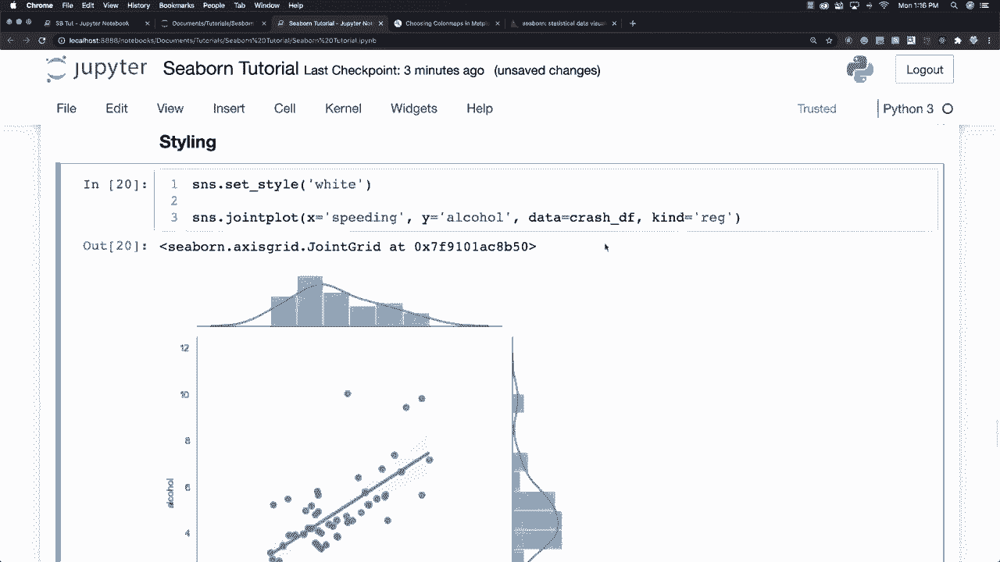

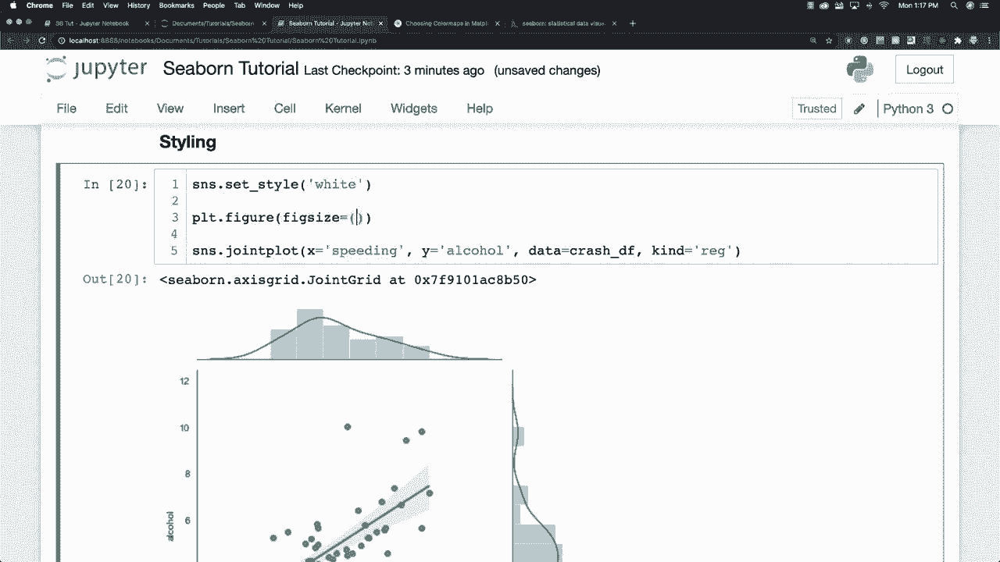

Grid， and there you can see the change there。 that looks kind of nice and the other option available。 I'm going to show you all of them。 You're also going to have white grid。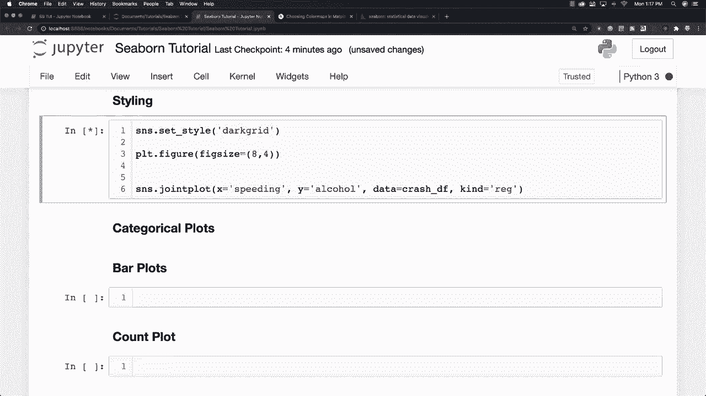

So there's that。 And you're also going to have dark。 Let's throw dark inside of here。 and there's dark。 looks kind of nice also。 and then you have ticks。 and that is all of the different options that I have there。 And depending upon what your data is and the palette you're using。

 you're going to use different grids and some of them look nice and some of them， maybe not so much。 so that's ticks。 I'm going just stick with ticks here for a second。 So one thing is your labels in the text and everything's kind of hard to see。 So how can we change our labels and our lines and other different elements to best fit and present our data nice。

 Well， to do that， you go set context and there's three options here。 you can have paper。 I'm going change the font as well。

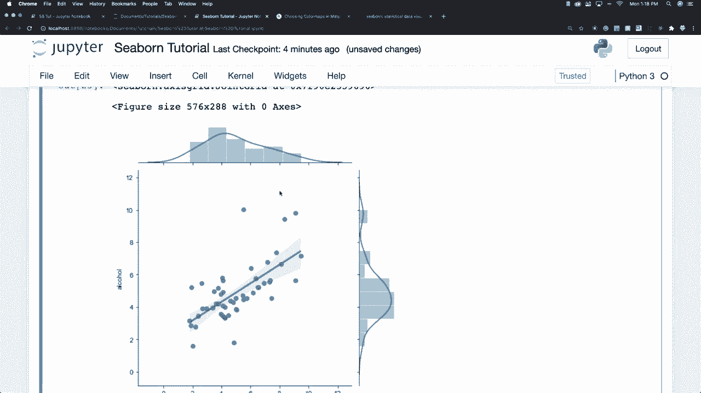

So I'm gonna to say font scales E01。4 and there you can see the fonts changed and so forth。 and then I'm going to go and also show you the other different options available。 You can have paper， you can have talk， you can see that's much easier to see right there and also you're going to have poster。 which is going to be super clear as well。 and you can see that is super big and this would be like what you would use on a poster and while talk would be what you would use in a presentation and paper is what you would use in like a Jupyter notebook Allright。

 so let's stick with paper here。

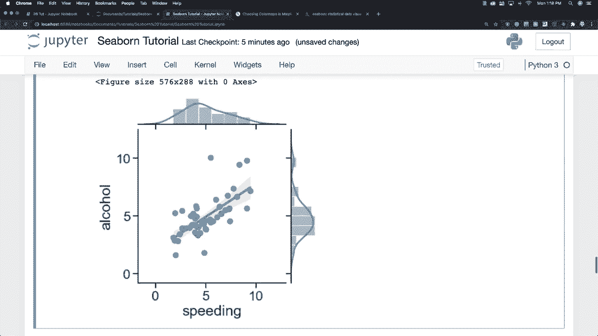

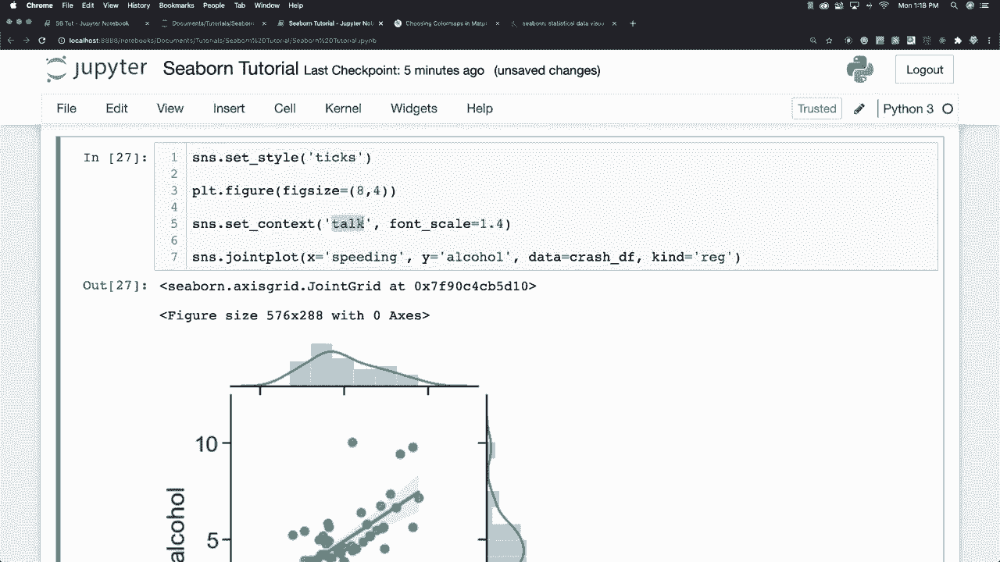

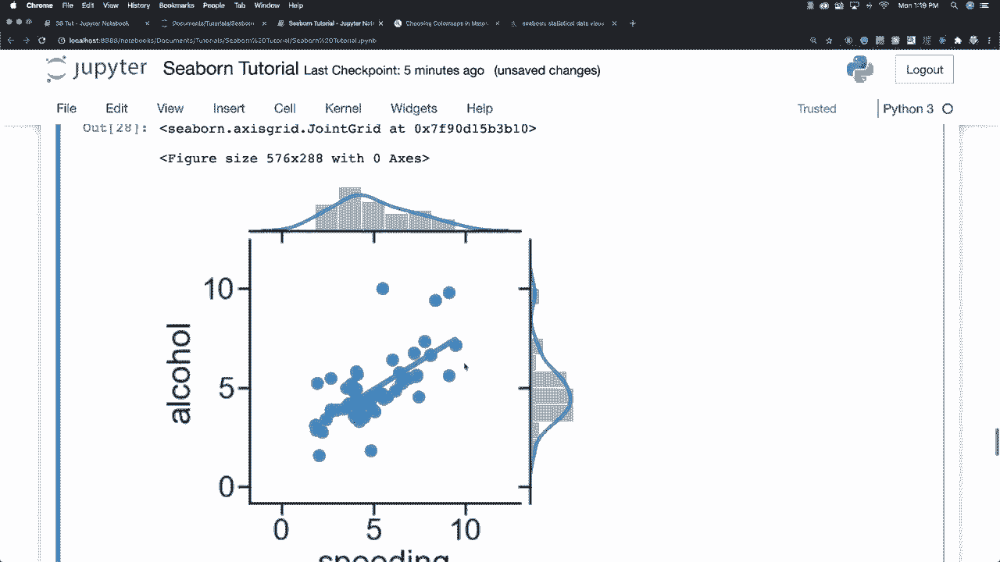

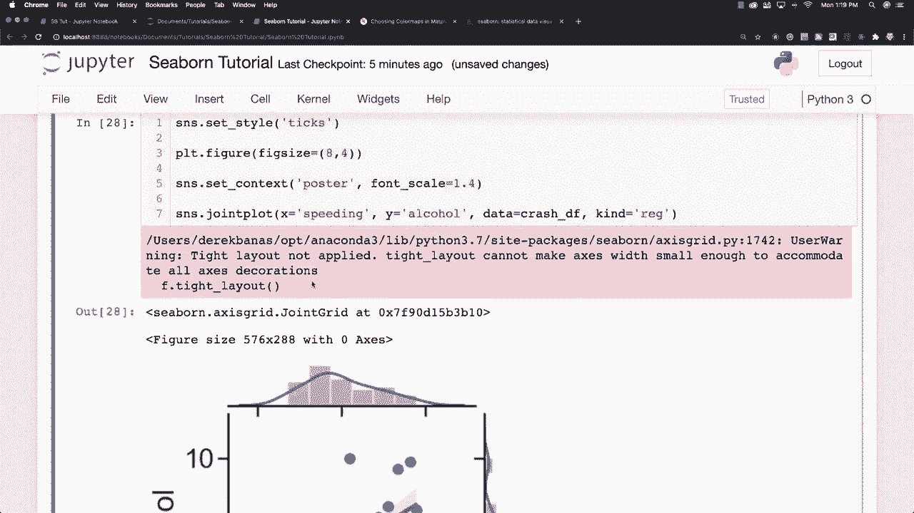

And see how that looks。 And I think that's pretty readable。 And of course。 you could change your font size if you'd like to get it exactly where you would like it to。 And another thing is sometimes these different axes you have on here。 these spines are kind of obtrusive and might not really help you with your data。 Well。

 you can also go and decide which ones to turn on and which ones to turn off by calling D spine And let's say that you want。

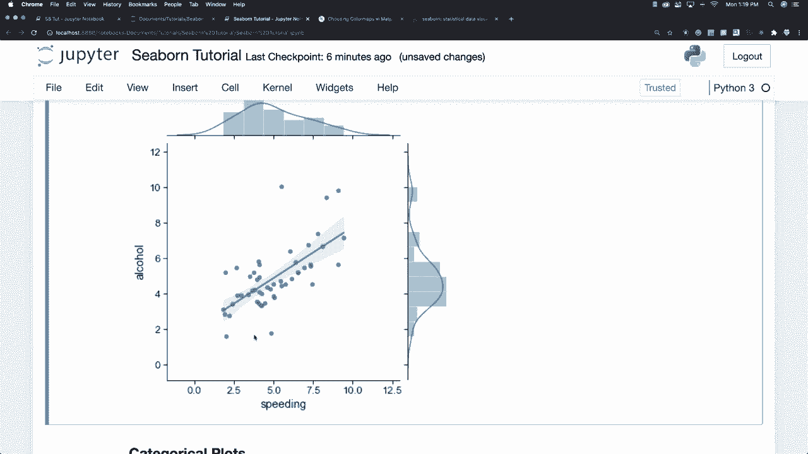

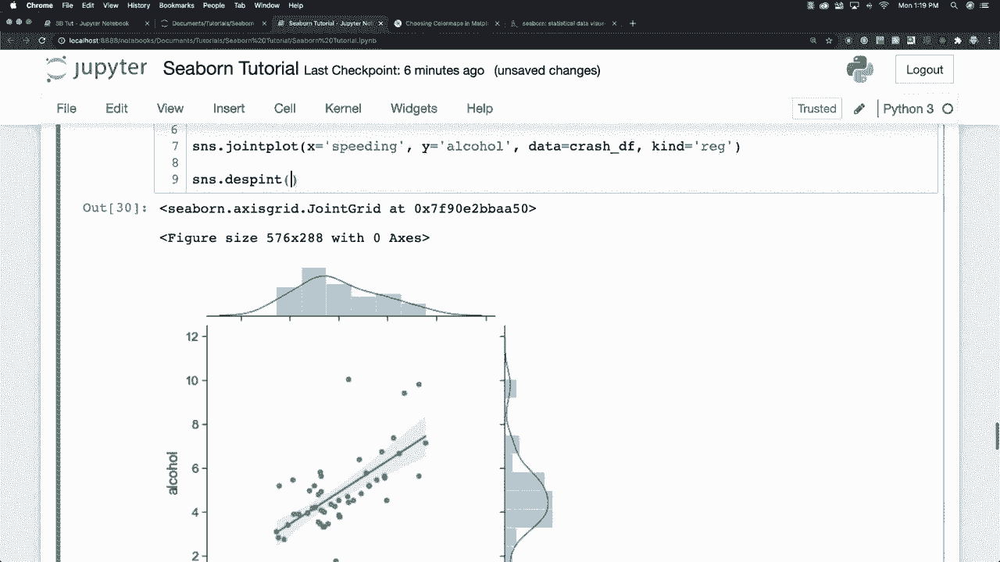

Its going left is equal to。False whoops accidentally hit a T there instead of an E and you could see that we have our left axes on there。 Let's set this to true。 And now you see that it's missing alright and let's say that we would also like to get rid of this bottom one for some reason you can also come in and say bottom true and now we don't have a bottom and so forth and so on。

 And as you can see here， they sort of default that what happens to the left happens to the right and what happens to the bottom also happens to the top and of course。 you can also come in and decide if you want right as well as the top spine to be showing or not or you could decide to not use either of them and get this layout All right so there's some different styling options and I'm going to get into other different styling options as we continue as well as talk about different coloring options through color maps that are also available with matpllibb but now what I want to do is talk。

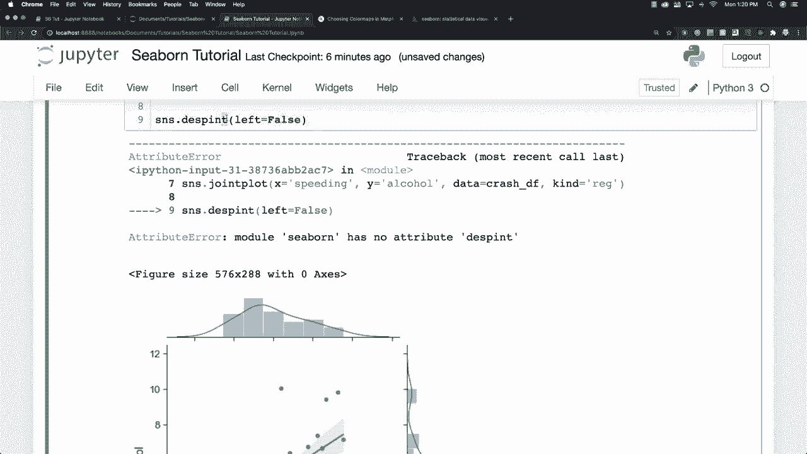

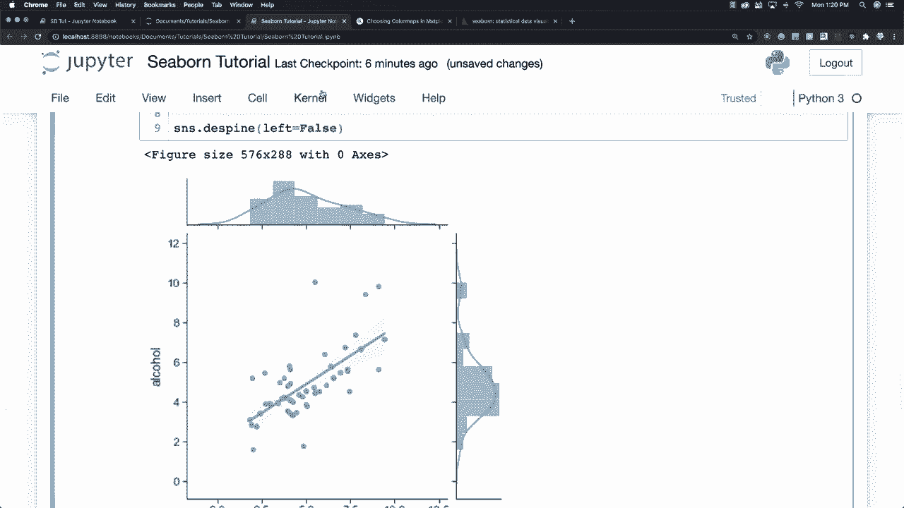

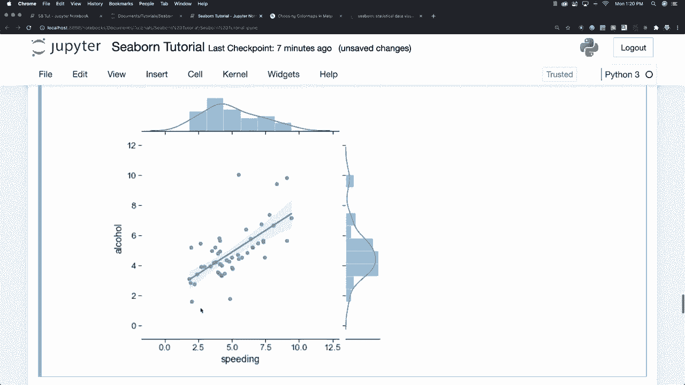

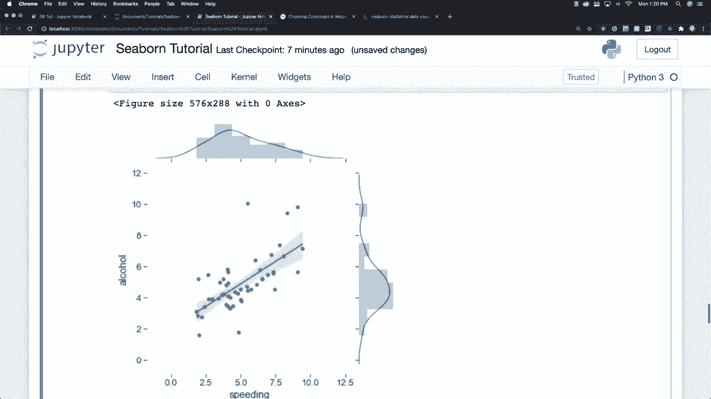

