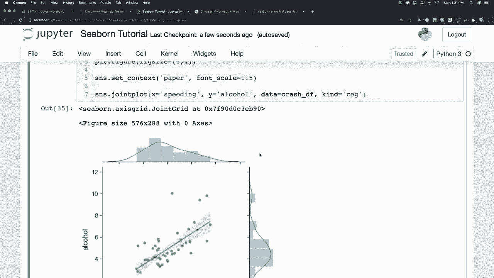
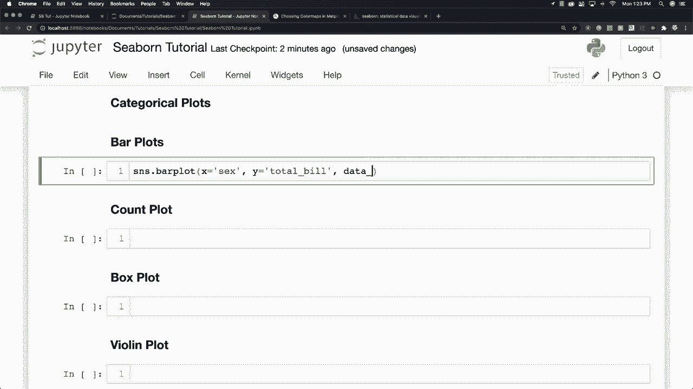
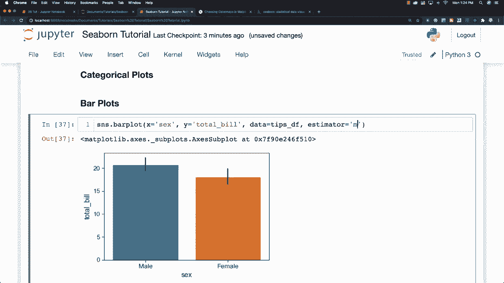

# 【双语字幕+资料下载】更简单的绘图工具包 Seaborn，一行代码做到 Python 可视化！1小时教程，学会20种常用图表绘制~＜实战教程系列＞ - P11：L11- 条形图 - ShowMeAI - BV1wZ4y1S7Jc

About categorical plotting Now with categorical plots。

 we're going to focus on distributions using categorical data in reference to one of the pieces of numerical data and the first one I'm going to talk about here our bar plots So I'm going to say SNS and bar plot and let's say let's go and let's analyze some information in regards to tipping for the different males and females so we'll say x is equal to sex and versus the total bill so total bill and of course we have to say where we're going to be getting our data which is going to be from that tips data frame and there you can see is the differences versus the sexes in regards to the total bill from our tips data and this little bar right here is referencing。

Varariance between the mails and the total bill amounts and so forth and by default。

This data is going to be aggregated based off of the mean， but you can come in and change that。

 so estimator is how you're going to change it and you could base it off of the median instead and you're going to be able to use all sorts of nupy formula。

 So this is your data based off of the median you're also going to be able to base it off of standard deviation。

AndVance。And also covariance with COV， and you could also make your own functions and just plug them into the estimator to change exactly how this data is going to be aggregated。

 and that is a rough estimate of bar plots。

