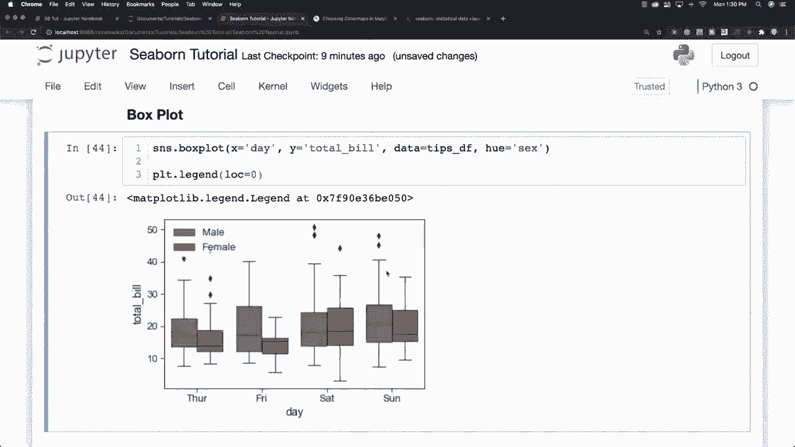
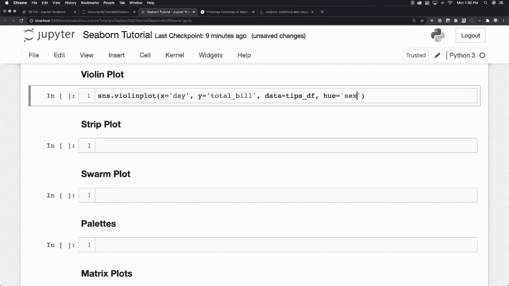
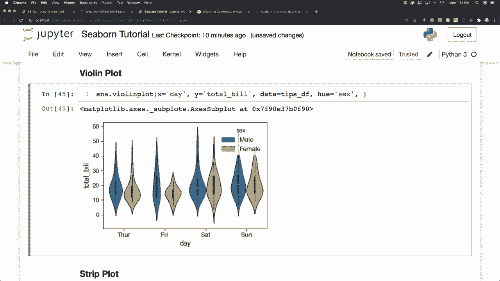
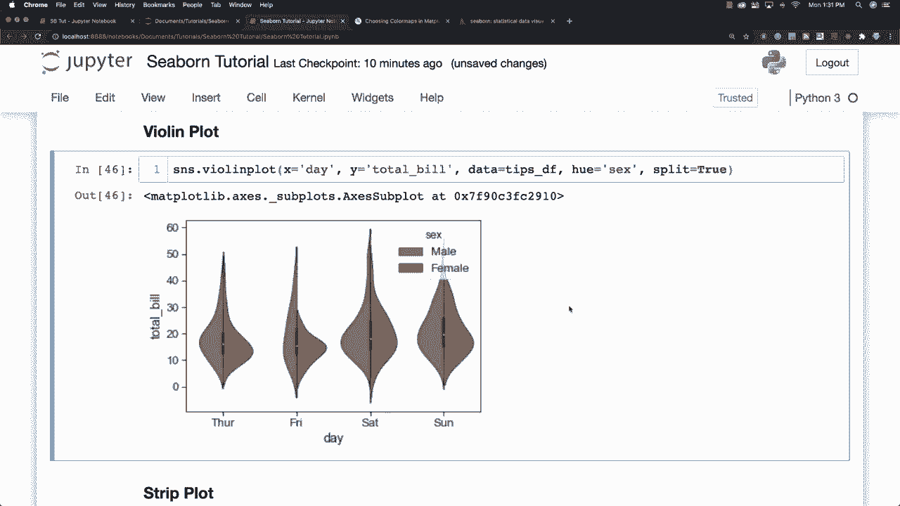

# 【双语字幕+资料下载】更简单的绘图工具包Seaborn，一行代码即可实现Python可视化！1小时教程，学会20种常用图表绘制~＜实战教程系列＞ - P14：L14- 小提琴图 - ShowMeAI - BV1wZ4y1S7Jc

对我们来说，另一个与箱线图非常相似的图是所谓的“小提琴图”，你可以通过搜索小提琴图来创建一个，基本上它是箱线图和KdeE图的结合。假设我们想要的信息几乎完全相同，我们将获取日期信息和总构建信息，并从我们的提示数据框中提取这些数据，同时也使用H，以便我们可以获得男性和女性的数据，这就是小提琴图的样子。箱线图对应数据点，而小提琴图使用数据点的KdeE估计来创建这些图形。我们还可以在这里添加一个名为split的选项并将其设置为true。

像这样，分割将允许你比较不同类别之间的关系。因此非常有用。正如我所说，这取决于你的数据类型，以帮助你找到最适合你的图表。接下来，我想谈谈条形图。然后我将更深入地讨论一些样式选项。

有不同的调色板可供选择，但首先我们要。
