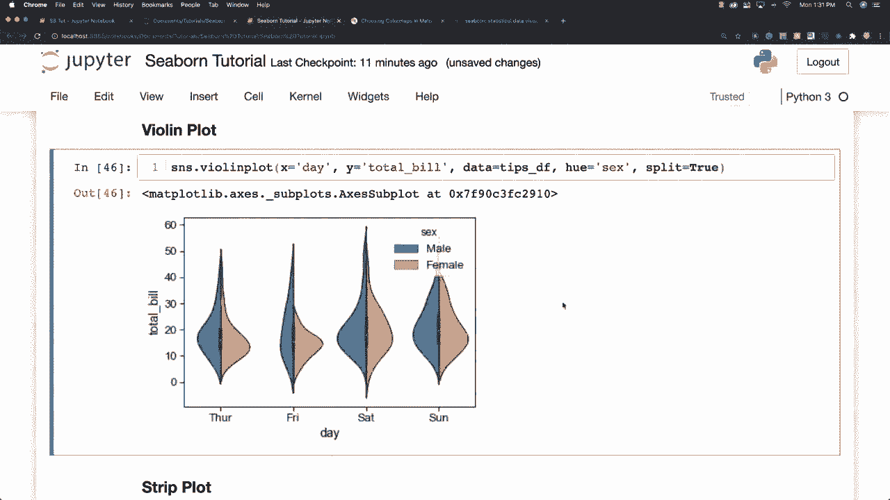
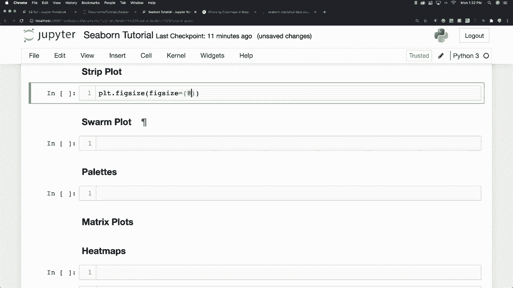
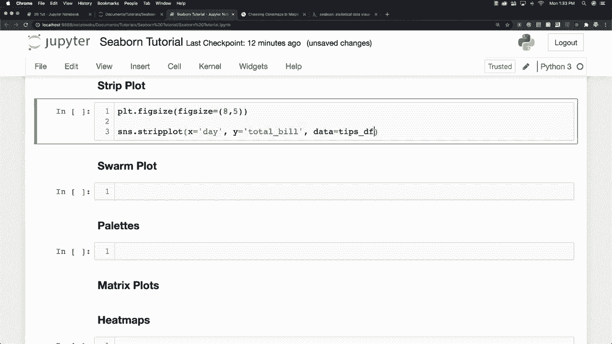

# 【双语字幕+资料下载】更简单的绘图工具包 Seaborn，一行代码做到 Python 可视化！1小时教程，学会20种常用图表绘制~＜实战教程系列＞ - P15：L15- 带状图 - ShowMeAI - BV1wZ4y1S7Jc

Talk about strip plots Allright， so another thing we can do here is we can change our figure size to make it larger so and how we do this is again by using my plot Lib So let's say eight and five is pretty big and then we'll throw in this strip plot and see how that works out for us and so to create one you just go strip strip plot and basically what a strip plot does is it's going to draw a scatter plot representing all the different data points where one variable is categorical and you're often going to see them used to show different observations with a box plot that is going to represent the average distributions So let's go X is equal to day and。

Total and y is equal to total bill。 and again， data is going to be our tips。

Data frame whoops I've got an error here。 This is figure There we are and you can see how a strips plot is going to work out here and one thing we can do is we can put in another attribute called jitter and it's going to spread our data points out so that they aren't going to be stacked on top of each other and you just say jitter is equal to true and you see how they spread out a little bit and let's say that we wanted to break this data up even further into men and women again we're going to use H for this。

And now you can see the difference between the men and the women and then on top of that you can use Dodge and it is going to separate the men and women data completely so though each get their own bar Allright so there you go there is a strip plot with many of the cool things it can do and now I want to talk about another one of those plots it sort of combines the capabilities of multiple other plots and it is called。

