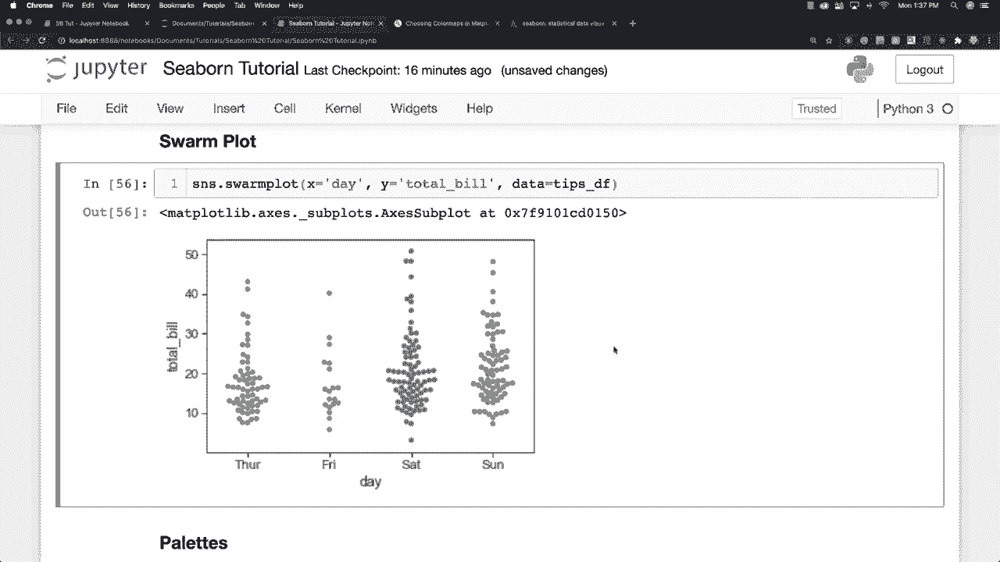

# 【双语字幕+资料下载】更简单的绘图工具包 Seaborn，一行代码做到 Python 可视化！1小时教程，学会20种常用图表绘制~＜实战教程系列＞ - P16：L16- 群图 - ShowMeAI - BV1wZ4y1S7Jc

Swarm plot okay， so what I want to do here is I'm going to create a violin plot and then I'm going to stack a swarm plot on top of it。 So I'm going to say x is equal to day Y is equal to total bill and again data is going to be from our tips data frame and like I said a swarm plot is kind of like a strip plot but points are going to be adjusted so that they don't overlap and it sort of looks like a combination between a violin and a strip plot whenever I create it and I'm just going to copy all of this data out of here and run it and you can see it because it's using exactly the same colors for all of these different dots inside of here but you can easily fix that just by coming in the same color is equal to white like that and now you can see all those different plots inside of there Allright。

 so kind of neat stop。

And if you just want to see it on its own like this。 well obviously you can't have the color be white and there you can see exactly what it looks like All right。 so tons and tons and tons of different plotting options available to you and now what I want to do is to talk about palettes。

