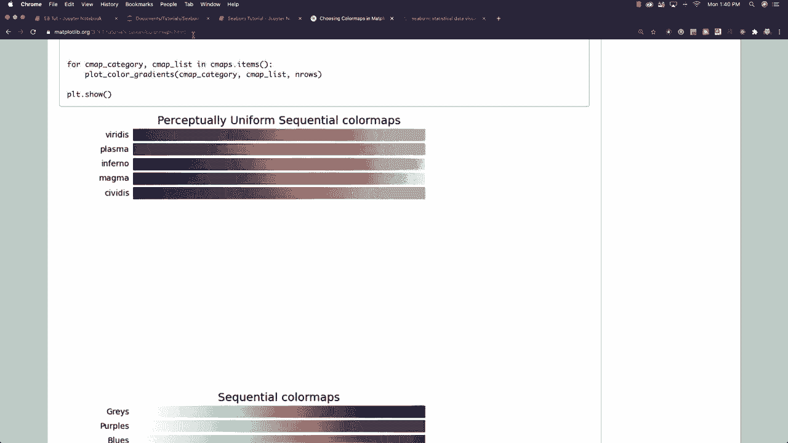

# 【双语字幕+资料下载】更简单的绘图工具包 Seaborn，一行代码做到 Python 可视化！1小时教程，学会20种常用图表绘制~＜实战教程系列＞ - P17：L17- 调色板 - ShowMeAI - BV1wZ4y1S7Jc

can make our plots look nicer， so I'm going to change the size of my plot and I'm going to set my grid styling here as well to use a darker look and I'm going to make it larger by getting sort of like a presentation type of look to it by calling talk and now what I want to do is I want to create a strip plot and let's stick with what we're kind of used to here。

 which is our tip data with our total bill。And our data coming from our tips。

Data frame and let's use our h equal to sex。 And there you can see exactly how that's going to end up looking for us。

 Now these different colorings that we are using here， sometimes they look great。

 sometimes they don't Well， if you want to change them。 what you can do is set the palette。

 and then you're going to find different coloring options for yourself。

 by going to mat plotlib and specifically looking for color maps。

 that is what we're doing if you type in mat plotlib color maps it's going to take you to this page right here。

 And what you can do is there's tons of them， these are examples of all of the different color maps available to you。

 And if you scroll way down you're going to see an example of them right here。

 the colors that you're going to get So let's say that I wanted to get something like magma。

 Well what I could do is I can come in here and I could say。

How it is equal to magma and run it and you can see if that looks better for you or not and you could try other different looks so let's say you can also type in this is purple blue green。

 let's try something like AFM hot okay， let's try that AFM hot， I don't know。

 I'm just pulling random ones off of there。

And that's kind of neat looking， and of course we can change our styling hair to white。

And so forth and so on。 All right so there's some different ways to change the coloring for your plots and like I said before。

 sometimes this legend ends up in the wrong place Well very often you can fix that just by coming in and saying plot legends and location is equal to0 and it's stayed exactly where it is。

 So if you want other options for where you can move it other thing you can do is try changing your figure size and it's now it's not obstructing any of your data。

 at least that's another option that's available to you or if you do not like the best option。

 which is what zero is going to give you you could try placing it in the upper right and how you do that is you just put in a value of one So let's throw one inside of there Now it's in the upper right let's say you don't like that either you could try the。

Or left， which is already where it was with two， you could put in the lower left with three so we can try that。

And it's still kind of obstructing， I think the upper left is definitely the best option which was the best option and if you want to find out all of the other different options that are available to you。

 you can go to Macplotlib and specifically look for pi plot legends and it's going to show you all of the other different options you also have the options of placing it specifically here's the options upper left。

 upper right， lower left， lower right and so forth and so on and here are the location code numbers for all those different things and you're also going to be able to go and put it specifically on the XY axis by using a tuple All right so there's a whole bunch of different ways you can styled by changing pallets and changing locations for legends and so forth and so on and up next I want to talk about a completely different type of plot which is called a matrix plot。

