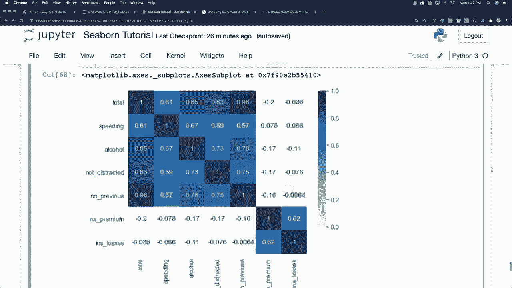

# 【双语字幕+资料下载】更简单的绘图工具包Seaborn，一行代码实现Python可视化！1小时教程，学会20种常用图表绘制~＜实战教程系列＞ - P18：L18- 热力图 - ShowMeAI - BV1wZ4y1S7Jc

好的，首先我们要讨论的第一个矩阵图是热力图。让我们来进行一些样式设置。我将设定我的图形大小为8和6，并且我还将更改我的网格背景上下文。

我将把这个改为纸张，哎呀，要用引号把它括起来。我将使用1.4的字体缩放，这通常也有效，如果不行我们再改。好的，要用数据创建热力图，你基本上需要以矩阵格式设置变量。这样做。

让我来具体展示一下我的意思。所以我们有我们的事故。

数据框，好的，就这样。我们需要做的就是创建一个热力图，我们必须让在我们的列上的数据与这些列也作为行对齐，而不是像这样用索引，有两种主要的方法来做到这一点，我将向你展示这两种方法。

两种可用的选项。好的，假设事故，这将是矩阵。你可以做的一种方法是获取事故数据框，并调用相关性函数，基本上相关性将告诉你变量对结果的影响程度，这将创建那个，我可以准确地向你展示它的样子，所以现在你可以看到你的列和行都在这里对齐，而不是使用那些不同的索引。

这正是用于创建热力图的方法，你可以查看这个数据，举个例子，在我们的数据集中，没有之前的事故与事故之间有很强的相关性，而像保险费这样的因素则没有。你还可以看到，酒精使用与某人发生事故也有很强的相关性，但我们在这里讨论热力图并不是只看基本数字，所以让我们创建一个热力图，我将说热力图，并且我将使用我们的事故矩阵。

我将添加注释，这将在热图每个部分的中心显示数字。如果你在mapplotlib中创建过热图，你会知道使用Seaborn有多么简单，你可以看到，这就是在mapplotlib中创建热图的快速方式，大约四五六行代码。这是一个完整的代码，并且这是一个来自我之前展示的mapplotlib页面的颜色映射，你可以使用任何不同的颜色映射，你可以准确看到我们的热图与之对齐，基本上是同样的数据，只是看起来更好。因此，让我们展示另一种创建矩阵的方法，所以让我们继续，我将保持完全不变，你也可以通过使用称为透视表的方式来创建矩阵。

我为什么不直接使用完全不同的数据呢，我要去获取一些航班数据。我将其称为flights。然后是SNS。并加载。此次使用的数据集是内置的，称为flights，你可以看到，基本上它是基于年份和月份的飞行人数。好吧，你也可以看到这里有索引，除非我们将列中的内容放入行中并展示它们之间的关联，否则我们无法创建热图。所以我们要做的是创建一个透视表。我将调用flights.dot pivot table，这只是另一种将列放入行并关联所有数据的方法。这就是它的含义，所以我将说我想创建一个以月份为索引的矩阵，我希望我的列等于年份，而我想要的数据值是乘客数量。你可以准确看到这些数据来自哪里，所有三个数据部分都会被使用。

如果我运行这个，你会看到我们的月份在左侧，而年份在顶部，特定年份和月份的乘客数量就是你看到的实际数据。好吧，这非常非常有用。我现在想做的是实际创建这个热图。我将说热图使用我们的flights数据，我将使用我的颜色映射。

这是我比较喜欢的蓝色图，你也可以在这里放入白线来分隔数据。不过我先给你展示一下它的样子，哦，航班。这将只是S和S，我们不需要这个，好吧。所以你可以看到这是基于我们航班数据的新热图，但你也可以在数据之间放置线条，如果这样更方便操作，但除非你定义线宽，否则它是不会显示的。

让我们试试只使用一条线，你可以看到它是如何被分开的，而且你也会发现，大多数航班发生在七月和八月，并且随着时间的推移，自1949年至1960年，更多的人开始飞行。好吧，这真是很酷的信息，现在我想谈谈聚类。

