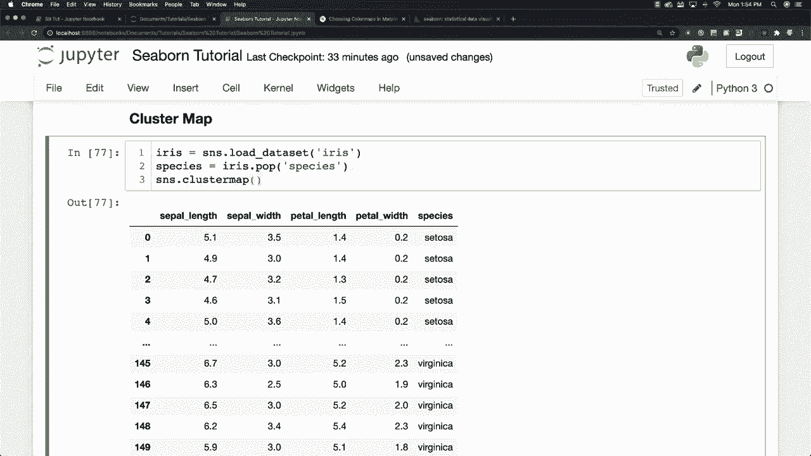
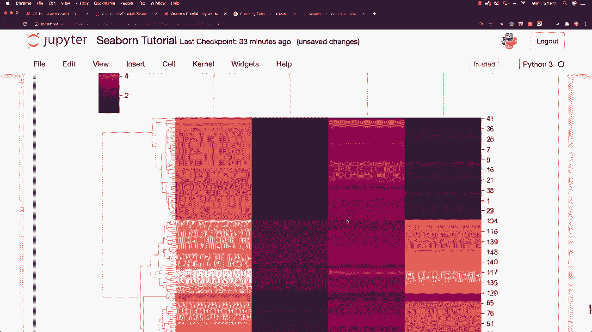
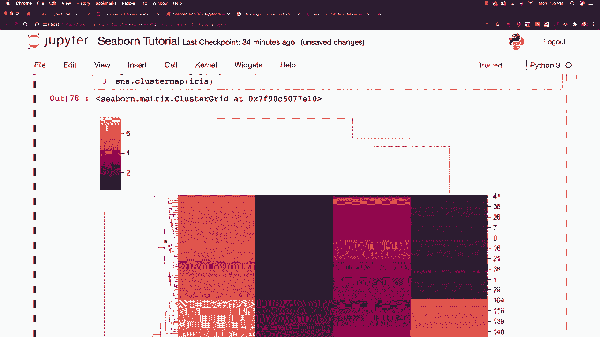
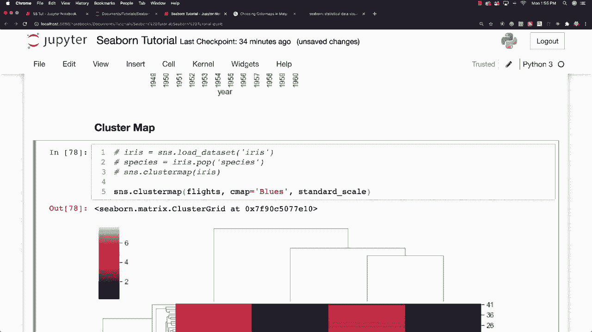
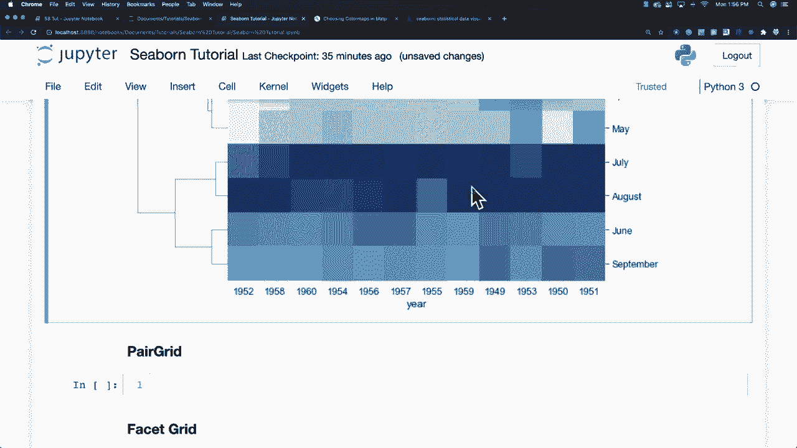
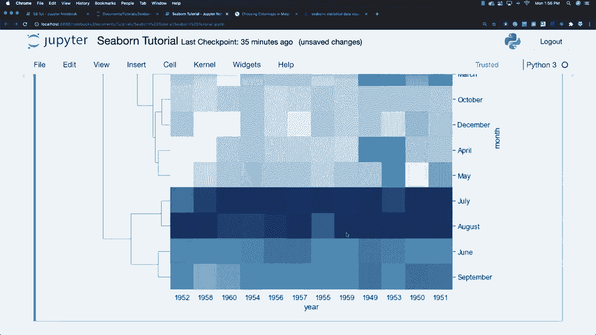

# 【双语字幕+资料下载】更简单的绘图工具包Seaborn，一行代码做到Python可视化！1小时教程，学会20种常用图表绘制~＜实战教程系列＞ - P19：L19- 聚合地图 - ShowMeAI - BV1wZ4y1S7Jc

地图好的，对于聚类图，我想使用与鸢尾花和花萼长度等相关的数据。所以我将去使用它，这就是我们加载数据的方式，基本上就是一个聚类图。我们来实际创建一个，然后我将准确解释它向你展示的内容，所以我们要像这样进行聚类图，然后传入鸢尾花，但首先，我需要定义我希望返回给我的值。也许我应该先给你看看，来看看它是什么样的，好吧，这里是鸢尾花。你可以看到sL，这些基本上是不同花瓣的长度和宽度，基本上是鸢尾花上的花瓣。所以我想要根据不同的鸢尾花物种来划分数据，然后就绘制这个数据，我需要说物种等于鸢尾花。

Pop物种。好的，这将说明我们希望根据不同物种返回的值。然后我可以说S和S。聚类图。抱歉，我不是花卉专家。所以我真的不知道这些不同的家伙之间的区别。好的，这就是我们创建的内容，看起来有点复杂。

但我将尝试准确解释这个聚类图中发生的事情。现在这就是我们称之为分层聚类热图的东西，它在这里所做的是计算点之间的距离，然后将最近的点连接在一起，这将继续进行下一个最近的点，并且将比较我们的热图的列和行。所以我们来看看你可能已经习惯的另一组数据。这基本上就是在尝试聚类相似的数据类型，我们的数据点。我是说，所以我们来使用我们的航班数据来展示一些你已经知道的东西。

看了一点点，所以我将去做SN S和聚类图，航班和CM等于蓝色。而标准化尺度的作用是将数据归一化，以专注于聚类。这将有点混淆日期，正如你所说的，你必须将其设为1。好了，你可以看到我们的航班数据，你也可以看到我们确实集中并聚类了7月和8月的数据，你还可以看到下面的年份不再按顺序排列。所以这就是热图之间的区别。

热力图不会尝试重新定位数据以寻找数据集群，而是会在现有数据的基础上工作，而集群图则会紧密适应并聚集数据，以便你可以看到正在形成的非常具体的模式，这些数据是关于人们乘坐飞机的航班数据，非常有趣，接下来我将讨论配对网格。

是的。
