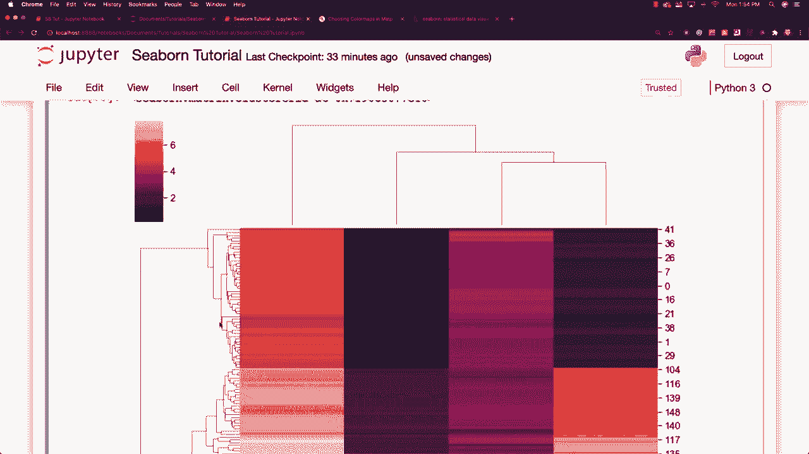
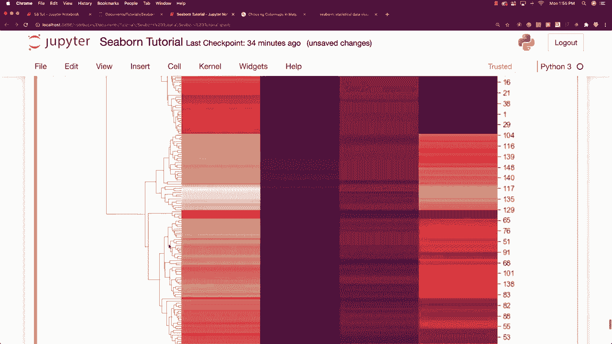
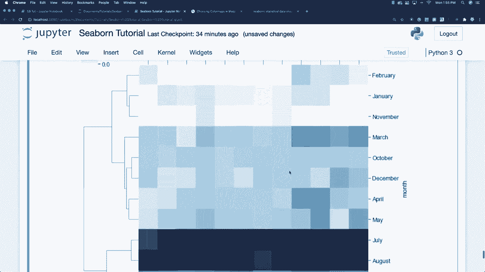

# 【双语字幕+资料下载】更简单的绘图工具包 Seaborn，一行代码做到 Python 可视化！1小时教程，学会20种常用图表绘制~＜实战教程系列＞ - P19：L19- 聚合地图 - ShowMeAI - BV1wZ4y1S7Jc

Maps all right， so for the cluster maps， what I want to use is there is data that is in regards to irisees and pal lengths and things like that。So I'm gonna go and just use that and that's how we load it and basically a cluster map。 let's go and actually create one and then I'll go and explain exactly what it's showing to you so we're gonna to go cluster map like this and then just pass in iris but first off what I want to what I need to do here is I need to define how I want the values to be returned to me maybe I should just show you let's go and show you what it looks like okay so here's iris alright so you can see the sL these are basically different petal leaps or lengths and widths so they're basically petals on irisees so what I want to do is I want to divide the data based up on the different species of irisees okay and then go and just plot this data well I need to say species is equal to iris。

Pop species。 Okay， so that's going to say how that we want to that we want to return values based off of the different species。 And then I can say S and S。Cluster map。 sorry I'm not a flower expert。 So I really don't know the difference between all these different guys。 Alright。 so this is what we create。 and it's a little bit complicated looking。

 but I'm gonna try to explain exactly what is going on here with this cluster map。 Now this is what we call a hierarchically clustered heat map and what is doing here is the distance between the points are going to be calculated and then the closest are going to be joined and this is going to continue for the next closest and it's going to then compare the columns and the rows of our heat map so let's go and look at another piece of data that you're kind of used to So that's basically what is going on sort of trying to cluster the like data types our data points I mean so let's go and use our flight data here just to go and show you something you've already。

Seen a little bit of so I'm going to go and I'm going to go SN S and cluster map and。Flights and CM is equal to blues。And what standard scale is going to do is it will normalize the data to focus on the clustering。 which is going to sort of mess up the dates， as you're going to say and you have to have this be equal to one There we go and there you can see our flight data and you can also see that we really focused in and clustered our July and August data and you can also see down here that the years are no longer in order So that's kind of the difference between the heat map。

 the heat map isn't going to try to reposition data to find clusters of data it's going to sort of work with what it has while a cluster map is going to tightly fit and cluster the data so you can see very specific patterns that are being developed and that is some flight data and when people fly in airplanes so pretty neat stuff and up next I'm going to talk about pair grids。

はい。