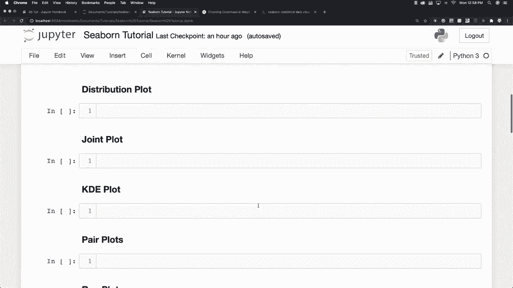
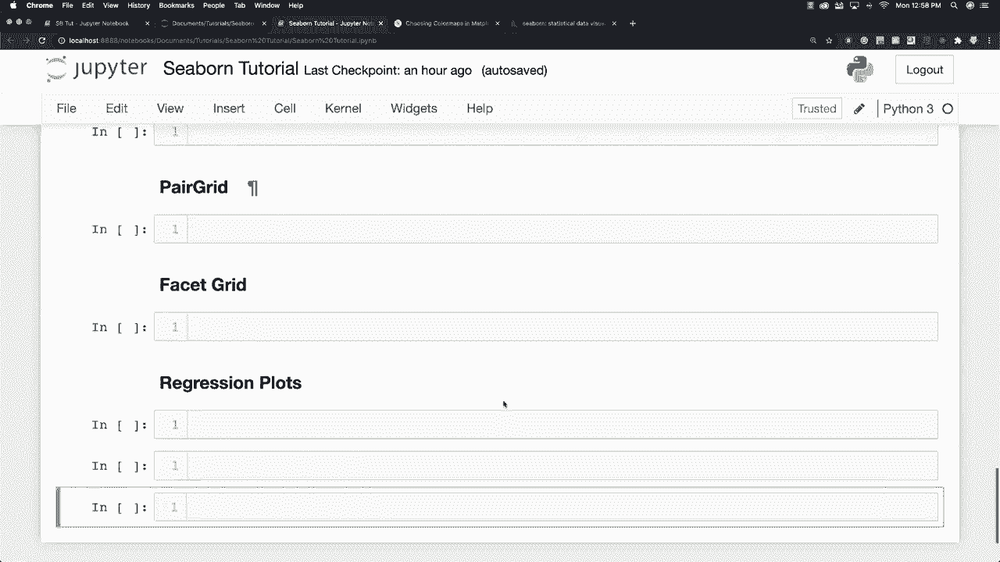
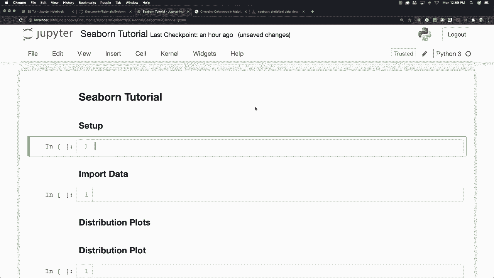
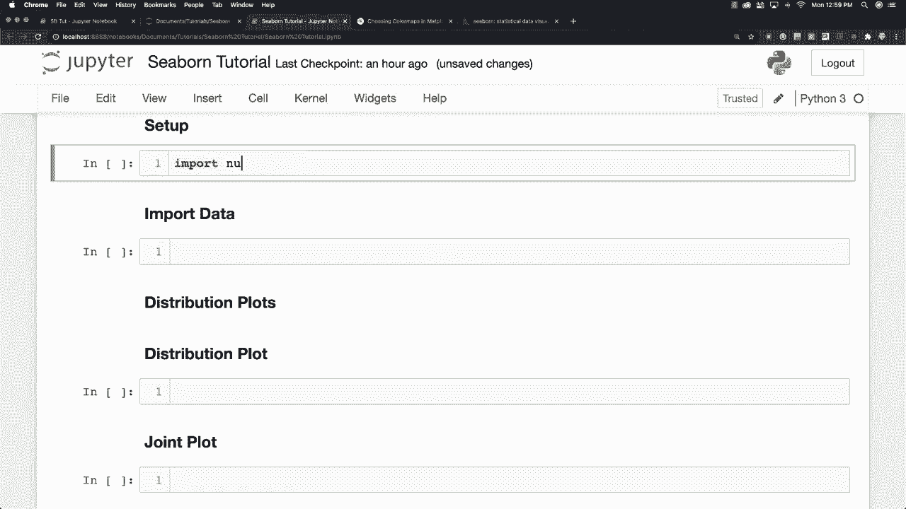
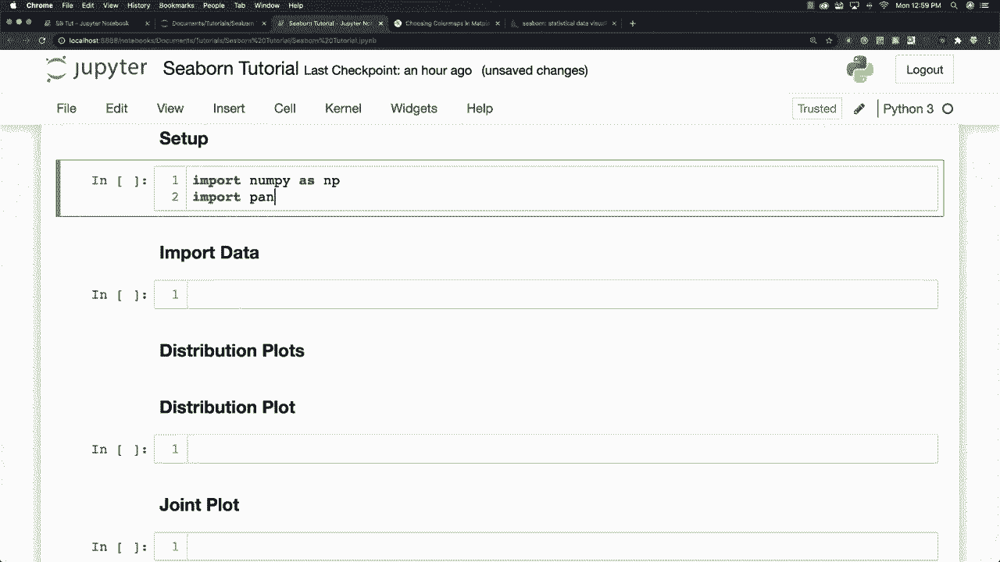
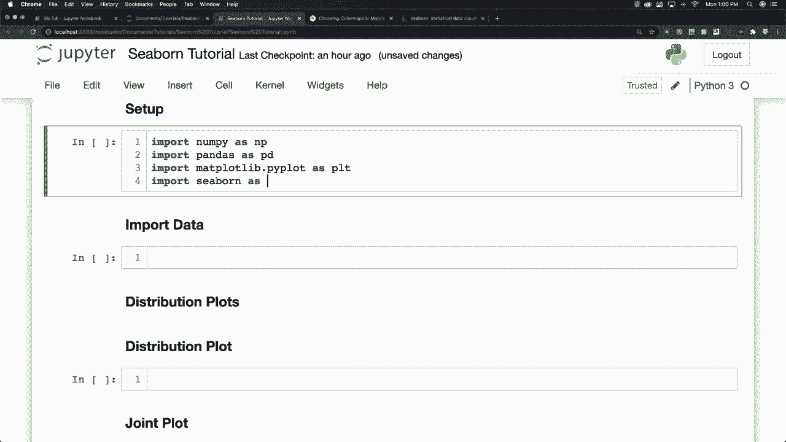
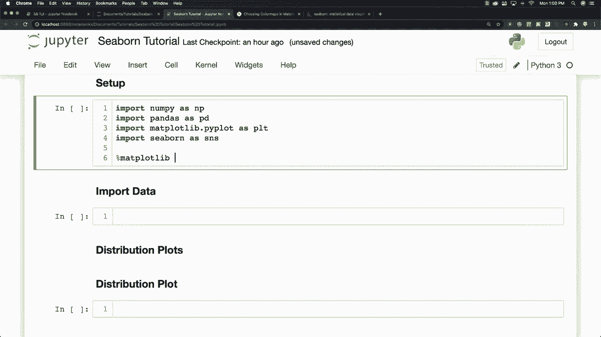
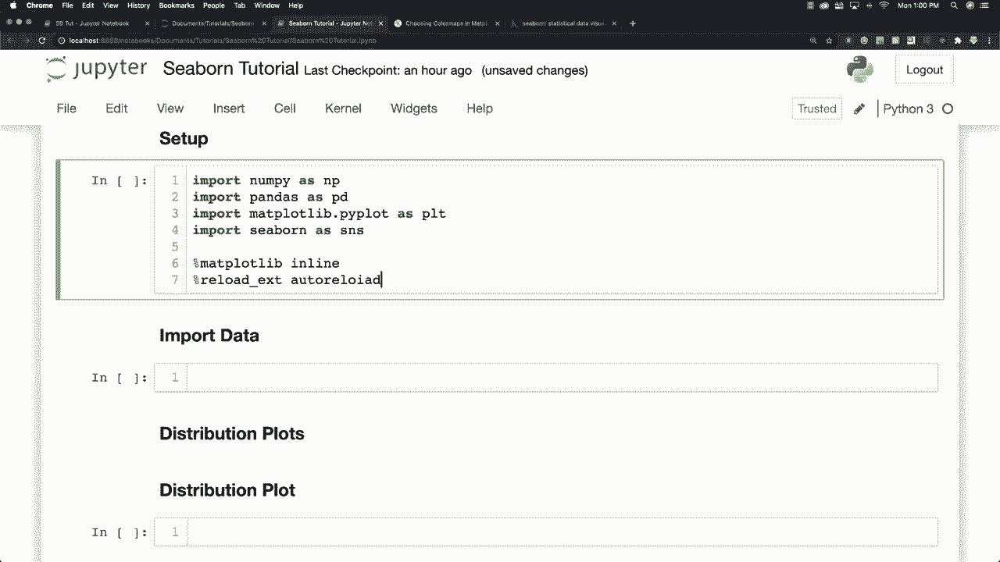
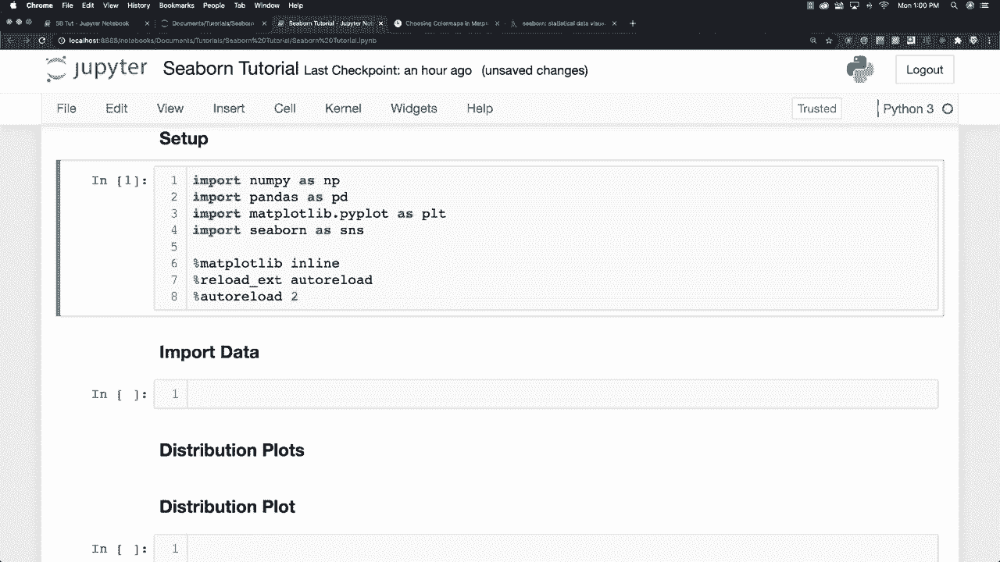

# 【双语字幕+资料下载】更简单的绘图工具包 Seaborn，一行代码做到 Python 可视化！1小时教程，学会20种常用图表绘制~＜实战教程系列＞ - P2：L2- 设置 - ShowMeAI - BV1wZ4y1S7Jc

Cious。Now this is Jupiter notebooks， which is that way I'm going to do everything you can see everything that I am going to cover in this tutorial right here and also underneath the video you're going to find a table of contents that you can use to jump to whatever specifically you might be interested in Now while in Mattplotlibb you often had to write multiple lines of code to create a plot as you're going to see Seaborn makes assumptions on what you want which is often going to translate into getting the same exact plot with just one line of code so it's really cool and you install it either by using the Anaconda environment tab which you may or may not have if you're using Jupyter notebooks or you can enter any of these into the terminal could either say Pipin Cborn or you could sayconda install Cborn so either one of those is going get everything going now what I'm going to do。

First， just to set up everything is to import nuy， I'm also going to import pandas and Im going to import Madplotlib and of course。 I am going to import seaborn kind of hard to do a seaborn tutorial if you don't do that going to do a couple other things here。

 I'm going to set it up so that my plots are going to show up directly inside of my Jupiter notebook like this。 and then I'm going to add a couple other commands for auto reloading。

And you don't need to do these， but it may help you out All right。 so everything is a set up and then of course I just hit control and return to load everything the way we have there。

