# 【双语字幕+资料下载】更简单的绘图工具包 Seaborn，一行代码做到 Python 可视化！1小时教程，学会20种常用图表绘制~＜实战教程系列＞ - P20：L20- Pair对网格 - ShowMeAI - BV1wZ4y1S7Jc

Okay， so what do we want to do here Well， basically I had previously talked about pair plots up here and basically the way that the pair plot works out is you plug in the data and it gives you a whole bunch of different plots but what happens whenever you want to get really specific control over what plots and what data shows up where well that's where pair grids come in Okay。

 so what I want to do here is I first I'm going to use Iis again and what I want to do is I want to create an empty grid system based off of this iris data and I say pair grid and Iis。

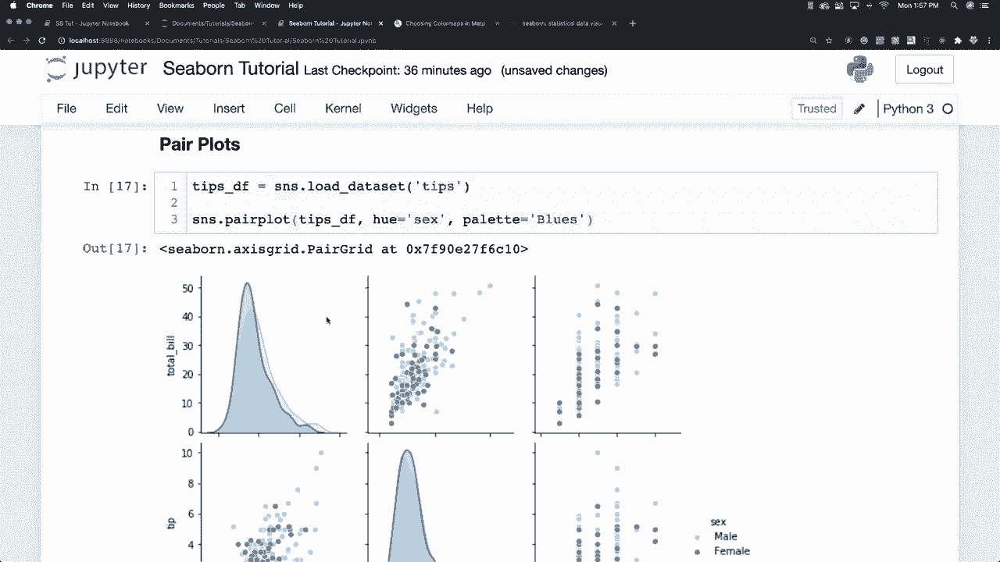

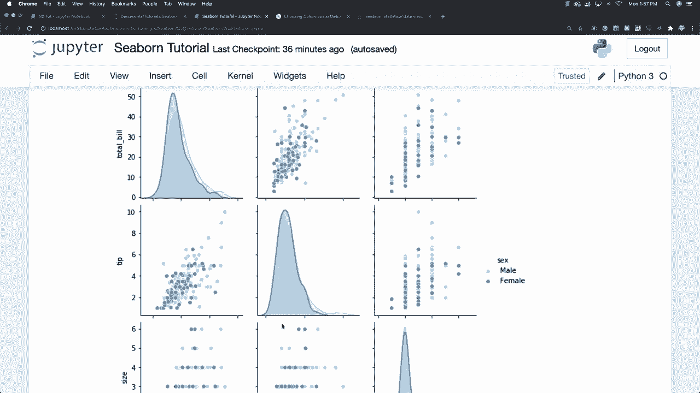

h is going to be equal to species， so we're going to colorize based off of the species that are inside of the different or iris data frame and then what I want to do is I want to put a scatter plot across the upper lower and the diagonal So how I do that is I go Iis G map。

 and then I call plot and scatter like this and I had to go load our iris data in here as well and I also typed in app instead of map okay so this is what a pair grid looks like and you can see it's just scatter plots everywhere and you can also see that everything is going to line up in rows and columns and how that data is going to interact and correlate is going to be basically laid out for us in our plot but what would happen if we decided that we would like to put a scatter plot across well different。

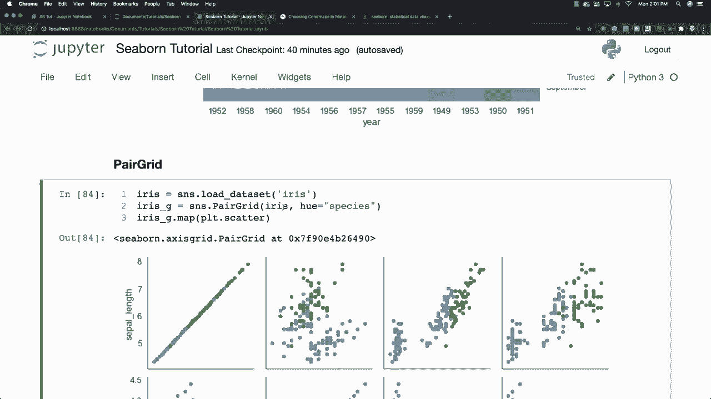

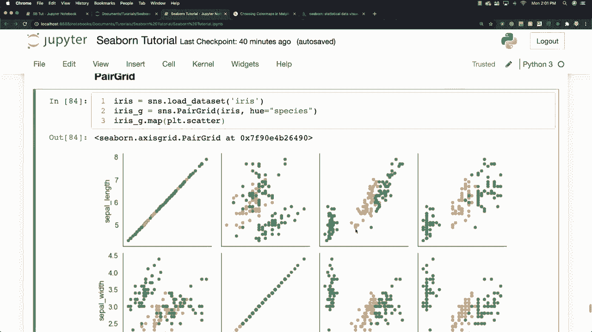

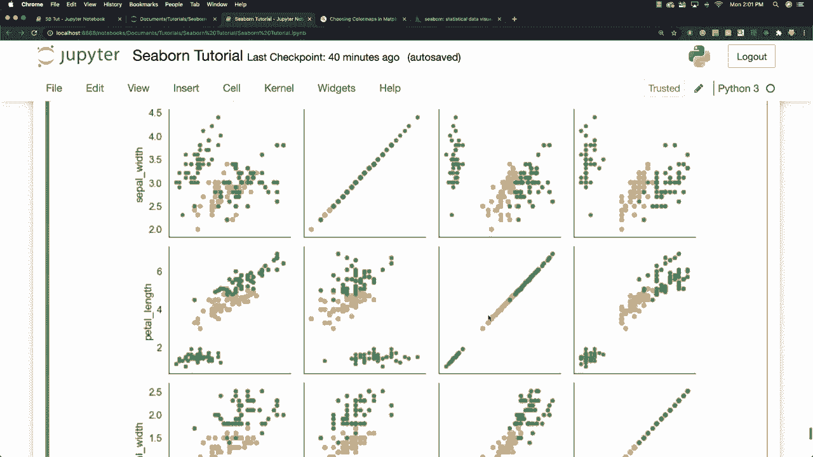

Ploots in the upper and lower as well as on the diagonal I'm going to say I G map plots scatter and let's say I want to put a histogram across the diagonal I can say I G map and diagonal and plot histogram and now you can see we have a histogram but we also have these other scatter plot still showing up here so let's go and get rid of the scatter plot and let's say that we want to have scatter plots show off of the diagonal in the upper and the lower part well we say I G and map off diagonal and there we want to plot our scatter plot and now we get our histogram that's not obstructed with the scatter plot and we get a scatter plot in the upper as well as the lower part of our pair grid。

 but let's let's say we want to go and put different。

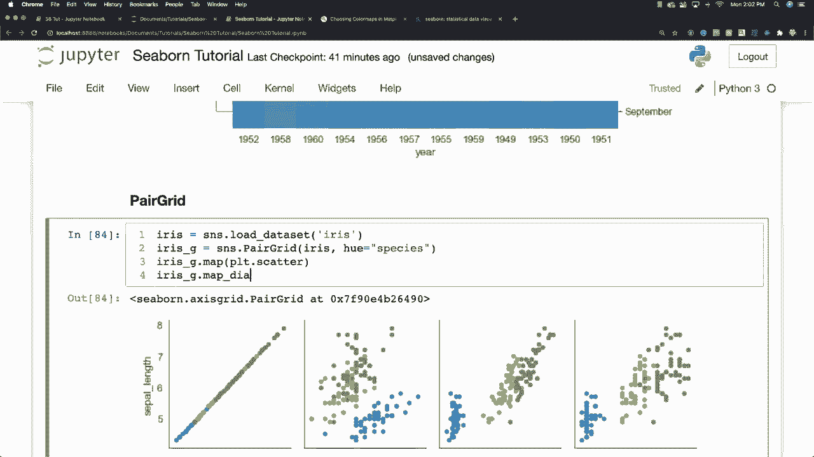

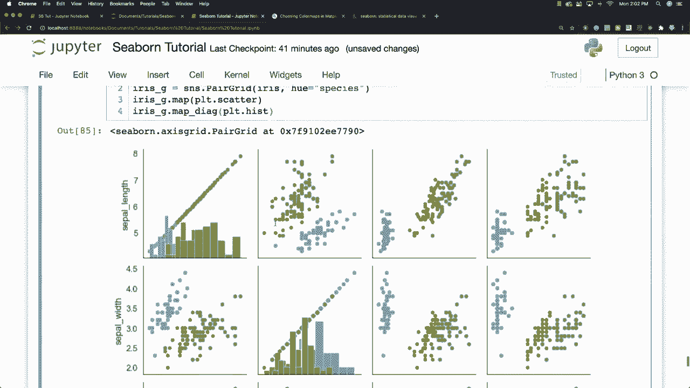

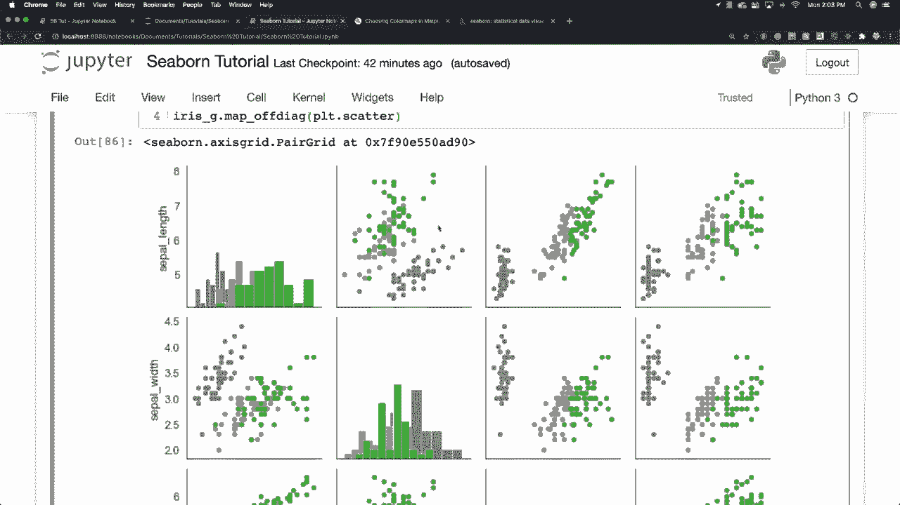

Stuff on the upper part and another different plot on the lower part Well， we can just come in。

 let's just go and copy this。 I don't have to type it again。

 so I'm going to say that in the upper part I want to use。

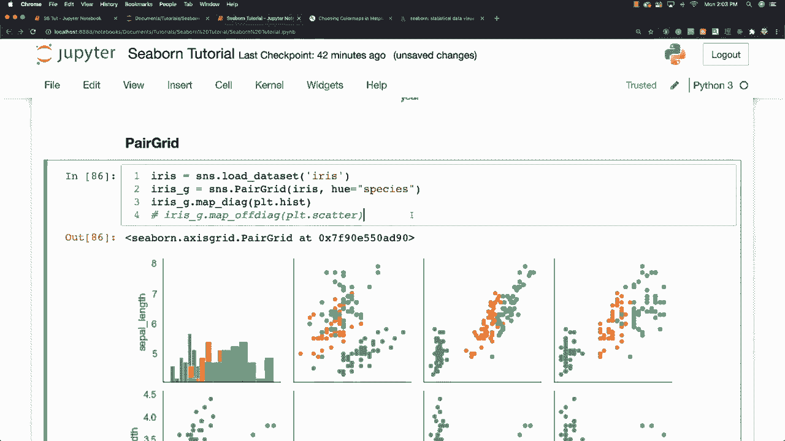

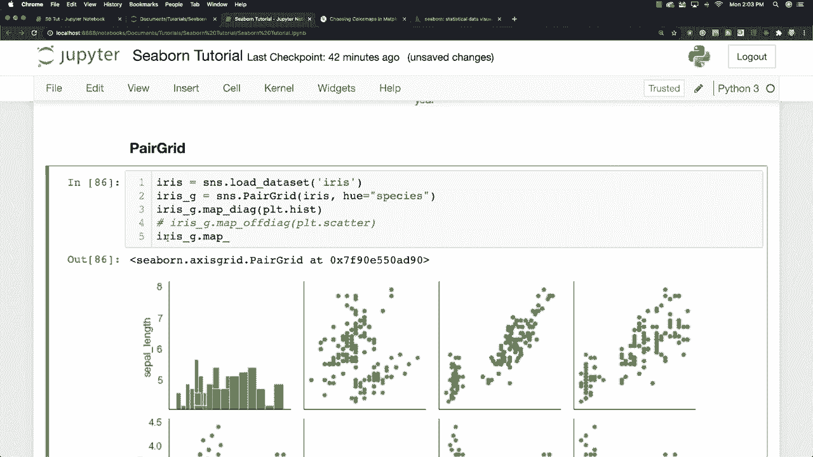

A scatter plot and in the lower part just by typing in lower， I want to put in a Kde plot。

 which is actually part of seaborn。 So this is Kde plot and you can see that it did exactly that for us。

 And if you want to see the different options that are available to you。 of course， shift and tab。

 press the plus button right here。 and you can look at all of the different options that are available in regards to that function。

 Allright， so neat stuff。 you can make really， really custom awesome looking plots。

 The other thing we can do is we can come in here and define variables for the X and Y for our custom grid by going Iis。

And G is equal to SN S。Para grid。Iris？I'm going to say the hue is going to be based off of species and then X variables is going to be based off of sepal length。

 which I think that's how you pronounce it， I don't know that much about flowers So I apologize I'm saying that wrong and the sel width and then the Y variables going to be equal to and let's just go and copy this and then let's change this to pal and change this to pal and then we can say that we want to plot a scatterpl and let's go and get rid of this part and then we can also come in and throw a legend inside of here with add legend and you can see we were able to create our custom plot Allright。

 so pretty neat stuff Alright and up next I want to talk about another grid which is。

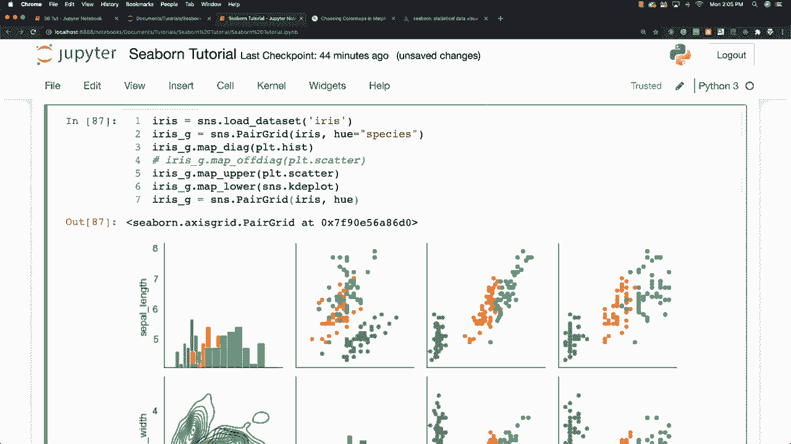

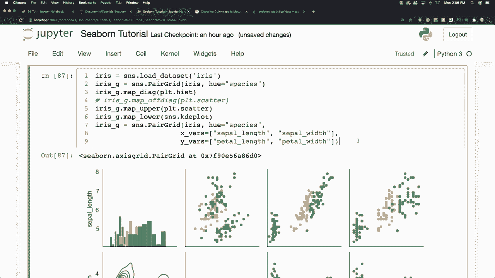

