# 【双语字幕+资料下载】更简单的绘图工具包 Seaborn，一行代码做到 Python 可视化！1小时教程，学会20种常用图表绘制~＜实战教程系列＞ - P21：L21- Facet网格 - ShowMeAI - BV1wZ4y1S7Jc

The facet grid Okay， so with the facet grid， you're going to be able to print multiple plots in a grid in which you are going to be able to define your columns and your rows So let's say I wanted to get a histogram for smokers and nonsmokerrs with total bill for lunch and dinner I'm going to use the tips data frame for this。

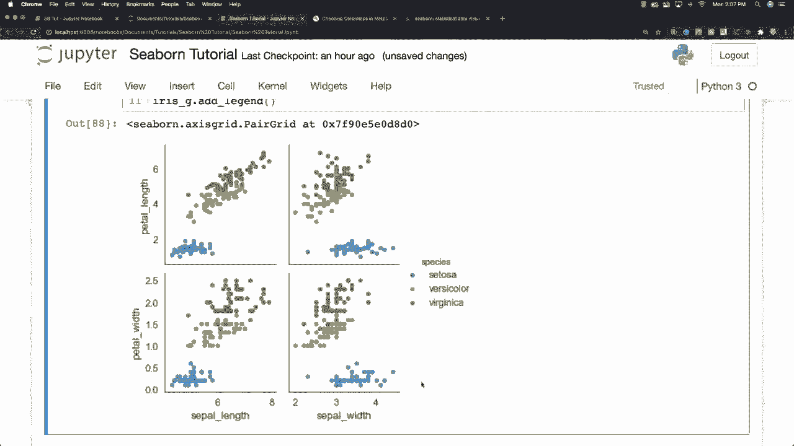

And I put Fg in there for facet grid。And then you call SN S。Facet。Grid。And I'm going to use the tips data frame， of course。Column is going to be represented with time and row is going to be represented with smokers。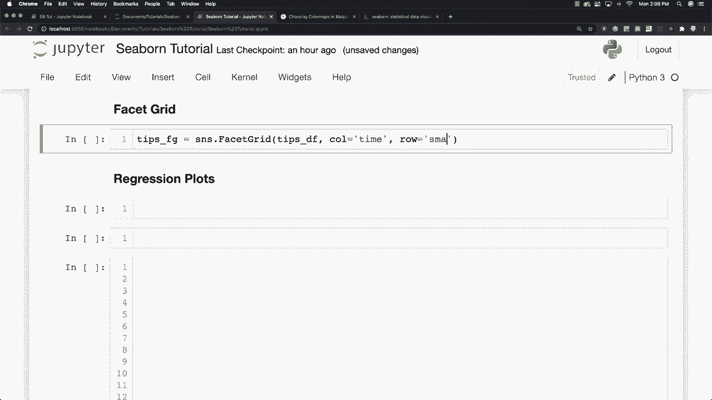

And you can see we went and created our grid like system here。 and what I want to do now is I want to pass in attributes for my histogram。 so I'm going to say tips， FG， map， and plot a histogram。And。Based off of total bill。 and I'm going to say that I want to put this in buckets or bins of eight。

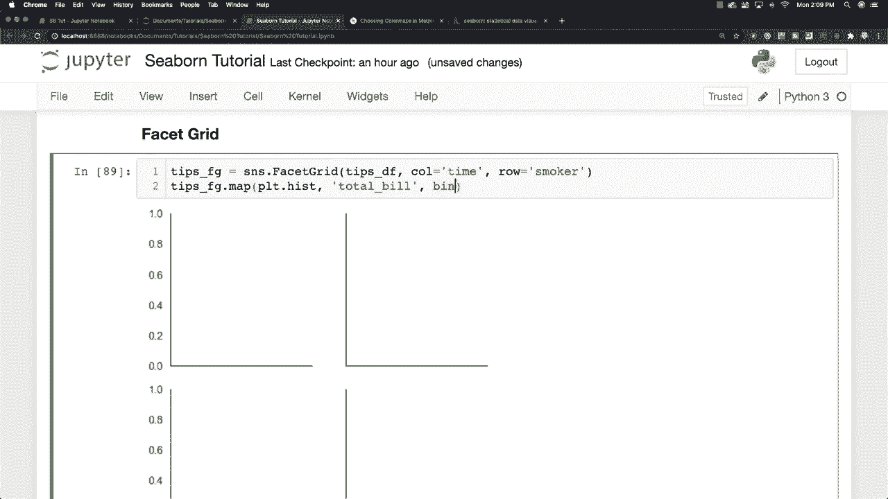

You can see it went automatically generated those histograms for us of pretty neat stuff you're also going to be able to come in and let's say you wanted to create a scatter plot and that's going to be total bill and let's try tips。

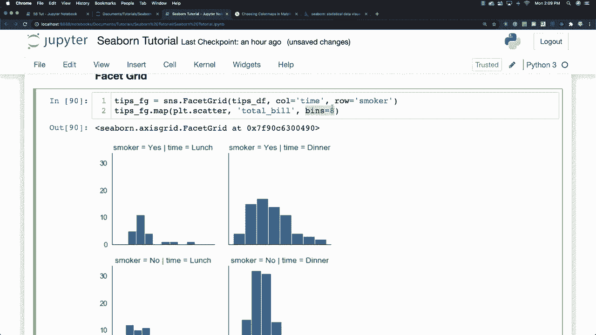

Compare both of those as well this is tip not tips al right and there you can see we created a scatter plot Another thing we're going to be able to do is let's go let's get rid of this and let's say that we would like to assign variables to different colors could do this so let's have this still be the tips data frame I'm going have column B time I'm going however change h to smoker and you can also go and change the height and then you can let's change the height to4 and then you can change something called the aspect which is going to be the width based off the height so I'm going make that be1 so they're going to be equal to each other let's make it a little bit bigger let's say 1。

3 then we can come down and we could say tips FG。

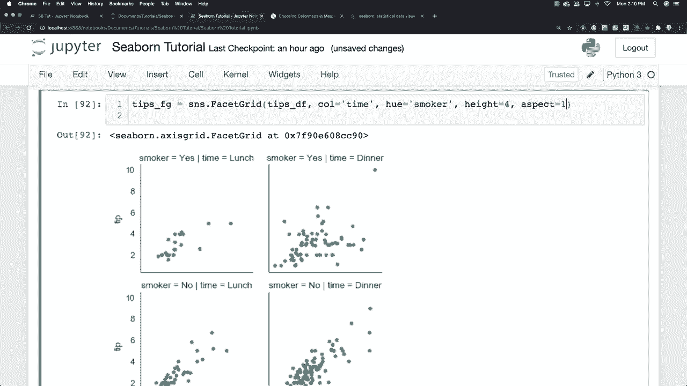

Let's try map and let's just stick with a scatter plot here because that makes most sense for doing some crazy stuff。 So I'm going to have this be total bill and tip。

And you can see there is our our two scatter plots。 Let's go and add some different options like let's say I wanted dinner to come before lunch for some unknown reason。 I can do that。 So I'm going to say a column order is equal to dinner。

And lunch， and let's go and change our palette as well。 So we'll say palette is equal to。 and I'm going to use one called set one。 and I'm also going to change。The edge color for our dots in our scatter plot to be equal to white。 And there you can see with the changes that we made there。 Alright， so pretty neat stuff。

 Now let's go and show you some other options because this guy has a ton of options。 Let's say that we would like to go and change sizes and line widths and assign different colors to markers and different use different markers。 These dots right here called markers。 I can change all that stuff。 What I want to do is I am going to create a dictionary。

 This is going to represent the size of our markers。 And then I'm going to define the line width to be equal to 05 and the edge color to be equal to white。 then I'm gonna come in。

facet grid is going to be equal to SN S facet grid tip stat frame。 let's have our column be equal to sex and our Hue changes are going to be based off of whether the person is a smoker or not。And。Let's define the height for each of these to be4 in the aspect ratio。 which we end up in the width， is going to be 1。3 again。

 And let's keep just adding all kinds of different crazy stuff。 Let's say we want to change our H order。 have this be yes， and then no for smoker。 Okay。 that's what that references。 And then we can also change our markers by saying h KWs is equal to dictionary。

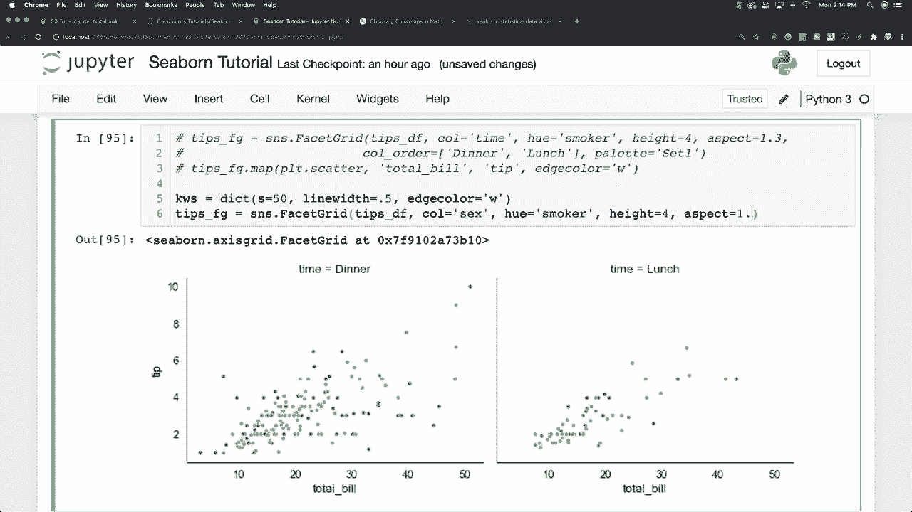

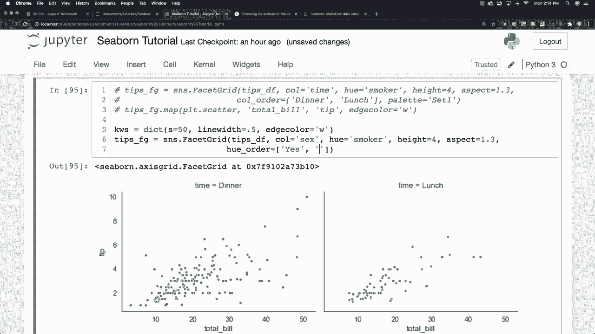

We'll define our marker symbols to be let's do like a upwards facing triangle with this carrot symbol like this。 and then let's do a downward facing triangle by putting a V inside of there like this All right I'm trying to figure out all the use all the different parameters and then we're going to assign this dictionary worth of data in regards to the markers as well。

 So I'm going to say tips facet grid。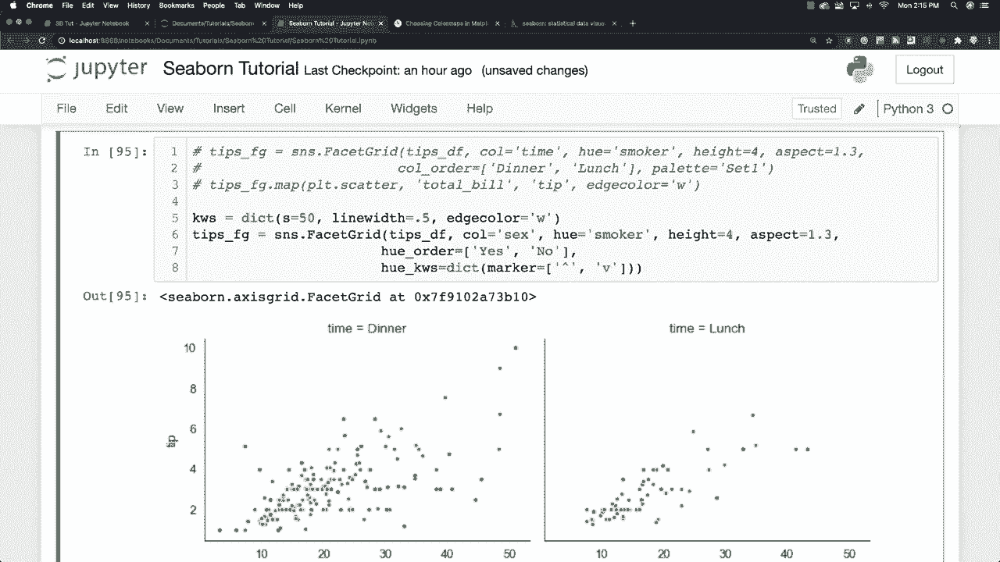

Map and。Go and create our scatter plot based off of。The total bill。The tip amount and then pass in the other data that we made in regards to the markers and there you can see all the crazy stuff we just did with both of those all right。 so that's if you wanted to see just about every option imaginal and then the last thing I want to do with a facet grid is show you something kind of neat I'm going to go and get different data again。 so I'm going to go this is attendance data so SS dot load。

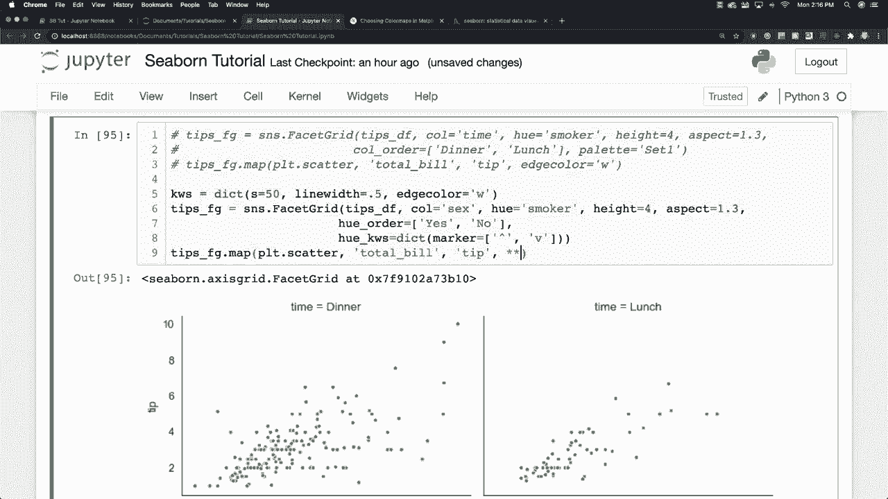

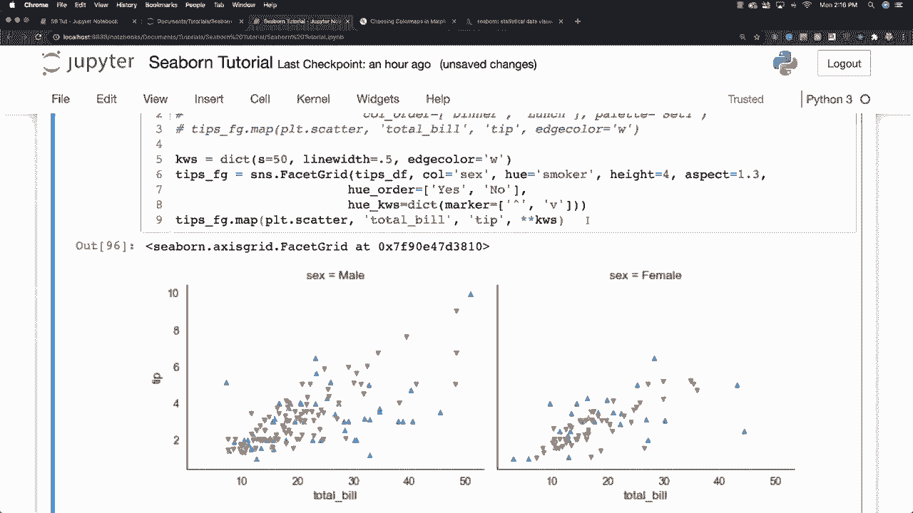

Data set。And attention And what this is is this is data frame is going to provide like scores that were taken for different students based off of the level of attention they were able to provide during the testing phase that's these kind of weird sort of stuff and I'm going to go S and S I'm going to create a facet grid here again and what I want to do here is I want to put each person in their own plot with。

5 per line and plot each of their scores depending upon how much attention they were able to pay during the testing phase。 Okay， so it's kind of just neat weight of playing around with data。 So the column is going to be the subject。 I'm going to say that I only want five subjects per line So column wraps 5 and I'll define the height to be 1。5。 and then what I'm going to do is to do a regular traditional plot So I'm going to say Tt FG map and just do a regular plot plot。

いや。🤢，We'll have solutions。And。Scores and then for we can also define custom markers So we'll say our custom marker in this situation is going be a very simple dot Oh and I type in column wraps instead of column wrap and scores。 this should be score and run it and there you can see all the individual subjects or students that were being tested。

 their scores and how their scores change depending upon how much detention they could pay Allright so just so many different ways to look at and play with data and to finish off this tutorial I want to talk about something you're going to use all the time which are。

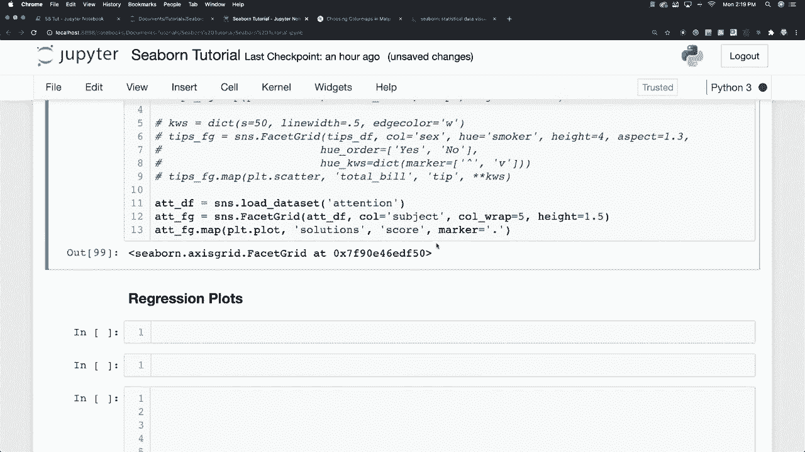

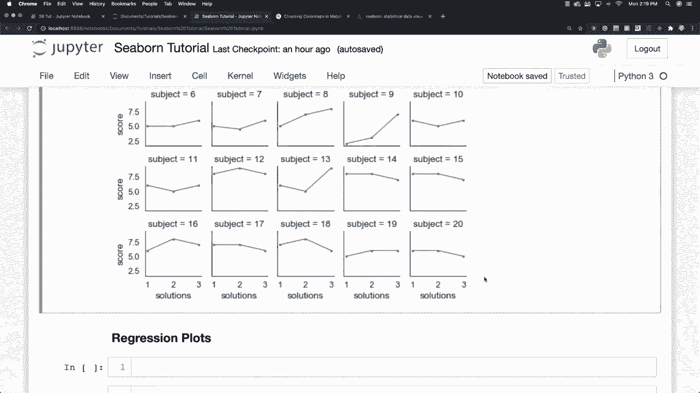