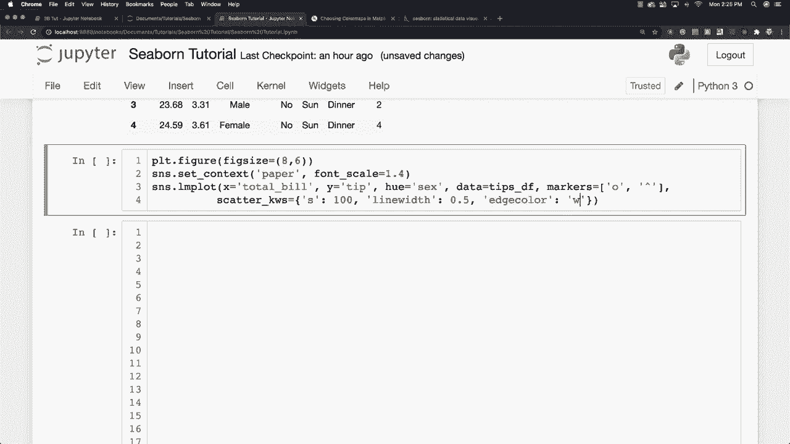
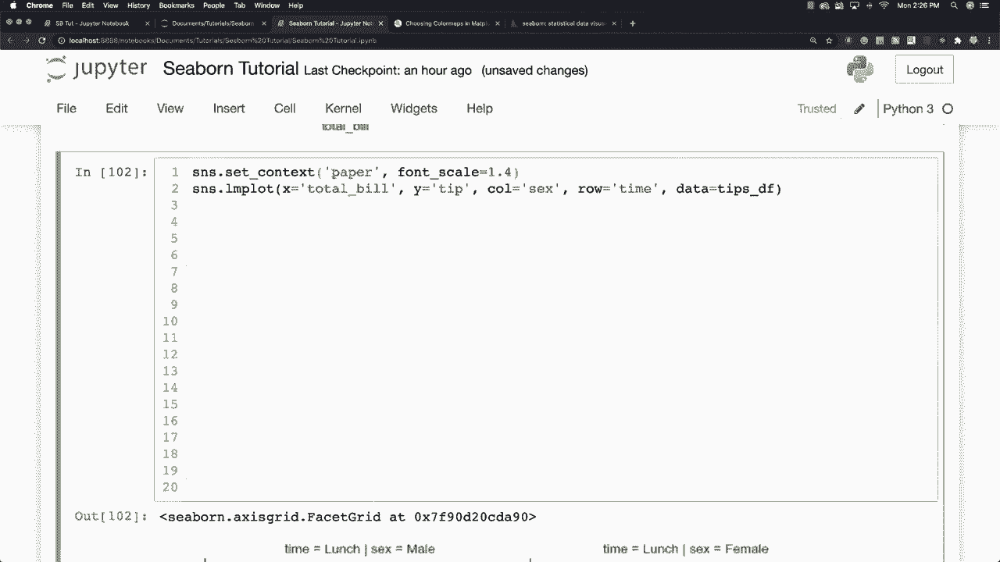

# 【双语字幕+资料下载】更简单的绘图工具包Seaborn，一行代码实现Python可视化！1小时教程，学会20种常用图表绘制~＜实战教程系列＞ - P22：L22- 回归图 - ShowMeAI - BV1wZ4y1S7Jc

所以我会再次使用我的小费数据。让我们去看看这些数据的前五个，只是提醒你我们将使用什么类型的数据。好的，所以我想做的是，我将定义图形的大小，图形大小将等于8乘6，我会将其设置为纸张格式。

所以设置。

上下文。为了纸张，我会将我的字体缩放到1.4，以使其看起来不错，并绘制一个回归图，我在之前的教程中多次提到过，你可以像这样使用LM图。我想研究总账单是否会影响小费金额，当然会，这就是我们这么做的原因，所以我将输入总账单金额，对于Y，我们将输入小费金额，Hugh将用于显示男性和女性之间的分隔。

所以我们可以说hug是与性相关的，数据当然会来自我的小费数据框，T数据框，我会再次使用自定义标记，来展示你可以做到的。我要用一个圆圈。然后，我会，确保把它放在引号里。

圆圈。然后对于女性，我将使用大写三角形，然后我还会通过将scatter underscore KWS设置为和我将定义我的标记的大小，让它为100。

看看那是什么样子。我还会定义对齐宽度，让我们把它设为0或0.5。我还会改变边缘颜色。让我们把它设为白色，如果我运行它，你可以看到我们的高度自定义散点图，你可以在这里应用我们在这个教程中学到的所有其他内容，玩弄并让它看起来像你认为的最佳样子。

最后，我会在这里做另一个回归图。但是你实际上可以将数据分成不同的列。因此，我将使用SNS Lm图，将其设为总账单和小费金额。所以我们在这里做相同的分析，所以这里是小费，列我还会分析六，你也可以将其分开到一天中的时间。

所以我会基于这个进行行处理。

然后，最后，把你正在使用的数据框放入，你可以看到所有这些数据是如何发挥作用的，以及它如何影响我们的回归分析，它提供了多种不同的方式来查看多个数据点。如果你不喜欢这个样子，有时你可以调整上下文。

所以让我们把这个放进去，就这样。然后将其改为海报格式。哦，那非常，非常大。所以这不太合适。我们还是坚持使用纸张格式，这样比较容易阅读。当然，你也可以来调整高度和宽度等。

现在让我们来调整一下高度，首先，我们把这个移动到这里，留出很多空间。我们将高度定义为类似于8，宽高比设定为0.6，完成了。所以我们有不同的方法来扩展我们的数据，查看、分析并呈现给观众。这是对Seaborn的所有不同功能的一个相当全面的概述，更多的可视化教程即将推出，像往常一样，请在下面留下你的问题和评论，否则，下次再见。

