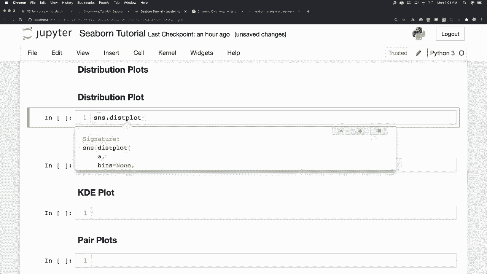
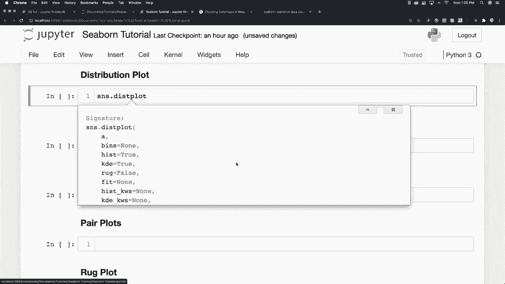
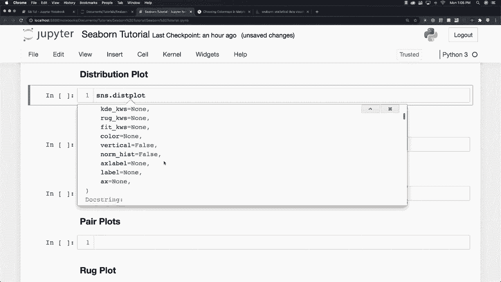
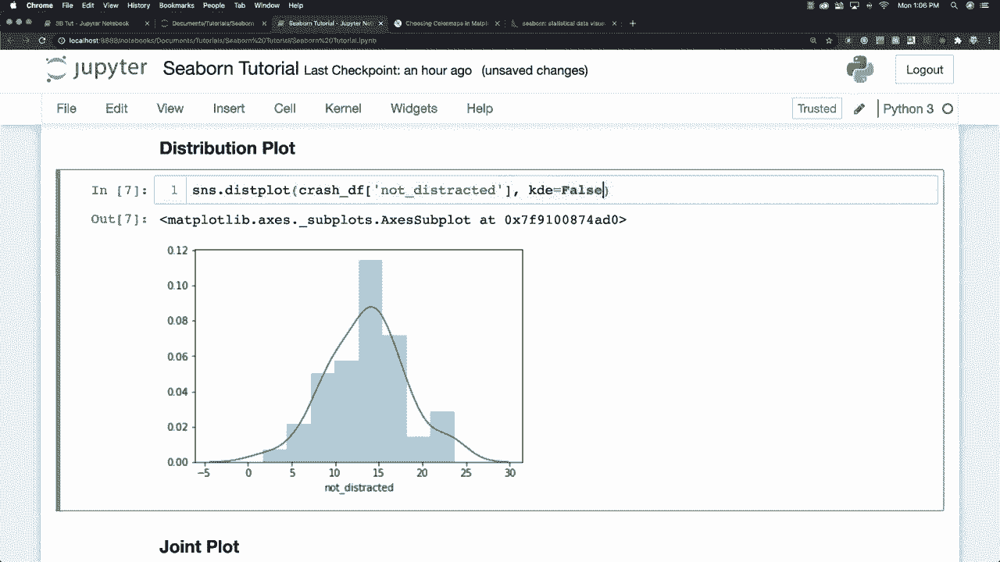
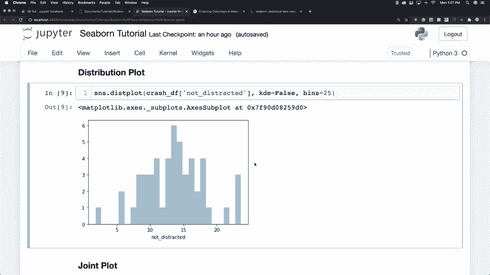

# 【双语字幕+资料下载】更简单的绘图工具包 Seaborn，一行代码做到 Python 可视化！1小时教程，学会20种常用图表绘制~＜实战教程系列＞ - P4：L4- 分布图 - ShowMeAI - BV1wZ4y1S7Jc

On GiHub Allright， so now I want to talk about the different distribution plots that are available to you and the very first plot we're going to look at here is what we call a distribution plot and basically what they're going to provide is a way to look at Univariate distributions and you may say what's our Uniivaria distribution It's just going to provide a distribution for one variable and how you get them is say S and S。

And distribution plot。Distribution plot and of course you can go and find out more information about this specific command by just going shift and tab and it'll show you all of the different information in regards to what is available for you in regards to attributes and such and I'm going to cover some of these things and some of them I am not I'm going try to get in a happy medium of providing what you're going to use a lot versus getting into every single thing and that you're not going to use okay so let's say we were interested in accidents in which the person was not distracted so let's come in here and you can see there's a plot and this line right here is or this is a histogram plot that's what this is called and what this plot is here is what is called a kernel density estimation and。

If you come in here and you don't want that on there。 you can just come in and say KdeE is equal to false and see there it's gone now and basically it's just going to provide an estimation of the total results in your data set all right so pretty simple stuff and what else can we do here。

 we can also define bins so we can say bins is equal to $25 see how that changes our data and basically a bins like a bucket that is going to be used to divide the data up into between different intervals so for example。 if you were doing something with profits you could say put all profits between 10 and 20 in a bucket or a bin and it's just going to decide how many of these bars you're going to see across your data and so that's basically a distribution。

