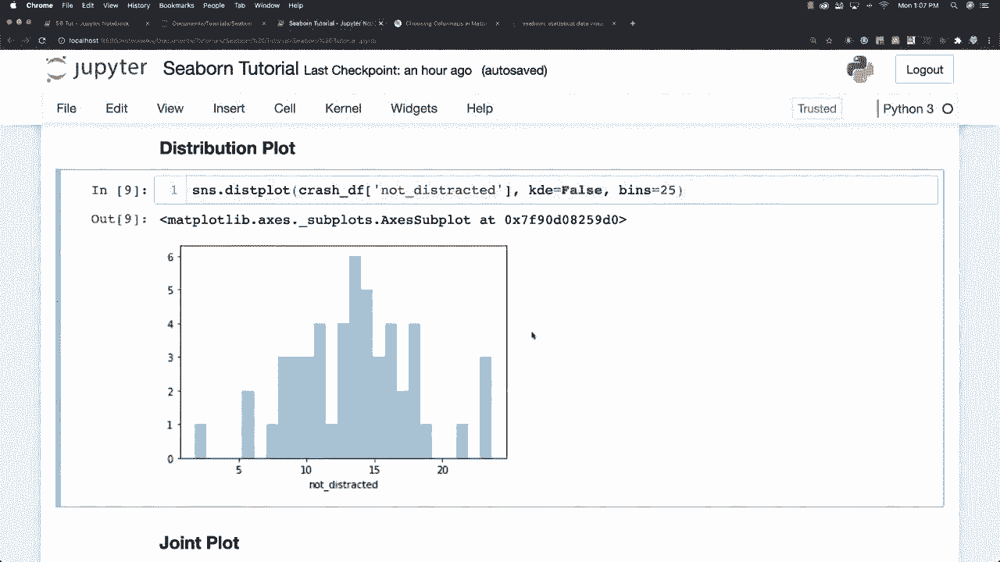
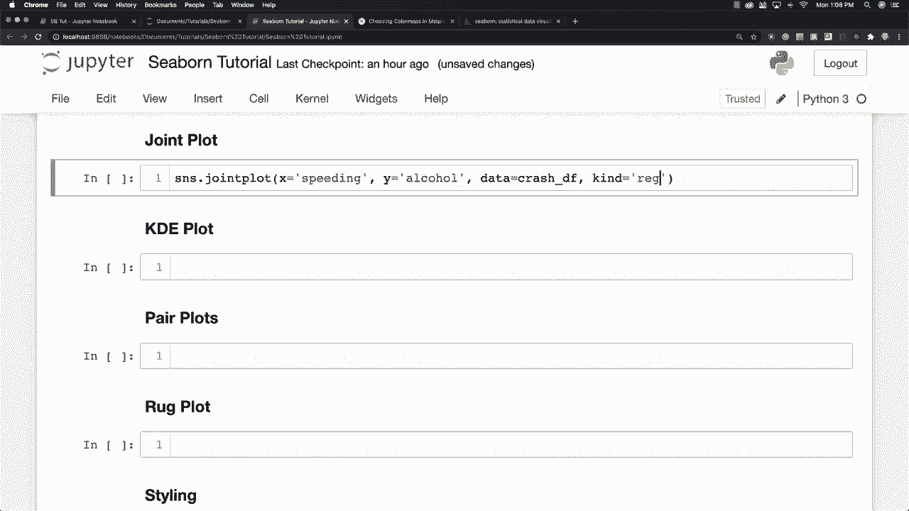
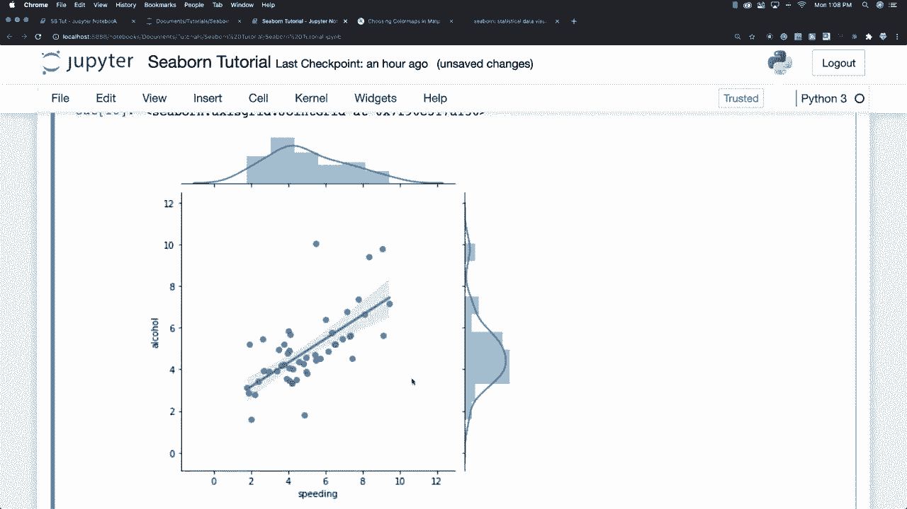
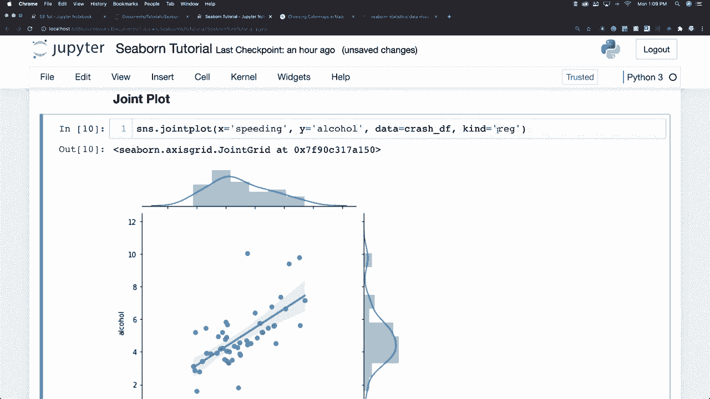
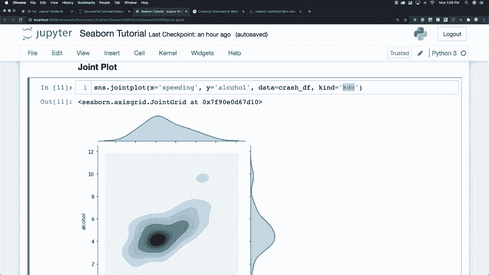

# 【双语字幕+资料下载】更简单的绘图工具包 Seaborn，一行代码做到 Python 可视化！1小时教程，学会20种常用图表绘制~＜实战教程系列＞ - P5：L5- 联合图 - ShowMeAI - BV1wZ4y1S7Jc

Now we also also in the realm of distribution plots。

 we have things called joint plots and a joint plot is going to be used to compare to distribution and plots a scatter plot by default so we can come in and go joint plot and let's say that I would like to receive data on the X axis that is in regards to whether the person was speeding or not。

 and on the Y axis in regards to whether the person was inebriated or was drunk driving。

You can say data is equal to， and we're using the crash data frame and let's say that we would like to generate a regression line。

We can go kind is equal to regression and boom， and then you can see that it went and plotted all of this crazy stuff all over this place here。

 you could also come in and create one of those KdeE plots just by coming into the kind area and saying KdeE and see kind of all kinds of cool types of plots we can make inside of here and KdeE again refers to kernel density estimation and like I said before。

 just estimates the distribution of data and you could also come in and create a hexagon。

