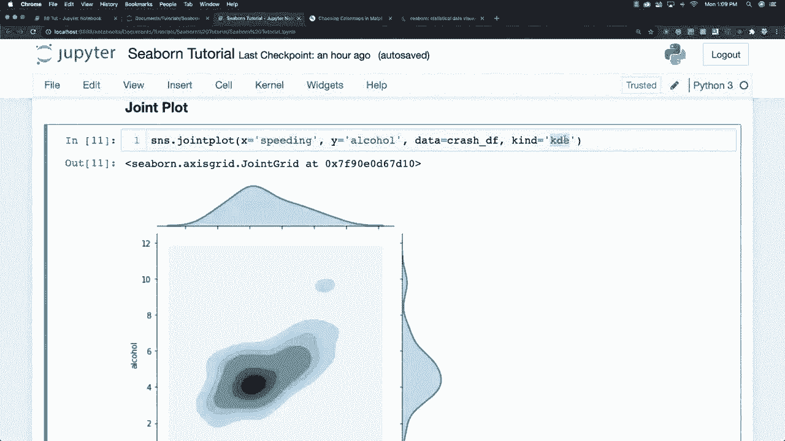
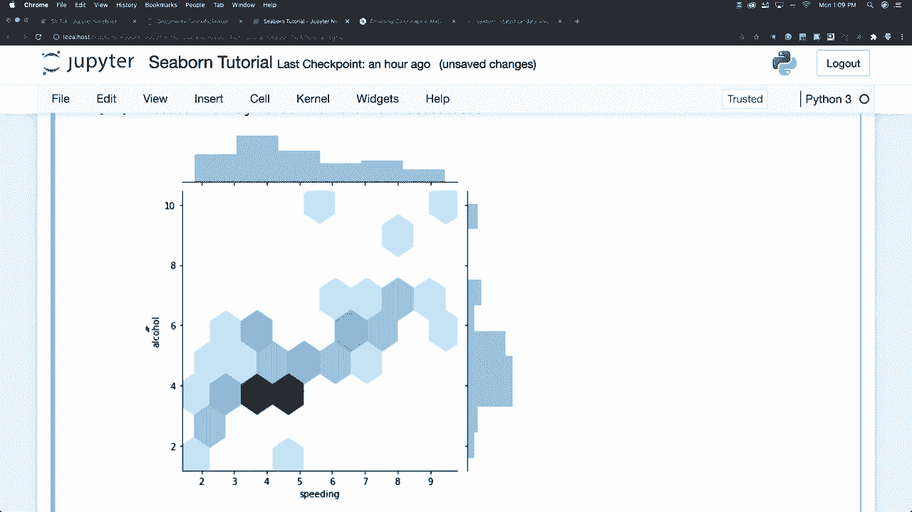
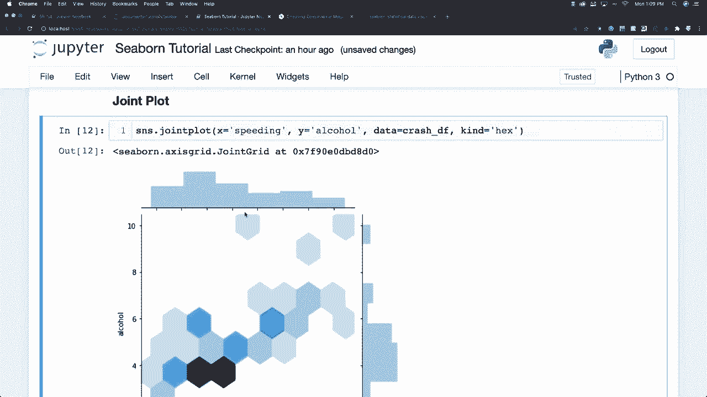

# 【双语字幕+资料下载】更简单的绘图工具包 Seaborn，一行代码做到 Python 可视化！1小时教程，学会20种常用图表绘制~＜实战教程系列＞ - P6：L6- 六边形分布图 - ShowMeAI - BV1wZ4y1S7Jc

在分布上，只需像这样输入十六进制。你可以看到这些数据是如何分布的，以及大多数人在饮酒和超速之间的快乐点，任何时候他们发生事故时。所以你可以用这个做很多非常酷的事情。

