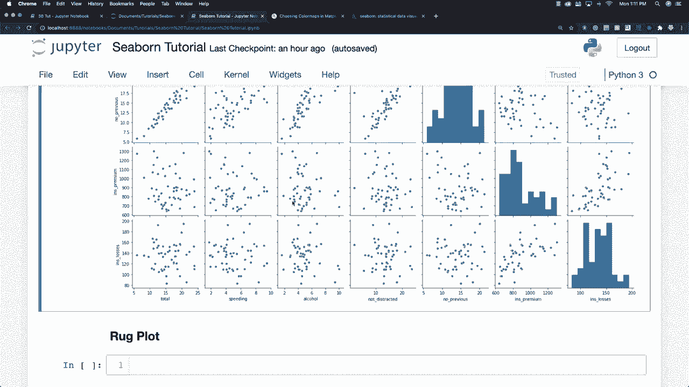

# 【双语字幕+资料下载】更简单的绘图工具包 Seaborn，一行代码做到 Python 可视化！1小时教程，学会20种常用图表绘制~＜实战教程系列＞ - P8：L8- Pair对图 - ShowMeAI - BV1wZ4y1S7Jc

现在我想再次谈谈配对图，仍然是在分布图区域，基本上配对图将绘制整个数据框数值之间的关系，所以让我们创建一个，可以说配对图和`Cash`数据框，并查看所有信息，所以有很多信息，您可以看到左侧有我们的总数。

我们有超速数据，我们还将有关于酒精的数据，我们将比较这些列和行，以及这些不同数据如何相互影响，以生成对角线上的直方图，以及其他地方的散点图。

但我们可以在这里更改很多内容，让我们加载另一部分数据。假设我们想获取提示数据框，再次使用`load`加载这新数据。

数据集和提示。只是为了向您展示我们这里的提示数据框中有什么。基本上，我们将会有总账单，提示金额，谁给了$1的小费。我不知道是否是男性或女性，是否吸烟，购买发生的日期，以及这是晚餐还是午餐，以及派对的规模，我相信这就是所指的内容。所以，为了处理一些不同的数据，并混合一下，我们来创建另一个图表。所以我将去掉这个，打算使用`SNS.pairplot`，我们将使用提示数据框，并且您可以传入分类数据，图表将根据这些分类数据进行着色。所以假设我们这次想要获取与性别相关的数据。

您还可以进来，我会很快详细介绍调色板的样式。这是一个名为blues的matplotlib调色板，我在之前的教程中使用过，您现在可以看到所有内容都使用蓝色样式，您还可以看到浅色点代表男性，深色点代表女性，您可以看到我们能够制作的图表，基本上是总账单、提示和规模，总账单、提示和规模是我们在这里提取的信息，我会在稍后讨论样式，所以我们可以更改这些字体大小等等，当我们进入网格时，我会向您展示如何制作这些图表，并在我们的图表网格的顶部、对角线和底部放置不同的图形，但现在我想谈谈rug。

