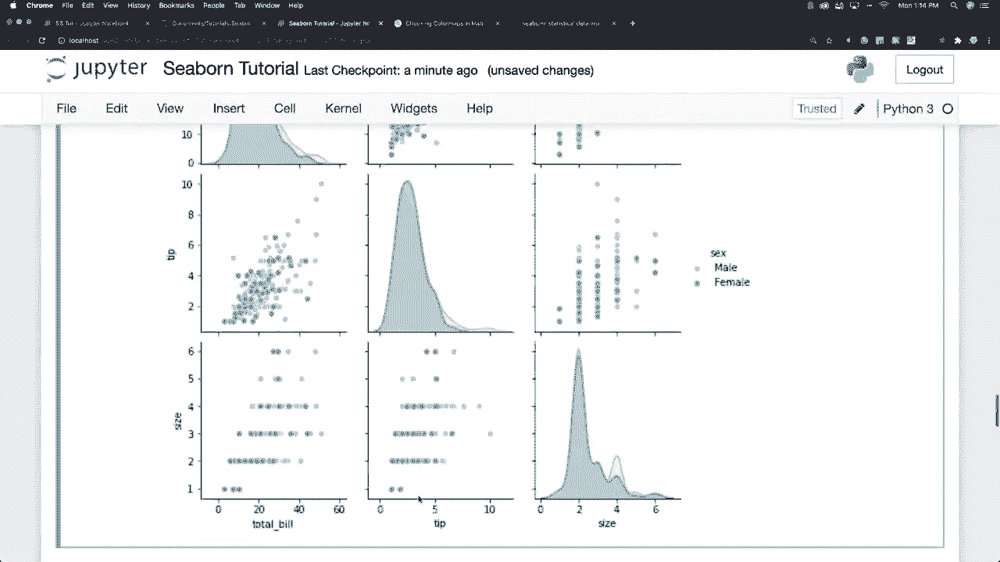

# 【双语字幕+资料下载】更简单的绘图工具包 Seaborn，一行代码做到 Python 可视化！1小时教程，学会20种常用图表绘制~＜实战教程系列＞ - P9：L9- Rug图 - ShowMeAI - BV1wZ4y1S7Jc

Plos allright， so let's go and create a rug plot just by saying rug plot and specifically we're going to look in the tips data set again and specifically we're going to look at tip amounts and basically what a rug plot is going to do is it's going to plot a single column of data points in a data frame as sticks So you see these different sticks across the bottom on this axis and with a rug plot you'll see a more dense number of lines where the amount is most common and this is kind of like how a histogram is taller where values are instead with a rug plot the plot is denser where the values are more common Allright rug plots aren't really use very much but Ive been messing around here with all these graphs and such and what I want to do now is focus in on styling so we can make。

