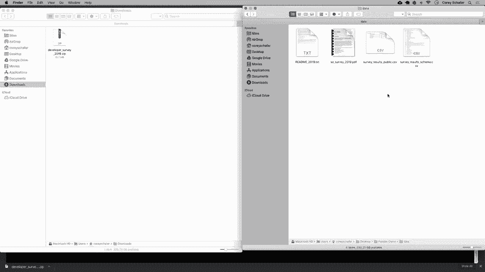

# 【双语字幕+资料下载】用Pandas进行数据处理与分析！真实数据&实时讲解，学完就能上手做数据分析了！＜实战教程系列＞ - P1：1）数据分析入门 - 安装和加载数据 - ShowMeAI - BV1M64y187bz

嗨，大家好，最近过得怎么样？在这个视频系列中，我们将学习如何使用pandas库和Python。pandas是一个数据分析库，使我们能够轻松读取和处理不同类型的数据。我们可以用它来分析CSV文件、Excel文件和其他类似格式。

如果你想进入数据科学领域，那么这个库是必学的。它是Python中下载最多的包之一，这有很好的理由。它不仅让我们轻松读取和分析数据，而且由于是基于NumPy构建的，因此性能也很出色。

在这个系列中，我们将学习不同类型的数据分析。因此，在这个视频中，我们将讨论如何安装pandas，如何下载我将在这个系列中使用的数据，以及如何在Jupyter notebook中打开这些内容。

这样我们就可以准备进行编码和分析了。现在，我还想提到，我们有这个系列视频的赞助商，那就是brilliant.org。所以我非常感谢brilliant赞助这个系列。如果你们能通过下面描述部分的链接查看他们并支持赞助商，那就太好了。

我会稍后详细介绍他们的服务。那么，话不多说，我们开始吧。首先，让我们安装pandas。我为这个系列使用了一个干净的虚拟环境，但如果你不想使用虚拟环境，也没关系。如果你不知道虚拟环境是什么，并希望了解更多信息。

那么我会在下面的描述部分留下我关于这个主题的视频链接，供有兴趣的人参考。安装pandas真的很简单。我们只需输入`pip install pandas`，然后让它运行。一旦我们安装了pandas，我们还需要安装Jupyter，以便使用Jupyter notebooks。

我对在这个系列中使用Jupyter有些犹豫，因为有些人觉得它很难上手。但老实说，如果你要使用pandas进行大量工作，那么它绝对是一个不错的工具。所以现在并不是必要的。如果你使用常规编辑器，也可以很好地跟随这个系列。

Jupyter notebooks可以通过浏览器更轻松地展示我们的数据和表格，使其更容易可视化。因此，我将在这个系列中使用它，但你不必这样做。要安装Jupyter，我会输入`pip install jupyterlab`，这个拼写是J U P Y T E R L A B。我们将安装它。

现在我不会在这个系列中深入探讨如何使用 Jupyter。我主要会专注于 pandas。但如果你想要详细了解如何使用 Jupyter，我有一个相关的视频。

Jupyter 深度介绍，如果有人想了解更多关于使用它的详细信息，我将在下面的描述部分留下那个视频的链接。好的，现在我们已经安装了 pandas 和 Jupyter 笔记本，现在我们需要下载我将在本系列中使用的数据。对于那些一直在观看我最新视频的人，你们知道我喜欢使用 Stack Overflow 开发者调查进行不同类型的数据分析。之所以喜欢使用这些数据，是因为它是现实世界中的数据，并且其中有很多我认为对观看这些视频的人来说有趣的数据。

我见过一些其他的教程，其中的数据似乎有些不切实际，不太相关。因此，希望使用这些数据能让人们保持兴趣，同时也能让你对如何从来源下载真实数据并开始使用 pandas 进行分析有一个好的了解。

为了下载这些数据，我在浏览器中打开了这个。我们可以去 Stack Overflow 调查结果页面。现在这很简单，只需 Google 一下即可。但为了简单起见，我将在描述部分提供这个下载页面的链接。好的，现在在这个页面上，你可以下载任何年份的 CSV 格式的数据。

现在我要下载 2019 年的数据，这是这里的顶部数据。因此，我将下载这个 cv，然后我们再点击下载，这应该会为我们下载。好的，确实下载了，现在我要在我的查找器中打开它。我将解压这个数据，它以压缩包的形式提供。一旦数据下载并解压。

我将把那个文件夹拖到我桌面上的一个文件夹里。我们也将在那里创建一个笔记本并分析这些数据。快速说一下，我没有打开这个。让我打开它。

Pandice 演示文件夹。然后这将会在查找器中打开。现在我将数据拖入我桌面上的这个 pandas 演示文件夹。因此，你的项目可以在任何地方。但我刚刚在桌面上创建了一个名为 pandas demo 的项目文件夹。这个文件夹除了我们刚刚拖入的数据外是完全空的。

现在我将重命名这个文件，因为这个名字有点长。我将把它重命名为数据，这个数据被命名为开发者调查2019。但我只是称之为数据，这样我们在脚本中更容易找到。好的。那么在我们解压的这个数据目录中，我们有什么文件呢？

让我把这个放大一点。好的，首先，如果你下载的数据附带有readme文件，那么这通常是有帮助的。我们在这里有一个readme文件。它告诉你其他文件将是什么。所以在这种情况下，我们有。

调查结果包含主要调查结果，每个响应者一行，每个答案一列。调查结果模式在这里有与结果中每个列名对应的问题。如果现在有任何内容不清楚，那么在我们打开这些数据时就会明白。所以我这里只是给出一个大概述。不要让我说的所有内容让你感到不知所措。

一旦我们在Jupyter中打开它，这会更有意义。所以我们就开始吧。为了在Jupyter笔记本中打开这个，我会回到我的终端。所以我会关闭这里打开的Finder窗口，回到我的终端，现在在这里，我将导航到放置数据的文件夹。

在Mac、Linux和Windows上，这应该是相同的命令。所以我会说C，并将转到我的桌面。这个位置将是你项目目录的所在位置。

但我的演示在桌面的这个Pandas上，一旦我导航到该目录就可以启动Jupyter笔记本。我们只需要输入Jupyter notebook并运行它。我们应该看到一个服务器在这里启动。看起来花了一秒钟。好吧，来了。现在，回到我们的终端，这将运行一个Jupyter服务器。在你使用Jupyter时，你需要保持该终端窗口打开。

Jupyter在浏览器中运行，所以如果你关闭这个服务器，你将无法访问我们的笔记本。好的，所以让我们回到浏览器。这是我们有Jupyter笔记本的地方。让我放大一点，这样大家就能看得比较清楚。好的，我将放大到差不多这个位置，我觉得很好。好的。

所以我们可以看到我们下载的数据文件夹，放在我们的Jupyter演示文件夹里。不久前。但现在让我们创建一个新的笔记本。为了创建新的笔记本，我将在右上角点击“新建”，然后选择Python 3。😊。

现在我们可以命名我们的笔记本。所以上面说无标题的地方，我要点击这里，称其为 pandas 演示并重新命名。好的，现在我们准备开始使用 pandas，因此我们可以通过说 import pandas as PDD 来导入它。将 pandas 导入为 PDD 是使用 pandas 的常见惯例。所以让我们运行它。

我通过按 shift 和 enter 运行了那个单元。再次说明，我不会在这一系列中深入讨论在 Jupyter 中工作的具体细节，但如果你想了解我将使用的功能和快捷键的概述，我在下面的描述部分有我的 Jupyter 视频链接。好的。

所以在视频的其余部分，我们将看到如何加载数据，并查看一些关于该数据的信息。我们的数据是 CV 格式的。因此，为了读取这个 CV，我们可以简单地说 D F，这将代表数据框。我们将在稍后学习有关数据框的一切。

我们将说 D F 等于 P D.dot.read_ CV。我们将使用这里的 pandas 的 read CSV 方法。现在我们只需传入 CV 文件的路径。我的文件在数据文件夹内，文件名为 survey_ results_ public。😊，CSV。

现在如果我按下 shift，然后那将运行这个单元。所以一开始，我们可以看到这非常简单易用。因此在使用原生 Python 来读取 CV 文件时，我们需要使用 Cv 模块来创建 CSV 读取器等。

但这里我们只是将这一切放在一行中。因此当它读取时，它将以数据框的形式读取。因此，数据框几乎是 pandas 的支柱，我们将在下一个视频中深入探讨数据框和序列对象。

但就基础而言，数据框基本上只是数据的行和列。我们可以通过打印出来看看数据框的样子。这就是使用 Jupyter 笔记本的好处，因为它允许我们以其他编辑器无法做到的方式可视化这些内容。

所以在 Jupyter 中，我可以简单地说 D F，然后运行它。它将打印出我们的。😊。数据框。因此我们甚至不需要在这里用 print 函数包裹它。现在，如果你使用普通编辑器，你仍然可以打印出数据框信息，但它看起来不会像在 Jupyter 中那样好，因为我们得到了这个交互式表格。所以这是我们数据的一个小概览。

现在这里实际上有 85 列，但如果我滚动这些，它看起来并没有实际打印出 85 列。因此，这实际上是默认连接的，只是为了给我们一个数据的广泛概览。因此，默认情况下，Jupyter 显示我们数据框的 20 列。现在。

我是怎么知道这个数据框有85列的呢？有一些属性和方法可以帮助我们了解数据的样子。首先，我们有形状属性，`shape`。它以元组形式给我们行数和列数。让我们来看看这个。在下面的单元格中，我要说 `Df.shape`。

我将运行这个。现在这里是一个属性。它不是一个方法。所以你不需要加括号。所以 `Df.shape`。我们可以看到我们有88000行和85列。如果你想要更多信息，我们可以使用信息方法。信息方法会告诉我们行数和列数。

还有所有列的数据类型。在我运行这个之前，看起来我的文本有点被切断了。有时在使用Jupyter时会发生这种情况。为了修复这个问题，我通常会上面重新启动并重新运行我的所有单元格。

这通常可以解决问题。让我们看看是否有效。好的，这似乎有效。你还可以做的另一件事是完全重新加载页面和浏览器。当你重新加载页面时，我觉得这只是因为我把文本放大了，所以它有点影响这些的显示，但现在我们可以清楚地看到这些。好的。

正如我所说，我们可以看到这里有88883行和85列。如果你想要更多信息，我们可以使用信息方法，这将告诉我们行数和列数，以及所有列的数据类型。让我们运行这个。如果我输入 `Df.info`。哦，`Df.info`。这实际上是一个方法，所以我们需要加上括号。让我运行这个，现在让我们查看这个输出。我们可以看到这里说我们有88883条记录。

所以这些是我们的行，我们总共有85列，然后列出了我们所有的列数据。这些是我们加载的CSV文件中的所有列。现在它还给出了每一列的数据类型，我们将在未来的视频中讨论数据类型，但大多数情况下，对象通常表示字符串，然后还有其他类型。因此，`int64`就是整数，`float`是浮点数，可能是小数。这个数据中没有其他数据类型，但一般来说还有更多数据类型。所以我会确保在不久的将来专门制作一个关于数据类型的视频。好的，现在我们知道行数和列数，让我们在Jupyter中更改一个设置，以便我们可以看到所有列。我认为看到这些会很有用，即使有很多需要滚动浏览的内容。

更改一个设置，我将来到这里的底部，使用PD.set_option来更改一个设置。在这里，我将说display.max_columns，并将其设置为85，这样我们就能看到所有列了，我将运行这个。现在如果我们打印出数据框，我会返回到打印这个数据框的地方，重新运行那个单元格，现在如果我滚动这些列。

然后我们可以看到，现在看起来我们确实有这85个不同的列在这里。因此我可以继续滚动，继续滚动，而不是像之前那样在20的地方被截断。现在，显然行也在这里被连接在一起，我们肯定不想打印出所有89000行。

不过在某些数据集的例子中，您可能想看到所有行。例如，我提到的下载中包含的调查结果模式CSV文件提供了与这些列名对应的匹配问题。

所以如果我们想知道这些列名在这个数据中意味着什么，那么我们也可以加载那个模式CSV文件，让我来做这个。我将到达笔记本的底部，只需通过说schema_df来加载它。现在我不想仅仅称其为Df，因为我们不想覆盖其他数据框，我将像之前那样通过说PD.read_csv来加载它，这在数据文件夹中，名为survey_results_schema.csv。现在我运行这个，看看我们刚加载的模式数据框，这里在这列中，给出了我们其他数据框中的所有列。

主要分支，爱好者，如果我向上滚动到那个数据框，我将删除这里的信息，因为我们不再需要它。如果我向上滚动到这个数据框，我们可以看到响应者的主要分支和爱好者。所以如果我们想知道这些意味着什么，那就是我们使用模式的原因，这样我们就可以看到主要分支或爱好者意味着作为爱好编写代码，主要分支则是哪个选项最能描述。

现在它实际上连接了文本，为了看到完整的文本，我们可以更改一个选项，或者直接访问这个值。我将在下一个视频中向您展示如何做到这一点。但是现在我们可以看到，我们看不到与每个列名相关的问题的所有行。

记住我们有85列。但是在这里我们只能看到前五列，然后我们看到这里的省略号，接着可以看到最后五列。所以我们来设置一下，以便查看85行，然后重新打印，这样我们就能看到所有内容了。因此回到我们设置最大列数的同一个单元格，现在我们也要为行添加一个设置。我只是复制并粘贴，但这里不再是最大列数。

我将把这个设置为最大行数，然后运行它，现在我们将重新运行这个模式数据框。我们可以看到所有列和相应的问题文本。如果你想知道这些列的含义，这就是我们的做法。例如，“你是你家里的支持者吗？”这可能是一个是或否的问题。这就是它们的意思。如果你在自己查看这些数据时，不知道某一列在我们的调查数据中意味着什么，你可以随时使用这个作为参考。

如果你不想翻阅所有内容来寻找特定的行或列名，那么在未来的视频中，我们将学习如何过滤数据框，并查看如何获取某一列等于特定值的行。目前我们可以看到我们模式数据框的85行，但你可能在想。

嗯，那很好，但我不想每次查看调查数据时都看到85行。不过，我们可以使用几种方法，只查看特定数量的行。这些方法你可能会经常使用，以便确认你的过滤器和数据框是否正常工作。因此，我们可以通过说而不是直接使用`Df`来查看前五行。

我们可以说`Df.head()`，如果我运行这个命令，我们将得到前五行数据。你可以传入一个数字，如果你想看到特定数量的值。如果你想查看前10行，那么我们可以传入10给`df.head()`，这将给我们前10行，因此我们可以看到从0到9的所有数据。如果你想查看最后几行而不是前几行，那么我们可以使用`tail()`方法。

但是如果我们传入一个数字，就像使用`head()`一样，那么我们现在要说的是我们希望在数据中获取最后10个条目。这是我们数据的最后10个项目。好的，这就是关于安装pandas、下载数据以及如何将数据加载到Jupyter中的简要概述，以及如何读取这些内容。在结束之前。

我想提一下这个视频的赞助商，那就是**brilliant org**。在这一系列中，我们一直在学习关于pandas的内容，以及如何使用它。

在Python中分析数据，**brilliant**是补充你在这里学习内容的绝佳方式，他们提供实践课程，可能有一些优秀的课程和课程内容，深入探讨如何正确思考和分析数据，特别是数据分析基础。

我非常推荐查看他们的统计课程，它展示了如何分析图表并确定数据中的显著性。同时，我也推荐他们的机器学习课程，这个课程将数据分析提升到了一个新水平，同时你将了解那些允许机器在变量过多时做出决策的技术。因此，请支持我的频道，并进一步了解**Brilliant**。

你可以访问**brilliant.org/cs**注册免费账户。而且，前200个访问该链接的人将享有年费高级订阅20%的折扣。你可以在下面的描述部分找到该链接。再次强调，这是**brilliant.org/cs**。所以我认为这就是我们第一次关于**Pandas**视频的全部内容，希望你们觉得对如何安装**Pandas**和加载数据有了良好的介绍。

在下一个视频中，我们将学习更多关于数据框的内容，并学习系列数据类型。因此，我们将以更易于理解的方式思考数据框，并查看如何抓取特定的元素、列和行。

所以请确保继续关注。但如果有人对本视频涵盖的内容有任何问题，请随时在下面的评论区询问，我会尽力回答。如果你喜欢这些教程并想支持它们，还有几种方式可以做到这一点。

最简单的方式就是给视频点赞并支持。此外，分享这些视频给任何你认为会觉得有用的人也是非常有帮助的。如果你有条件，可以通过**Patreon**进行支持。该页面的链接在下面的描述部分，确保订阅以获取未来的视频，谢谢大家的观看。

😊。
