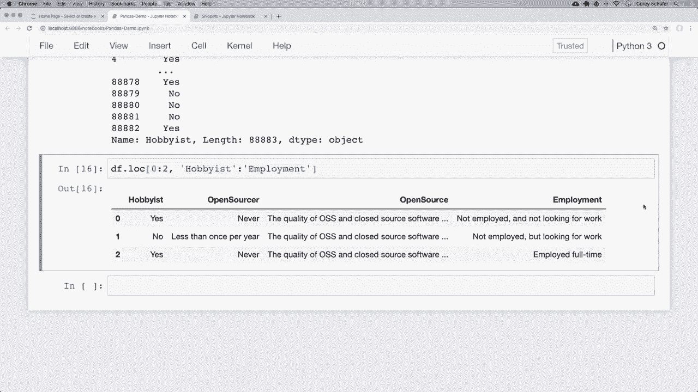
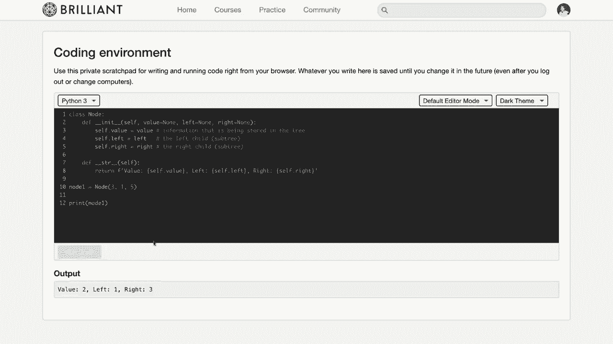
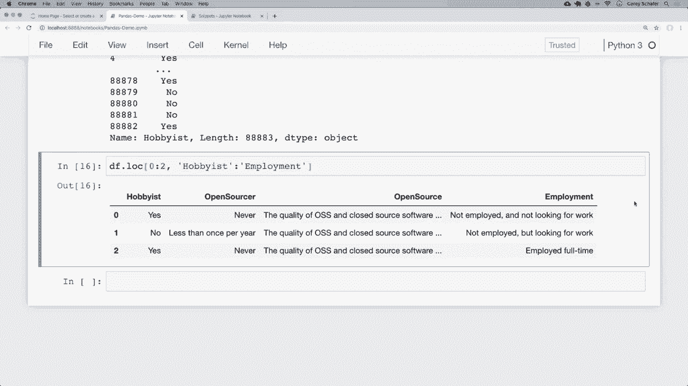

# 【双语字幕+资料下载】用Pandas进行数据处理与分析！真实数据&实时讲解，学完就能上手做数据分析了！＜实战教程系列＞ - P2：2）DataFrame和Series基础 - 选择行和列 - ShowMeAI - BV1M64y187bz

嗨，大家好，最近怎么样？在这个视频中，我们将继续学习更多关于Pandas的知识。具体来说，我们将学习数据框和系列数据类型。因此，正如我在上一个视频中所说的，这些基本上是Pandas的支柱，是你最可能使用的两种主要数据类型。在这个视频中，我们将讨论如何以不同的方式看待数据框和系列数据类型。

然后我们将了解如何从这些数据类型中获取信息的基础知识。现在，我想提到的是，我们为这个视频系列提供了赞助商，那就是Brilliant.org。因此，我真的很感谢Brilliant赞助这个系列。如果大家能通过下面描述部分的链接查看他们，并支持赞助商，那就太好了。

我会稍后再谈谈他们的服务。说到这里，让我们开始吧。好的，首先，让我们看看什么是数据框，然后我们将更多地了解如何将其视为Python对象。我们在上一个视频中简单查看了数据框，以确保我们的数据正确加载。

所以这些是😊，在Jupyter中显示为行和列的项目。基本上是一个表格。那么让我们看看这是什么样子。如果你跟着上一个视频，这基本上是我之前的同一个Jupyter笔记本，只是稍微整理了一下。因此，我们在这里导入Pandas，读取我们的Cv文件。

所以一个是我们调查结果的主要数据框，一个是我们模式结果的模式数据框。然后我们在这里设置了一些选项，最大列数设置为85，这样我们就可以看到所有列，最大行数设置为85，这样我们就可以看到所有模式。如果你到目前为止还没有跟上视频。

那么我在下面的描述部分有一个链接，指向你可以下载这些数据并跟随这个视频的地方。好的，这里是一个数据框。因此，当我们打印出Df的头部时，这就是返回的结果。所以这是我们数据框的前五行，你可以看到数据框由多行组成，我们也有多列。所以就这组数据而言，这些是调查结果，但你的数据可以是任何东西，最有可能以行和列的形式呈现，就像一个表格。因此，对于这组数据，作为调查结果，每一行是一个回答调查的人的回答，每个问题是他们对调查中该问题的回答。举个例子。

这个回应者编号一在这里回答说是的。他们是一个爱好者，如果你想知道爱好者是什么意思，我们可以像在上一个视频中看到的那样查看我们的模式数据框，所以让我在这里打印出来，让我们看一下。如果我查看爱好者的定义，我们可以看到那个问题是“你是否把编码作为爱好”。

所以这就是这些数据的含义。这让我们对数据框有了一个基本的概念。数据框基本上就是行和列。但现在让我用原生 Python 来解释我对数据框的理解。如果我们只使用 Python，而不使用 pandas 来将信息存储在行和列中，我们该如何做到呢？对于那些熟悉字典的人，你可能会认为以这种方式存储信息是个好主意。

所以让我在这里打开一个新笔记本，其中有一些代码片段，让我们来看看这个。好的，让我们看一下第一个单元格。我们中的很多人可能都熟悉 Python 字典，其中有键和值。所以如果我在这个例子中表示一些数据，例如一个人，那么我们可以使用字典。首先，我有一个键是“first”，表示名字，然后它的值是 Corey，我们还有姓氏和邮箱的键和值。

好的，这个字典代表一个人的数据。但我们如何表示多个人的数据呢？嗯，可能有几种不同的方法可以做到这一点，但我喜欢在学习 pandas 时将字典中的所有值都视为列表。

所以让我们在第二个单元格中看看这是什么样子的。现在在第二个单元格中，我们可以看到我们有一个与上面相似的字典，但现在值不再是单个字符串，而是一个列表，目前这个列表中只有一个人。但现在由于这是一个列表，我们可以在这里添加更多的名字和信息。

所以我们的列表的第一个值将是我们的第一个人。如果我在底部查看第三个单元格，现在我们可以用这个例子来看一下多个人的情况。列表中的第二个值将是我们的第二个人，列表中的第三个值将是我们的第三个人。

所以如果我们在这里查看，我们有人的信息，有一个键是“first”。所以如果我们想要这里的第二个人，我们查看第二个值。那是简。姓氏是 Do，邮箱是第二个值，Jane Do at email do com。如果你想要第三个人，那就是约翰，第三个值的姓氏是 Do。

第三个值和电子邮件是John Do at email com。所以我们可以将其视为行和列。键是列，值是行。现在，如果你在线查找pandas数据框的定义，你会看到许多定义，仅仅说它是一个二维数据结构。虽然这听起来有点混乱，但用外行的话来说，基本上就是指行和列。好吧，正如我所说，电子邮件的键将是我们的电子邮件列，并包含所有电子邮件值。如果我们想查看电子邮件列，那么我们只需访问那个键。

所以如果我在这里下来，实际上让我快速运行所有这些，我想我在没有运行这些的情况下打开了这个，所以我想确保我们已注册好。如果我想查看那个电子邮件列，我可以简单地说people，然后访问那个电子邮件键。如果我运行它，我们可以看到所有的电子邮件。现在，我想向你展示这一点是因为我觉得这真的帮助我理解了如何思考数据框。

所以数据框与此非常相似，但功能比我们在标准Python中拥有的更多。现在我们实际上可以从这个字典创建一个数据框，看看它是什么样子。让我们这样做，看看一些基本的数据框功能，然后我们将利用上个视频中的Stack Overflow数据深入探讨。所以在这个底部单元格中，为了从这些信息创建一个数据框。

我们在这里有的信息，我将继续导入pandas。所以我将说import pandas as PD，现在我们可以使用上面这个字典实际创建一个数据框。所以要做到这一点，我可以简单地说Df等于PD的data frame，注意大小写，这里是大写的D和F。

然后我们将传入一个包含值作为列表的字典。如果我运行这个，似乎没有任何错误运行良好。现在让我打印出Df。如果我打印出来，我们可以看到现在我们的数据框以一种方式表示，能够可视化出行和列。所以我们得到了这些人以一个漂亮的表格显示出来。

现在我们左边还有一些没有列名的值，这就是索引。我现在不想深入讨论，因为下一个视频将会涉及这个内容，但基本上这是我们行的唯一值。它不需要是唯一的，但我们将在专门讨论索引的视频中详细讨论。

现在我们对如何思考数据框有了一定的了解。现在让我们看看如何在数据框中访问信息。首先，让我们访问单个列的值。就像我们在字典中做的那样，我们可以像访问字典的键一样访问单个列。

就像我在这里做的人和电子邮件一样。我可以在这里做类似的事情，只需说我想要数据框的电子邮件列。现在，这实际上并不是一个访问数据框列的关键。但是我们可以看到，我们从数据框中得到了所有电子邮件。因此，我想强调的是，我只使用纯 Python 示例。

我们可以对数据框的思考方式有一个大致的想法，但正如我所说，数据框远不止是一个列表字典。例如，我们可以看到当我们显示这里的电子邮件列时，它的显示方式与我们从字典中显示值的列表不一样，因为这实际上返回的是一个系列，如果我检查这个电子邮件列的类型，我们就能看出。

所以让我运行一下。我们可以看到这是 pandas 核心系列对象。所以这是一个系列对象。那么什么是系列呢？系列基本上仍然是一个数据列表。但正如数据框一样，它比这要具备更多功能。现在，如果你在网上查找系列的定义，你会看到很多定义只说它是一个一维数组。

这可能听起来有些困惑，但通俗来说，这基本上意味着它是数据行。因此，你可以将数据框视为行和列，而系列则是单一列的行。因此，数据框基本上是多个系列对象的容器。所以这很重要。让我再说一遍。

所以我们可以看到，这里数据框是二维的，因为它有行和列。我们可以看到它包含名字、姓氏和电子邮件。现在，每当我们只访问电子邮件时，我们就可以看到这里的所有电子邮件。现在，这是一个系列。我之前提到过，数据框基本上是多个系列对象的容器。

所以我们可以将这里的电子邮件列视为一个系列，这最后一列视为一个系列，这第一列也视为一个系列。我们还可以看到，当我们打印这个电子邮件的系列时，这个系列也有一个索引，就像我们的数据框一样。

所以这个索引在左侧，有0、1和2。好的，所以我们可以像访问关键一样访问数据框的单个列，就像我们在这个单元格中做的那样，但你可能还会看到一些人使用点表示法来完成同样的事情。所以你可能会看到一些人这样做，他们可能会写 Df. email。如果我运行这个单元格。

然后我们可以看到，让我去掉这个单元。为了让我们能够比较这两者，我们可以看到这给我们带来了相同的结果。无论我们是像键那样访问还是使用点符号，这都会返回相同的电子邮件值系列对象。无论你想用哪种方式，这真的只是个人偏好，我实际上更喜欢使用括号的第一种方式，原因有几个，我更喜欢使用它而不是点符号，首先是我喜欢使用括号，因为有可能你的某一列与数据框的某个属性或方法同名。

如果是这种情况，那么使用点符号可能会给你一些错误。例如，如果一个数据框有一个名为 count 的方法。如果你有一个名为 count 的列，而你尝试使用点符号访问那个 count 列，那么实际上这会访问。

数据框的 count 方法，而不是 count 列。所以我们这里的做法实际上是不可行的。如果你想访问实际名为 count 的列，虽然在这个特定数据框中我们没有这个列，但如果有，我们将不得不这样访问。所以这就是我更喜欢使用括号的原因。

所以在这个系列中我将会使用括号。但我想让你知道点符号的用法，因为如果你和其他使用 pandas 的人一起工作，那么你可能会看到他们用点符号来访问列。所以你需要知道这至少是一种可能性。而且再一次。

这并不意味着他们在做错，只是个人偏好。我更喜欢使用括号。所以我说数据框的功能远比我们使用标准 Python 所看到的要多得多。那么让我们看看我们可以在这里做的一些其他事情。

假设我们想要访问多个列。为了访问多个列，我们可以使用括号符号并传入我们想要的列的列表。所以如果我想要姓氏和电子邮件这两列，那么我们可以说 Df 并使用我们的括号，就像我们之前看到的那样。

但现在我将放入一组内层括号，作为我想要访问的列的列表。所以对于第一个值，我将输入姓氏，对于第二个值，我将输入电子邮件。所以如果我运行这个，我们可以看到现在返回了一个包含姓氏列和电子邮件列的数据框。现在我想再次强调，我在这些括号中传入了一个列表。

所以有两对括号。你不能省略内层括号，因为你很可能会遇到键错误，因为 pandas 会认为你将这两个字符串作为单个列名传入。还有一点我想在这里指出的是，现在我们在获取。

多个列这不再是一个系列，因为记住，系列基本上是单列的行。所以当我们像这样获取多个列时，它只是返回另一个DataFrame。在这种情况下，它是一个仅包含这些特定列的过滤DataFrame。

所以我们过滤掉了第一列的名字，只保留了姓和电子邮件。好的，这就是我们如何获取特定列或多列，我们也可以像切片列表一样进行切片。不过我将在稍后的更大Stack Overflow数据集中展示这一点。现在，如果你有很多列并想轻松查看所有列。

我们可以通过说Df.columns来特定地获取列。我们可以运行这个，看到它给我们所有的列。所以我们的列是first、last和email的索引。好吧，现在我们已经看到如何获取一列，但我们该如何获取一行呢？因此，要获取行。

我们可以使用lo和i lo索引器，分别是lo和i Lo。让我们看看这些。首先，我们来看i Lo。i Lo允许我们通过整数位置访问行，因此名称为i Lo即整数位置。所以如果我想获取第一行，我们可以直接说Df.i Lo，然后在这里使用括号，因为这是一个索引器，使用括号并传入0，这样就能给我们第一行。

所以如果我运行这个，我们可以看到第一行的名字是Cory，姓是Shaefffer，电子邮件是coreium.schaffer@gmail.com。所以它返回的是一个包含第一行数据值的系列，正如我所说的，这是名字。

这是这个例子中第一个人的姓和电子邮件。再说一次，我们还没有讨论索引，这将在下一个视频中讲解，但这里的索引是列名，以便我们知道这些值是什么。所以在这里我们的索引是0、1和2，但每当我们实际访问一行时。

它将把索引设置为列名，以便我们知道这些值是什么，因为如果它只是说0、1和2，我们可能不知道它们是什么。就像当我们选择多个列时，我们也可以通过传入一个整数列表来选择多行。所以如果我想要第一和第二行，我们只需说，再次强调，这将在这些括号内形成一对括号，因为我们在这里将一个列表传给索引，我将传入0和1的列表。

所以如果我运行这个，我们可以看到现在我们得到了前两行数据。再说一遍，请确保在这些括号内传入一个整数列表，这样它才会按预期执行。同时，我们可以看到现在我们得到了一个包含这些多行的DataFrame。现在，使用这些i lo和lo索引器，我们也可以选择列。

这将是我们传递给外部括号的第二个值。所以如果我们把`ilo`和`lo`看作函数，那么我们可以把想要的行视为第一个参数，把列视为第二个参数。让我给你展示一下这是什么样的。这里是我们的内部括号。那些是我们想要的行。但是现在在那个列表后面，我们可以加一个逗号。

现在我们可以指定想要的列。使用`i Lo`时，我们不能指定实际的列名，因为这些使用的是整数位置。因此这些仅适用于整数。记住，我们的名字是第一列，姓氏是第二列，电子邮件是第三列。

如果我们想要前两行的电子邮件地址，那么我们可以抓取索引为2的列，这将是第三列，因为所有这些都是从零开始的。如果我在这里传入一个2并运行它，那么我们可以看到现在得到了这前两行的电子邮件地址。好的，这就是`ioc`。现在让我们看看`Lo`。与`ioc`相比。

我们之前是通过整数位置进行搜索的，现在我们将通过标签进行搜索。当我们谈论行的标签时，这些将是索引。而且目前我们没有自定义索引。所以这个索引只是一个默认的整数范围。因此，目前这在某种程度上与`i Lo`相似。

我们将看看使用实际标签的`Lo`的用例，下一期视频将介绍索引。因此，快速来看一下我们的整个数据框。我会在这里打印出来。正如我所说，左边这些是我们的索引。这些是该行的标签。如果我想要第一行，那么默认情况下。

这只是一个标签为0的行。所以我可以说`Df do lo`并传入一个0。如果我运行它，我们可以看到得到了标签为0的那一行。再说一次。我知道目前看起来与`i Lo`相似，但我们将在下个视频中看到如何使用带标签的索引。就像使用`i Lo`一样。

我们还可以传入一个列表，以指定多个行。因此，如果我想要第一行和第二行，就像使用`i Lo`一样，我可以在这里传入一个内部列表。假设我想要第一行和第二行。我会运行它。我们可以看到现在得到了第一行和第二行。再说一次。

现在我们可以看到，返回了一个数据框，因为我们有多个`R`，而且就像`I Lo`一样，我们也可以在索引器中传入第二个值，以选择这些行的特定列。现在，使用`Ilo`时，我们用整数选择列。但现在使用`Lo`时，我们可以使用标签。所以如果我们想要这前两行的电子邮件列。

现在我们可以直接传入电子邮件的值。如果我运行它，我们可以看到现在得到了这前两行的电子邮件值。我没有在`IL`中展示这一点，但我们也可以为列传入一个列表。所以如果我想要这几行的姓氏和电子邮件。

然后在这里作为第二个值传入字符串，而是可以传入我们想要的列的字符串列表。所以我将把它用括号括起来。我知道所有这些内部括号可能会让人有点困惑。但假设我们想要电子邮件和姓氏。所以如果我运行这个。

现在我们可以看到这些特定的列。电子邮件和姓氏对应于这特定行，标签为 0 和 1 的行，同时注意到列的显示顺序与我们在 Lo 中使用的列表顺序不同，上面是先名后姓，但我们请求的是电子邮件和姓氏，它以电子邮件和姓氏的顺序返回给我们。现在我们已经看到了从小数据集中抓取特定行和列的基础知识，现在让我们回到上一个视频中的数据，看看如何从 Stack Overflow 数据集中抓取一些行和列。我将回到我们的 pandas 演示，这里再快速回顾一下我们拥有的数据，我们在导入 pandas，Df 是我们的主要调查结果。

我们的模式 Df 作为我们的模式。我们在这里设置了一些选项。这是我们的主数据框头部的样子，即前五行。然后这是我们的模式的样子。所以我将在我们的模式下方进行一些操作。现在让我们稍微复习一下我们学到的内容，并挑选出某些行和列。

但首先，让我们看看这个数据框中有多少行和列。我们在上一个视频中看到了几种不同的方式来做到这一点。所以最简单的方法是使用 shape 属性。所以如果我说 Df.do.shape 并运行这个，那么我们可以看到我们有 88000 行和 85 列。

所以让我们抓取 hobbyist 列的所有响应。再次重申，我在这里想做的是，如果我们查看我们的主数据框，我想抓取这一列的所有响应，hobbyist。好的，我们该如何做到这一点呢？如果你还记得，如果你要查看可用的列。

然后你可以说 Df 做列来查看所有这些。我们可以看到这些列有点长。这里有 85 列。但这里我们有 hobbyist，这是我们想要的。这个问题是人们是否把编程当作爱好来回答的。接下来的视频中，我们将讨论索引。

我将展示我们如何搜索模式数据框以找到确切的问题，这样我们就可以看到数据框中哪些问题对应于特定的列。但现在，让我们直接抓取这些 hobbyist 响应。所以如果你记得我们刚刚看到的小数据集，要抓取 hobbyist 列，我们可以像访问键一样访问它。所以如果我说 Df，然后传入 hobbyist。

然后我们得到了所有回复的系列。幸运的是，这不会在我们的浏览器中显示所有 89000 行。但是我们确实得到了数据的头部和尾部，以便了解这些回复的样子。现在，快速让我给你展示一些我们在系列后面会更深入讨论的内容。

但我想让你了解 pandas 这样的东西有多强大。所以假设我们想知道这些回复中有多少是回答“是”的，有多少是回答“否”的。现在，如果我们使用常规 Python，我们可能会导入计数器类，或者写一个快速函数或循环来做到这一点。

但是 pandas 已经内置了很多这样的功能。因此，为了获取这一列中唯一值的计数，我可以直接使用这个值计数方法来计算。所以在这里，我只需添加一个 value_counts 方法。现在，再次。

这将是未来视频的内容。但我只是想让你了解 pandas 能做什么。因此，每当我添加这个值计数方法时，我们可以看到在我们返回的这个系列中，对于所有回答这个爱好者问题的人中，71000 人表示是，他们确实把编程作为爱好，大约 18000 人表示否，他们并不把编程作为爱好。再次提到，当我们深入学习数据分析时，我们会在未来的视频中讨论更多内容。

但是我想让你快速了解一下，为什么学习 pandas 是有益的，就像我们在这里做的那样。这使得这类事情变得非常简单，我们可以进一步绘制图表等等。好的，但在这个快速的偏离话题之后，让我们继续并回顾一下我们之前学到的其他内容。所以我们这里有一列。

所以让我去掉那个值计数。所以我们有我们的列在这里。那么现在让我们获取特定的行和特定的列。我们获取第一行，同时也获取那一行的相同爱好者列。那么我们如何抓取行呢？请记住，如果我们想抓取行，我们使用 lo 或 i Lo。

indexers 所以我将继续使用 Lo，因为请记住，这是允许我使用标签的那个，我将为爱好者列名使用一个标签，而不是整数。现在再次提到，由于我们只是使用默认索引，我们可以在这里看到索引，0，1，2，3。

由于我们只是使用默认索引，而不是自定义索引，我们当前的索引标签只是从 0 到 88000 的一系列值。因此，为了获取第一行，我可以说 Df 的 Lo，并传入那个第一个索引的标签。在这种情况下，它只是 a0。这是第一位受访者的所有回复。所以这是某个人的整个调查结果。

现在如果我们想查看仅针对那个爱好者问题的结果，那么请记住。在这里的括号内，我可以传入我想要的列的第二个值。所以如果我传入爱好者，那么我们可以看到他们的回答是否作为爱好编程是“是”。而且像我们之前看到的，我还可以传入多个行或多个列的列表，以获取我们想要查看的确切行和列。

所以要获取爱好者列的前三个响应，而不是仅仅传入一个值，我可以在这里放一些内括号，并传入多个行的列表。如果我在这里传入三个行的列表，并运行这个，那么这些就是爱好者列的前三个结果。现在，我们还没有看到的一件事是，我们也可以使用切片来抓取多个行和列。如果您熟悉列表切片，那么这几乎是同样的事情。唯一的区别是我们的最后一个值将是包含的，至少在Lo中是这样。

所以如果我们想要前三行，那么我们可以说我们想从0开始，然后切片到2的索引。如果我运行这个，哎呀，我不小心在这里犯了个错误，实际上，无论何时使用切片，我们都不将其包装在括号中。所以我将把它去掉。所以对于我们的第一个值。

我们只是说我们不再传入一个值的列表，我们只是传入从0开始的切片，然后是冒号2。所以如果我运行它，我们可以看到现在我们得到的结果与之前相同。我们也可以用列来做到这一点。所以现在，我们只获得爱好者列。

但是让我们回去看看我们的列，看看爱好者列之后有哪些列。在这里，这些都是我们的列，我们打印出来了。所以让我们看看爱好者之后的几列。所以我们有开源者，开源就业。假设我们想从爱好者一直获取到这个就业列的所有列。

为了做到这一点，我只是复制那个。我们可以在这里向下走，我们可以直接传入一个冒号然后是就业。这样就会从爱好者切片到就业。现在，我还想指出，这是切片包含这些值的原因，因为想象一下这会多麻烦。

如果我们想要从爱好者到就业的所有列，但最后一个值不是包含的，我们必须上面说，如果我从爱好者到就业，那么我真的需要传入，您知道的，爱好者到国家，而国家不包含。那就会太混乱了。

所以这里变得更加包容。如果你在想他们为什么这样做，那就是原因所在。所以如果我运行这个，那么我们可以看到现在前面有这三行数据。对于前三行，我们获得了从业余爱好者到就业的所有列的响应。现在我们已经概述了到目前为止我们所学的关于探索数据框和系列对象的所有内容，以及如何提取一些基本信息。

现在还有很多关于数据框和系列对象的内容需要学习，我们将继续在pandas系列中学习更多内容，因为这两种数据类型是我们在pandas中使用的主要数据类型。因此我们将学习更多关于高级过滤查询的内容。

如何查看每一列的数据类型，还有很多其他内容。在结束之前，我想提到我们这段视频的赞助商是Brilliant。Brilliant是一个解决问题的网站，通过积极进行指导课程帮助你理解基础概念，Brilliant将是补充你在这里所学知识的极佳方式，他们有一些关于数据科学的优秀课程和教程，深入探讨如何正确思考和分析数据。因此，如果你在观看我的pandas系列，因为你正在进入数据科学领域，那么我强烈推荐你。

还建议你查看Brilliant，看看你可以学习到哪些其他数据科学技能。他们甚至在统计课程中使用Python，并会考核你如何正确分析语言中的数据。他们的指导课程将挑战你，但如果需要，你也可以获得提示或解决方案，这些课程非常适合理解材料。为了支持我的频道并了解更多关于Brilliant的信息，你可以访问brilliant org cms免费注册，前200位访问该链接的人将获得年度高级订阅20%的折扣，你可以在下面的描述部分找到该链接，再次感谢Brilliant。

org cms。

好的，我想这就是这段pandas视频的全部内容。我希望你觉得自己对数据框和系列对象有一个好的介绍，以及如何浏览一些数据。正如我所说的，关于这些数据类型还有很多内容要学习，以及一些高级过滤将在未来的视频中学习。所以请务必关注接下来的内容。在下一个视频中。

我们将学习更多关于索引的内容。在这个视频中我们看到了基本的默认索引。但在下一个视频中，我们将学习如何将索引设置为特定列及其好处。如果有人对我们这里讨论的内容有任何疑问，请随时在下面的评论区提问，我会尽力回答。

如果你喜欢这些教程并希望支持它们，有几种方式可以做到这一点。最简单的方式就是给视频点赞，点个赞。此外，分享这些视频给任何你认为会觉得有用的人也是巨大的帮助。如果你有条件的话，也可以通过Patreon进行支持。

在下面的描述部分有一个链接到那个页面。确保订阅以便观看未来的视频。感谢大家的观看。😊。
