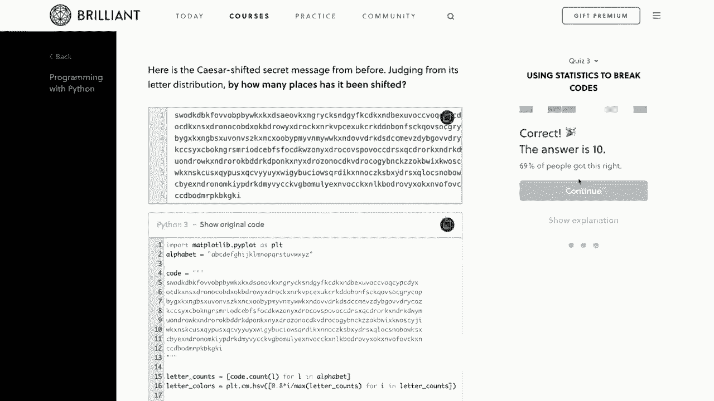
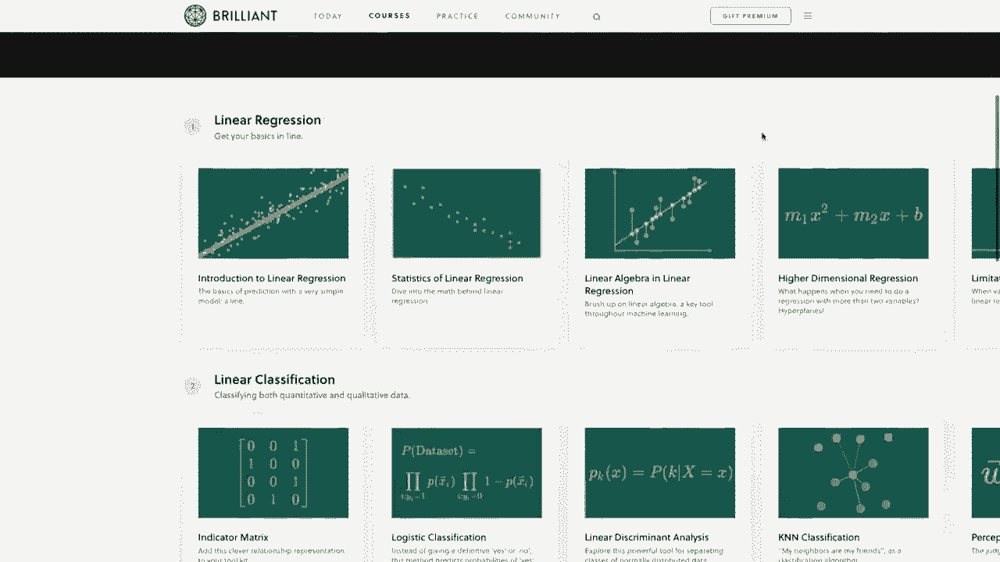

# 【双语字幕+资料下载】用 Pandas 进行数据处理与分析！真实数据&实时讲解，学完就能上手做数据分析了！＜实战教程系列＞ - P3：3）索引 - 如何设置、重置和使用索引 - ShowMeAI - BV1M64y187bz

Hey there。 how's it going， everybody。 In this video， we're gonna be learning more about indexes。 So we've seen basic default indexes in previous videos， but in this video。 we'll learn how to set custom indexes and the benefits of doing this。 Now。 I'd also like to mention that we do have a sponsor for this series of videos。

 And that is brilliant org。 So I really want to thank brilliant for sponsoring the series and would be great if you all can check them out using the link in the description section below and support the sponsors。 And I'll talk more about their services in just a bit。 So with that said。

 let's go ahead and get started。 Okay， so I have my snippets file open here my snippets notebook open here so that we can look at indexes using a simple data frame with a little bit of data and then we'll see how to use these with our larger survey data set that we've been using so far in the series。

 So in these snippets， we have the same small data frame that we saw in the last video where we just have three people with their first name。 last name and email address。 And I have this data frame displayed down here at the bottom right here。😊，Like I said in previous videos， our data frames have this thing on the far left over here that looks like a column without a name。 and this is an index。 So since we've just seen these default indexes so far this is currently just a range of numbers that's basically an integer identifier for the rows。

 So this is a0， a1 and a2。 Now sometimes it might make more sense to have a different identifier for each row。 and that will basically be the label for that row。 So it's usually unique Now pandas doesn't actually enforce indexes being unique and sometimes it won't be。 but most of the time these will be unique values。 So what might be a better index for our sample data here。

 Well， maybe the email address would be a good index for this data since that's usually a unique value for most people So right now if I wanted to view all of the email addresses then we could say Df and access the email。And we saw this in the last video， but we can see that it displays all of these email addresses。 Now。

 what if we wanted to set these email addresses as the index for this data frame Well， to do that。 we could just say D set underscore index and then we can just pass in the name of the column that we want for the index So if I run this now we can see that the email is on the far left and it's bold and it actually does kind of look like a normal column because this index has a name it has the same name as our column when we set it So I want to show you something here we can just set this index in this cell but if I look at my data frame again。

 so underneath here if I say Df to print out this data frame then we can see that our data frame didn't actually change it still has the default index over here on the left and that's because pandas doesn't do a lot of these changes。In place unless we specifically tell it to do so and this is actually nice because it allows us to experiment without worrying about modifying our data frame in unexpected ways。

 So let's say that we actually did want to set our index to the email column and have those changes carry over into these future cells so to do this back up here where we said set index we can just add in another argument here and say in place is equal to true Now if I run that。

 and then rerun the data frame again， then now we can see that it actually did set that index and modify that data frame and we can actually look specifically at that index just by saying Df index and if I run that then we can see that we have an index here and it has the values as a list of what all the index values are and it also tells us that the name is equal to email okay so。

Would this actually be useful Well， like I said before。 the email address as the index gives us a nice， unique identifier for our row。 And remember in the previous video that we used do lo to search our data frame by label。 Well。 these indexes are the labels for these rows。 So before we just use the default ranged index。

 but now we can find a specific row by passing in that label。 So if I say Df do lo。 this will be easier if we actually just look at an example here if I say Df do lo before we were passing in a0 as the label。 but now I can say， okay， I want to see the information for Corium Schefffer at Gmail do com and then it'll come back and say。 okay that person has a first name of Cory last name of Schchaefffer and so on。

 So now we get the row for that specific email index。 And like we saw in the last video we can still pass。😊，In values for the specific columns as well。 So if we wanted the last name， then I could just pass that in as the second value。 So I'll just say I want the last name and we can see that there we get saferffer。

 Now we actually no longer have those default integers as our index。 because now it's using the email。 So if I try to use those integers that we use before。 So if I say if I want row of0 using Lo。 then we're going get a type error。 and I get an error because it no longer has an index with that label。

 If you want to use integer location instead of labels。 then you still have the ilo indexer available to you。 And we saw that in the last video as well。 So if I change this to be i Lo instead of Lo。Then it'll still give us that first row。 So that still works。 Now， if you accidentally set the index and want to reset it。

 then we can do that with the reset index method。 So down here I will just say Df do reset underscore index。 and I will do an in place equal to true so that those changes carry over。 and then I'll go ahead and print out that data frame。 So if I run this。 then we can see that now we're back to having that email as a column and the default range index。

 Now if you actually know what you want the index to be when you're creating your data frame。 then you can simply set it there instead of setting it later using the set index method。 and we can do that as we're loading in data from a Cv or other source as well。 So let me switch over to our other notebook here with the stack overflow data that we've been using so far throughout the series and we'll take a look at some real worldorl examples of why using indexes is useful now。

And for those of you who have been following along with the series so far。 this should look familiar to you but if you haven't been following along and this is the first video you've watched here's a brief overview of what's going on we are loading in pandas here we are loading in some cv files here as well and I have a link in the description section below to the data that we are using for these CSv files and then we're also setting some options here in pandas to display max columns to where we can see all the columns and max rows to where we can see a lot of these rows and then this is what our data frame looks like。

 these are just survey results from stack overflow So so far if we look at our data frame here in the series so far we've been using this default index and we can look over here and see that it's just this range from012 and 3 Now if we look at the survey response data then it looks like they actually have。

Unique value per row within the data itself。 So if we look at this respondent column here。 this respondent column is actually a unique ID。 So it's respondent1 respondsponent 2 and3 and so on。 So really we should probably clean this up a bit and just use that respondent ID as our data frame index Now we could do this just like we saw before by coming down here and saying Df do set index and do it that way。 or we can do this while we're actually reading in the data by passing in an additional argument to the read CSv method So up here where we loaded in the data let's just add another argument here。

 and we will call this index underscore call is equal to and now the name of the column that we want to be the index and in this case I want it to be this respondent unique I here。 So I'm going to say our index call is equal to respondent。I will rerun that cell。

 Now I'll come back down here and rerun our data frame head。 And now we can see that this is cleaned up a bit because now we have this respondent as our actual index。 So now these are the labels。 So if you wanted the first respondent。 then we could just say the F dot Lo and that is one。 So this is the first respondent there。 Okay。

 let me delete that cell。 Okay， so now let me show you a real worldl example of where I would use this。 So if you remember from earlier in the series。 we have our survey data that we can see here。 but we also have another data frame that tells us what each of these columns actually means in the survey data。 So let me display that data frame real quick。 So， for example。

 if I wanted to know what hobbyist mint， then we can look at our schema。Data frame here。 and we can see that the answer that they or the answer on the survey or the question on the survey for hobbyist was do you code as a hobby。 So when we see yes and no questions up here for hobbyist they were answering the question do you code as a hobby。 So here's a question。 What if I wanted to locate what a specific column meant without needing to search through this entire data frame manually。

 Well， in this case， we can simply set the column name as the index and use the dot Lo indexer。 So I'll set this index up here where we loaded in the schema data frame。 So let me go back up here to the top。And the column。 we want this here to be the index because these are all unique values。

 So I'm going to grab the name of this column， which just so happens to be column。 And then up here。 I will say that I want the index。To be equal to this column of actually。 let me get that within the string there。 Okay， index call is equal to column。 Run that。 And now let's rerun our schema data frame。 And now we can see that that column is bold。

 So that is our index。 So now we can use dot Lo to search for those columns directly。 So if I wanted to see what the information for the hobbyist column was， then I could just say。 let me scroll down here。 I could say a schema data frame dot Lo。 And then we can just pass in the label of the index that we want。

 So if I wanted to see what hobbyist was。 Then we can see， oh， okay。 hobbyist has the question text of du code as a hobby。 So let's go back to our survey data here and see if we can find a column that doesn't make much sense to us。 So if I scroll through these here， okay， like， what would this one mean。 M G R。😊，Idiot okay。

 N GR idiot。 So let me scroll down here。 And now I'll paste that in to the schema Df dot Lo and rerun that。 Now we can see that we get the information for that column。 now the text is actually truncated in Jupiter notebooks by default。 but we can we can change that setting if we'd like to see this entire question text。

 but I kind of want it on since we have so much data to display。 But instead。 if you want to see the full text for that question。 then you can just access the data in that row and column directly。 by also passing in the column name into dot Lo as well。

 So just like we've seen before when we're using dot Lo， this is the row we want。 So what column do we want。 So we want to read that question text。 So I'll paste that in。 And now if I run this again。 now we can see that the full question text for。What M GR idiot means is how confident are you that your manager knows what they're doing。

 So this is one nice example here of when setting these indexes is useful。 because it allows us to make these search search these rows by labels very easily。 just like we did here with the schema。 Now， let me show you one more thing before we finish up here。 So we can see that we were able to set our indexes and all of that looks good。

 but it might make it a bit easier to read the schema data frame。 If the indexes were sorted alphabetically。 So to do that。 it's just as easy as saying schema Df dot sort。Underscore index。 And let's run this。 Let me scroll down here a little bit。 And we can see that now these indexes are sorted alphabetically。

 So if we knew that we wanted to you know get to employment or something。 It's going to be in the ease。 So that just makes it a little bit easier to find what you're looking for。 And if you wanted to sort this in descendending order instead。 then we could just say ascending is equal to false。

 And now we can see that it is in reverse order here instead。 So depending on your data that might make it easier to read。 So we're going to go over a lot more advanced sorting in a future video。 but these are just some basics on getting our indexes in order。 Now， as usual with our data frame。

 if you wanted to the sort to be permanent and carry over into future cells。 then you should set in place equal to true。 and we'll see that a lot throughout the series because doing it this way。of allows us to see what things would look like without actually affecting the data frame itself。 So down here the data frame is still unsorted， but if I come up here and say sort index in place equal to true。

 rerun that and then rerun our schema data frame then now our schema data frame is permanently sorted。 So depending on your data learning about these indexes will be really useful。 especially whenever using dot Lo because it allows you to search by label there。 which is extremely useful depending on what type of data you are searching through Okay so before we end here。

 I'd like to mention the sponsor of this video and that is brilliant org。

So in this series， we've been learning about pandas and how to analyze data in Python。 and brilliant would be an excellent way to supplement what you learn here with their handson courses。 They have some excellent courses and lessons that do a deep dive on how to think about and analyze data correctly。 for data analysis fundamentals。 I would really recommend checking out their statistics course。

 which shows you how to analyze graphs and determine significance in the data。 And I would also recommend their machine learning course。 which takes data analysis to a new level where you'll learn about the techniques being used that allow machines to make decisions where there's just too many variables for a human to consider。 So to support my channel and learn more about brilliant。

 you can go to brilliant org forge slash Cs to sign up for free。 And also the first 200 people they go to that link will get 20% off the annual premium subscription。 And you can find that link in the description section below。 Again。 that's brilliant org forge slash C M S。😊。

Okay， so I think that is going do it for this pandas video。 I hope you feel like you got a good idea for how to use indexes and why these might be useful。 And like I said， you don't have to use indexes。 but sometimes it just makes sense depending on your data。 So for example， in this video setting the schema data frame index made it very simple for us to look up column names easily。

 So in the next video， we're gonna start learning how to filter data frames and grab data that meets specific criteria。 So maybe we only want to see data where you know the salary is above a certain amount。 or maybe we only want to see data for people who said that they use Python in this survey。 So we'll take a look at being able to filter data frames on that type of criteria in the next video。

 But if anyone has any questions about what be covered here。 then feel free to ask in the comment section below and I'll do my best to answer those。 And if you enjoy these tutorials and would like to support them。 then there are several ways you can do that。 The easiest ways to simply like the video and give it a thumbs up。

 And also it's a。😊，You help to share these videos with anyone who you think would find them useful。 And if you have the means， you can contribute to Patreon。 And there's a link to that page in the description section below。 Be sure to subscribe for future videos。 And thank you all for watching。

