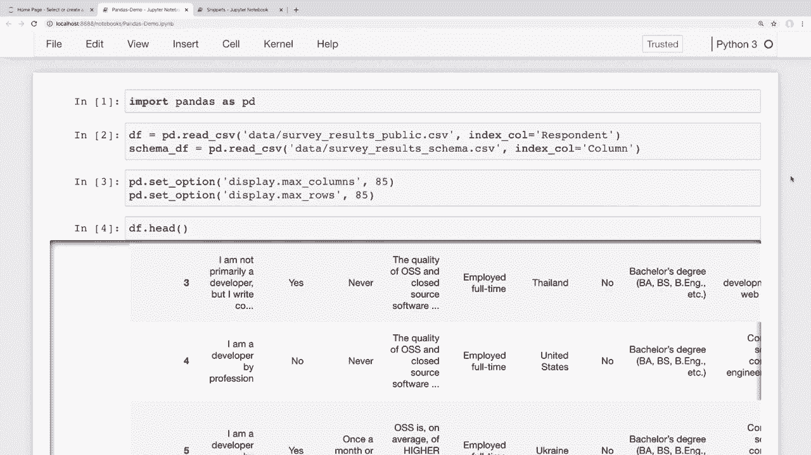
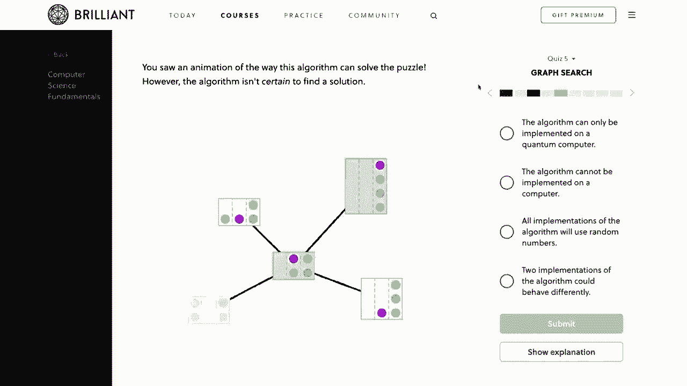
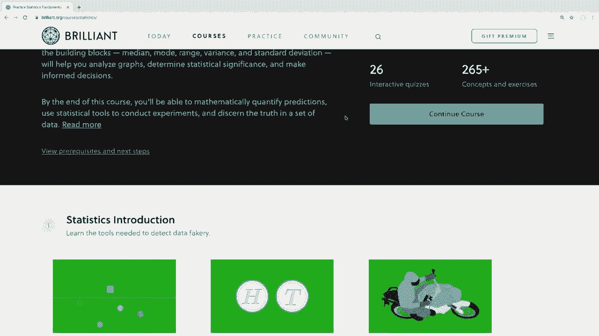

# 【双语字幕+资料下载】用 Pandas 进行数据处理与分析！真实数据&实时讲解，学完就能上手做数据分析了！＜实战教程系列＞ - P7：7）排序 - 数据排序 - ShowMeAI - BV1M64y187bz

Hey there。 How's it going， everybody。 In this video。 we're gonna be learning about how to sort our data in pandas。 So we'll look at ways to sort our columns， how to sort multiple columns and grabbing the largest and smallest values from different rows。 Now， as usual， we'll look at how to do this on a small dataset first。

 and then we'll see how this applies to a larger dataset。 like our stack overflow survey data that we've been using throughout the series。 Now。 I've been reading your comments and suggestions for the series。 and I'm trying to take your suggestions to heart。 A lot of people have said that they'd like shorter videos。

 So I'm going to do my best to have shorter videos that don't sacrificed on any of the details that I think are important。 Now， I'd also like to mention that we do have a sponsor for the series of videos。 and that is brilliant。 So I really want to thank brilliant for sponsoring the series。 And it would be great if you all can check them out using the link in the description section below and support the sponsors。

 and I'll talk more about their services in just a bit。 So with that said。 let's go ahead and get started。 Okay， so I have my snippets notebook open that we've seen throughout the series。 Now， again， if anyone would like to follow along than I do have links。😊。This code and the data in the description section below。

 So let's say that we want to sort this small data frame that we have here。 So first。 let's decide how we want to sort this。 Now， one way that might make sense is to sort this by last name。 So in order to do this， we can use these sort values method。 So in order to sort this by last name I can simply say Df do sort underscore values。

 and then we'll say that we want to sort that by and set the by argument equal to the column name in this case。 it's last。 So if I run this。 then we can see that we get a data frame returned where those last names are sorted alphabetically。 and if these were numbers， then those would be sorted smallest to highest。 and we'll see that when we look at our stack overflow data。

 Now if we wanted to sort these in descending order。 then we can pass in an argument and just say that we want the uscending order to be equal to false。So if I run this， now we can see that those are sorted in descending order。 Now。 sometimes your sorts can get a little complicated。 Maybe you want to sort on multiple columns。

 Now you do this when the first value that you sort on has identical values。 and then you want to sort on a second value。 So in order to do this。 we can just pass in a list for these columns that we want to sort on。 So let's say that we want the first column that we want to sort on is the last names in ascending order。

 And then if there are duplicate last names， then we want to sort the first name after that。 So in order to do this， we can just pass in a list of columns to sort by。 So I'm actually going to go to a new line here。 And now instead of just sorting by last。 I can pass in a list here。 So let's say that we want to sort on the last name first。

 So then we want to sort on the first name。 So if I run this， then we can see that this is sorted in。Sending order on the last name， just like we saw up here before。 but it's also sorting in the first name in descending order as well。 if there are identical last names so we can see that Jane was first up here。

 And now it's John because this is in descending order。 And sometimes you might run into a situation where you want to sort on multiple columns。 So you might want to have one in descending order and another in us sending order。 So let me add one more name to our data frame here。 so that it's more clear whenever I do this。

 So I'm going to add one more name here at the top to our dictionary。 So I'm just gonna call this Adam and we'll keep a duplicate last name of Do。 And then I'll just pass in an email of a email do co。 So now let me go ahead and rerun all of these cells。

 So I'll just say sell run all And now down here at the bottom。 we can see that we have our last names。 And then all of these in descend。Order。 but let's say that we want to sort this data frame by last name in descending order like we have here。 Then we want the first names to be in ascending order。 So to do this。

 we can simply pass in a list of boolean values to the ascending argument。 So let me copy what we have here and show the differences of what this looks like。 So instead of just saying ascending is equal to false。 let's instead pass in a list。 and these will correspond to our columns。 So if I say that I want the last name and descendending order。

 then we can keep that as false。 but then if I want the first name to be in ascending order。 then I can just pass in a true for that second value。 So now if I run this。 then we can see that our last names are still in descendending order。 but our first names here are now in ascending order with atom coming before these two here。

 And as we've seen several times throughout the series if we want to save this data frame and make this sort permanent then we can set the inplace value equal to true。So if I do this， I'm just going add an in place equal to true here at the end。 If I run this。

 and now I look at our data frame， then now our data frame has been modified in an order where we can see that these values are sorted how we specified。 Now， if you want to set this back to how it was before and have those indexes be sorted then we can do that by sorting the index So to do this instead of using the sort values method。

 we'll use the sort index method， So I can just say Df do sort underscore index。 and run that。 and we can see that now our index is sorted over here on the far left in the order that we added those。 Now I also want to point out that if you're simply wanting to sort a single column。 then we can easily just sort that single series as well。

 series objects also have that sort value method。 So if we want to simply see the sorted last names and not the entire data frame。 then I can simply access that column。By passing in the last name column there in those brackets。 And then I can just say sort， underscore values。 I'm just going to leave all of the arguments as defaults here and run this。 And now we can see that these are sorted in ascending order。 Okay， so that's a brief overview。

 So now let's go over to our survey data and see what this looks like on a larger data set。 And we'll also see some simple ways to view the largest and smallest results from our data。 Okay。 so I have our stack overflow developer survey open here that we've seen throughout the series。 And again， if you'd like to download this data to follow along。

 Then I have links in the description section below。 Okay。 so one way that we might want to sort sort the survey results。 is by country name。 We can see over here that we have a country column where the respondent answered which country they were from。 So maybe you're doing some analysis on information from different countries。

 And it's just easier seeing them all sorted。 So for example。 let's say that we want to look at countries。And salary。 So to sort these survey results by country。 then we can simply come down here to the bottom and say Df dot sort， underscore values。 And I want to sort that by and set that equal to。Country。

 and now I'm also going to make this in place so that it changes our data frame。 So now let's take a look at the country column for the first 50 results or so from this data frame。 So I'm going to access that country column of the first。 and I'll just get the first 50 of those by using the head method。 So if I run this。

 then we can see that these are in alphabetical order。 So we have results from developers from Afghanistan。 and at the bottom here。 the results go into Albania。 Now we only have the top 50 results here。 But if we were to look through all of these， then we'd see that all of these countries are listed in alphabetical order。

 Okay， so now let's look at let's take a look at the salaries reported from these countries。 So let me add that to our output here。 and I'll just do that by accessing the converted comp。Column so that is converted comp。 Now， remember here。 This is a mistake that some people make。 whenever we're accessing multiple columns here， we have to put this inside of a list within our brackets。

 So we're going to have two sets of brackets here。 Okay， so now let's run this。 And we're going to have the salaries here for each respondent listed on the right。 we can see that we have a lot of not a number objects here。 which just means that they skipped over the question。

 But if we wanted a general idea of the higher salaries， then we can sort these in descending order。 So like we saw in our earlier example。 if we want to sort the countries in a sendinging order and the salaries in descending order。 then we can do that just by going up here。 and passing in multiple columns that we want to sort on。 So we want to sort on country。 And we also want to sort on this converted comp column here and。Also。

 I'm going to pass in an ascending argument here， and I'm going to set this equal to a list。 and this will correspond to our column names， whether we want these in ascending order。 So for the country， I will pass in true that we do want those in ascending order。 but I want to see the highest salaries first， which means that we want this to be false so that the salaries are in descendending order。

 So if I run this sort， and then we take a look at this head again。Then we can see that now we have Afghanistan here and all the highest salaries are listed at the top for what people said they made。 and if we scroll down here， we can see that we get to zero and then not a number as the lower salaries。 and then once we get down to Albania， then it restarts with those high salaries from that country。

Now， we can see that there are some big outliers here。 This is a lot larger salary than what other people said that they made。 Now。 there are some techniques that we can use in order to account for outlier data。 And we'll focus on that in the next video where we cover aggregating data and grouping data。 Now。

 before we end， I'd also like to take a look at some other useful methods for seeing the largest and smallest values。 So maybe you're sorting results just so you can grab the largest or smallest values from a specific data frame。 Well， if you're doing that， then there's actually a much simpler way to do this。 So maybe we want to see the 10 highest salaries from our survey。 So in order to do this。

 we could simply use the in largest method。 So first， I'm just going to run this on a series。 So let's say that I want to grab that converted comp column， which is the salaries。 And I will grab the in largest。 and I want to grab the 10 largest salary。So if I run this。 then we can see that we get the10 largest salaries reported。

 So these salaries are all the same here at 2 million。 so I'm assuming that the survey capped their salaries at 2 million for this particular survey So you know I think that's pretty high So I'm curious to see what type of developers。 these people are and if they're in management roles or or not。 And again。 we'll see how to further analyze these results in the next video。

 But you know if any of you all are making $2 million a year as a developer and are hiring then let me know because you know I'm not looking for additional work at the moment。 but I do think I would make an exception here for 2 million bucks a year。 Now you can see here when we grab the 10 largest values from this series here from this column it only gives us the 10 largest values from that column but what if we wanted to see the other survey results from these rows。 Well， in order to do that then we can simply run this method on the entire data frame。

And pass in the column for which we want the largest results。 So I could say Df dot n largest。 and then I want the 10 largest from the converted comp column。 So if I run this。 then these will give me those same rows， but now we have all of their survey results instead of just the salary。 So if I go up here to their index。 So this is 25983， then we can see the first one here is 25983。

 So this is the same result if I scroll over here to converted comp。 we can see that these are all $2 million here。 And if we wanted to see the smallest values instead of the largest then instead of using in largest here。 then we can simply say in smallest。 So if I look at the smallest salaries here。 then this will give us the smallest salary values from our survey Now I'm assuming this is probably just zero for people who。

Aren't currently working， and yes， this is a zero here。Okay。 so that's a brief overview of how to sort our data and how to sort on multiple columns and get the largest and smallest values。 Now， before we end here， I would like to mention the sponsor of this video。 and that is brilliant。 Bri is a problemso website that helps you understand underlying concepts by actively working through guided lessons。

 and brilliant would be an excellent way to supplement what you learn here with their handson courses。 They have some excellent courses and lessons on data science that do a deep dive on how to think about and analyze data correctly。 So if you're watching my panda series because you're getting into the data science field。 then I would highly recommend also checking out brilliant and seeing what other data science skills you can learn。

 They even use Python in their statistics course and will quiz you on how to correctly analyze the data within the language。 Their guided lessons will challenge you， but you also have the ability to get hints or even solutions if you need them。 It's really tailored towards understanding the material。 So to support my channel and learn more about brilliant。 You can go to brilliant org Forge。😊。

to sign up for free and also the first 200 people to go to that link will get 20% off the annual premium subscription and you can find that link in the description section below again that's brilliant。 orgm。Okay， so I think that's going to do it for this pandas video。

 I hope you feel like you get a good overview for how we can sort our data frames。 In the next video we'll be learning about aggregating and grouping data。 Now。 this will be the video that a lot of people have been waiting for。 because this is what most people think of when they think of data analysis。 So， for example。

 we'll see how we can group our survey data by country。 and then get the median salaries for each country and things like that。 that also would take care of some of that outlier data that we just solved before。 It's definitely a good skill to know in pandas and will be you know open up a lot of possibilities for exploring your data further。

 But if anyone has any questions about will be covered in this video。 then feel free to ask in the comment section below and I'll do my best to answer those。 And if you enjoy these tutorials and would like to support them。 then there are several ways you can do that。 The easiest ways to simply like the video and give it a thumbs up。

 And also it's a huge help to share these videos with anyone who you think would find them useful。 And if you have the means you can contribute through Patreon。 And there's a link to that page into the description section。😊。Below be sure to subscribe for future videos and thank you all for watching。

