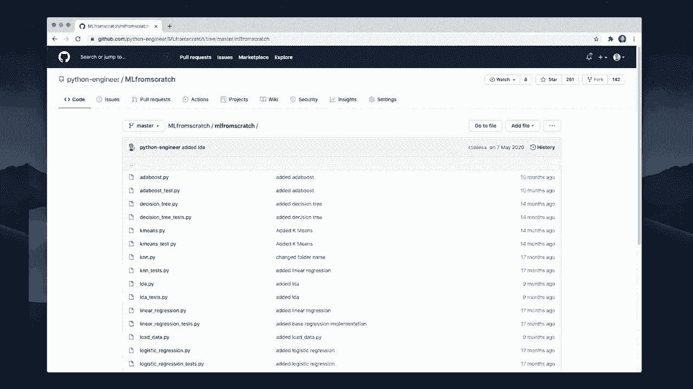
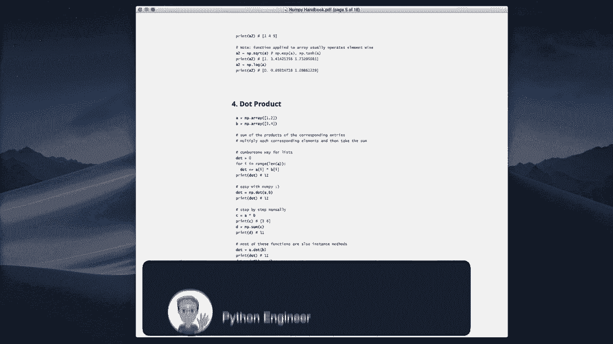
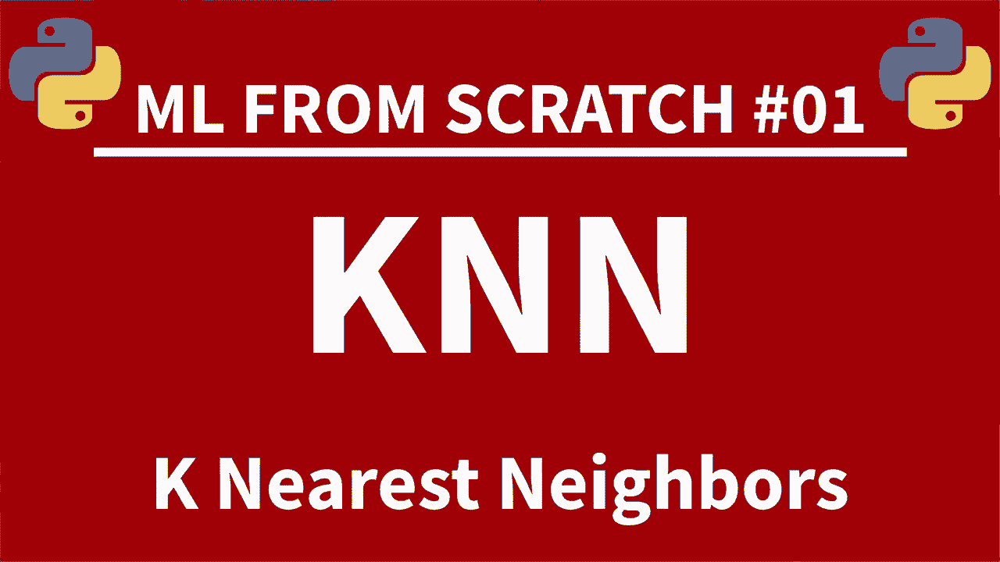

# 【双语字幕+资料下载】用 Python 和 Numpy 实现最热门的12个机器学习算法，彻底搞清楚它们的工作原理！＜实战教程系列＞ - P1：L1- 介绍 - ShowMeAI - BV1wS4y1f7z1

Welcome everybody to hear all in one machine learning from scratch video。 This video takes all 15 parts of my M L from scratch series and combines it into one single video。 In this series， we are going to implement the most popular machine learning algorithms using only pure Python and Ny。 This is perfect。 if you are at a beginner or intermediate skill level and want to get a deeper understanding how all these algorithms work。

 All videos also contain a little theory section before we jump to the code。 I will leave timetims for each section。 and， of course， all the code is available on Github。 I also created a free Nmpy handbook that covers all the essential functions that you have to know in Numpy。 and it contains useful code examples for all sections。

 So you can download this ebook for free on my website。 I will leave the link in the description。 So let's get started。 And if you enjoy this content。 Be sure to leave me alike and consider subscribing to the channel。😊。

