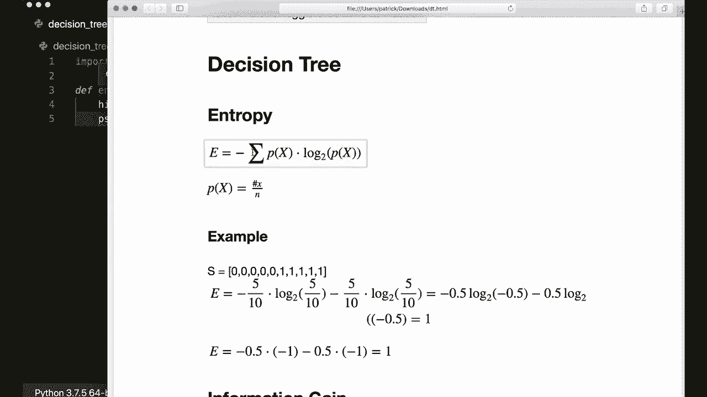
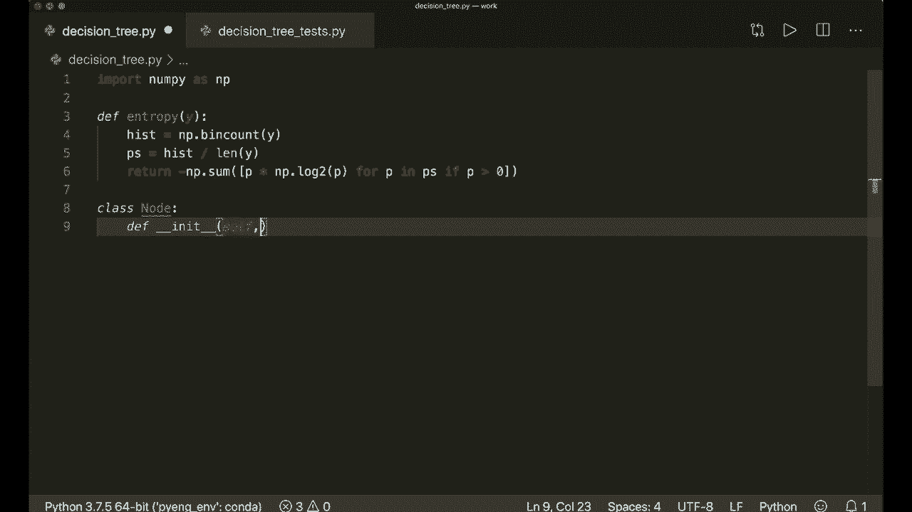
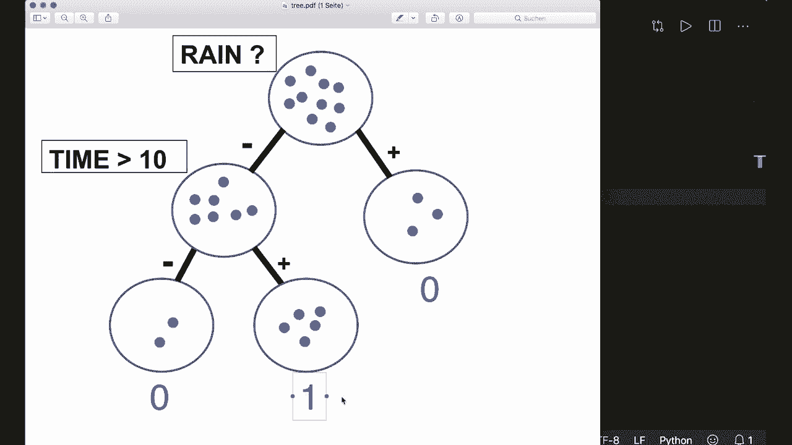
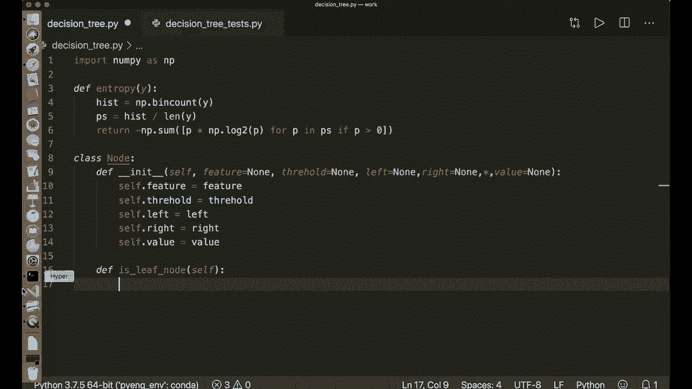
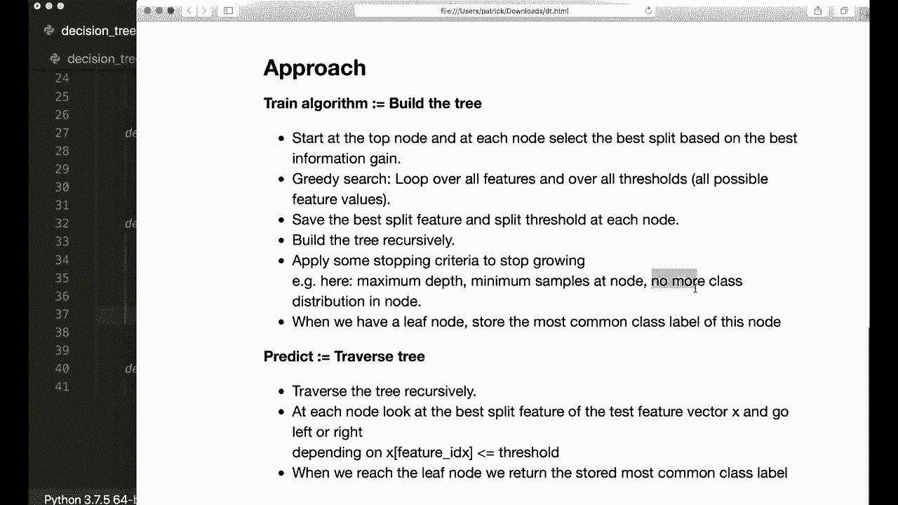
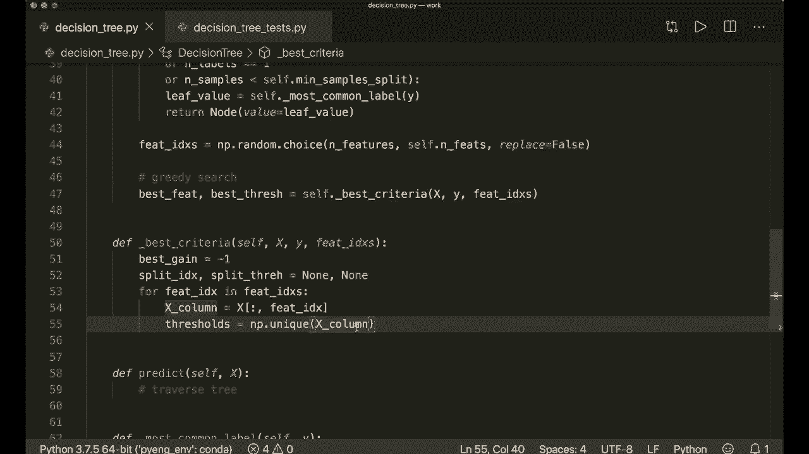
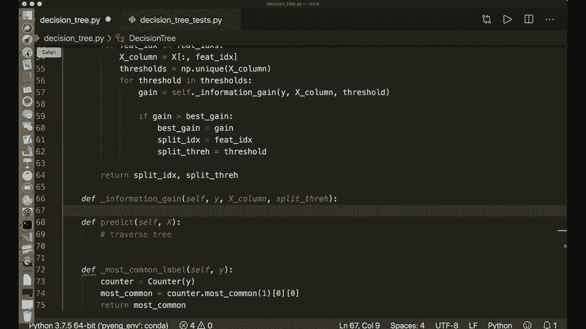

# 【双语字幕+资料下载】用 Python 和 Numpy 实现最热门的12个机器学习算法，彻底搞清楚它们的工作原理！＜实战教程系列＞ - P10：L10- 决策树第 2 部分 - ShowMeAI - BV1wS4y1f7z1

Hi， everybody。 Welcome to the second part of the decision tree tutorial。

 If you haven't watched the first part， then please do so， because there， I will explain the theory。

 So here we continue with the implementation， and we can start right away。

 So we say import numpy S and P。 and then。Before we implement the decision tree class， we will first。

Create our entropy method to calculate the entropy。 and we implement this as global functions。

 So we say define entropy。 and this will get a vector y of all our class labels。

And let's have a look at the formula。 So we have to calculate the number of occurrences， and we can。

Do this with a function。 And we call this hist or histogram。 And we can use nuy bin count。Of y。

 So this will calculate the number of occurrences of all class labels。

 and then we divide them by the number of total samples。

 So we say P equals hist divided by length of y。

And then we apply the actual formula。 So we say minus the sum of p of x times the log of p of x。

 So we can do this in one line and say return minus nu pi sum。 And here we use less comprehension。

 So we can say P times nupy log2 of P for all P in P P and we also have to use a condition if P is greater than 0 because the lock is not defined for negative numbers。

So this is the entropy。And now we also implement a helper class and call this note。

 So here we will store the information for our note。 So this will get an in it。Which gets self。

 And then let's have a look at this， so。

If we are in the middle， then we want to store the best split feature and the best split threshold。

And we also want to store the left and the right child trees， because we need them later and。

If we and now， if we are at a leaf note， then we also want to store the actual value here。

 So the most common class label。

So， we say， feature。Equals none。Threshold equals none left equals none right equals none。

 And then we use a little trickier。 So we use an asterisk and a comma。

 and then we say value equals none。 So now if we want to use this value parameter。

 we have to use it as a。Key word only parameter。 So later when we create our leaf node。

 which only gets the value， then we also have to write value equals something。

 So then it's clearer that this is a leaf node。 And here we simply store them。

 So we say self feature equals feature self threshold equals threshold。Self left equals left。Self。

 right equals right。And self value equals value。 And now we also create a little help a function to determine if we are at a leaf node。

 So define fine is leaf node。Which gets self。 And here we simply say if， if we are。

 if we have a value， then we are at a leaf node and otherwise not。

So we return self that value is not none。So if we have a value， then we return true。

And this is our helper class for the notes。 And now we can start with the actual decision3 class。

 So this also gets an in it。Which gets self。 And then it will get some stopping criteria。

 So we call this min samples split。 And by default， let's say this is2。

 So the minimum samples required to further split our  tree， Then the max depth。 And by default。

 this is 100。And then also， it gets a parameter that we call the number of features or n Fes。

 And this is none。 So we don't need this， but we can specify it。 So as I said。

 we do a greedy search over all the features， but we can also only loop over a subset of number of features。

And then we randomly select this subset， So this is one of the random factors。

And that's also one of the reasons why it's called random forest。

 If we extend our decision trees to a random forest。 So this is one random factor。

And now we simply store them。 So we say self dot min samples split equals min samples。Sorry。

 min sample split self dot max step equals max。Deep。Self dot n features equals and features。

 And we also create a root。 And by in the beginning， this is none。

 So we later need to know our root so that we know where we should start traversing our tree。

And now we implement the fit method。Which gets the training data and training labels。

 So here we want to grow our tree。And then it gets the predict method。With the test labels。

 So here we want to traverse our tree。So let's start with growing our tree。

 So we say self dot root equals。 And now we call and create a help a function self dot grow3。

 which gets X and y。And we also apply a safety check。 So we say self dot and features fits equals。

X dot shape。off。1， so this is a nuy and DRA。 And the second dimension is the number of features。

If not self dot and feed。 So if this is not specified， if this is none。

 then we simply take the maximum number of features。And otherwise， we take the minimum of self。

And feets and X dot shape 1。So this just makes sure that it can never be greater than the actual number of features。

 And now we implement the。Grow tree。Method， which gets self。 and then it gets X and y。

 And also also a depth。 And this is 0 in the beginning。 So we need to keep track of the depth。

And now let's do this。 So first， let's get the number of samples and the number of features。

 This is x dot shape。And then we also want to get the number of different labels。

 So this is the length of nuy。Unique。Of y。 So all the different labels。And now， first。

What we do here is first， we apply our stopping criteria。Tia。So we say if。

 and now let's again have a look what we said。 So we want to check for the maximum depth。

Then the minimum samples required and if we have no more class distribution， so we say if。

And we say depth is greater or equal than self max depth。Or。If。The number of different labels。

Equals one。 So if we have only one class at this node， or if we have number of samples。

Is smaller than the minimum samples required。So。If this is true， then we are at the leaf node。

 So we says let leaf value equals self dot most。Common label。Of this y。

 And now we create and return our leaf node。 So we say return node。

 And then we have to say value equals leaf value。 And now it gets clear why I use just ask the risk。

 So here I have to use the value as keyword。 And now it's clear that this is a leaf node。

And now we also need this help a function to say to get the most common label。

 So let's write this down here。 So define most common label， which gets self。

And then it gets a vector of the glass labels。 And for this， we use a Python module。

 the counter module。 So we say from collections import counter。

 So I talked about this in previous videos already。

 please check that out if you're not familiar with the counter module。

So here we can create a counter object。 Count equals counter of y。 So this will。嗯。

Calculate all the the number of occurrences for all the ys， similar to the nu pin count。

 and then we have a most common function。 So we say most common equals counter dot most common of one。

 So we only need the very most common label。 and this will return a lists of tus。

 So we want to have the first element of the list。 So this is the very most common tuple。

 and in the tuple， there is the value stored and also the number of occurrences。

 So we only need the value。 So we again say index 0。 So please double check it for yourself。

 and then we return this。This will determine the most common label。 So now we have the tier and。Now。

 if we didn't meet the stopping criteria， then we continue。 So first， we select the feature indices。

 So feature indices equals nuy random choice。And this will get the number of features。

 So it will select random numbers from between 0 and the number of features。

And the array should be of size， self dot and fes that we specified。

 And we also say replace equals false because we don't have。

 don't want to have the same indices multiple times。And now， we do our greedy search。So， we say。

 best thresh。And best， all let's do it the other way around。

 best feature and best thrash equals self dot。Best criteria。

 And this will get X and y and all the feature indices。 So this is another helper method。

 So let's define it here。 define itself best。Criiteterria。

 which gets self and X and y and the feature。Inice sees。So， here。We do our greedy search。

 So we say best gain equals -1。 So we want to go over all the features and all the feature values and calculate the information gain。

So。Now， let's say split index and。🎼Split threshold equals none。 So both of them are none。

 And then we have our first loop。 So4 feature。Index in。Feature indices。

 And now we only want to select。The column vector of this x。 So we say x。X column equals。X of。

 And we want to have all samples。 but only at this index。

And then we want to go over all the possible thresholds， So we say。Thresholds equals Ny， unique。Of。嗯。

X column。 So we don't want to check the same value twice。 So like in this example here。

 we would check for 30，15，5，10。

20 and 25。And now we go over all the possible thresholds。 So we say for th。Old in thresholds。

And now we calculate the information gain， we say gain equals self dot。In formation gain。

Which gets y and the column vector， and also the current thresholds。

And then we say if gain is greater than our best gain， then our new best gain is the current gain。

And our best split index is the current feature index。

And our best split threshold is the current threshold。And at the end， we want to return them。

 So we return the split。Index， first。And then the split threshold。So this is the greedy search。

 And now we need another helper function to calculate the information gain。

 So let's say define information gain with cell。And then it gets y and an X column and the threshold。

 So let's call a split thrash。And now。Let's say。Let's have a look at the formula， again。So。Sorry。

 so we want to calculate the entropy of the parent and then a weighted average of the children。

So。We calculate the parent entropy。Then， we generate。A split。

Then we calculate the weighted average of the child entropiece。

 and then we return the information gain。So the parent entropy， we can simply say parent。

Entropy equals entropy because we already have this function。 So parent entropy of what entropy of y。

 Then we generate our split。So we say left indices and right。Indices equals self dot split。

And we split based on this X column， and a split threshold。So。We need another help of function， so。

I hope you can still follow me。 I hope I try to explain everything as clear as possible。

 but the code is a little bit more complex than usual。 But yeah， let's continue。 So let's say。

 define split self。And then it gets x column and our split threshold。

And here we can say left indices。 So here we apply our question and we can use a function that is called nuy arc where and here we ask if the value of x column is smaller or equal than our split threshold。

 So this will return an array where with all where all the these conditions are true for all the values in our x column and we want to Latin this array because we only want a 1 d vector please check it for yourself。

 and we do the same for the right indices， so we say nuy。Arc， where。

 And here we check if X column is greater than our split threshold。 And then we flatten this。

And then we return the left indices and the right indices。So now we have the split function。And now。

 if we have the。嗯。With this function， we generate the split here。 And first， we check if。Leng。

Of the left indices。Is 0 or the length of the。Right in the C is 0。

Then we can immediately return 0 as information gain。 And otherwise， we continue。

 So we calculate the weighted average。 So we need the number of total occurrences of or the the the number of。

嗯。Of our samples。So， this is length of。Y， and then the number of our left samples and the number of our right samples equals Lng left indices and Lng right indices。

 Then we calculate the entropy。 So we say E， L and E R equals entropy。Of y。

 of all the left indices and entropy of y of all the right indices。And now， our child。

Entropy equals the weighted average。 So we say N L divided by N times。The left entropy plus。

And now N R divided by n times the right entropy。 So this is the child entropy。

 And now let's calculate the information gain。 This is just the parent entropy minus the child entropy。

 and now we return it。 So return the information gain。

So now we have this so now this function is complete。

And now we can have to continue with the growing。So。Now， after we have selected the best criteria。

 we want to split our tree with this best feature and best threshold。

 So we say left indices and right indices equals self dot split。 So again。

 here we can use our split function。 So we say X。Off。And now we have to be careful。

 So now we want to have all samples。嗯。But only the best。Feature index。So， this is a column。

And here we put in the best threshold。And。Now， with our left and right indices。

 we can continue growing。 So we go to the left and say left。Equals。

And we call this function here in itself recursively。 So we say self dot。Grow tree。And here we say X。

And then we only want the left indices， but we want all。The features。So and S Y。

 we want only want the left indices。And then we also say depth plus one。

 So now our depth is increased by one。And now we do the same thing for the right side。

 So we say right。Equals scroll3 with the right indices。And now we return a new note in the middle。

 So this will get the best。Feature。The best threshold。And the left， and the right。Childs。

 but no value here。So this is the growing method。 And now the only thing left is to implement the predict method。

 And I promise this will be fairly easy。 So we only need one helper function。 So we say return。嗯。

Numpy array。 And here again， we use list comprehension。 So we traverse our tree。

 So self dot traverse3， where we put in one sample for all the samples in capital X。

So this is our predict method。 And now let's implement the。Traverse3 method as last thing。

 So this will get self and one sample。 And it also gets a note where we start。

 So we have to put in self dot root in the beginning because we start at the top and here。

We also do this recursively。 so first， we can check for the stopping criteria so we check if we have reached a leaf node so we can say if node is leaf node。

 So that's why we implemented this helper function。

 then we return node dot value because if we are at a leaf。

 we also have a value and otherwise we apply our question so we go to the left or the right。So。

 we say if。X of this note。The feature index that we stored。

Is smaller or equal than the threshold that we start at this note。 Then we return。Self dot Traverse3。

 So we go to the left side of， and we put in X and note left。

 So that's why we start the left and the right notes at the notes。And otherwise， we return。

Self dot traverses3 of x and no dot right。So， yeah， this is the whole Traverse implementation。

 And now we are finally done。 This is the whole implementation that we need for a decision tree。

 And let's check this。 So I've little little I've written a little help a script。A test script。

Where I implement this decision tree class and I use the data set。

 the breast cancer data set from the psychic learn module。

And I will split our data in training labels and training samples and test labels and test samples。

 Then I will create our decision tree and fit the data。

 then predict the test data and calculate the accuracy。 So let's check。

 let's run the script and check if everything's working。Needs a little time to。嗯。Sorry。

 as traverse3 missing one positional argument note。嗯。Self do traverse 3 X。 Oh。

 self do root must be here， not here。So let's clear this and give this another try。

And fingers crosseds。Note object， test no attribute feature index。So this is， how did we call it？

Just feature， sorry。If note that。Feature。Threhold。The threshold， threshold yo。So， one more time。

I hope I have no more typos。So yeah， now we have the accuracy and everything's working。 And yeah。

 I hope you enjoyed this tutorial。 If you liked it， please subscribe to the channel。

 And in the next tutorial， we will continue by extending this decision tree to the random forest model。

 So yeah， see you then bye。😊。

