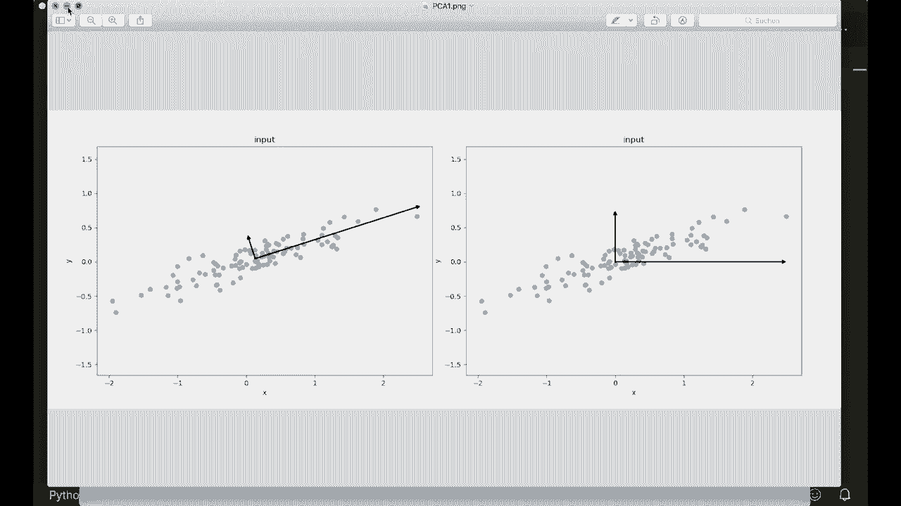
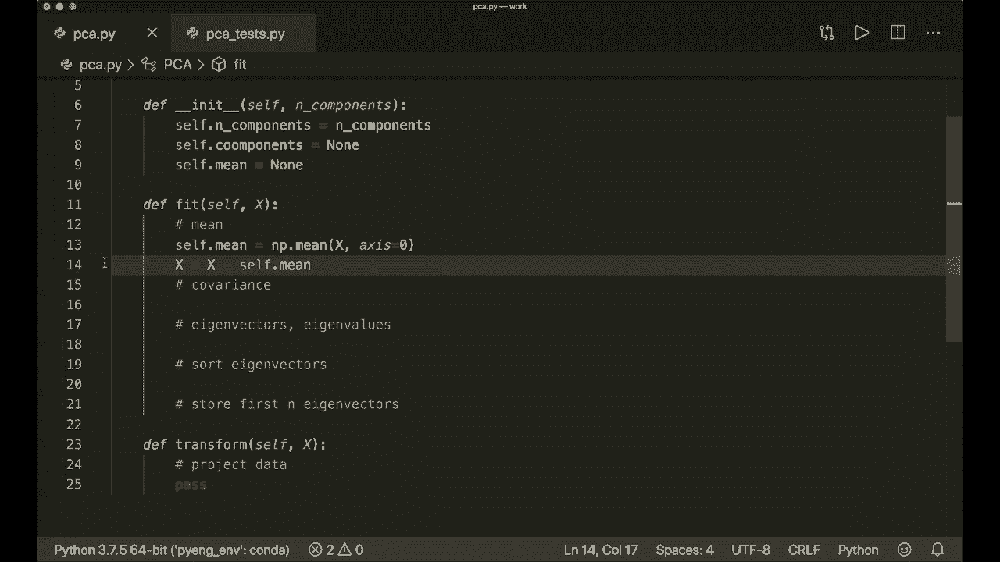
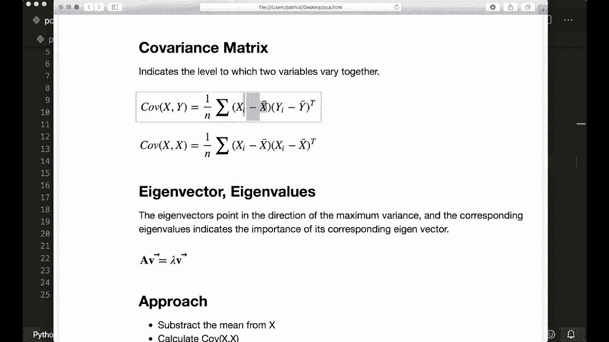
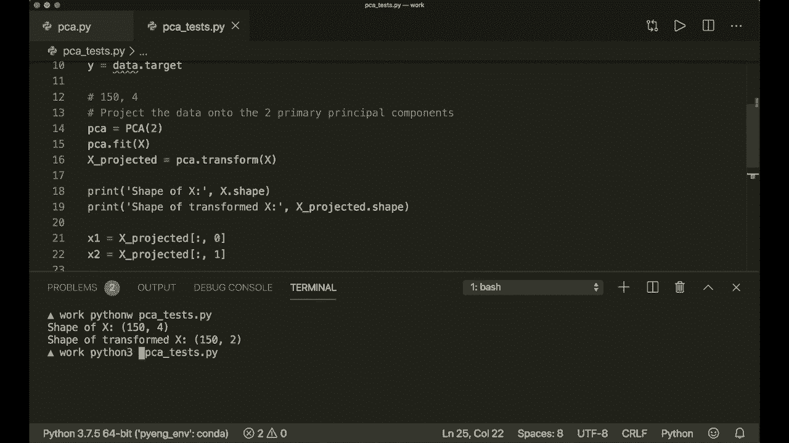
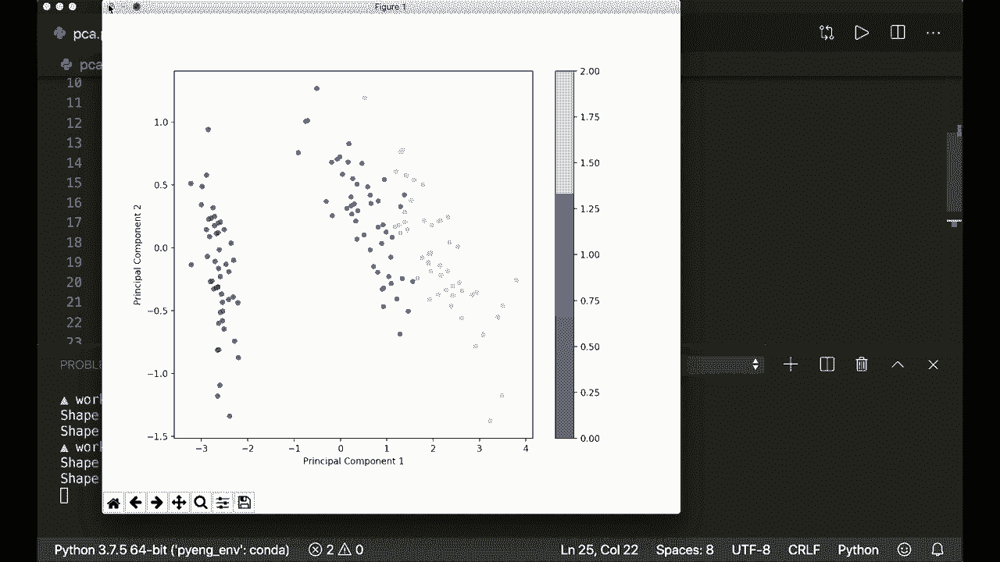
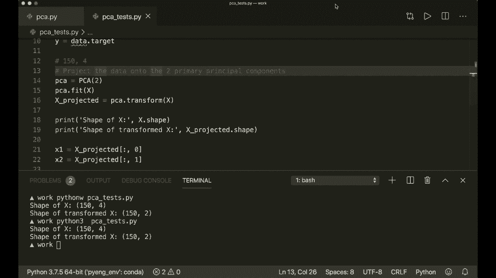

# 【双语字幕+资料下载】用 Python 和 Numpy 实现最热门的12个机器学习算法，彻底搞清楚它们的工作原理！＜实战教程系列＞ - P12：L12- 主成分分析 - ShowMeAI - BV1wS4y1f7z1

Hi everybody。 Welcome to our new machine learning from Sct tutorial。 Today。 we are going to implement the principal component analysis or PCA using only Python and Numpy。The PCA is a nice tool to get linearly independent features and also to reduce the dimensionality of our data set。So the goal is to find a new set of dimensions such that all the dimensions are orthogonal and hence linearly independent and ranked according to the variance of data along them。

 So this means we want to find a transformation， such that the transform features are linearly independent。And the dimensionality can then be reduced by taking only the dimensions with the highest importance。And those newly fine dimensions should minimize the projection error。 and the projected point should have a maximum spread or which means the maximum variance。

 So let's look at an image to understand this better。 So let's say our 2D data is distributed like this and now we want to project it into 1 d and now what we want to do is we want to find the axis that are orthogonal to each other。And when we project our data onto these axes， then our new projected data should have the maximum spread。So on the left side， these are the correct principal axis。 So if we project them in one D。

 So on the largest principal component。If we project our data on this axis。 then they have the maximum spread。 And， for example， if we look on the right side。 So these are incorrect axis。 So， let's look at how the projected data would look like for。 so on the right side， we made it even worse and projected it on the。Y xs。

 So these are clearly wrong because here we can see that a lot of data is on the same spot。 so we don't have any more information about them。 But here on the left side。 the projected data has the maximum spread。So we can contain most of the information about the data。And also， the projection error， which means this would be。The lines from here to the axis。

 this is minimal， whereas on the right side。 So here we have to make a long。 very long projection line for each point。 So the left side is the correct answer。 And now how do we find these principal components。So for this， as I said。 we want to maximize the variance， so we need some math。

 so we need the variance of a sample X and this is calculated as one over the number of samples。 and then we have the sum over each component minus x bar and x bar is the mean value。 So we subtract the mean value from our data set。And now we also need a covariance matrix。 so this indicates the level to which two variables vary together and the covariance matrix of two variables is defined as this so1 over n and then again the sum and here we subtract the mean and again here also the mean and then transposed and in our case we want to have the covariance matrix with both of our x。

 so this is also called the auto covariance matrix。So。We have to calculate this and then our problem is reduced to an eigenvector or eigenvalue problem。 so I will not go into detail about eigenvectors here。 but I will put some links in the description if you want to read more。嗯。

But what we have to do is we have to find the eigenvectors and eigenvalues of this covariance matrix and the eigenvectors point then in the direction of the maximum variance and the corresponding eigenvalues indicate the importance of its corresponding eigenvector。

 So now if we have a look at this image again on the left side。 So these twovectors that I've drawn here， they correspond to the eigenvectors of the covariance matrix of our data set。So this is what we have to do。 And here I've written the approach。 So first we sub the mean value from our x or from our data set。

 Then we calculate the covariance matrix。 Then we have to calculate the eigenvectors and eigenvalues。Then we sort the eigenvectors in decreasing order， according to their eigenvalues。 and then we can specify how many dimensions we want to keep。 and then we choose only the first K eigenvectors。That will then be the new K dimensions。

And then we transform the original data。Into these new dimensions by projecting them。 just。 this is simply a dot product。Of our data with the new， with the eigenvectors。And then we are done。 So this is all we have to do， and。Bye。One thing that is very nice about this。Pncple component analysis and the eigenvectors is that they are all orthogonal of each other。

 This means that our new data is then also linearly independent。 So this is a nice little bonus of the PCA。

And now we can start。 So let's import Ny S and P。 And then we create a class PC A。 This will get an in it with self。 And then here we specify the number of components。 We want to keep。And then we store them here， so we say self dot n components。Equals n。Components。And。We want to find out the eigenvectors。 So let's call them components here。

And this is none in the beginning。 And we also want to store the mean later。 So let's say self that mean equals none。 And then we define our fit method， as always。 So this will get the day that we want to transform。And then we don't use the predict method。 So now we call this transform。So this will transform our data once we fitted it。

And this is just the projection。 But now let's start with the fit method， so。Let's say or again。 let's write our approach。 So we want to have the mean。Then we calculate the covariance matrix。Then we want to calculate the eigen vectorctors and values。嗯。Higenvalue。Then we sort our een back to。 so sort。Eigenves。And。Then， we store only。The first and。Eying vectors。So this is what we have to do。

 And here we have to。Project our data。So。Yeah， let's do this。 So let's say。嗯。Here we can say self dot mean equals。 and then we just use the Ny mean function of our data along the first axis。And then we sub the mean。 So we say x equals x minus self dot mean。So。

We have to do this， because if we look。Again， and in our formula with the covariance matrix。 then always this， the mean is subtracted。

So let's just do this here。 and then we calculate the co variance matrix。 and this is called cof。 And then we simply use the nuy dot。Cough function。 So this will do exactly this if we only put in one input here。But now we have to be careful。 because let's。嗯。Let's look at our data。 So this would be a nuy and D array where one row。

 the row is one sample。And one column。Is one feature of Eto。But if we have a look at the documentation， then for this function， it's the other way round。 So one column is one observation or one sample。 So we have to transpose it here。 So please double check it for yourself。And then we continue。 So now we calculate the eigen。

Vectctors， and I， I don't know。 it's the other way around。 Sorry， eigenvalue and eigen vectorctors。 And for this， we can also use a function in Nmpy。 So lump Ny linearal。Lynn A dot。Iike。😊。And then we put in our Covari matrix。And here again， we have to be careful if we。If we look at the documentation， then it says that eigenves are returned as column vectors。

 So one column。With all。1 column I here is one eigen vector。And now for to do easier calculations。 we want to do it the other way around。 So we say eigenvectors equals eigenvectors dot transposed。And then， we sort them。So for this， we say in our sortded indices。 are Ny a sort of the eigenvalues now。And we want to have it in decreasing order so we can use slicing here all the way from start to the end。

 And we put in my a step-1。 So this is a nice little trick to reverse a list。And now we have the indices of the soded eigenve eigenvalues in decreasing order。 And now we say our soded eigenvalues equals the eigenvalues。With this order and the same for the eigenvectors equals eigenvectors。With this indices。

And now we store the first N eigenvectors。 So we say self dot components。嗯。Little typo here。 Self do components。Equals， and now we can simply say eigenves。From the start。 So from 0 to self dot and components。 So this is why we transposed it here so we can easily do this transformation and also this transformation。So this is the fit method。 And now we just have to transform it。 And now here we。

Must not forget that we should also subtract the mean here。 So we say x。Equals x minus self。Don't mean this is why we started here。And now we can project it and then return it。 So we say return nuy dot。 and we project X onto our。嗯。Components。 so we the dot product with the self dot components。 But now again， we have to be careful here。

Because here we transposed them and now again we want a column vector。 So here again。 we have to transpose it。 So again， please double check it for yourself。And now we are done。 So this is the whole implementation。 And now here I've written a little test script that is using the famous Iis data set。And then I will create a PCA instance and I will。 so by the way。

 this will have a dimension of 150 by4 So we have 105 samples and four different features here。 and now we only want to keep two and dimensions。 So we put in two in our initializer。 Then we fit the data， and then we transform it。And then I print the shape of both。And then I will plot them。 So now we have a 2D vector so we can plot it in 2D。So yeah。

 let's run this and see if this is working。And o。一页。So I didn't write Python 3 here。 but it worked anyway。 So let's test this again。

So yeah， here we have our 4D feature vector transformed or projected into 2D。 and we see that all are。All the three different classes are plotted in a different color。 so we can see that we can still have an easy separation of our classes。 So yeah， that's very nice。 And yeah， that's the PC A， I hope you understood everything。 And if you liked it。

 please subscribe to the channel。 and see you next time， bye。😊。

