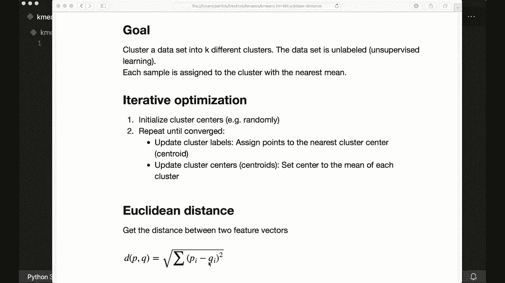
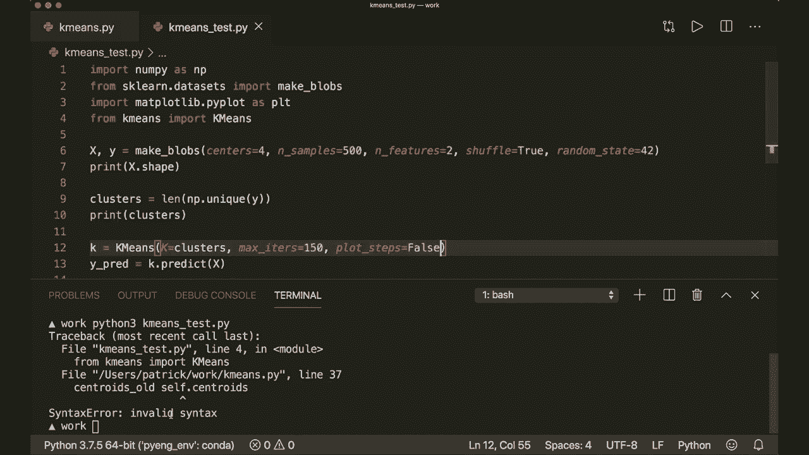
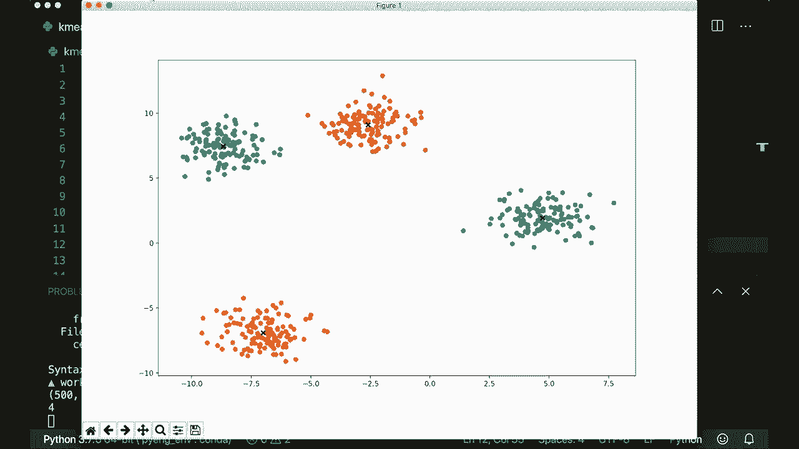
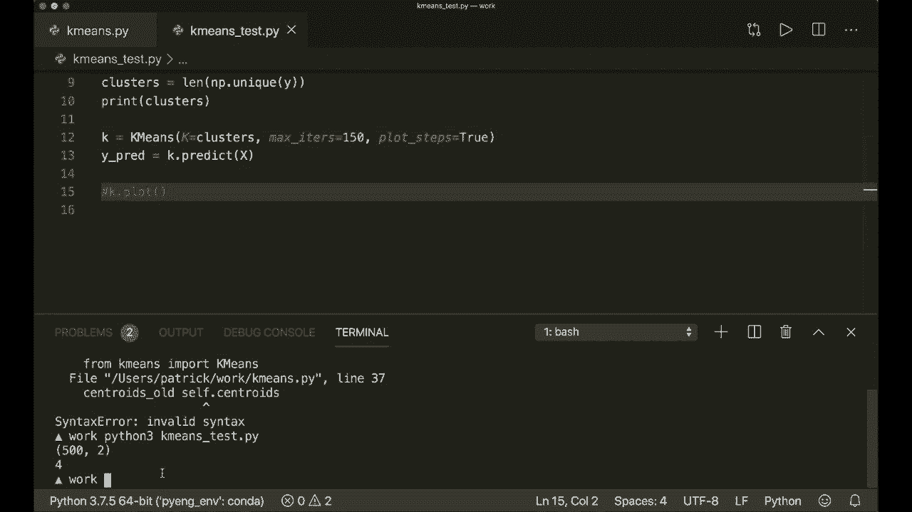
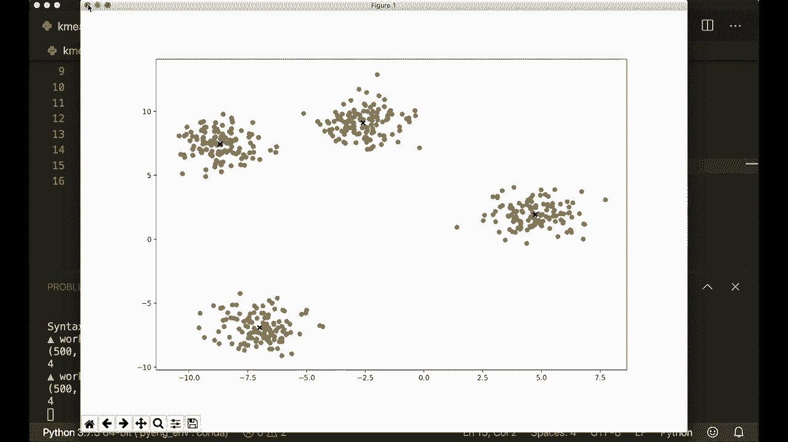
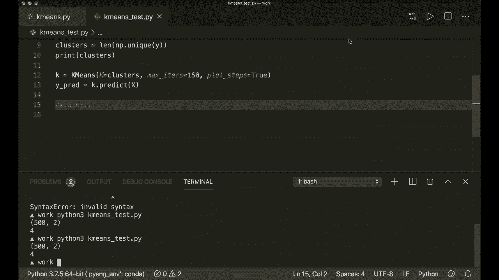

# 【双语字幕+资料下载】用 Python 和 Numpy 实现最热门的12个机器学习算法，彻底搞清楚它们的工作原理！＜实战教程系列＞ - P13：L13- K均值 - ShowMeAI - BV1wS4y1f7z1

Hi everybody and welcome to a new machine learning from Sct tutorial Today。

 we are going to implement the K means algorithm using only built and Python modules and Nmpy。

 The goal of the K means is to cluster a data set into K different clusters and here we have a unlabeled dataset set。

 So we are dealing with an unsupervised learning technique and each sample should be assigned to the cluster with the nearest mean So let's have a look at some images to see what this means。

 So here we have our unlabeled data and now in this case we want to find three different clusters So should look like this。

And then we assign the labels to the closest cluster， so to the center of the closest cluster。

So yeah， this is what we want to do and how are we going to achieve this So this is an iterative optimization technique。

 so first we initialize our cluster centers so we randomly pick some samples and say these are our first centers and then we do these two steps until we are conversed。

So first， we update our cluster labels， which means we assign the points to the nearest cluster center。

And the cluster sender is also called centroid。And next， we update our centroids。

 So now we set the center， the new center to the mean of each cluster。

 and we iteratively do this until there's no more change。 So let's again。

 have a look at the images to see how this is working。 So first， we have our unlabeled data set。

And now we randomly pick three centroids。 So here I've drawn them。 So I hope you can see them。

 So these are our initial centroids。 And now we assign the labels to the。Of the data to the。

 to the label of the closest centroid。 So this is our first initialization。

 And now we start optimizing。 So now we update our centroids。

 So we calculate the new mean for each cluster。 So I think this centroid will be moved to something like here。

 And this will maybe， maybe be here。 And the green centroid will be moved to maybe here。

 So let's see what's happening。 Yeah， so this is the new centroids。And now we update our label。

 our labels。 So now we check which is the closest centroid for each label。

 so maybe these will become blue and more of these will become orange。So yeah， this is the next step。

 And now again， we update our centroid。 So I think this one will further move to to the right。

And this one will move up here and this one will maybe stay the same。 So yeah， this is the next step。

 And now again， we update the labels。 So I think these will become orange now。

 and these will become blue。 and now we are almost done。 So maybe here are some slight shifts。

 So again， update the centroids。 then again， the labels then the centroids than the labels And now there's no more change。

 So now we are converged。And yeah， so this is the whole approach。

 And the only math that we need for this is the Euclidean distance。

 So I already showed you this in the tutorial about the Can nearest nava。Algorithm。

 the Euclidean distance between two vectors is defined as the square root of the sum over the squared distances。

So this is all we need。 So now we can start。 So let's import nuy as N P， of course。

 And then I will say， I will set a random seat to， let's say 42， you don't need this。

 but I want to reproduce my data later。 And since we are using a random initialization。 I want to。

 to have the same results， or I want to。To reproduce my results。 So I will set a random seat here。

And now let's define our Euclidean distance function first。 So Euclidean distance of two vectors。

 x1 and x2。 So this will be a global function。 And here we have to implement the formula that I just showed you。

 and we can do this in one line。 So we say return and nuy first， we have the square root off。

 And then we have the sum nu pi sum。 And then we have the sum over all the distances。

 So we can say x1 minus x2 to the power of2。 So the square distances。 So this is the function。

 And now we can implement our K means class。 So this will have an in it。Which has self。

 And then it will get a K。 So this will be the number of clusters。 And by default， let's say it's 5。

 Then it will get a max its。 So this is the maximum number of iterations。

 we want to do for our optimization。 And by default， let's say it's 100。

 And then it will also get a Boolean plot steps equals false。 So you don't need this。

 but I'm going to implement an additional function here to plot the different steps like we've just seen。

 So。Yeah， so first， we set them or we store them。 So we say self dot K equals K self dot max iters equals max iters and self dot plot steps equals plot steps。

 And now we create our empty clusters and centroids。 So self dot。Clus equals。Oops。Equals。

 and now here we want to be careful because this is important。 So this is a list of lists。

 So a list of sample indices。For each cluster。 and in the beginning， each cluster has an empty list。

 So we say， and we use list comprehension and then say we say have an empty list for underscore in range self dot K。

 So for each cluster， we initialize an empty list。And then we say our self dot centroids equals。

 and this will also be an empty list。 And here we are going to store the feature vectors or the mean feature vector for each cluster。

 So mean feature vector for each cluster。 So here we are having actual samples。

 And here we just store the indices。 So this is important。And now we can continue。

 So now usually we would implement a fit and a predict method。

 But since we are having a unsupervised learning technique here， we and we don't have any label data。

 we just have to implement the predict method。 So， and we don't need this the fit method。

 So let's define our predict method。With self and X。And here， first， let's store our data。

 self x equals x。 and then the dimensions。 So self number of samples and self dot number of features equals x dot shape because we need this later。

 And as always， this is a nuy and D array。And so， yeah。

 So now let's do the steps we just talked about。 So first， we have to。Initialize our。Our centroids。

And then we do a optimization。 So here we can say four underscore in range self dot max its。

 And now here in our loop first， we update our clusters。So， let's say， update clusters。And then。

 we update the cents。And then we check for conversiongs。Check。If converged。And if so， then we break。

 And at the end， we want to classify the samples as the index of their clusters。

 So here we say return。Return。Cluster labels。 So this is what we have to do。So now let's start。

 So let's say we want to initialize our centroids。 So we want to randomly pick some samples。

 So let's say random sample indices equals。 and now we use list comprehension。 So or no， sorry。

 here I can use nuy dot random dot choice。And this will get self dot number of samples， and self dot。

K， and we also have to say replace equals false because we don't want to pick the same indices twice。

 So this will be an array of size self dot K。 And for each entry。

 it will pick a random choice between 0 and the number of samples。And now， we assign。

The according sample that belongs to this index to our centroids。

 So we say self dot centroids equals。 And now here we use list comprehension。 So we say self dot X。

Of the current index for index in random samplingdices。

So this is the initialization of our centroids。 And now we can do the optimization。 So first。

 we say we update our clusters。 So we say self dot clusters equals self dot， create clusters。

 and this will get self dot centroids。 So this is a help of function。

 create clusters that we are going to implement now。

 So define create clusters with self and the cents。

So here we assign the samples to the closest centroids to create our clusters。 So first we have。

An empty list of lists for our clusters。And now we iterate over our data。

 So we say for index and sample in enumerate self dot X。

 So this enumerate function will give us the current index and the current sample。

 Now we want to get the closest centroid。 And we want to have the index of this。

 So we say centroid index equals self dot closest。Centroid。And this will get， get the current sample。

 and then it will get the centroid。 So this will be another helper function that we。

 we will create in a second。 But now let's continue here。 So when we have the centroid index。

 we append。Or we take the current。Cluster， so the clusters of this。Centroid index。

 And then we append。The current index。 So we put the current sample index in the closest cluster。

And then we return our clusters。So this is how we create our clusters。

 and now we need the define closest centroid function。

 which gets self and a sample and the centroids。And。

Here we calculate the distances of the current sample to each centroid。And then， want to get the。

The centroid or the index of the centroid， which has the， the closest distance。

 So let's calculate all the distances with list comprehension。

 So here we use the Euclidean distance function we already have。

 So the Euclidean distance of a sample and of each。Centroid point。 So point4 point in cents。

And then we want we so we have all the distances here。

 and now we want to see which is the minimum or the index with the minimum distance。

 So we can use Ny arc min here。 So we say closest index equals Ny arc min of this distances。And then。

 you simply。Return it。 So return the closest index。 So now we have this。

 and now we created our clusters， and now we can continue with our optimization。

 So here we update our centroids as the next steps。 But before we want to store the centroids。

 So let's say centroids alts equals self dot centroids so that we can check for convergence later。

 And then we say self dot centroids equals self dot get。Centroids。Of this。

 And this will get the self clusters。 So this is another function。

This will assign the mean value of the clusters to the centroid。 So for each cluster。

 we now calculate the mean。 So let's define this， define。Get。可。Notice do I get cents。

Which gets self and the clusters。So。Here， we initialize our centroids with zeros in the beginning。

 So let's say centroids。Equals nuai zeros。 And this will be of size self K and。Self dot N。Features。

 and here this should be a two pull。 So we have to be careful here。 So for each cluster。

 we will store the feature Ea。 So that's why it has to have this dimensions。

And now we iterate over the clusters。 So we say four cluster index and cluster in enumerate。Cluters。

And。Then we calculate the cluster mean。 So cluster mean equals N pi mean of our self dot x of this cluster indices。

🤢，And this should be along the first axis。So again， let's have a look at what this means。 So our。

 as I said， our clusters is a list of lists。 So if we have just a current cluster。

 then this is a list， and this is a list of the indices that are in this cluster。

 So if we call self dot X with this indices。Then it will only return the samples that are in the current clusters。

In the current cluster。 And then we calculate the mean。

 So this is what what what's going to happen here。 And now once we have our mean。

 we assign it to the current cluster So to the current centroids。 So we say centroids of the current。

Cluster index equals cluster。Mean。And then we are done and can return the centroids。So， yeah。

 So now we have our new centroids。 and now we check if we are converged。 So we say if self dot。

Is converged。Then we will break so we can stop here。And this will get the centroids。

Old and the new new ones。 So self do cents。 And this is another helper function。This will simply。

Calculate the distances between each old and new centroids for all the cents。 and check if this is0。

So， define is converged。Self and cents， old and new centroids。So again。

 we calculate the distances with less comprehenion。 This turns as equals。

 And here we calculate calculate the Eucladan distance of centroids old of I。

 So the current centroid vector。And the new one， So centroids。I。4 I in range self dot k。

🎼So for each cluster， it will look at the old and the new centroid vector and calculate the Euclidean distance and store it in this list。

 And then we can return some。Distances。Equals equals 0。

 So this is a build in function that will iterate over these entries and calculate or sum it up。

 And so if this is0， then there is no more change in our centroids。 So we say it is converged。So。

 yeah， so now we have this。 And now we want to return the cluster labels。

 So let's say return self dot。Get cluster labels。And this will get self thought。Cluters。

So here for each sample， we will get the label of the cluster it was assigned to。

 So let's create this right here。 So define get cluster labels with and the clusters。And so first。

 we say our labels equals a nuy。Ety array。Of size， self dot number of samples。 So for each sample。

 we want to return， which is the。The cluster it was assigned to， But be careful here。

 because these labels are not the actual labels of our data because we don't know them。

 So this is just the index of the cluster it was assigned to。So， yeah。

 So now we iterate over the cluster。 So for cluster index。And also， cluster in enumerate。Cluters。

And then we iterate over the current cluster。 So for sample index in cluster。So again。

 this is a list of list， and each cluster has a list has all the the sample indices of the samples that are in this cluster。

 So for each sample index in this current cluster， we say labels of the sample index equals。

The current cluster index。And then we return our labels。 And now we are done。

So one more thing that I want to implement， but you don't need this is to have a plot function。

 So define find plot and self。And here we are going to use matpl lab so I can say， import。Much。

Ploot lip dot pi plot S P L T， And I'm not going to explain the details here。

 but if you want to see more tutorials about my plot lip， then please leave some comments。

So let's implement the plot method。 So here， I simply want to。Ploot the。

 the data and to which cluster it belongs。 And then also the centroids。 So let's create our figure。

 So F a X equals P， L T dot sub。Ploots， and let's give this a fixed size of size。 Let's say，12 by 8。

 And then we iterate over our clusters。 So for I and index in。Sell in， in nom。

Marade self dot clusters。 And now we get the current point。 So point equals self dot X。Of the index。

 but we have to transpose it here。And now we scatter the point。 So A X starts scatter。

 And here I unpack the point。And now， so this will plot all the points。And for each cluster。

 it will use a different color。And now we do the， we plot all the centroids。

 So for point in self dot cents。A x dot scatter。 And again， we unfold our point。

 and then we say marker equals。X， so it has a marker sign， and color equals。

Black and line width equals 2。So， and then we have to say PLT dot show， of course。And。

So this is the plot function。 And now， during our optimization， if we set plot steps to true。

Then we want to plot after we updated our clusters， so we say。If self dot。Ploot steps。

 then self dot plot。And again， we also want to plot after we updated our centroids。

So we put it right here。 and now we are done。 So now let's run this。

 and I hope that everything is working。 So let's clear this and run our script。And。Oh。

 I missed a comma here， line 37。Update cent， the centroids old equals。The current ones。

So again， let's try this。 And now it's working。 So here we have。

 I created a data set with four different clusters。

 and we can see that it correctly could identify them。

So let's set plot steps to true and don't plot it at the end。 And now let's run it again。

To see the different steps。 So here， this is after our initialization。

 So we randomly picked some samples and said these are our first centroids。

 So maybe the initialization is not very good here， but。

You could find out the clusters correctly later。 So let's see what's happening。

 So now we are so then we are starting to optimize。 So now in the next step。

 we are calculating the new centroids。So I think the centroid of the blue cluster is moving to maybe over here and the orange centroid is moving to down here。

 So let's look at the next step。 So yeah， and now we are updating the labels。

 So I think these here are no longer orange but red and green。So。Yeah。

 and also some of them are now red。 And now we update our centroids again。

 So I think this will further move over here。 This will move down here。

And these will move a little bit。 So yeah。And now we again update our labels。

 So I think more of them will become red and more of them here will become green。So， and now again。

 we update our centroid。 So I think this will further move over here。

 The red centroid will move over here。 This is already good。 And the green 1 or moves over here。

 I think。So， yep， that's that。 And now again， we update the labels。 now again。

 the centroids and the labels。 And now I think we are converged。 So， yeah。

 this is how the K meanss works。 And I hope you understood everything。 And if you liked it。

 please subscribe to the channel and see you next time by。

