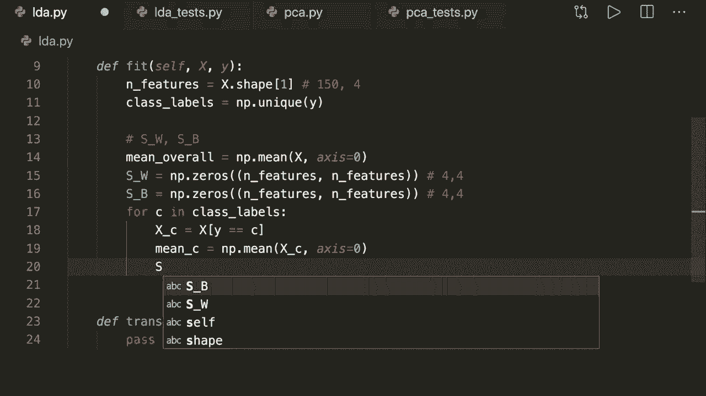
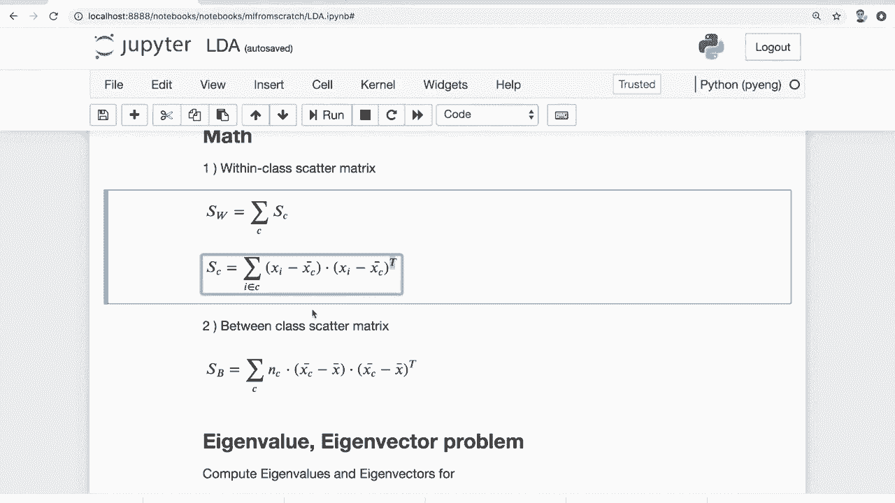
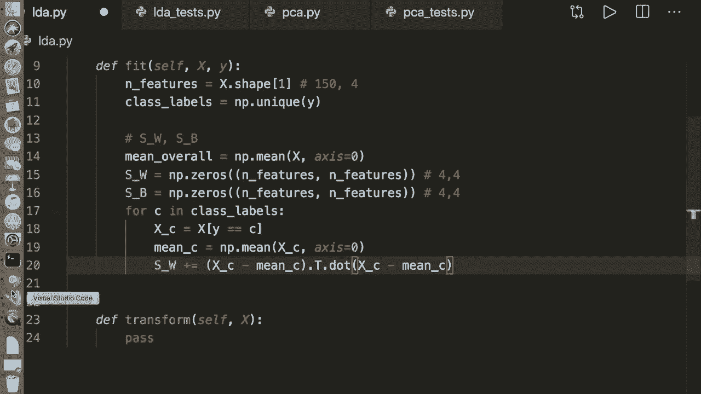
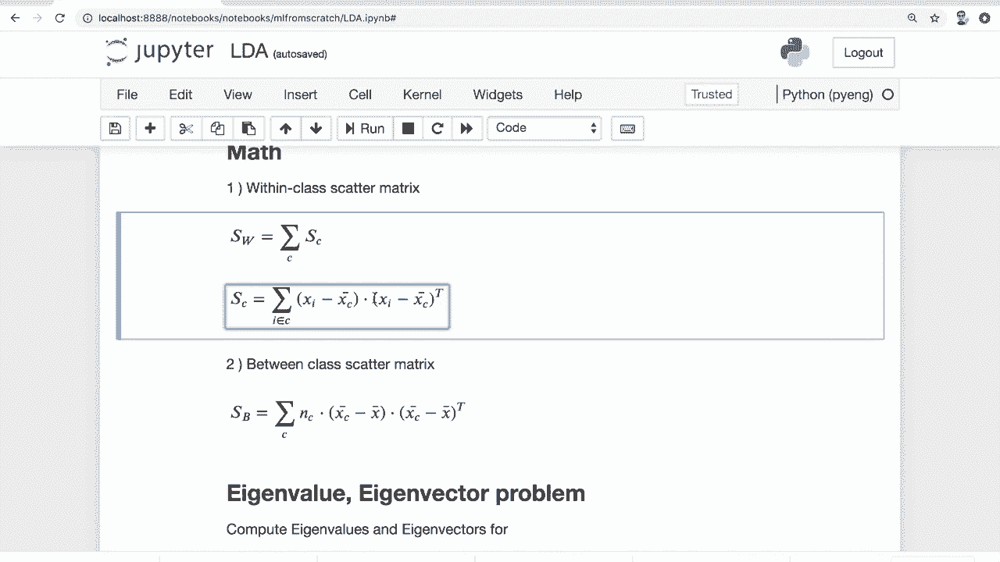
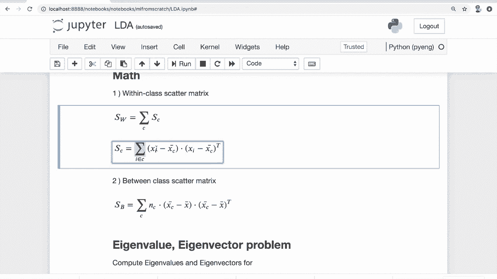
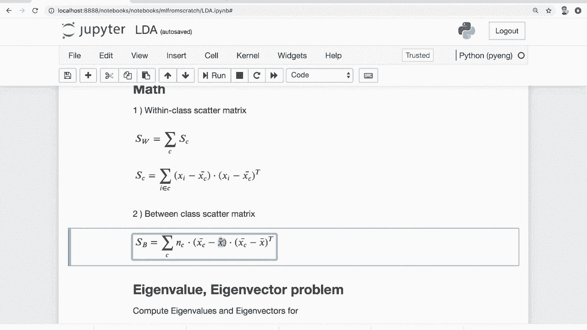
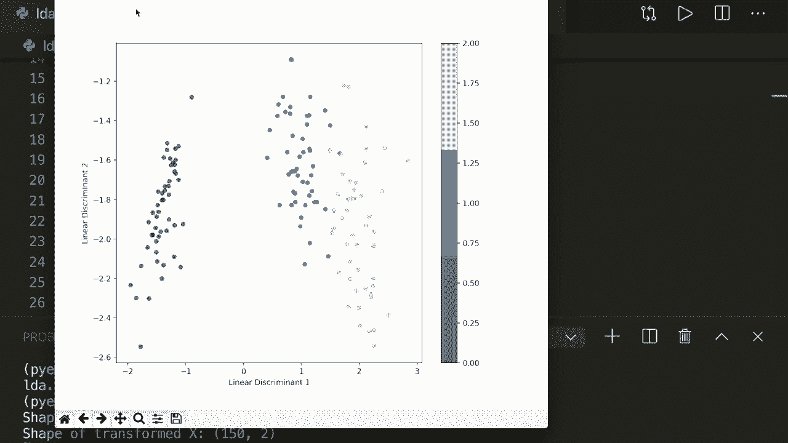

# 【双语字幕+资料下载】用 Python 和 Numpy 实现最热门的12个机器学习算法，彻底搞清楚它们的工作原理！＜实战教程系列＞ - P15：L15- LDA - ShowMeAI - BV1wS4y1f7z1

嘿，大家好，欢迎来到新的机器学习Sc教程。今天，我们将使用Python和Numpy实现线性判别分析算法或LDA。LDA是一种降维技术，是机器学习管道中一个流行的预处理步骤。

LDA类似于我在之前的教程中展示的PCA技术。PCA和LDA的方式和实现有很多相似之处。因此，我强烈建议你先观看这个视频。现在在我们跳到代码之前，先快速谈一下LDA的概念。目标就是。

正如我已经说过的，这是特征减少。因此，我们希望将数据集投影到一个低维空间，并找到良好的类间分离。😊在这里，我们有PCA和LDA之间的区别，在PCA或主成分分析中，我们想要找到一个新的轴，以便最大化在新轴上的方差。而在LDA中，最大区别是我们知道特征标签。

这是一种监督技术。在这里，我们希望找到新的轴，使得类间分离最大化。如果你看看这里的图片，我们有两个不同的类。然后我们可以将数据投影到Y轴或X轴上。在这种情况下，Y轴不是一个好的选择，但X轴是一个不错的选择，因为在这里我们仍然有良好的类间分离。

这就是LDA的概念。我在这里再次列出了PCA和LDA之间的差异。因此，在PCA中，我们想要找到最大化数据方差的成分轴。而在LDA中，我们也想这样做。在绿色区域和蓝色区域内，我们仍然希望单个特征之间有良好的方差。

另外，我们还对最大化多个类之间分离的轴感兴趣。因此，这里基本上应该在新的轴上最大化这个差异。是的，LDA是监督学习。所以我们知道我们的标签，而PCA是无监督的。这是一个重要的事情，我们应该记住。

现在让我们跳到数学部分，这里我们有所谓的散布矩阵。我们有两个不同的散布矩阵，类内散布和类间散布。这基本上代表了我在这里所谈论的内容。因此，类内散布确保我们在一个类内的特征被很好地分开。

而类间散布确保两个或所有类被很好地分开。如果我们将其转化为数学，我们必须处理均值和方差。因此，类内散布的公式是对散布的总和，每个类的散布是特征值减去所有特征的均值的总和。

仅在这个类中，然后乘以相同的转置。然后我们对该类中的所有特征求和。因此，这基本上与我们想要计算协方差矩阵的 PCA 算法是相同的。因此，这几乎是协方差矩阵的相同公式。

只是在开始时我们没有缩放。因此，这是类内散布器。然后是类间散布器，这里的公式是对所有类求和。然后对于每个类，我们有该类中的特征数量，哦，不，应该是该类中的标签数量，然后乘以均值。

所以这个 x bar 是该类特征的均值减去所有特征的均值。所以总的。然后乘以相同的转置。所以这两者是我们必须计算的矩阵。然后我们计算类内散布器的逆，并将其与类间散布器相乘。

这是我们必须解决的特征值和特征向量问题。所以这与 PCA 中的情况相同。我不会再详细说明了。因此，请确保你知道特征值和特征向量是什么。基本上，我们必须做的是计算这些公式的特征值。

然后让我们再次看看整个方法。所以在这里我对它进行总结。首先，我们想要计算类间散布器和类内散布器。然后我们计算类内散布的逆，并将其与类间散布相乘。然后我们计算特征向量和特征值。

然后我们根据特征值按降序排序特征向量，然后我们只选择我们指定的前 k 个特征向量。所以仅保留我们想要的 k 个维度，这些特征向量被称为线性判别，因此它才有这个名称。接着我们将原始数据点转换到这 k 个维度，这种转换基本上就是一个投影。

通过点积。因此，这整个方法与 PCA 算法中的方法是相同的，只是我们必须为不同的公式解决特征值和特征向量问题。所以这就是方法。现在让我们跳到代码部分。

所以，当然，我们导入 nuy S N P。然后我们定义我们的类。我们称之为 LD A。接下来我们定义我们的初始化，它有 self。并且它还获取我们想要保留的组件数量。在这里我们简单地存储它。所以我们说 self 和。Components 等于 n components。我们还创建一个变量，称为 self dot linear this。Preriminence。

这一开始是 none。在这里，我们想存储我们计算的特征向量。然后我们定义我们的 fit 方法。在这里我们有 self，还有 X，还有 y。因为记住，这是一个监督技术。接着我们还实现了一个不是 predict 的方法，而是称之为 transform。变换与 PCA 中是相同的。

在这里，我们想获得想要投影的新特征。所以让我们实现 fit 方法。在这里，首先，我们想要获取特征的数量。我们通过说 x dot shape 来获取这个值，然后是 index1。所以 index0 是样本的数量，而我们只想得到特征的数量。

然后我们还想获得所有不同的类别标签。我们称之为类标签，这等于 nuy，然后我们可以应用 y 的唯一函数。因此，这将仅返回我们标签中的唯一值列表。现在我们想计算两个散布矩阵。

所以 S underscore W 是类内的聚合，S underscore B 是类间的聚合。让我们开始吧。首先，我想计算所有样本的均值，因为我们需要这个值。对于一个公式，我们说均值。总体均值等于 numpy dot mean of x，然后沿着轴 0。接着让我们初始化两个矩阵。所以我们说 S W 或 S underscore W 等于 nuy zeros。

所以我们希望用零填充这个，并希望将其大小设置为特征数量乘以特征数量。类间散布也是同样的处理。所以我们用零初始化这个。稍后，我们想用例如鸢尾花数据集的特征来测试这个。所以这个大小是。我认为是 150 个样本和四个特征。所以这个大小是 4 乘以 4。

这在四次四的情况下是相同的。

现在我们需要应用这两个公式。因此，我们需要对所有类进行求和，然后应用这两个公式，这样我们就可以在一个循环中完成。

所以我们说对于我们计算的类标签中的 C。首先，我们想要获取该类的样本。因此我们说 X，C 等于 X，其中 Y 等于 C。在当前迭代中我们有这个标签。然后我们想从这些特征中获取均值。mean C 等于。这是 Ny dot mean of X C 沿着 x 为 0。所以与我们在这里做的相同。

但仅针对这一类中的特征。然后我们来看看类内的情况。

公式。因此，在这里我们有特征，然后减去均值。基本上这是点积乘以转置。

所以让我们来做这个。在这里我们说我们的 S within 加上等于。因为在这里我们对所有类求和。所以加上等于。然后我们说 x C。

减去均值 C。然后我转置这个并计算点积，和我们在这里做的一样。所以。这里我们需要小心。如果我们再看一下公式，我们会看到我必须在最后转置项。这里我转置了第一个项。这是因为我们这里有一个额外的求和。因此，我们对这个类别中的所有样本都这样做。我们在一个操作中用点积来进行这个求和。

所以使用我们的 numpy 操作。然后我们必须注意尺寸。因此，我们最后想要的是一个像这里一样的 4 乘 4 矩阵。因为我们将其添加到这些矩阵中。在开始时，我们的 X C 和我们的均值 C 的大小为该类别中的样本数量乘以 4。😊。

所以我们必须调整这个顺序。我们必须说这是 4 乘以该类别中的样本数量。因为当我们将其相乘或计算与这里未转置的这个点积时。因此，我们这里有该类别中的样本数量乘以 4。然后如果我们乘以这个，就得到一个大小为 4 乘 4 的矩阵。

所以这些是矩阵操作的基本规则。确保你理解这一点。因此，第一个矩阵的最后一个维度必须与第二个矩阵的第一个维度匹配。然后最终输出大小由这两个大小组成。这就是为什么我们必须在这里转置第一个项。因此，这可能有点令人困惑。

确保自己仔细检查这一点。然后我们得到了类内散布。现在对于类间散布，我们想要的是该类别中的样本数量。我们通过说这是等于 X，C 点形状来得到这个 N C。在这里我们希望得到索引 0，因为我们想要样本数量。

然后在这里，我们必须小心，因为我们需要重塑我们的向量。假设我们的均值除。

再次查看公式。在这里。我们计算该类别的均值减去总体均值。哦，来吧！

所以这是，假设我们有该类别的均值减去总体均值。这是单维的，但我们想要的是，如果我们查看形状，则会说四，零。但我们希望它是 4 乘 1。因此，我们必须说重塑。然后是特征数量乘以 1。这是因为。

再次，如果我们查看最终的乘法。与我们正在进行的层次相同。我们想要一个大小为 4 乘 1 的矩阵，并将其与一个 1 乘 4 的矩阵相乘。因此，这基本上是 4 乘 1 转置。然后我们得到一个 4 乘 4 的输出。这就是为什么我们必须在这里应用重塑。然后我们说 S B。加等于。

然后这里我们有这个类的样本数量乘以。这里有均值的点积，均值差的转置，这两个都是我们的矩阵。我们终于得到了这些矩阵。现在，正如我所说，我们必须获取类内散布的逆，并与类间散布相乘。所以我们得到逆。也是用numpy获取的，通过说nuy L alk。Dot in of S W。然后点积。

我们与类间散布相乘。我们称之为a，并将其存储在这个矩阵中。然后为此，我们必须解决特征值和特征向量问题。所以我们必须计算特征值和特征向量。接下来的代码与PC A算法完全相同。所以请检查一下。

所以我们通过说，这是numpy。Lin Ark dot Ig of a来获取特征值和特征向量。然后我们对特征向量和特征值进行排序。对于这一点，和我们在PC算法中做的相同。所以我们通过说特征向量等于特征向量点T来转置特征向量。这样可以简化计算，然后我们对特征值进行排序。

所以我们说索引等于nuy dot arc sort off。在这里我们说特征值。为了使其更美观，我们实际上想要特征值的绝对值。然后我们想按降序排序。因此，我们使用这个切片并用步长为-1的这个小技巧从开始到结束。这样就可以将索引反转。然后我们就得到了降序排列。

现在我们通过说特征值等于这些索引的特征值，按降序获取特征值，特征向量也一样，特征向量等于这些索引的特征向量。然后我们只想存储前n个特征向量。

我们将其存储在我们这里的线性判别中。所以我们说self dot。线性判别等于特征向量。从开始的最大特征向量和最大或最高的特征值。然后是self dot指定的分量数量。

所以这是我们保留的维度数量。现在我们终于完成了拟合方法。这就是整个拟合方法。然后在一个变换下，我们要做的唯一事情就是将我们的数据投影到这些新分量上，而这个变换无非就是点积。

所以我们可以将其写成一行，并返回nuy dot。然后我们将数据投影到self dot线性判别上。由于在这里进行了转置，我们必须在这里再次转置。然后我们完成了。这同样是PCA中的内容。请自行仔细检查。

现在我们完成了，可以运行脚本。这里我有一个小的测试脚本，这基本上和PCA测试中的相同。唯一要交换的是，我们创建LEA并希望保留两个分量，然后调用拟合和变换。

我们对Iris数据集执行这个操作，然后我将新的标签绘制在新的两个维度上。让我们运行这个。假设是Python LDA。下划线测试饼图。希望一切正常。是的，这里我们看到我们的特征在只有两个维度中被转置。我们看到类别非常好，彼此分离。

所以我们有三个不同的鸢尾花类别。我们看到这个是有效的。

所以我们的LDA特征降维方法有效。请再次将其与PCA算法进行比较。希望你喜欢这个教程。如果你喜欢这个，请订阅频道，我们下次再见，拜。😊。
