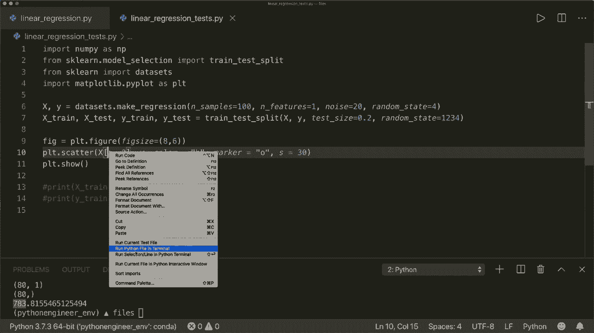
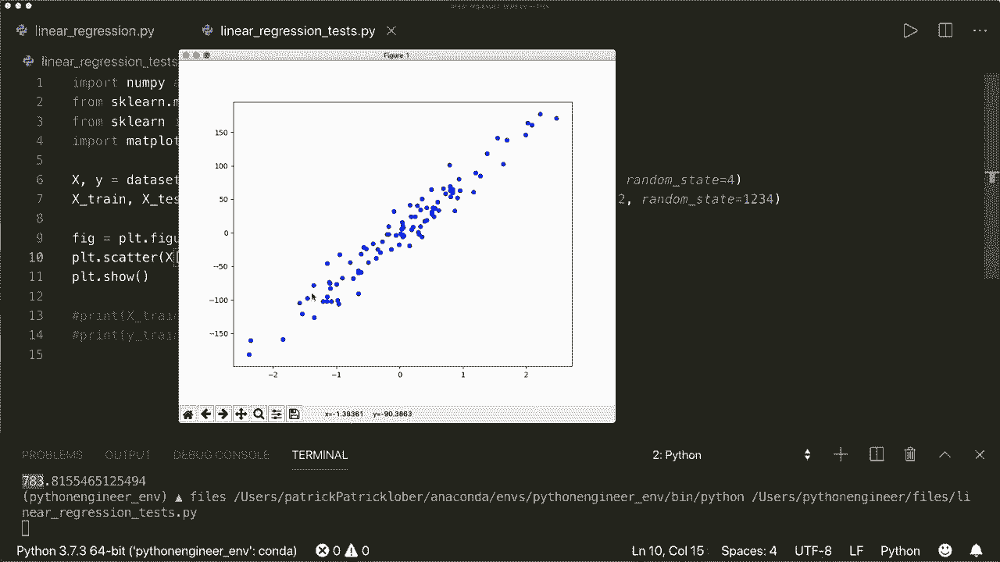
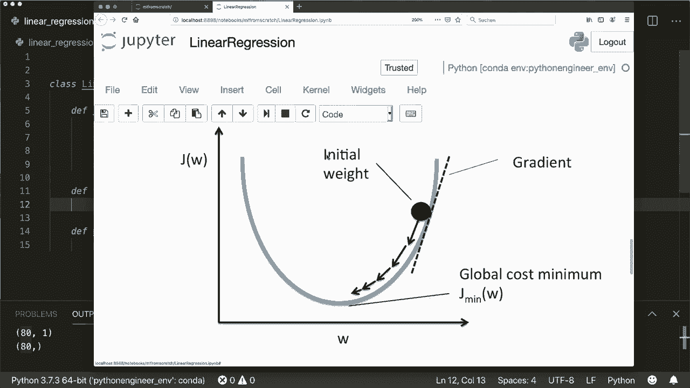
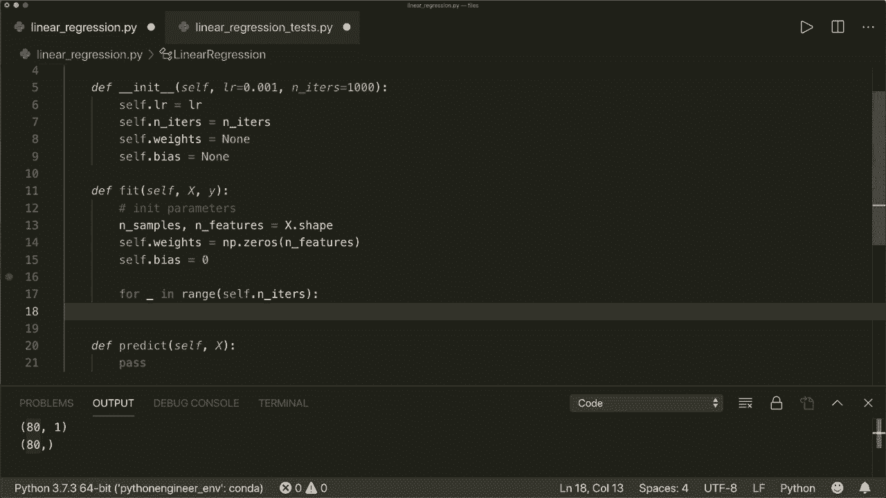
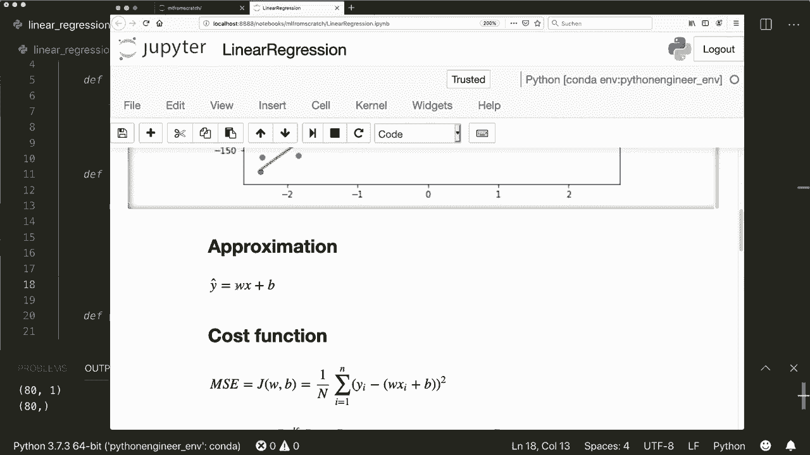
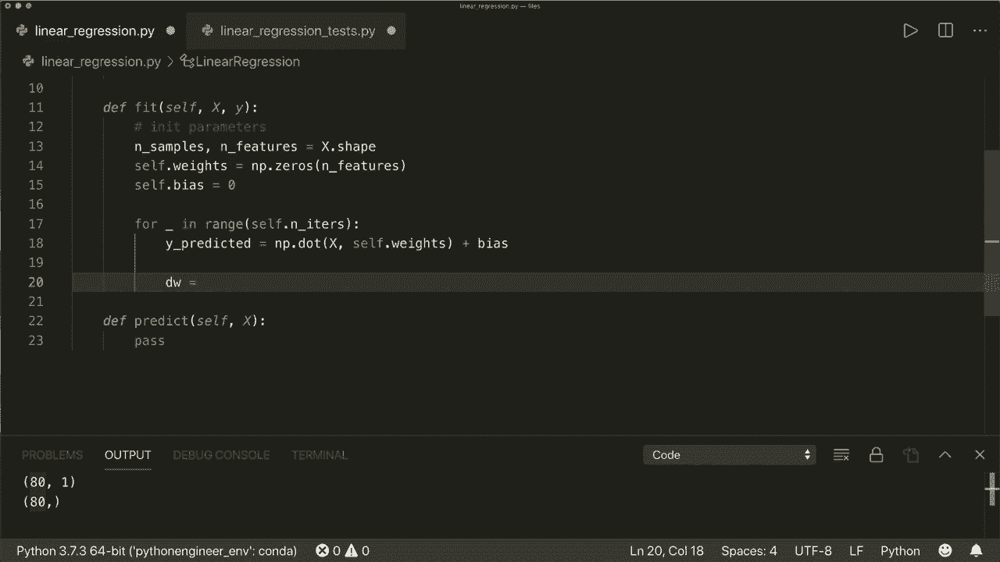
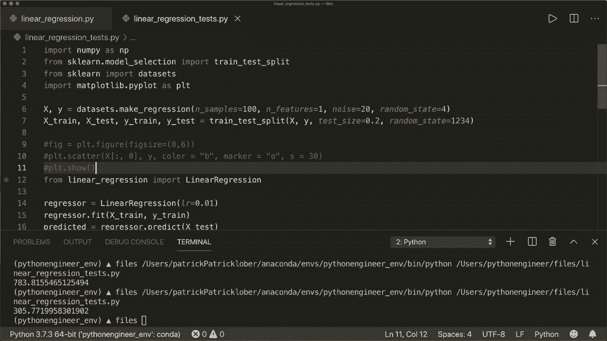

# 【双语字幕+资料下载】用 Python 和 Numpy 实现最热门的12个机器学习算法，彻底搞清楚它们的工作原理！＜实战教程系列＞ - P3：L3- 线性回归 - ShowMeAI - BV1wS4y1f7z1

Hi， everybody。 Welcome to a new tutorial。 This is the second video of the machine learning from Sc tutorial series。 In this series， we are going to implement popular machine learning algorithms using only built and Python modules and nuy。 Today， we are going to implement the linear regression algorithm。 So let's talk about the concept of linear regression first。 So in regression。

 we want to predict continuous values， whereas in classification。 we want to predict a discrete value like a class label 0 or one。 So if we have a look at this example plot。 Then we have our data， the blue dots。 and we want to approximate this data with a linear function。

 that's why it's called linear regression。 So we use a linear function to predict the values。😊。So we can define the approximation as y hat equals w times x plus B。 So this is the line equation where W or our weights is the slope and B is the bias or just the shift along the Y x's in the2 D case。So this is the approximation。 And now we have to come up with this W and the B。

 And how do we find this。So for this， we define a cost function。 And in linear regression。 this is the mean squared error。 So this is the。Diffence。Between the actual value and the approximated value。 So the actual value for this。 we need training samples。And then we square this difference and sum over all the samples and then divide by the number of samples。

 So this way， we get the mean error。This is the cost function of the， so this is the error。 And。 of course， we want to have the error as small as possible。 So we have to find the minimum of this function。 And how do we find the minimum。 So for this。 we need to calculate the derivative or the gradient。

 So we calculate the gradient of our cost function with respect to W and with respect to B。So this is the formula of the gradient。 Please check this for yourself。 and I will also put some links in the description with some further readings。 but I will not go into detail now。And now with this gradient。

 we use a technique that is called gradient descent。 So this is an iterative method to get to the minimum。 So if we have our object or our cost function here， then we start somewhere。 So we have some initialization of the weights and the bias。And then we want to go into the direction of the steepest descent。And the steepest de is also the gradient。 So we want to go into the direction of the。 into the negative direction of the gradient。And we do this iteratively until we finally reach the minimum。And with each iteration， we have a update rule for the new weights and new bias。

 So the new W is the old W minus alpha times the derivative。😊。So minus because we want to go into the negative direction。And then this alpha is the so-called learning rate。 And this is an important parameter for our model。 So the learning rate defines how far we go how far we go into this direction with each iteration step。

 So， for example， if we use a small learning rate， then it may take longer。 but it can finally reach the minimum， And if we reach or if we use a big learning rate。 then it might be faster， but it might also jump around like this and never find the minimum。 So this is an important parameter that we have to specify。 and please keep that in mind。

So now that we know our update rules， I've written the formulas for the derivatives again here and。Then simplify them a little bit。 Please check that for yourself。 So these are the formulas for the update rules and the derivatives。 And this is all we need to know。 So now we can get started。 So now let's define a class called linear regression。

And this will， of course， has an in it method。Or double underscore score in it。And then it has self。 and it gets the learning rate。 And I will give this a default value。 So usually this is a very small value。 So I will give it0001。 And then I will give it a number of iterations。 So how many iterations we use in our gradient decent method。

 and I will also give this a default value。 So I will say this is 1000。 And then I will simply store them here。 So I will say self L R equals L R and self。And。Itders equals and its。 And then later， we have to come up with the weights。 But here at the beginning， I will simply say self weights equals none and self dot bias equals none。

And then we have to define two functions， and we will follow the conventions of other machine learning libraries here。 So we will define a fit method， which takes the training samples and the labels for them。 So this will involve the training step and the gradient descent。And then we will define a predict method。So then when it gets new。Test samples。

 then it can approximate the value and return the value。 So these are the functions we have to implement。 And before we go on。 let's have a quick look at the data X and Y。 So how does this look。And for this。 I've written a little example script， and I used the psychic learn module to generate some example data。

 and I will split the data into training and test samples and also training and test labels。 So first of all， let's have a look at how this data looks。

So here is the plot。 So this is how our data looks。 And now we want to find a function somewhere here that approximates the value。

And let's have a look at the。Shape of our x and y。 So let's run this。 And I don't want this plot here anymore。嗯。So if we see that our x is a N D array of size 80 by1。 And this is because I put in here， I want to have 100 samples。And one feature for each sample。 And then I will split this。 So our training samples only has 80 samples in it。

 So this is a ND array of size 80 by one and our training labels is just a 1 D vector of also of size 80。 So for each training sample， we have one value。So this is how our data looks。 And now let's continue。 So let's implement the fit method。 So， as I said。 we need to implement the gradient decentcent method here。

 and the gradient decent always needs to start somewhere。 So we need to have some initialization。

So。Let's do。 let's in it our parameters。 And for this first。 let's get the number of samples and the number of features。 We can get this by saying this is x dot shape。And then we simply initialize all the weights with0。 So we can say self weights equals nuy0s。Of size and feature。And features。 So for each component。

 we put in a0 and self du bias equals 0。 This is just a value。 So you can also use random values here， but 0 is just fine。So let's use 0 here。 and then we use the gradient descent。 So this is an iterative process。 So we use a fall loop。 So for I， oh actually， we don't need this。 So for underscore in range and then self dot and its。

And now， what we need。We first have to approximate。Or let's have a look at the formula again。

So， the formula for our。And new weights is the old weight minus the learning rate times the derivative。And the derivative with respect to W is one over n。And then we have the sum and the sum over two times X I。Times， and then。The difference here of this approximated and the actual values。 So let's first。First。

 calculate this approximation。 So we have this formula here。The approximation is。The weights times our x plus the bias。

So let's do this。 Let's say， and let's call this why。Predic it equals。 And then we can use N dot dot。And then x and self dot weights。Plus。Bs， so this will multiply the x with the weights。And now that we have the approximation， we can calculate the derivative with respect to W。 And this is。 let's again， have a look at this formula。

1 over n。And then。The sum。 and then inside the sum， we have the product of x times this。So， we say。

1 over。And samples。 So we already got the number of samples here。And then times。 And then we have the sum product。 So this is nothing else， but also the dot product。 So N P dot dot。 But now we have to be careful。 So what we did here。嗯。Here we multiply each weight component with the feature vector component and sum it up。

 And we do this for all samples and then get one value for each sample。And here we want to get one value for each feature vector component。 So we multiply each sample with a predicted value and sum it up。So。 and then we do this for each feature vector component and get one value for each component。

 So this is the other way round。 So this is along the other axis。 And we can。 So we have to use x dot transposed here， x dot T。And this is the dot product of the transposed X。 And then we have y predicted minus the actual y。 So please check the nuy dot function for yourself。So， this is the。The of the W and the derivative of the bias is also one。 Or again。

 let's have a look at the formula。 So this is the same。 except that we don't have the x here。 So this is one over n。 and then just the sum。

Of this difference。 And by the way， I。I left the two out。 So this is just a scaling factor that we can omit。So here one over n and then the sum over the difference。

So again， one over number of samples。 And then we can say nuy dot sum and the sum of y predicted minus actual y。So this are， these are our derivatives。 And now we update our weights。 So we say self weights minus equals self dot learning rate times this。Divative。And self。 the bias equals self。Minus equals self dot learning rate times。The derivative。And。Yeah。

 so this is the gradient descent。And now we need the predict method。 So， again， we approximate。

We approximate the values with this formula， so。

We already have this here。 So this is。The dot product of x and the weights， plus the buyers。And then。 we simply returned this。So this is the whole implementation that we need， and。I forgot to import Ny。 of course。 So I say， let's say， import Ny S and P so that we can use this。And now， let's test this。So。嗯。Let's import this class。 So let's say， from。Linear regression。Import linear regression。

And then create some regresso equals。Linear regression。And then we say regressor dot fit。 and we want to fit the training samples and the training labels。And then we can say we can get predicted values equals。Regress or。Dot predict。 And now we want to predict the。Test。嗯。Samples。And now。

 in order to calculate the or to see how our model performs。 now we can't。 we can't use the accuracy measure。 But here we use the mean squared error。 So as I said。 this is our cost function， the mean square error that tells us how big。

The difference between the actual value and the approximated value is。 so let's define the mean squared arrow。 Let's say theef M， E， and this will get。

The actual values， and the predicted values。And this is。The numpy here， we can use Nampy mean。And then， simply， the difference。To the power of two。 So why true。Mus y predicted to the power of2。And then we want to return this。So， let's see。 let's say。M S E value equals ME。Off。W。Test。And the predicted。Values， and let's print this。So now if we run this。嗯。See， it's not running。

 Bias is not defined。 So let's say what we。What did we miss here， dot biasas。And let's run this again。So。L，27。Oh， sorry。 I copied this and forgot this year， too。 So next try。Now。 we see that our。Performance， so the mean squaredarrow is 783。 So this is pretty high。 So let's use another learning rate here。 So let's say L R equals。t0，1。And let's run this。

And now we see that our arrow is smaller。 And let's actually plot this。So。Let's plot。First。 with the original learning rate， let's see our。How the plot looks。So， now。Our plot looks like this。 So it's。

Almost like the right slope， but not exactly。 And now let's have the other learning rate。 So let's use this learning rate。 and let's run this。

And now our plot looks like this。 and this looks pretty good， actually。 So this is a pretty good。Fit a pretty good approximation of this data with a linear function。 So we see that our implementation is working。 and I hope you enjoyed this tutorial and see you in the next tutorial。😊。

Bye。Hi， everybody。 Welcome to a new machine learning from scratch tutorial。 Today。 we are going to implement logistic regression using only built and Python modules and Nmpy。 If you haven't watched my previous video about linear regression。 I will highly recommend to watch it first。 Since I explain some of the concepts a little bit more in detail there。

 But I will try to cover all the important concepts again in this video。 So let's talk about the concepts of logistic regression。😊，So。As you remember， in linear regression。 we model our data with a linear function W times x plus B。So this will output continuous values。And now， in logistic regression， we don't want continuous values， but we want a probability。

And in order to model this probability， we apply the sigmite function to our linear model。So the sigmoid function is one over one plus the exponential function of minus x。So this is the soid function and Min and x。 in our case， is then our our linear model。So。 and this is， this will output a probability between 0 and1。 So if we plot the sigmoid function。

Then you can see this is between 0 and one。So with this function。 we can model a probability of our data。And now， with this。Approximate it。Output， and we can then。We must then come up with the parameters W。 So our weight and our bias。And how do we do that。 So again， I already explained this in the previous video。

 So we apply a method that is called gradient descent。 So first of all， we need a cost function。 And here we don't have the mean squared arrow any。 but we use a function that is called the cross entropy。 So this is the formula。I will not go into detail about this， but I will put some further readings in the description。So。

 with this formula。What we do， we want to optimize this with respect to our parameters， W and B。So we use gradient descent。 and this means we start at some point and then iteratively update our parameters。 So we have to calculate the derivative。And then go into the direction of this derivative until we finally reach the minimum。So， and then we also need to define a so called learning rate。

 So the learning rate determines how far we go into this direction with each step。 So this is an important parameter。 It shouldn't be too high since then it might jump around and never find the minimum。 but it also shouldn't be too low。Sorry。And now with this gradient descent。What we have is we have our update rules。 So our。Our weight is our new weight is the old weight minus。

 because we want to go into the negative direction， minus our learning rate times the derivative。And the same is for our bias。And then here are the formulas that we need for our derivatives。 So these are the formulas， and they are actually the same derivatives， like in。Lar regression。 so you can check the math behind it yourself。 I will also put some links in the description。

And this is all we need now to get started， and now we can implement our。