# 【双语字幕+资料下载】用Python和Numpy实现最热门的12个机器学习算法，彻底搞清楚它们的工作原理！＜实战教程系列＞ - P4：L4- 逻辑回归 - ShowMeAI - BV1wS4y1f7z1

逻辑回归。当然，我们再次使用nump。让我们导入Nmpy S N P。然后我们创建一个名为Lo regression的类。这将有一个初始化方法。所以我们有一个初始化。初始化与线性回归完全相同。我会在这里放入一些学习率，它将得到一个默认值。因此是0。

001通常学习率非常小，并且还会得到一个迭代次数。因此its和默认值为1000。这将决定我们用于梯度下降的迭代次数。然后我将存储它们。因此我会说self L R等于L R和self。然后its等于its。然后，我将简单地创建一些权重，但一开始将它们设置为none。因此我们的权重是none。

而我们的偏差是none，简单地说我们现在需要想出它们。然后我们定义一个拟合方法。因此这里我们再次遵循心理学习库的约定。这将需要一些训练样本和标签。因此这将涉及训练步骤和梯度下降。然后我们有一个预测方法。

在这里我们获得新的测试样本，想要预测这些是我们想要实现的方法。我们的输入在这里。因此x是一个大小为M乘n的nuy N D向量，其中M是样本数量，n是每个样本的特征数量。而y是一个大小为M的10向量。因此，对于每个训练样本，我们有一个向量。所以。

现在我们可以继续。所以首先，我们必须初始化我们的权重。让我们假设我们想要初始化参数。为此，我们获得样本数量和特征数量。所以这是x的形状，这将把第一个维度展开为样本数量，第二个维度为特征数量。然后，我们初始化我们的。嗯。权重。只用0。因此，我们创建一个仅包含大小为0的零向量。

特征数量。我们一开始将偏差设置为0。例如，你也可以使用随机数进行初始化，但0就很好。在此之后。我们使用我之前提到的梯度下降。因此我们迭代地更新我们的权重。我们使用一个for循环。因此假设4 I。实际上，我们不需要这个。因此对于下划线在范围内。

然后是self dot和its。因此，这是我们想要的迭代次数。现在让我们再看一下公式。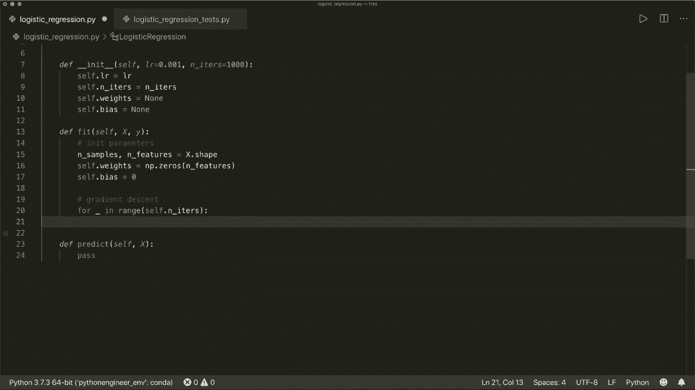

所以首先，我们用这个函数近似我们的y。因此首先。让我们应用这个线性模型，然后应用sigmoid函数。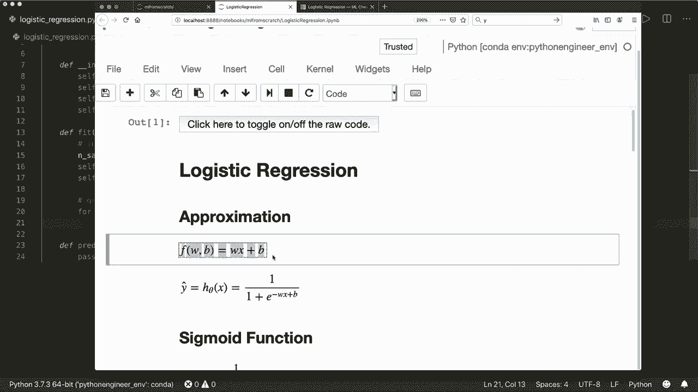

所以，假设。模型等于这是w乘以x加上B。因此我们可以使用nuy dot函数来乘以我们的向量。将x与self dot weights相乘，加上self dot bias。然后，我们应用sigmoid函数，所以让我们创建一些帮助或方法，一些私有方法，sigmoid。获取一些X。嗯。所以，在这里。这是胸部。

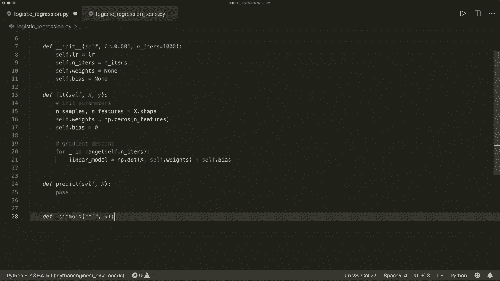

如果你看看公式1除以1加上负x的指数函数。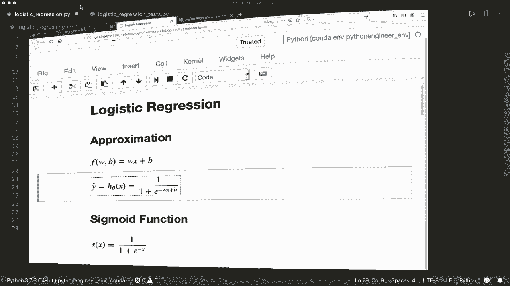

因此，我们可以将其写成一行，返回1除以1加上N P点积。或者我们给它加上括号，1加上N P点积X。然后，减去x。这就是我们所需的全部。现在我们在这里应用sigmoid函数。因此，我们说预测的y等于self.dot。Sek可能减去。然后我们的线性模型。

这就是我们对y的近似。然后我们需要更新我们的权重。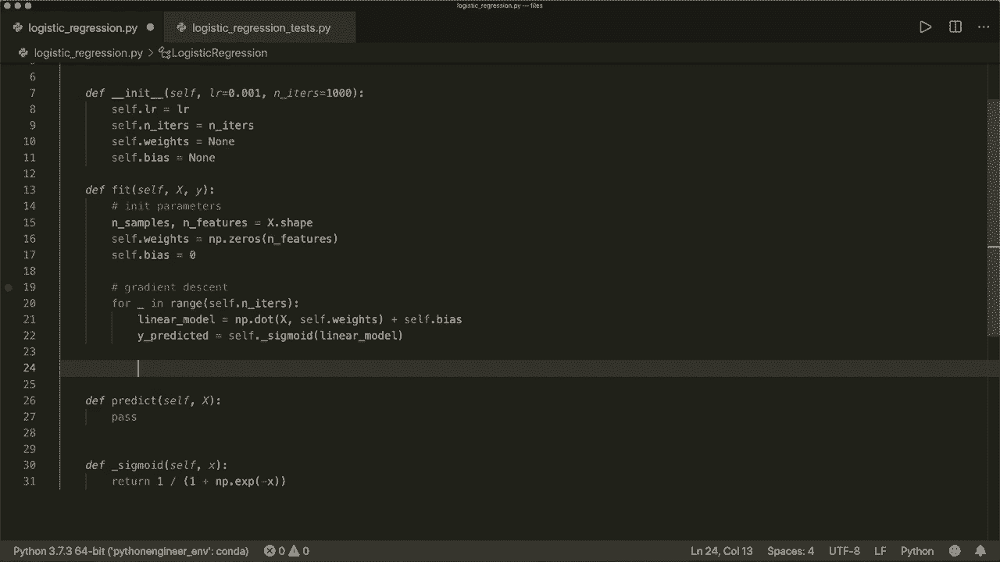

所以，我们看看更新规则。我们首先计算这两个公式的导数。假设。

DW等于，且这是1除以n。然后求和。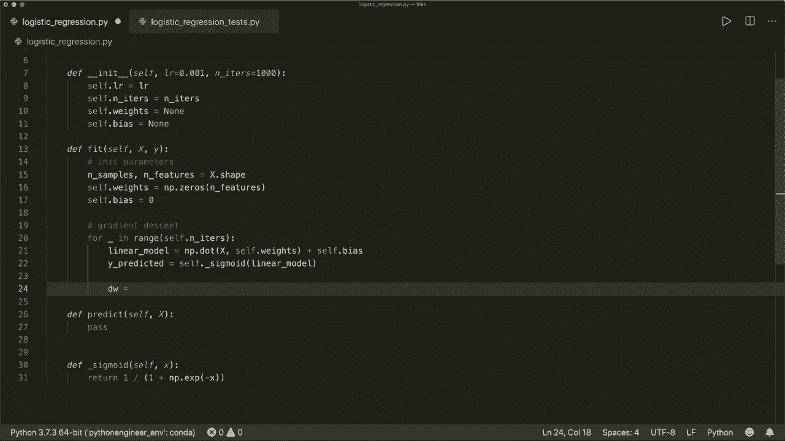

两倍于x乘以预测的y减去实际y的差。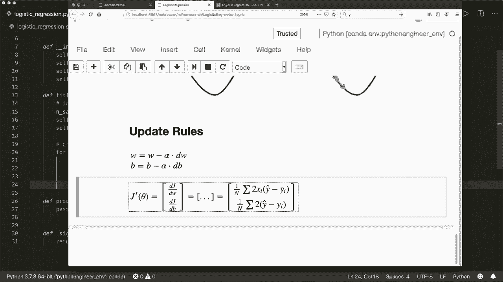

因此，我们有1。除以我们已经在这里得到的样本数量。然后乘以。接着我们有了。产品，然后对这个产品进行求和。这没有别的，还是向量的点积。因此，我们可以使用numpy.dot。但现在我们必须小心。现在我们想要沿着其他维度进行操作。

所以我们必须使用X的转置。然后将其与预测的y和实际的y进行点积。所以请自己检查点积。因此，这就是相对于W的导数，而相对于偏差的导数是相同的。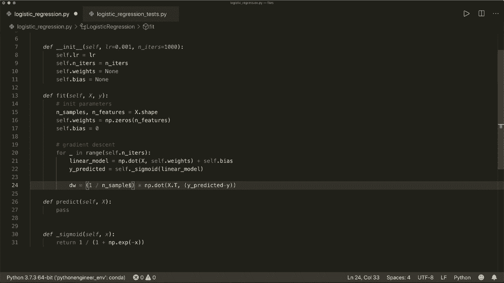

但没有X。因此这只是一个和。顺便说一下。我省略了2，因为这只是一个可以省略的缩放因子。因此，这是1除以n。然后这个差值的和。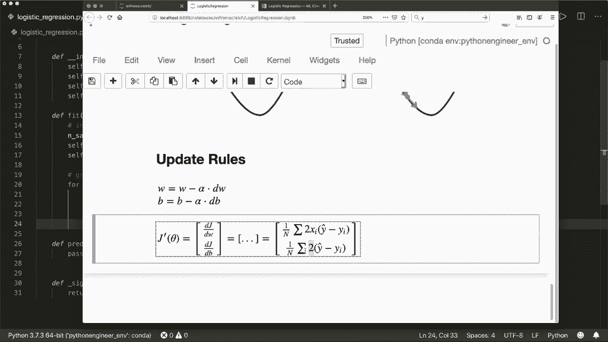

所以，我们说D B等于样本数量的倒数。然后乘以N P点积和。然后这里我们简单地有预测的y减去实际的y，所以。这就是我们的导数。然后我们更新我们的参数。因此，我们说self.dot.weights减去等于self.dot.learning rate乘以导数，对于偏差也是如此。所以减去等于self.dot.learning rate乘以导数。

这就是我们的拟合方法的全部。这是梯度下降。现在让我们实现预测方法。因此，这里我们做了与这里相同的事情。因此。我们首先用线性模型来近似我们的数据，然后应用sigmoid函数来获得概率。

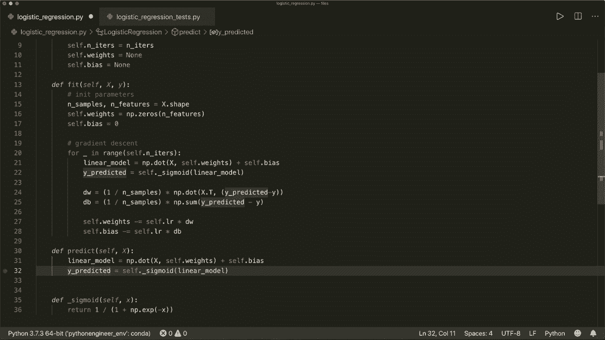

现在，我们想要的就是判断，如果是类别1或类别0。因此，我们查看这个函数。如果它大于0.5，那么就是类别1。如果它小于，就属于类别0。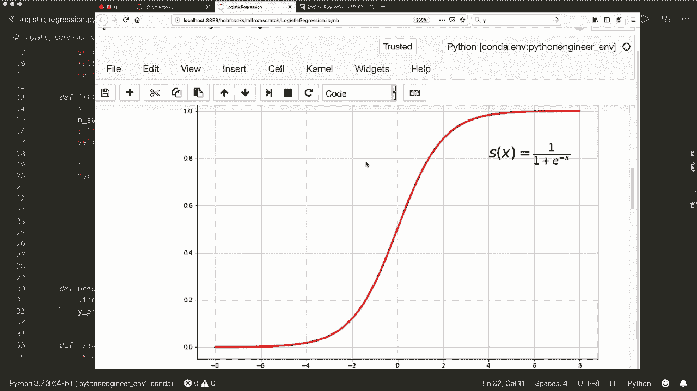

比如说，我们预测的类别。这是对于多个样本的等式。然后我们使用列表推导，如果我们的值大于0.5，则结果为1，否则为0。然后我们对每个概率进行此操作。现在我们得到了0和1，然后我们就返回这个。也就是返回预测的类别。

这就是我们需要的完整实现。现在我们可以测试它了。因此，我已经写了一个小的测试脚本，使用心理学习模块加载一些测试数据。这是乳腺癌数据集。你可以在网上搜索一下。这是一个流行的二分类问题。然后我会将数据分为训练样本和测试样本。

然后我将创建一些逻辑回归模型，从我们刚刚在这里实现的类中提取，并拟合我们的训练数据和训练标签。然后我将进行预测，并预测测试数据的标签。接着我计算准确率。看有多少标签被正确分配。

如果你看过关于K和N算法的视频，那么你已经见过这个。现在让我们运行它。所以，在这里。出现了意外的关键字参数学习率。嗯。哦，抱歉。我将其称为L R。这是迭代次数。让我们再次运行它。然后我们看到我们的准确率是0.92，或者几乎93%的测试数据被正确分配。

所以我们看到它运行得很好。希望你喜欢这个教程，下次见，再见！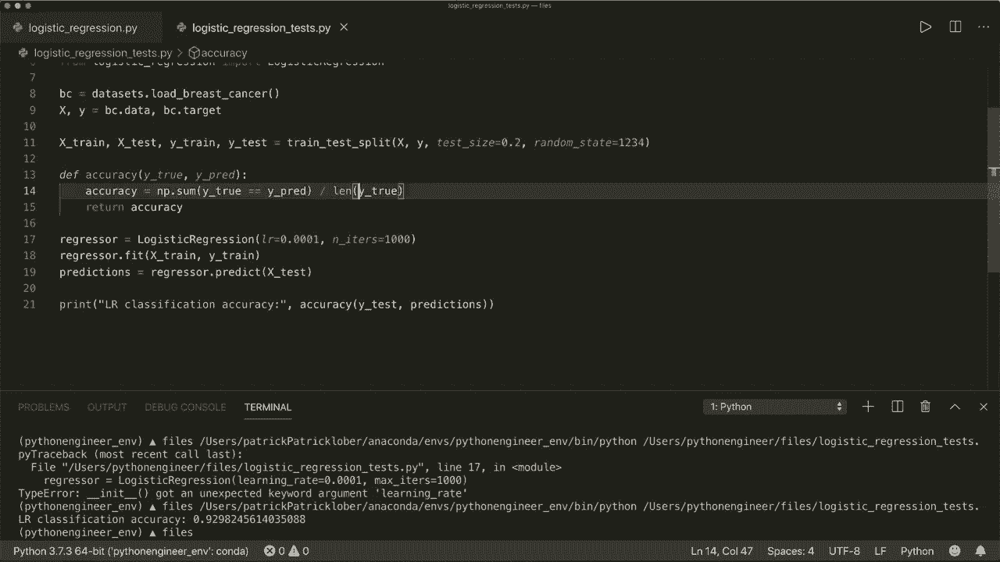
