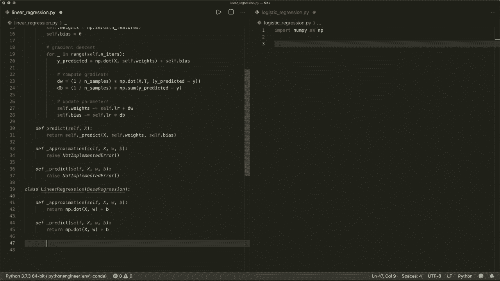
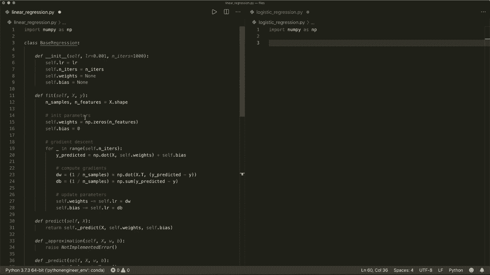

# 【双语字幕+资料下载】用 Python 和 Numpy 实现最热门的12个机器学习算法，彻底搞清楚它们的工作原理！＜实战教程系列＞ - P5：L5- 回归重构 - ShowMeAI - BV1wS4y1f7z1

大家好，欢迎来到你的新Python教程。在这个视频中，我将简单地重构前两个视频中的代码。如果你还没有观看关于线性回归和逻辑回归的前两个视频，请先去看。所以现在如果你比较代码，你会发现它们几乎相似。

所以这两个类的`in it`方法完全相同。两个类的`fit`方法也几乎相同。所以在这两个类中，我们在`in it`中传入参数，然后执行相同的梯度下降。除了在线性回归中，我们仅有这个线性模型来逼近y，而在逻辑回归中，我们也有这个线性模型，但随后我们还应用sigmoid函数。

同样的差异出现在预测方法中。所以在线性回归中，我们简单地应用线性模型，而在逻辑回归中，我们应用线性模型，然后是sigmoid函数，接着判断它是1还是0。我们有一个辅助函数。但很多代码是相似的。所以让我们进行重构。然而。

让我们创建一个基类，称为`base.Regression`，我们的两个类将从这个基回归派生。所以我们说，线性回归从基回归派生，逻辑回归也是如此。然后我们可以切分`init`方法，将其放入基回归中，因为这对两者都是相同的。所以，让我们在这里切分这个。

然后我们也切分`fit`方法。这几乎是相同的。所以我们在这里不需要这个，放到上面去。嗯，现在唯一需要不同的是`why predicted`，因为有时我们仅需要线性模型，有时我们需要线性模型和sigmoid函数。所以让我们创建一个辅助函数，称为`_approximation`。

这将获取我们的数据X，或样本，然后它还会获取权重和偏置。在我们的基类中，我们将引发一个未实现的错误。所以这必须在派生类中实现。现在在线性回归类中，让我们也创建这个。在这里我们将实现它，并在我们的线性回归模型中。

这简单就是线性模型，所以我们可以返回它。返回`x`和`W`的点积加上偏置。然后，我们还需要，嗯，或者我们可以切分。将逻辑回归方法中的`fit`方法提取出来并实现逼近方法。所以在这里，让我们复制这个。是哦。因此，让我们记住我们需要线性模型，然后应用sigmoid函数。

所以让我们切分这个。并创建我们的`_U`逼近方法，参数为`self`，`X`，`W`和偏置。然后我们创建我们的线性模型，表示为`nuy.Dot.X.W.Plus`偏置。然后我们应用sigmoid函数并返回它。所以让我们返回`self.dot._sigmoid`的线性模型。这是逼近值。

现在，预测方法有点不同，所以。让我们。在我们的基类中，定义这个预测方法。嗯。在这里我们将实现一个辅助函数，并称之为`underscore_predict`，它将获取`self.X`和`W`以及`B`。在基类中，我们将简单地抛出一个未实现的错误。所以这必须在派生类中实现。

所以我们在基类的`Predict`方法中调用并返回这个。让我们返回`self.underscore_predict`，并使用测试样本。现在，我们有了计算出的权重和偏差。在我们的线性回归类中，我们定义这个`underscore_predict`，它将获取`x`。

`W`和偏差。所以，在这里，它将获取。所以这将是相同的代码。点积。`x`和`w`的点积加上偏差。我们可以在这一行返回它。所以我们不需要这个。在逻辑回归中，我们将其定义为`underscore_predict`，带有`X`、`W`和`B`。然后我们在这里有相同的代码。所以我们使用`W`和`B`，然后应用sigmoid函数。

定义它是1还是0并返回。现在，我们可以将这个复制到这里，并放在同一个文件中。

然后我们完成了。所以现在我们有两个模型，线性回归和逻辑回归，仅用60行Python代码。看起来干净多了。那么，是的，这就是全部。希望你喜欢这个教程，下次见，拜。😊！

