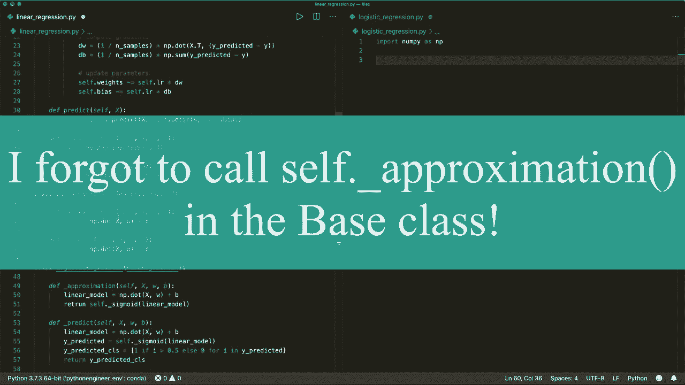

# 【双语字幕+资料下载】用 Python 和 Numpy 实现最热门的12个机器学习算法，彻底搞清楚它们的工作原理！＜实战教程系列＞ - P5：L5- 回归重构 - ShowMeAI - BV1wS4y1f7z1

Hi everybody。 welcomelcome to your new Python tutorial。 And this video。

 I will simply refactor the code of the last two videos。

 So if you haven't watched the previous two videos about linear regression and logistic regression。

 then please do so。So now if you compare the code， then you will see that is almost similar。

So both classes have exactly the same in it method。And both have almost the same fit method。

 So in both classes， we in it our parameters， and then we do the same gradient descent。

 except that in the linear regression， we have simply this linear model for our approximated y and in logistic regression。

 we also have this linear model。 But then we also apply the sigmoid function。

And the same difference is in the predict method。 So in linear regression。

 we simply apply the linear model。 and in logistic regression。

 we apply the linear model and then the sigmoid function。 and then say if it's 1 or 0。

And we have this help a function。But a lot of this code is similar。 So let's refactor this。 And yet。

 let's create a base class and call it base。Regression and our two class classes will be derived from this base regression。

 So let's say。Linear regression derived from base regression。

And the same for our logistic regression。And then we can cut the init method。

And put it in the base regression， because this is the same for both。So， let's cut this here。

And then we also cut the fit method。So this is almost the same。 So we don't need this here。

And put it up here。嗯。The only thing now that we have to。That is different is the why predicted。

 because one time we need simply the linear model and one time we need the linear model and the sigmoid function。

So let's call let's create a helper function and call it underscore approximation。

 which will get our data X， or samples， and then it also gets the weights and the bias。

 and in our base class， we will raise a not implemented error。

 So this have has to be implemented in the derived classes。 So now in the linear regression。嗯。Class。

 let's also create this。 And here we will implement this。 and in our。Linear regression。Model。

 this is simply the linear model。 so we can return this。

Return the do product of x and W plus the biasers。And then， we also have to。嗯。OrWe can cut。

The fit method from our logistic regression method and implement the approximation method。 So here。

 let's copy this。是哦。So all let's remember that we need to have the linear model and then apply the sigoidoid function。

 So let's cut this。And let's create our underscore。U。Exximation method with self。X， W， and the bias。

And then we create our linear model， which is nuy。Dot。X。W。Plus， bias。

And then we apply the sigmoid function and return it。

 So let's return self dot underscore sigmoid of our linear model。So this is the approximation。

 And now the predict method is a little bit different， so。Let's。In our base class， let's。

Toine this predict method。嗯。And here we will implement a。Help her function， and we call it。Undercore。

 predict。Which will get self X and also W and B。 And also in the base class here。

 we will simply raise a not implemented error。 So this now has to be implemented in the derived classes。

 So we call and return this in our。Predict method in the base class。

 So let's return self dot underscore， predict。 and with the test samples。

 And then now with our calculated weights and the calculated bias。

And now in our linear regression class， we define this underscore predict， which will get x。

 W and bias。So， and here， it will get。So this will be the same code。So。The dot product。

 dot product of x and w plus the bias。 And we can return this in this line。 So we don't need this。

And then also， in the logistic regression， we。Deine this as underscore， predict with X， W and B。

 And then we have the same code here。 So we。Use W and B， then apply the sigoid it。

 Define if it's  one or 0 and return it。And now， we can。

Coopied this here and put it in the same file here。

And then we are done。 So now we have two models， the linear regression and the logistic regression。

 just in 60 lines of Python。 And it looks much cleaner now。 So， yeah， that's it。

 I hope you enjoyed this tutorial and see you next time， bye。😊。

