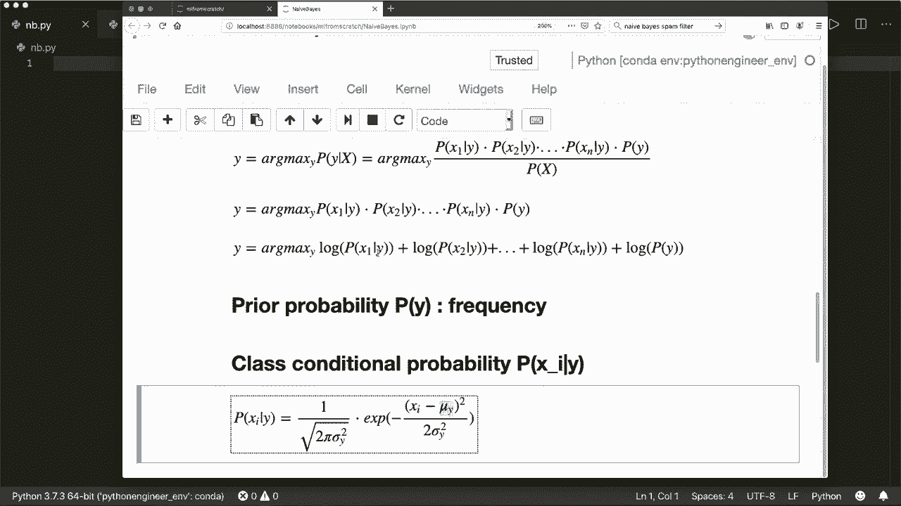
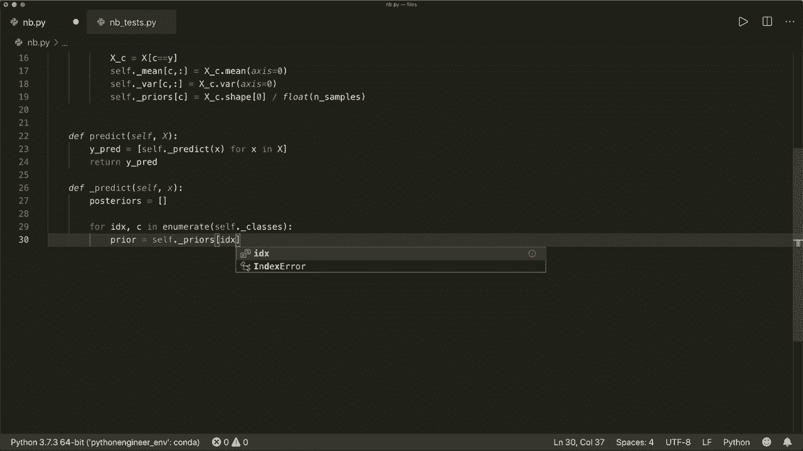
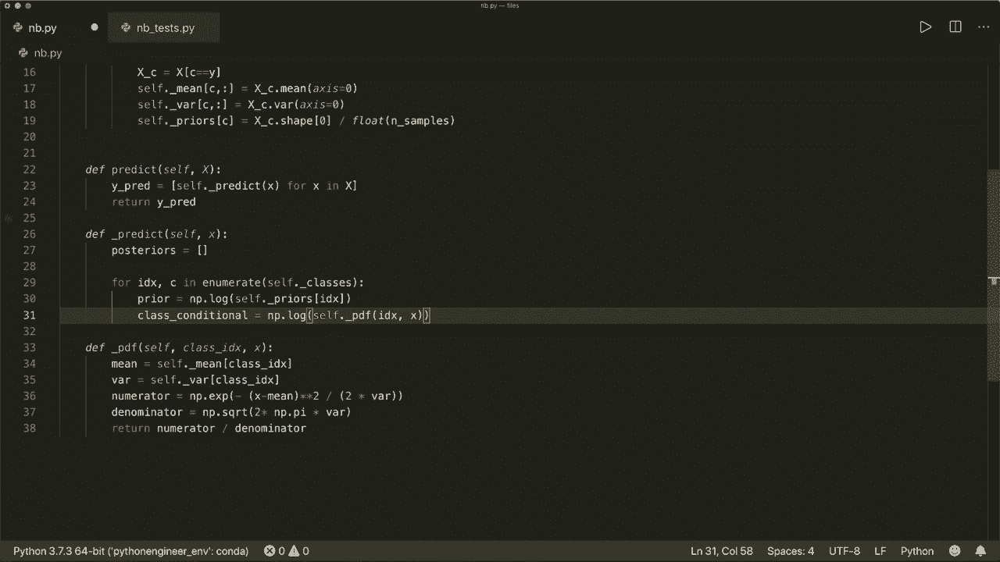
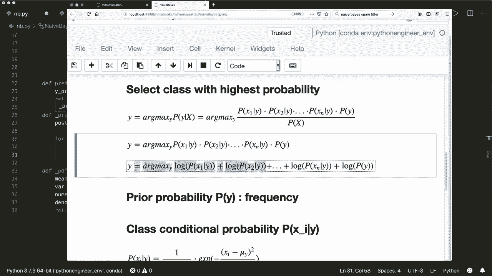
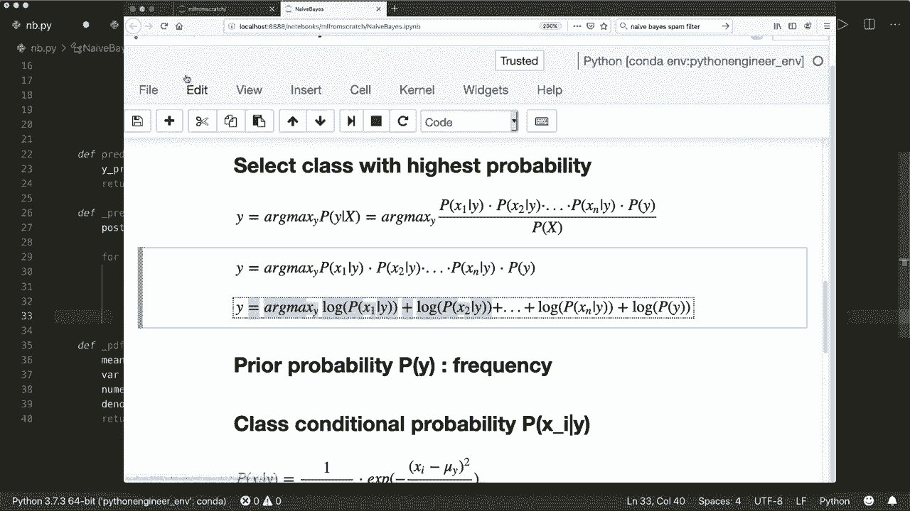
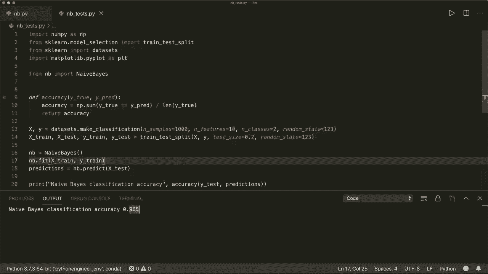

# 【双语字幕+资料下载】用 Python 和 Numpy 实现最热门的12个机器学习算法，彻底搞清楚它们的工作原理！＜实战教程系列＞ - P6：L6- 朴素贝叶斯 - ShowMeAI - BV1wS4y1f7z1

Hi， everybody。 Welcome to a new machine learning from scratch tutorial。 Today。

 we are going to implement the naive by classifier using only built and Python modules and Ny。😊。

So the naive bias classifier is based on the biaseth theorem， which says that if we have two events。

 A and B， then the probability of event A， given that B has already happened。

 is equal to the probability of B， given that A has happened。

 times the probability of a divided by the probability of B。And if we apply this to our case。

 then our formula is the probability of y of our class Y。

 given the feature vector X is equal to the probability of x given y times P of y divided by P of x。

And where x is our feature of vector， which consists of several features。

And now it's called naive by years because now we make the assumption that all features are mutually independent。

 which means， for example， if you want to predict the probability that a person is going out for a run。

Given the feature that the sun is shining and also， given the feature that the person is healthy。

Then both of these features might be independent， but both contribute to this probability that the person goes out。

So in real life， a lot of features are not mutually independent。

 but this assumption works fine for a lot of problems。And with this assumption， we can split。This。

Probability into the and use the chain rule。 So we calculate the probability for each。Feature。

Given why and multiply each。And then we multiply it with p of y and divided by p of x。And by the way。

 this P of y given x is called the posterior probability。

 P of x given y is called the class conditional probability。

 and P of y is called the prior probability of y， and P of x is called the prior probability of x。

And now we want to make a classification。 So given this posterior probability。

 we want to select the class with the highest probability。 So we choose y， which is the arc max of y。

Of this posterior probability。And now we can apply our formula。

 And since we are only interested in Y， we don't need this P of x so we can cross this out。

 And then our formula is this， so。Why is the arc max of。

And then we multiply each class conditional probability， and then the prior probability。

And then we use a little trick。Since all these values are are probabilities between 0 and 1。

 So if we multiply a lot of these values， then we get very small numbers。

 and we might run into overflow problems。 So in order to prevent this， we apply the lock function。

 So we apply the lock for each of these probabilities。

 and with the lock or the rules for logarithmuss， we can change the multiplication sign into an a plus sign。

 So now we have an addition here。And now we have this formula that we need。

 and now we need to come up with this。AP probability， So the prior probability is just the frequency。

We can see this in a second。 And then what is this class conditional probability， P of x given y。

And here we model this with a gausian distribution。 So here we can see the formula。

 So this is one over。 and then the square root of2 pi times the variance of y。

Times the exponential function of minus x minus the mean value squared divided by two times the variance。

And here we see a plot of the Gaussian function for different means and variations variances。

So this is a probability that is always between0 and one and。Yeah， with this formulas。

 this is all we need to get started。 So now we can。

Start and implement it。 And first of all， of course， we import Ny S N P。

And then we create a class called naive。But is。And it doesn't need an in it method so we can implement the fit method first。

 so we want to fit training data and training labels。

 And then we also want to implement a predict method。

So here we predict the test labels or test samples。And now let's start。

 So let's start with the fit method。 So what we can do here。

Is so we need the priors， and we can calculate them in this fit method。

 and we need the class conditional。 So here we need the mean for each class and the variance for each class。

 So we can also calculate these。

So let's do this。 So let's get the number of samples and the number of features first。And by the way。

 our input here， the X is a nuy N D array where the first dimension is the number of samples。

 and the second dimension or the number of rows is the number of samples and the number of columns is the number of features。

 so we can unpack this and say this is x dot shape。And our y is a 1 D row vector also of size。

 the number of samples。 So this is our input。 And now let's get the unique classes。

 let's say self classes equals nuy unique of y。 So this will find the unique elements of an array。

 So if we have two classes，0 and 1。 then this will be an array。Just with 1，0 and 1 y in it and1。

1 in it。Then let's say the number of classes equals。🤢，The length of this self。Classes。And now。

 let's in it or。In it mean。Variarianance and priors。 So let's say self dot mean equals。

 And we want to in them with zeros at first。 And it gets the size。

 It has number of classes and number of features as tuple here。 So it also。For each。Class。It has。

The same number of。Or for each class。We need。Means for each feature。

And we want to get this or give this a data type of float nuy dot float 64。

And we want to do this with the same for the variances。 So let's say self do。玩儿。Equals this。

 And then we want to do self dot。Priers equals N dot zeros。 And here for each class。

 we want one prior。 So this is just a 1 D vector of size number of classes with a data type of N dot float 64。

And now let's calculate them。 So for each class in self dot classes， we。Now。

 only we only want the samples that has this class as labels。 So let's call this X， C equals X。

 and then where。C equals equals。Why。And now we can calculate the mean for each class and fill our self do mean。

 So we want to fill。This。Row and all columns here。 And we say， this is x。X， C。

 dot and nuly has a or a N D。Aray has to built in mean functions。 So we can say mean along the axis0。

 So please check the mean。Function for yourself。And we want to do the same thing for var。

 So self var in this row for each column。Is X C dot var。 So Numpy also has a var method。

And then we calculate the prior， So self。Friers。Of this class。Is equal to。 And now。

 what information do we already have。If we have the the training samples and training labels。

 so we can say the prior probability that this class will occur is equal to the frequency of this class in the training samples。

So， we say。We get X， C。The shape。0， so only。This will get the number。Of samples with this label。

And then we divide it by the number of total samples。 So。

 and we have to convert this to a float because we don't want integers here。

 So let's say float number of samples。So this is the frequency。 How often this class C is occurring。

And now this is all for our fit method。 And now let's implement the predict method。 So and for this。

 we create a little helper method。 So let's call this underscore predict self。

 and this will only get one samples。 So here we have we can have multiple samples。

 So here we say why predict equals and then we use list comprehension。And called this underscore。

 predict method。For only one sample。 And then we do this for each sample in our test samples。

And then， we return them。And now we have to implement our underscore predict method。So here。

 what we need now is we need。

To apply this function。So。We have to calculate the posterior probability。And calculate the。

Class conditional and the prior for each one。 And then choose the class with the highest probability。

So let's create an empty list called posteriors。Equals an empty list。

And now let's go over each class。So let's say for index and C in。Enumerate。Self dot classes。

 So here we get also the index。And the class ladle， with this enumerate function。And now we can say。

First， we get the pia。 So the pia equals， and we already have calculated the p。 So this is。

The prior of self dot。Priers。With this in current index。

And now， as I said， then at the end， we apply the lock function。 So let's apply this right here。

 So let's say NP P dot lock。

And then create the posterior。So， the posterior equals。on， let's call this。Class。Conditional。Equals。

And then we apply the gause functions。 So for this。

 let's create this helper function and call this probability density function。With self。

 And then it gets。The class index。And then it gets x。And here we apply this formula here。

So we need the mean and the variance。And then。嗯。Apply this function。 So， first of all。

 let's get the mean equals。 and we already have the mean。 so we can say self。

Mean。Of this class index and also the variance equal self。Vre of this class index。

And then let's create a de numerator， which is equals to nuumpy dot x。So。

 the exponential function of minus。And then we have x minus mean。To the power of two。Divided by。

And then， two times。The variances。And then， we have the。Dnominator， sub denominator equals。

And here we have N dot。S。Co are Ts over the square root of。Two times。 And we have pie。

 We can also get this from Nami， and Peter pie。Times theva， and then we return。Nummerator。

 divided by。Do you know me Na。So this is our probability density function。

 And then we can say our class conditional。Is。嗯。Self。Dot。Probability density function of our index。

And x。And then。嗯。We want to。We want to have the logo rimore。 So we have says N dot lock。And then。

We sum all of them up。

So， we can use。Nampy dot some of this。嗯。And then we say our post。Tior equals。Pya， plus。

The class conditions。Our class conditional。And then we have penned them to our posterior。

 So posteriors dot append posterior。

And now we use or we apply the arc max of this and choose the class with the highest probability。

 So Ny also has a arc max function。 So this is very easy， so we can now say return self dot。

Classes。Off， and the index is now。这。Index of the。Poeriors with the highest。Probability。So we can say。

 N dot Arc max。Of this poster。And now， we are done。So this is the whole implementation。And。

Now we can run it。 So I already have a little。Test script where I use the p Psych could learn library to load a data set and create a data set with 1000 samples and 10 features for each sample。

 And we have two classes。 Then we split our data into training and testing samples and the labels。

Then we create our naive bias classifier， which I import from this file。That I have here。

And then I fit the training data and the training labels。

 and then I predict get the predictions for the test samples。And then I will calculate the accuracy。

 So let's run this and see if this happen， if this is working。So yet，'s working。

 And we have a classification accuracy of 0。96。 So pretty good。So yeah， that's it。

 I hope you enjoyed this tutorial and see you next time， bye。

