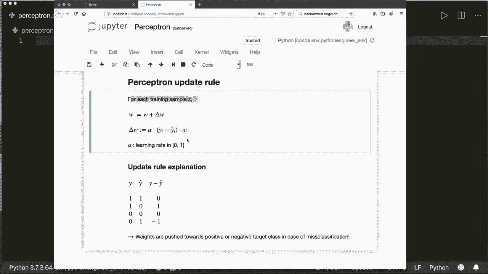
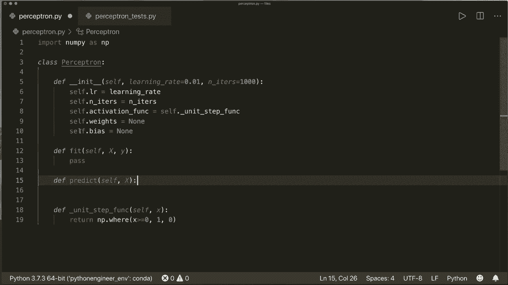
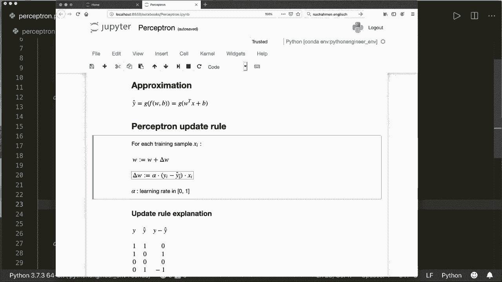
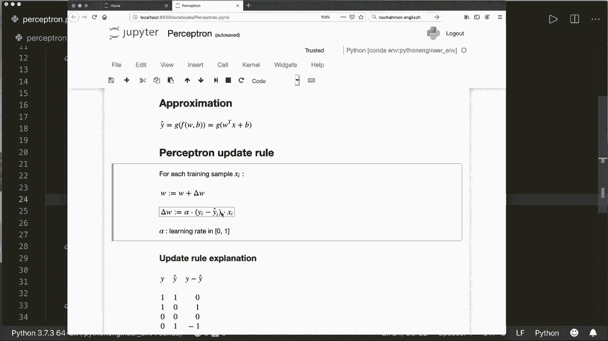
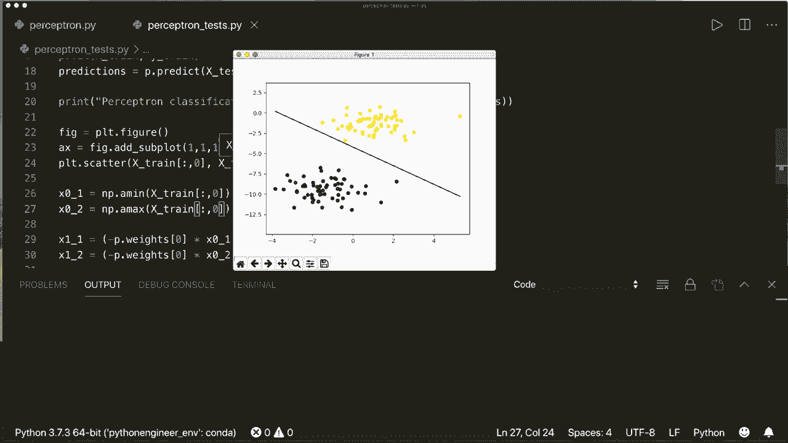

# 【双语字幕+资料下载】用 Python 和 Numpy 实现最热门的12个机器学习算法，彻底搞清楚它们的工作原理！＜实战教程系列＞ - P7：L7- 感知器 - ShowMeAI - BV1wS4y1f7z1

大家好，欢迎来到新的从零开始的机器学习教程。今天，我们将仅使用内置和Python模块实现一个感知器。感知器可以看作是人工神经网络的一个单元。因此，感知器是生物神经元的简化模型。

它模拟了仅一个细胞的行为。让我们看看这个图像，我们有一个细胞。我们的细胞接收输入信号，这些信号经过加权并相加。如果整个输入信号达到某个阈值，我们的细胞就会发出信号并提供输出。在我们的例子中，它要么发出1，要么发出0。😊

现在如果我们从数学上建模，那么看起来是这样的。我们有输入特征，它们与一些权重相乘并相加。然后我们应用一个激活函数，得到我们的输出类别。这就是模型，线性部分，线性模型看起来就是这样。

这只是一个线性函数。W的转置乘以x加上B。在这里，我们将权重和偏置相乘并相加。因此，偏置是这个图中的W 0。在这个线性模型之后，我们应用激活函数。在最简单的情况下，我们使用所谓的单位阶跃函数。它被定义为如果我们的输入达到某个阈值，则输出为1，否则为0。在这个图中，阈值是0。因此，如果输入大于0，则输出为1，否则为0。现在这就是我们建模输出所需的全部。最终的输出看起来是这样的。

首先，我们应用线性函数，然后应用激活函数。现在我们需要设定权重和偏置。为此，我们使用一个简单的更新规则，称为感知器规则。我们查看每个训练样本X I，然后对每个训练样本应用更新步骤。

这被定义为新权重等于旧权重加上增量权重，而增量权重或delta W被定义为alpha乘以实际标签减去预测标签乘以训练样本X。这里的alpha是介于0和1之间的学习率。所以这只是一个缩放因子。现在让我们看看这个更新意味着什么。

让我们看看在两个类别问题中可能出现的四种情况。我们的输出可以是1，实际标签可以是1，而预测标签也是1。那么差异为0。因此，我们在这里的权重没有变化。如果实际类别是0，而预测类别也是0，同样也是正确分类，差异为0。因此，权重没有变化。

但现在如果我们有误分类会发生什么。所以如果实际类别是 1，预测类别是 0。这意味着我们的权重太低。然后我们看到差值是 1。因此我们的权重在这里被增加。如果实际类别是 0，预测类别是 1。那么我们的权重就太高了。

我们看到差值是 -1。因此我们的权重被减少。因此，在误分类的情况下，权重朝着正类或负类移动。这是一个简单直观的规则，但它有效。这就是我们所需的一切。因此，我们查看每个训练样本，然后应用更新规则。

然后我们执行几次。因此我们迭代一定次数。然后我们就有了最终权重，完成了。这就是我们需要知道的一切。现在我们可以开始实现它。

首先，我们当然使用 numpy。因此我们导入 numpy S 和 P。然后我们创建一个类并称之为感知器。感知器。它有一个固有的方法，当然。这里它有自我，并获得学习率。我将默认值设为 0.01。然后它获得一个迭代次数。所以 n 次。我也会给这个一个默认值。

假设 1000。然后我会简单地存储它们。因此我会说 self.dot.L R 等于学习率，self.dot.n.其 equals，和其。然后我们创建激活函数。因此假设 self.dot.activationation fun。等于，现在让我们在这里创建它。正如我所说，激活函数就是单位阶跃函数。因此我们称之为。Unit step。Fk。

有了自我和输入 X，以及。我们可以简单地说如果 x 大于或等于 0，则返回 1，否则返回 0。但。我们稍后会看到，这只对单个样本有效，但我们稍后会看到，我们希望在预测方法中对所有测试样本应用激活函数。因此，我们也希望对 N D 数组应用这一点。为了这一点。

我们可以使用一个简单的函数，称为 numpy.dot.where。因此我们返回 nuy.dot.where。这将获取一个条件。因此 x 大于或等于 0。如果条件为真，那么我们返回 1，否则返回 0。因此这将对单个样本有效，但也对一个向量中的多个样本有效。因此现在这是我们的激活函数。

现在我们可以说 self.dot.activationation fun 等于 self.dot.unit step fun。现在让我们创建权重。说 self.dot.weights 等于 none，self.dot.Bs 等于 none。因此现在我们知道必须实现它们。或者获取它们。现在我们实现两个函数。和往常一样，我们实现 fit 和 predict 方法。因此首先。定义 fit 方法，带有 X 和 y。

因此，这获取训练样本和训练标签。然后，当然，哦。我忘了这个 self。然后，我们。还定义了。预测方法，它获取 self。然后是测试样本。现在我们开始。使用这个预测方法，因为这非常简单。

让我们再次查看我们输出的近似值。这里首先。我们应用这个线性函数，然后是激活函数。我们开始吧。所以首先，线性函数。假设是linear。

输出等于。这是w转置乘以x加上偏置，而W转置乘以x不过是点积，所以我们可以使用np.dot。off。X和self dot。self dot weights加上self dot bias。现在我们有了线性函数，接下来我们应用激活函数。所以我们说y预测等于self dot激活函数。

作为输入，它获取这里的线性输出。然后我们简单返回y预测。这就是整个预测方法。现在让我们跳到拟合方法。首先，我们获取x向量的维度。这是一个大小为M乘N的N维数组，其中M或行数是样本数，N或列数是特征数。所以我们说N样本和N特征等于x dot shape。现在我们初始化我们的权重。

我们必须给它们一个初始值，我们可以简单地将它们设置为0。所以我们说self dot weights等于nuy dot zeros。大小为特征数。所以对于每个特征，我们在这里放一个0作为我们的权重。而且，偏置，简单为0。现在我们可以开始，还有一件事我们要做的是确保我们的y只包含类别0和1。

所以我们假设Y下划线等于。现在我们将所有值转换为0或1。如果情况并非如此。我们使用列表推导式来实现。所以我们说如果i大于0则为1，否则为0，针对y中的i。现在将其转换为Ny数组。所以。现在，我们有了我们的Y，现在可以开始训练。

所以我们再次查看这个更新规则。我们希望查看每个训练样本，并且我们还想进行几次迭代。所以我们这里需要两个、四个循环。我们假设第一个循环是下划线，因为我们在范围内不需要这个self dot和它的。

🤢。

这是我们定义的迭代次数，然后是我们的第二个循环。为此，我使用了enumerate方法，所以我可以说四个。索引和X，Y在。enumerate X中。所以我想遍历训练样本，enumerate函数将给我索引以及当前样本。这是我们的两个循环，现在。

抱歉。让我们应用。这个更新规则。所以，再次。我们必须计算预测值然后应用更新。我们假设线性输出等于nuy dot of。

当前样本。还有我们的 self，那等待。加上 self 的偏置。然后我们应用激活函数并得到预测值。所以 y 预测等于 self.dot.activation_function 的线性输出。因此在这种情况下，我们只为一个样本使用它。

在 predict 方法中，我们对多个样本使用激活函数。这就是为什么我们在激活函数中需要这个 nuy 的原因。所以是的。现在继续。现在我们有了预测的 y。现在我们再看看公式。所以我们有学习率乘以差值。

然后，乘以 x。所以。我们称这个更新为 self.dot.learning_rate 乘以。这里我们有实际的。标签，所以 y_下划线 当前索引 减去 y 预测。然后。我们说 self.dot.weights 加上等于更新乘以 X，我。和 self.dot.bias 加上等于更新乘以 1。所以我们不需要这个乘以 1。现在我们完成了。

这就是感知器的整体实现。现在让我们测试一下。所以我在这里写了。我已经写了一个小测试脚本，所以我在这里导入感知器。然后我会创建两个。两个 blops。所以我可以使用 SK learn 模块中的一个叫 make blops 的函数。这将创建两个类别。

然后我将把数据分成训练样本和测试样本，以及训练标签和测试标签。然后我将创建一个感知器。我会拟合训练数据。然后我将预测测试标签。然后我将计算准确率。还会绘制这个。所以让我们运行它。我希望我没有忘记任何事情。

现在这是绘图。因此我们看到我们的两个 plotlops。在这里我们有我们的线性决策边界。这是我们的感知器生成的决策函数。我们看到它完美地分开了我们的两个类别。所以，我们也看到我们的准确率是 1。在这种情况下是完美的。是的。

我们看到感知器可以工作。我们需要注意的一点是，感知器仅适用于线性可分的类别。所以如果类别可以用线性函数分开，比如在我们的案例中。我们再看一下这个。那么它工作得非常好，但否则效果就不那么理想。为了进一步改善，我们可以尝试不同的激活函数。例如。

sigmoid 函数，然后应用梯度下降方法，而不是感知规则来更新我们的权重。不过，现在我想展示的应该就是这些。我希望你喜欢这个教程，下次再见，拜拜。
