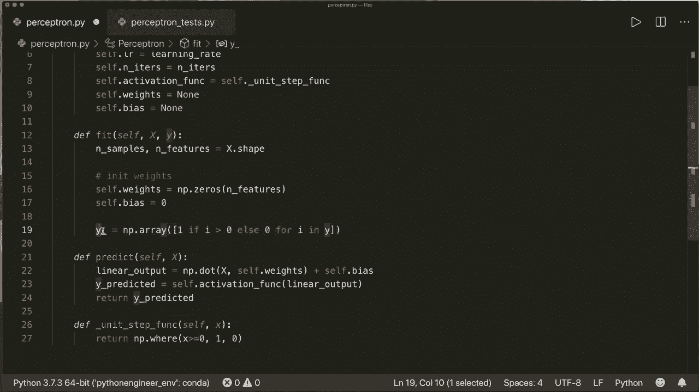
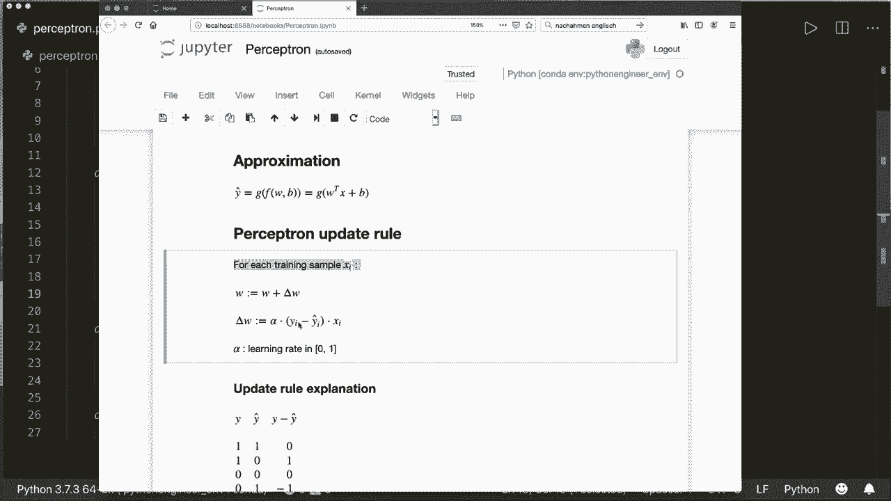
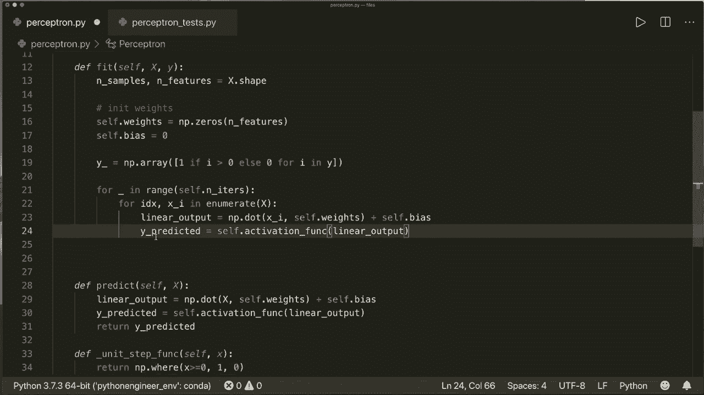

# 【双语字幕+资料下载】用 Python 和 Numpy 实现最热门的12个机器学习算法，彻底搞清楚它们的工作原理！＜实战教程系列＞ - P7：L7- 感知器 - ShowMeAI - BV1wS4y1f7z1

Hi， everybody。 Welcome to a new machine learning from scratch tutorial。 Today。 we are going to implement a perceptron using only built and Python modules and Ny。 The perceptron can be seen as one single unit of an artificial neural network。 So the perceptron is a simplified model of a biological neuron。

 and it simulates the behavior of only one cell。 So let's have a look at this image here。 we have one cell。 and our cell gets an input， so it gets input signals。 and they are weighted and summed up。 And if the whole input signal then reaches a certain threshold。 Our cell fires a signal and delivers an output。 So in our case， it either fires a1 or a0。😊。

And now if we model this mathematically， then it looks like this。 so we have our input features and they are multiplied with some weights and then summed up。 and then we apply an activation function and get our output class。So this is the model and now the linear part， the linear model simply looks like this。

 so this is just a linear function。W transpose times x plus B。 So here we multiply and sum up our weights and the bias。 So the bias is the W 0 here in this picture。And after this linear model。 we apply the activation function。And in the simplest case。 we simply use the so called unit step function。 and this is defined as it's either one if our input reaches a certain。 a certain threshold or serial otherwise。So in this picture， the threshold is 0。 So if the input is larger than 0， then the output is one。 and otherwise， it's 0。And now this is all we need to model the output。 And now the whole output is looks like this。

 So first， we apply the linear function， and then we apply the activationation function。And now we have to come up with the weights and the bias。 and for this。 we use a simple update rule that is called the Perceptron rule。So we look at each training sample X I， and for each training sample， we then apply the update step。

 and this is defined as the new weight is the old weight plus the delelta weight and the deelta weight or delta W is defined as alpha times the actual。Label minus the predicted label times the training sample X。 and here alpha is a learning rate between 0 and1。 So this is just a scaling factor。And now let's have a look at what this update will mean。

 So let's have a look at the four possible cases in a two class problem。 So our output can be one。 the actual label can be one and the predicted。Label is also one。 Then the difference is 0。 So we have no change for our weights here。And the same is if the actual class is 0 and the predicted class is also 0。 so correctly classified and the difference is 0。 And again， no change for our weights。

 But now what happens if we have a misclassification。 So if the actual class is one and the predicted class is 0。 this means that our weights are too low。 and then we see that the difference is one。 So our weights are increased here。 And if the actual class is 0， and the predicted class is 1。 then our weights are too high。

 and we see that the difference is-1。 So then our weights are decreased。 So the weights are pushed towards the positive or negative class in case of a misclassification。And this is a simple and intuitive rule， but it works。And this is all we need。 So we look at each training sample and then apply the update rule。

 and then we do this a couple of times。 So we iterate for a certain number of iterations。 and then we have the final weights and are done。 So this is all we need to know。 and now we can get started and implement it。

So， first of all， of course， we use numpy。 So we import numpy S and P。 And then we create a class and call it perceptron。Perceptron。And it gets an innate method。 of course。And here it has self。 and it gets the learning rate。 And I will give this a default of 0。01。 Then it gets a number of iterations。 So n its。 And I will also give this a default。

 Let's say 1000。 Then I will simply store them。 So I will say self dot L R equals learning rate and self dot n。Its equals， and its。Then we create a the activationation function。 So let's say self dot activationation fun。Equals， and now let's create this here， and。As I said。 the activation function is simply the unit step function。 So let's call this。Unit step。Fk。

With self and an input X， and。We could simply say return one。 if x is larger or equal than 0 and else return 0。But。We see later that we。 this would only work for one single。Sample， but we see later that we want to apply the activation function in the predict method for all the test sample。 So we want to apply this for a N D array as well。 And for this。

 we can use a simple function that is called numpy dot where。 So we return nuy dot where。 And this will get a condition。 So x is larger or equal than 0。 And if the condition is true。 then we return one and otherwise 0。So this will work for one single sample。 but also for multiple samples in one vector。So now this is our activation function。

 So now we can say self dot activationation fun equals self dot unit step fun。And now let's also create the weights。 say self dot weights equals none and self dot。Bs equals none。 So now that we know that we have to implement them。Or get them。 And now we implement two functions。 As always， we implement the fit and the predict method。 So first。Define the fit method with X and y。

 So this gets the training samples and the training labels。And then， of course， oh。 I forgot this self。And then， we。Also， define the。Predict method， which gets self。 and then the test samples。 And now we start。With this predict method， because this is very simple。

Let's have a look at the approximation of our output again。 So here first。 we apply this linear function and then the activation function。So let's do this。 So first。 the linear functions。 So let's say linear。

Output equals。 and this is w transpose times x plus the bias。 and W transpose times x is nothing else but the dot product。 so we can usempie dot。off。X and self dot。Self dot weights plus self dot bias。 So now we have the linear function。 and now we apply the activation function。 So we say why predict equals self dot activation function。

And as in input， it gets the linear output here。 And then we simply return the y predicted。 So this is the whole predict method。 And now let's jump to the fit method。 So first of all。 let's get the dimensions of the x vector。 So this is an N D array of size M times N where M or the number of rows is the number of samples and N or the number of columns is the number of features。So we say N samples and N。Features equals x dot shape。And now we in it our weights。

 we have to give them an initial value， and we can simply set them to 0 in the beginning。 So we say self dot weights equals nuy dot0s。Of size， number of features。 So for each feature。 we put a0 here for our weight。And also， our， the bias， this is simply 0。And now we can start or one more thing we have to do is we want to make sure that our y only consists of classes 0 and1。

 so let's say。Y underscore equals。 And now let's convert all the values to 0 or one。 If this is not already the case。 So we use list comprehension for this。 So we say one if I is larger than 0 else， it's 0，4 I in y。And now let's convert this to Ny array。So。 now， we have our。Why， and now we can start the training。

 So let's again have a look at this update rule。 So we want to look at each training sample and we also want to do this a couple of iterations。 So we need two， four loops here。 So let's say the first one for underscore because we don't need this in range self dot and its。

🤢。

So this is the number of iterations we defined。 and then our second loop。 And for this。 I used the enumererate method， so I can say four。Index and also X， Y in。En nuerate X。 So I want to iterate over the draining。Lmb training samples and the enumererate function will give me the index and then also the current sample。So these are our two loops， and now。

Sorry。Let's apply。This update rule。 So let's， again。 we have to calculate the predicted value and then apply the update。 So let's say the linear output equals nuy dot of。

The current sample。And ourselves， that awaits。Plus， the self of bias。Then we apply the activation function and get the predicted value。 So why predict equals self dot activation function of the linear output。 So here we can see that in this case， we use it for only one sample。

 And here down in the predict method， we use the activation function for multiple samples。 And that's why we need this nuy where function here in our activation function。So yeah。 and now let's continue。 So now we have our predicted y。 and now let's have a look at the formula again。 So we have the learning rate times the difference。

And then， times x， so。Let's call this update equals self dot learning rate times。 And here we have the actual。Label So y underscore of this current index minus y predict that。And then。We say self。Dot weights plus equals update times X， I。And self dot bias plus equals update times 1。 So we don't need this times 1。And now we are done。

 So this is the whole implementation of the perceptron。And now let's test this。 So here I've written。 I've already written a little test script here， so I importpart the perceptron here。And then I will create two。Two blops。 so I can use this from the SK learn module。 I can use a function that is called make blops。 So this will create two classes。

And then I will split our data into training samples and test samples and training。Training labels and test labels。 Then I will create a perceptron。 I will fit the training data。 and then I will predict the test labels。And then I will calculate the accuracy。 and I will also plot this。 So let's run this。And I hope I didn't forget anything。

So now here is the plot。 So here we see our two plotlops。 And here we have our linear decision boundary。 So this is the。Decision function at our perceptron generated。And we see that it separates our two classes perfect here。 So， and we also see that our accuracy is one。 So it's perfect in this case。And yeah。

 we see that the perceptron works。 and one thing that we should be aware of is that the perceptron only works for linearly separable classes。 So if classes can be separated with a linear function， like here in our case。 let's have a look at this again。Then it works very well， but otherwise not so much。And for further improvements means we can try out different activationation functions。 For example。

 the sigmoid function and then apply a gradient， decent method rather than the perception rule in order to update our weights。But yeah， for now， that should be all I wanted to show you。 And I hope you enjoyed this tutorial and see you next time， bye。