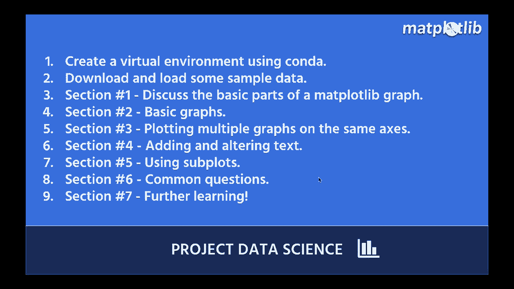

# 【双语字幕+资料下载】绘图必备**Matplotlib**，Python数据可视化工具包！150分钟超详细教程，从此轻松驾驭图表！＜实战教程系列＞ - P1：1）介绍 - ShowMeAI - BV14g411F7f9

欢迎来到另一个项目数据科学教程。这次，我们学习**Maplotlib**，Python中的基础数据可视化库。许多其他流行的Python数据可视化库都是建立在Maplotlib之上的，比如**Seaborn**就是一个立刻想起来的例子。

这就是为什么从Maplotlib开始是一个很好的选择。即使你还想学习其他库，Maplotlib也是一个非常强大的库，你想做的任何事情都可以做到，所以。😊在项目数据科学这里，我们相信你通过实践学习效果最佳。

这就是为什么我们所有的教程都是动手实践的。我们逐步引导你完成所有内容，但你绝对应该自己跟着做。所以如果你还不在电脑前，快去电脑前，准备好进行编码。好了，让我们走过今天你将学习的内容，我们将做什么。

第一步，我们将使用**Conda**创建一个虚拟环境，如果你还没有安装Python或者没有安装Maplotlib。这是我们将帮助你安装的地方。如果你不想在你的电脑上安装它，我们还会向你展示如何使用**Google Colab**，这是一种很好的入门选择。

我们将下载并加载一些示例数据到我们的**Jupyter Notebook**中，接下来的时间我们会在这个Jupyter Notebook中度过，以便让你轻松学习Maplotlib。😊！

然后我们将通过一些不同的部分。我尽量将其逻辑地分解给你。所以第一部分，我们将讨论Mapplotlib图形的基本组成部分。这对新手来说可能会有些困惑，所以我会在这里花一点时间。

帮助你理解图表的不同部分。第二部分，我们将进入一些基本图形，比如折线图、条形图、散点图等。😊第三部分，我们将看看如何在同一坐标轴上绘制多个图形，所以在同一图表上，实际上非常简单。

这非常简单，比如如果你想同时做散点图和折线图。第四部分，我们将看看如何添加和更改文本，比如标题、访问标签等。第五部分，我们将研究如何使用子图。什么是子图？它意味着在不同的小图表区域绘制多个图形。

所以我们将讨论如何做到这一点。而实际上，很多内容会在第6节中提到。因此，我们将在第1至第5节中覆盖基础知识。而第6节将涵盖一些初学者在使用map plotlib时常见的问题。我们也会讨论一些可能在开始时让你困惑的常见用例。

最后，第7节。我不想在视频结束时不给你一些未来学习的机会、资源和一些想法来实现这些目标。所以我们开始吧。😊。
