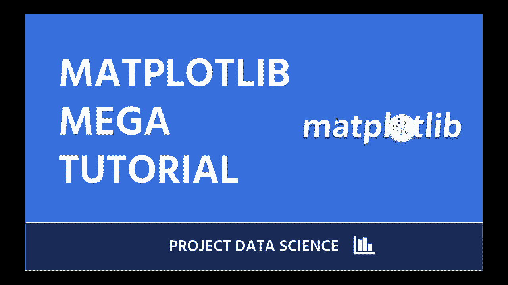

# 【双语字幕+资料下载】绘图必备Matplotlib，Python数据可视化工具包！150分钟超详细教程，从此轻松驾驭图表！＜实战教程系列＞ - P1：1）介绍 - ShowMeAI - BV14g411F7f9

Welcome to another project data science tutorial。 This time， we're learning about Maplloot LibB。 the foundational data visualization library in Python。 Many of the other popular Python data visualization libraries are built on top of Mapllootlib。 actually， like like Seaborn is one that comes to mind immediately。

 which is why starting with Mapllootlib is a great choice。 even if you want to go on to learn those other libraries as well。 And Maplotlib is just a hugely powerful library， Anything that you want to do you can do it， so。😊。Here at Project Data science， we believe that you learn best through doing。

 which is why all of our tutorials are handson。 We walk you through everything step by step。 but you should absolutely follow along on your own。 So if you're not at your computer。 Get at your computer， get ready to do some coding。 Allright。 let's walk through what exactly you're going to learn today。 what we're gonna to do。

 Step number one， we're gonna create a virtual environment using Conda if you don't have Python installed and if you don't have Maplot Lib installed。 This is where we are going to help you install that。 And and if you don't want to install it on your computer。 We're going show you how to use Google coabb， which is a great option for getting started。

 We're gonna download and load some sample data into our Jupyter notebook and we're gonna to be spending the rest of our time in that Jupiter notebook to make it nice and easy for you learning Mapllootlib。😊。

And then we're going to go through some different sections。 So I tried to break this down for you as logically as I could think to do。 So section number one。 we're going to discuss the basic parts of a map plotlib graph。 This can be pretty confusing to newcomers。 So I spend a little bit of time here。

 helping you get an understanding of those different pieces of the graph。 Section number 2。 we're going to go into some basic graphs like line plots， bar graphs， scatter plots， etc cetera。😊。Section 3， we're going to look at how to plot multiple graphs on the same axes。 so on the same on the same chart essentially， and it's pretty straightforward。

 it's pretty easy to do so like if you want to do a scatter plot and a line graph at the same time。Section number four， we're going to look at adding and altering text like titles。Access labels， etc。Section number5， we're going to look at using subplots。 What is a subplot。 Well it means plotting multiple graphs in their own different little chart areas。

 So we'll talk about how to do that。And then a lot of it actually is going to be in section number 6。 So we're going cover the basics in sections 1 through 5。 and then section number 6 is going to cover a lot of common questions that beginners to map plotlib have。 And we're gonna cover some of those common use cases that might trip you up in the beginning。

 And then finally， section number 7。 I don't like to to end video without giving you some opportunities for future learning and some resources and some ideas for how to do that。 So let's get。😊。