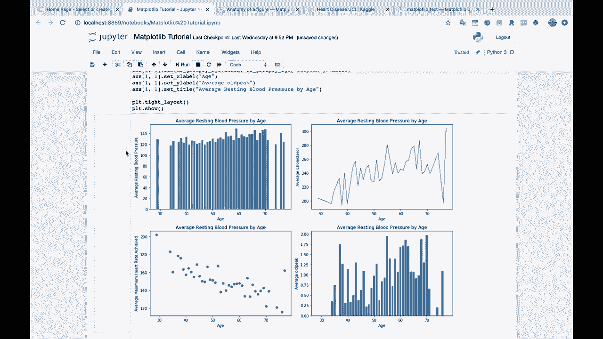
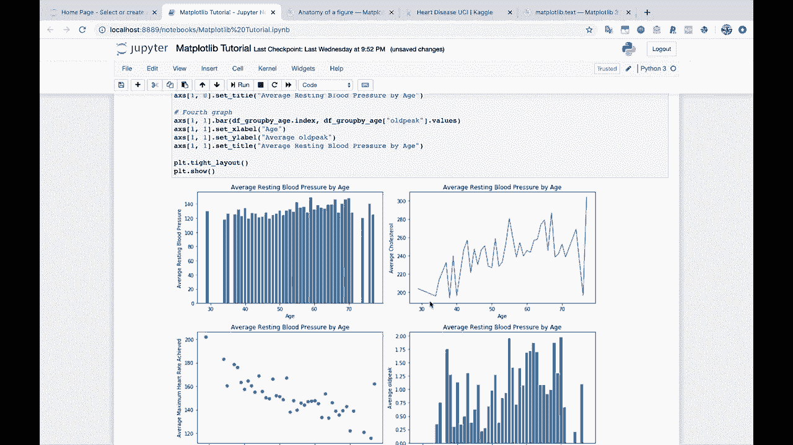
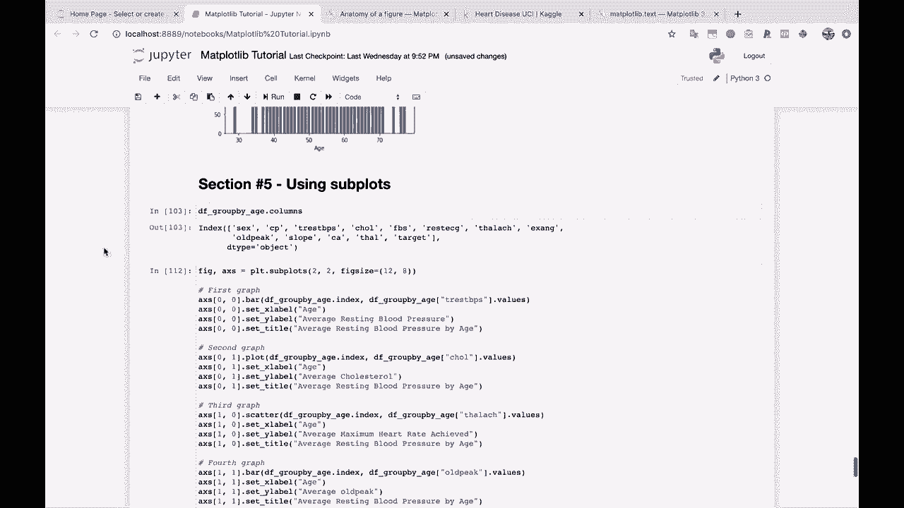

# 【双语字幕+资料下载】绘图必备Matplotlib，Python数据可视化工具包！150分钟超详细教程，从此轻松驾驭图表！＜实战教程系列＞ - P10：10）Matplotlib 中的常见问题 - ShowMeAI - BV14g411F7f9

Okay， so now we're going to go on to our last section here。

 which is a little bit of a longer section。 and that's because let's see section 6 here。

 section number6， That's because when we're talking about common map plot lib questions。

 there are a lot of these because weve you know we've walked you through the basics here。

 you now have all the information that you need to be able to take your data and do some basic plots。

 some basic line graphs， you know bar plots， scatter plots， etc ceter。

 and to set the titles to set the X and the y axis labels to do multiple plots。

 you have all that knowledge， but。

Typically， whenever people are doing plots。They want to do something specific。

 And there are a lot of different specific visualizations and specific ways to alter a visualization that people typically want to do that you might want to do。

 So this common question section here is going to go through a lot of the most common things you might want to do with your plot starting with。

