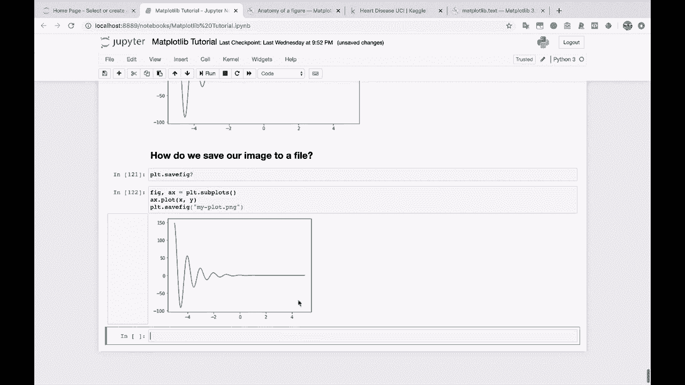
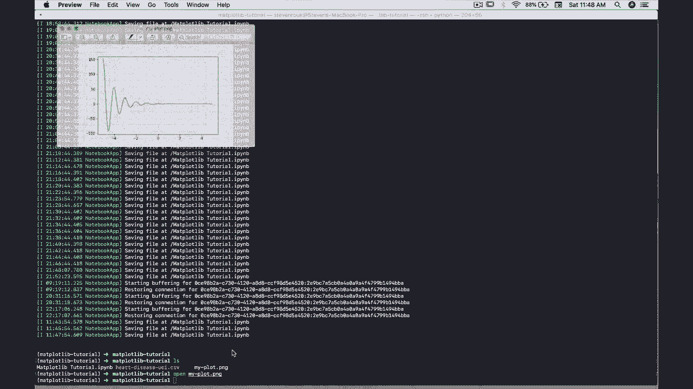
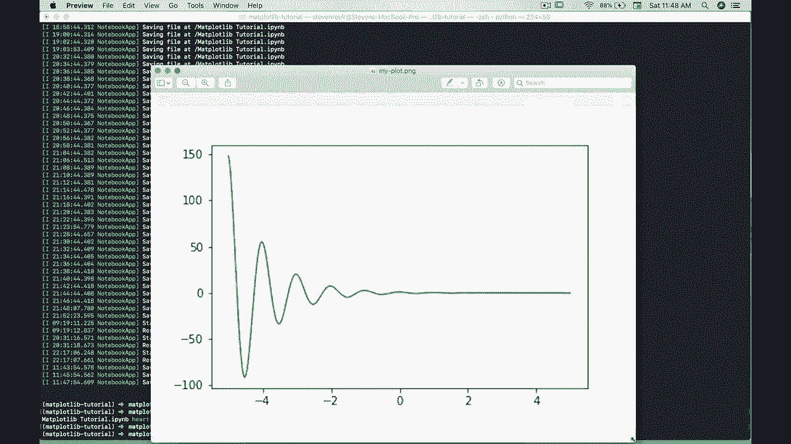
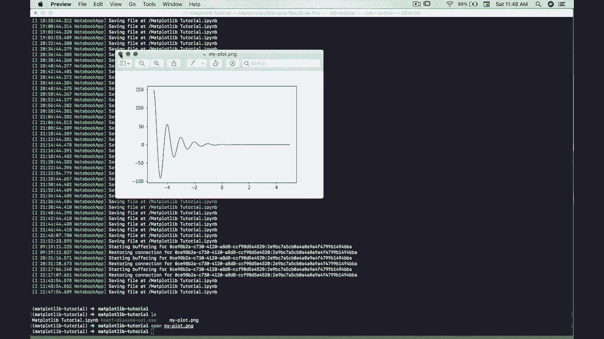
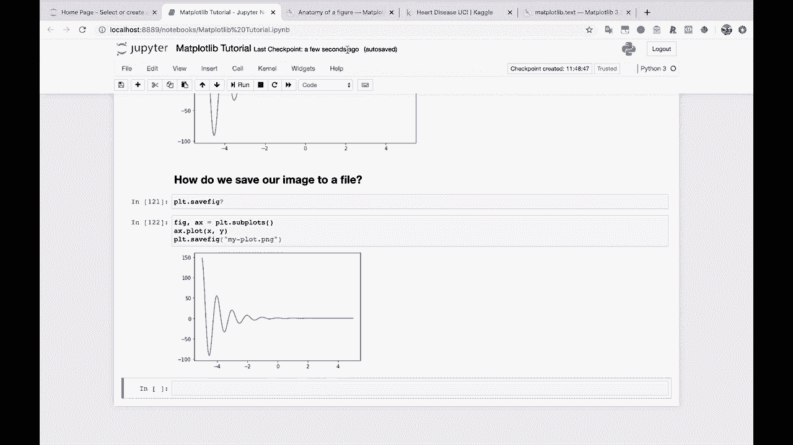

# 【双语字幕+资料下载】绘图必备Matplotlib，Python数据可视化工具包！150分钟超详细教程，从此轻松驾驭图表！＜实战教程系列＞ - P12：12）将图像保存到文件 - ShowMeAI - BV14g411F7f9

So moving on to our next question。How do we save our image to a file？

 How do we save our image to a file well。You could just right click here in Jupyter Notes and say save image as that's a very easy way to do it if it's just a one off thing。 but if you want to save it to a file using Maplotlib。Let's get our basic plot down here again。

 I'll remove figure size。So。Rather than calling PL T do show here at the end， let's do PL T dot。 I'm going to hit tab and see what all of our options are here。 And I I'm going to start tapping in save Fig。 There we go。So let's actually look at the documentation for that。Using our handy dandy question mark。

Question marks sendtax in Jupyter Notes。So we can save the fig， and then it just has as and quarks。 So， you know， arguments， keyword arguments。 So basically we can pass in anything to this。 Okay。 here's the call signature。 So F name， So file name， we can pass in the D PI if we want。 we can pass in the orientation bunch of different stuff。

 But the main thing that we're gonna want to look at here is the file name。So。If format is not set。 then the output format is inferred from the extension of F name。 So in this case。 let's say we want to save this as a P G， we can say my plot PG and it will save it as a PNG because mapplotlib sees the extension here and knows to save the file as a P andG file。 So let's go ahead and run this and you'll see that it actually it pops up here as well。

 but let's go back over to our terminal。

Let's do a little LS。And there we go， my plot dot PN G， let's open my plot dot PN G。

And here is that image right there。 Look at that。And so if we， if you blow it up really big。 you can see it does get a little fuzzy。 That's where the DPI argument can come in handy。 But we just saved out our image to a file。 So there we go。

I'm going to save this notebook really quickly， make sure to save as you're going along so you don't lose your work。