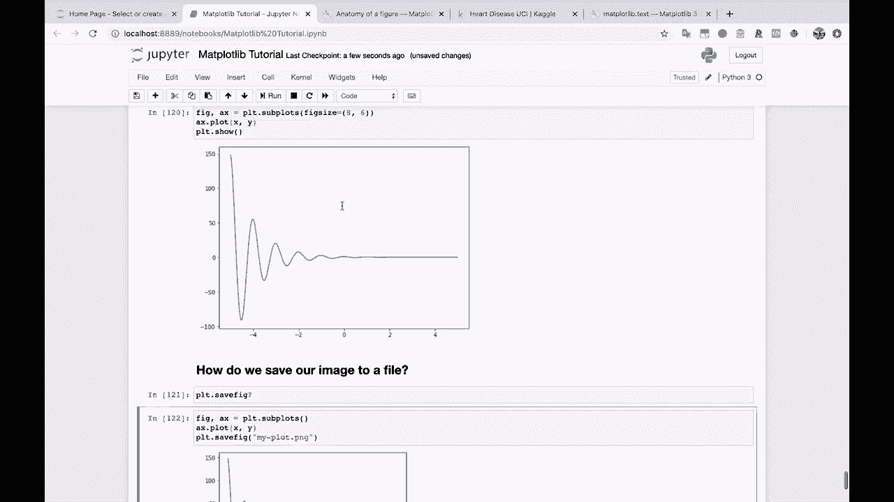

# 【双语字幕+资料下载】绘图必备Matplotlib，Python数据可视化工具包！150分钟超详细教程，从此轻松驾驭图表！＜实战教程系列＞ - P13：13）更改标题、轴标签和刻度标签的字体大小 - ShowMeAI - BV14g411F7f9

，All right。How， let's go to our next question。 How do we change the font size。Title。

 axis labels and tick labels。

Alright， let's check this out。 So we've got our normal， our normal。

Ploing。Formula right here。I'll remove the fig size。Okay， so we're gonna plot。 So first， let's。

 let's set our title and our access labels。 So I'll do A X dot set title。 Remember。

 and we can just say， you know， damped。Oscillation。And we can do A X dot set。Why label。

And we can just say that this is the， you know， let's just call it why label for now。

Y label and A x dot set X label。 and we'll just call this X label。

Alright， so we do that and you'll see that Mapllib goes ahead and puts a title X label， Y label。

 but they are the default fonts here。 and this， you can do this a lot of different ways。

You can do this right here， which will be the way that I'll show you。You can just pass in。

Some font parameters。 So if we do font size equals 20， let's say。Then there we go。

 Our title is now bigger。And we can also pass in。Font size。For let's， let's maybe do 15。

For these labels here。And there you go， you see that our x and our Y label are now different。

And then for our， our tick labels， this is going to be a little different。

 So usually you can just follow this， this kind of formula here for the tick labels。

 we're gonna to do something different。 And that's using the A X。 I'll come out here。 A X dot。

 If you start typing T， and then hit tab， this tick parameters Ramms here。 So I start typing tick。

Tick parametersms。 and let's take a look at this。So tick parametersams changes the appearance of ticks。

 tick labels， and grid lines， and you tell it which axis you want to apply it to。So。

In this case， we can say A X dot tick。Pms。Let's maybe say axis equals both。

 Let's apply it to both axes。And in this case， it's actually going to be label size。

 and we can let's set the s to 10。Just to show you that it's working unless set it equal to 30 at first。

 Okay， so that's nice nice and big， Way too big。 set it equal to like 7。 So they're pretty small now。

And I just want to to remind you right now that the documentation is going to be your best friend。

 So in the case of text， for example， here are the different things that you can pass in for text。

 we pass in font size for the title and the X and the y labels。

 we could also pass in let's see color， Let's just show you that really quickly。

 We can pass in color equals， you know， red or whatever。

And then if we just， let's just Google， you know， Mapl Lib tick。Pamms。

And this will take you to this documentation page right here。

And you can maybe find a little bit more information。 You could find some examples。

 You can see this example usage right here。 This documentation is going to be very helpful for you。

 and also the documentation that you can find。

In Jupyter notebooks， just by doing the question mark， most， if not all， actually。

 of the the documentation from online for some of these things can probably just be found right here like this。

 this usage right here， it gives you a。Gives you a nice example。 So remember， if you have a question。

 consult the documentation and there， because there， there can be a lot of different ways to do this。

 And I'm going to， I'm going to drop this as a reference。

Here right now， we're not going to go into it too much because this could be a whole other conversation。

But。

There is。This idea of your， your RC parameters Ram。 And this is basically what this is saying is。

 you know， this is gonna set your。This is going to set various parameters for different objects。

In mappllib for your entire plot or for your entire Jupyter notebook session。

 And you can store these parameter defaults externally in a file and load them。As well。

 so you don't have to do this every single time。 So you don't have to constantly be specify。

 you know， specify what font you want and what size you want， etc cetera。

So， for example， here's a font dictionary with the various parameters that we want for our font。

 We want the family to be monospace。 We want the way to be bold。And the size to be larger， which is。

 that's kind of funny。 And then you essentially say， I want to apply。

These parameters to all font objects。And this is how you would do that。

 So if you're interested in learning more about how to set these defaults and how to create your own mappllib parameter file。

Then definitely do some more research into that。 We're not going to be going over that today。

 but I will drop this link right here for more research。

 and you'll be able to find all of these links outside of the video， by the way。

 in the video resources。

