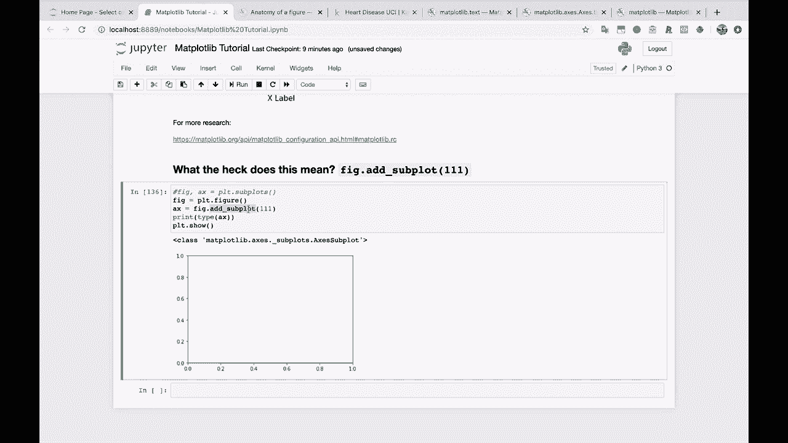
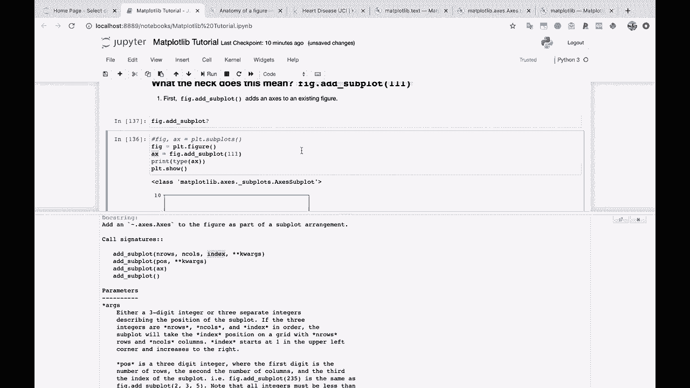

# 【双语字幕+资料下载】绘图必备Matplotlib，Python数据可视化工具包！150分钟超详细教程，从此轻松驾驭图表！＜实战教程系列＞ - P14：14）fig.add_subplot(111) 是什么意思 - ShowMeAI - BV14g411F7f9

好的，继续。那么一个非常常见的问题。非常常见的问题。这是我们实际上没有的。Y。😔，这种方法是这样的。但是你可能会看到像这样，究竟是什么意思。嗯。你可能会看到 Fig dot add subplot，像 1，1，1 这样的。

那么究竟是什么意思呢？好吧，让我们尝试一下，看看会发生什么。所以我们将做 fig x 等于，好吧，实际上。是的，是的。我们这样做。所以 PLT dot subpls。然后 Fig dot add subplot 11，1。让我们试一下，PLT do show。

所以这样会更清晰。如果我们去掉坐标轴。让我们先创建一个图形。所以 fig 等于 PLT dot fig your。但是我们一开始不创建坐标轴，我也不会使用这个 add subplot！

所以，只需创建一个图形，然后使用 PLT。你会看到这里有一个图形，但没有坐标轴，记住坐标轴是实际绘制图形的地方。

所以我们没有任何可以进行绘图的东西。如果你有一个图形并且想向其中添加坐标轴，这就是这个 add subplot 命令的用武之地。所以现在如果我将 A x 设置为这个，然后我们运行它。

你会看到现在我们有了一个坐标轴。如果，你知道，为了更明确一点，让我们打印一个 X，你会看到这是一个坐标轴子图类型。我们甚至可以打印这个对象的类型。这是类型为 mapplot Lib 的 axes，subplots，axy subplot。所以基本上，add subplot 的作用是为图形添加一个坐标轴。这就是第一步。

这就是这里的第一步。所以我会说，你知道，首先。

Fig dot add subplot。将坐标轴添加到现有的。

图形。那么关于这个 111 代表什么的问题？我承认这是非常令人困惑的。让我们看看子图的文档。

再一次，这有点不太有帮助，我们只有这些作为奇点。但是让我们看看调用签名。这是有用信息的地方。所以 add subplot。

看起来你有不同的选项来使用 add subplot 方法。确实如此。所以你可以调用的第一种方式是你想要多少行，多少列，然后这个图的索引是什么。让我们快速使用一下。所以想象一下我说。我想要。

我想要两行。我想要三列。这将位于索引编号，假设索引编号为2。所以很难看清。好吧，让我们。创建一个基本坐标轴来处理。首先，我们将在这里做 dot.subplots，然后在其上创建第二个坐标轴。

所以，希望这有点道理。我们基本上是在创建我们的第一个坐标轴，也就是这个图。而且添加子图。我们想象我们正在创建两个行和三列的子图。

我们将仅在索引编号2处创建一个坐标轴。假设我们想更清楚地演示这一点。我们还要添加，假设是坐标轴编号3。我们将在索引1,2,3处添加它，假设添加到4。所以我们将在这个左下角添加它。就这样。

所以添加子图基本上是一种说法，嘿，我有一个图。我想在上面创建一个坐标轴。我希望它在这个特定位置出现。并且我希望它看起来好像在两行、三列等中。所以这就是我们在这里使用它的方式之一。回到文档中。

你会看到我们也可以仅传入 pose 或 X，来看看它们是什么。

所以 POS pose 位置。是一个三位整数，第一位是行数，第二位是列数，第三位是索引。这就是我认为这有点令人困惑的原因，因为你基本上可以使用这些方法。

只需将它们压缩，没有逗号。这正是同样的事情。所以我们在说，嘿。我想创建子图，好像有两行和三列。我想在索引2处创建一个坐标轴。我们运行这个，得到完全相同的结果。如果你看到类似 Fig.add_subplot, 111。这到底是什么意思。

好吧。让我们回去。只创建我们的图。Figure。

好的。所以 fig.dot.add_subplot。

subpl 1,1,1。这是说我想要一行。我想要一列。然后我想在这个东西的索引1处创建一个坐标轴。所以这基本上是说我想要一个图，没什么太复杂的。

实际上，这与不带参数的调用是完全相同的。所以我认为这一切对我个人来说可能相当混乱。每当你有选项在一开始创建子图时。

每当这样对你有意义时，我会说就这样做。就这样做。然后你会得到你那里的坐标轴对象列表。然后你可以以那种方式单独操作它们。如果你真的喜欢这种方式，那很好。但请知道，这种操作有很多不同的方法。

我知道这可能会变得非常混乱。所以尝试选择一种方法并坚持下去。我建议你，如果可以的话，我建议你开始时就坚持这个方法。顺便说一下，正如我们可以在其他坐标轴上绘图一样，我将做`A X`等于`fig.dot.add_subpl`。

`A X.dot.plots`。让我们做`X`和`Y`。让我们再创建一个。`A X 2`等于`fig.dot.add_subplots`。让我们创建两行，三列。这次我们做`index3`。然后`A X 2.dot.plot X`。`Wai`。😔。好了，我们得到了我们的主要图表，就是我们创建的第一个图表；还有我们的次要图表，就是我们创建的第二个图表。

好吧，让我们继续。
