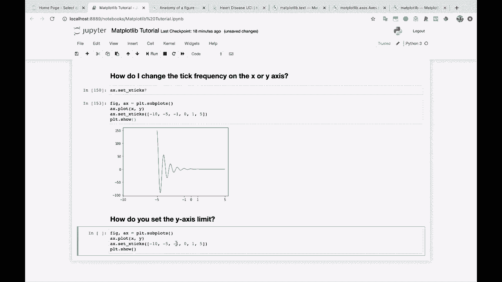
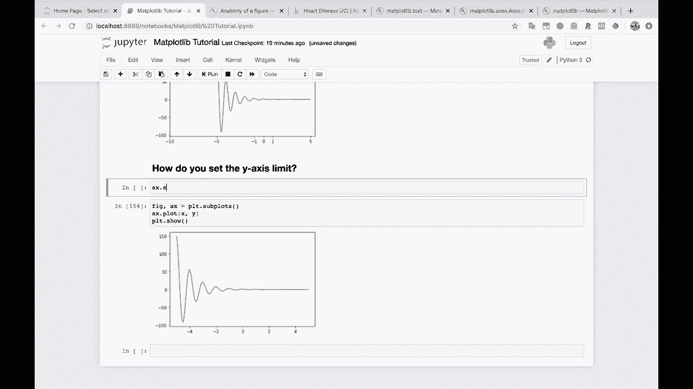
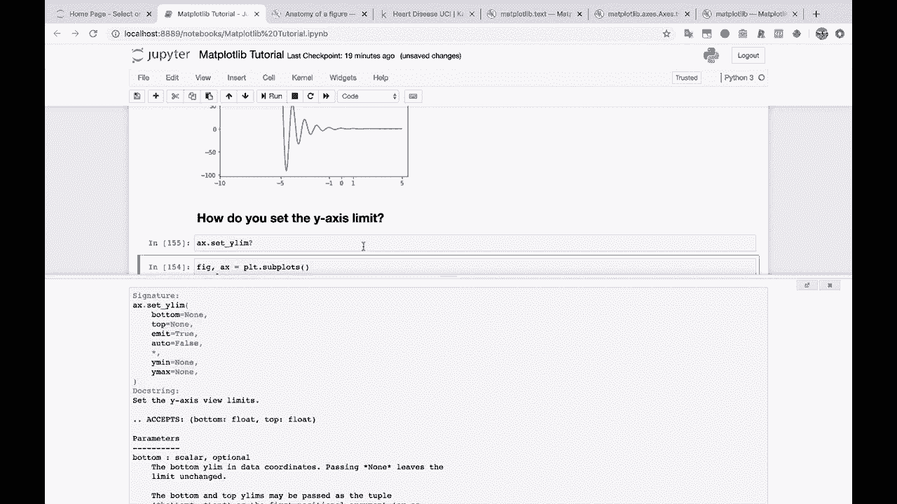
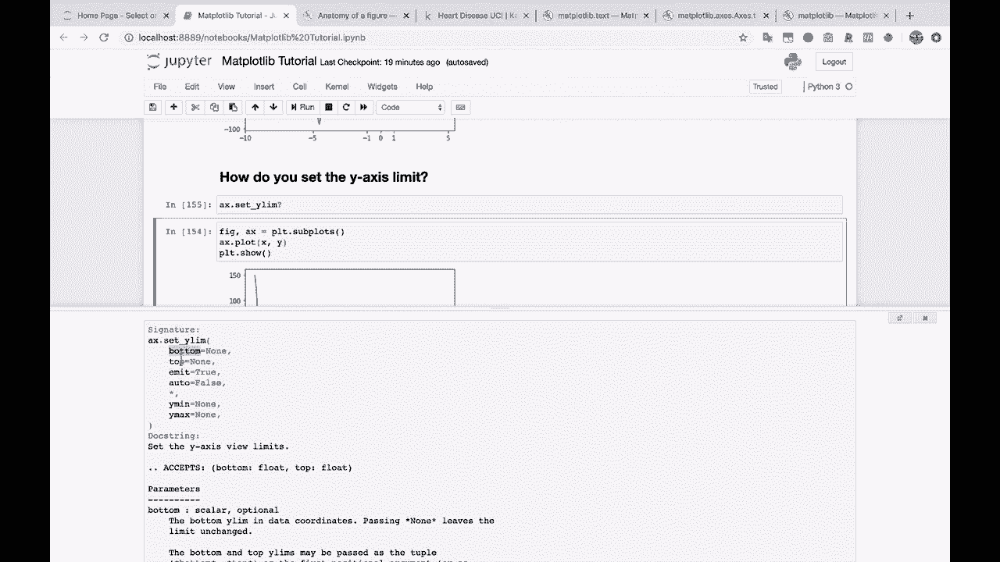
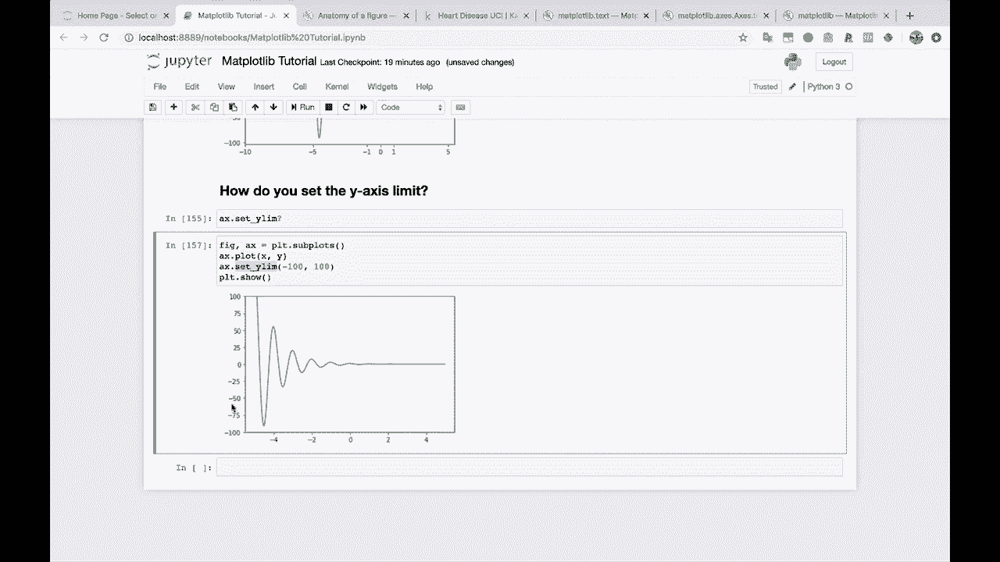

# 【双语字幕+资料下载】绘图必备Matplotlib，Python数据可视化工具包！150分钟超详细教程，从此轻松驾驭图表！＜实战教程系列＞ - P16：16）设置y轴上下界 - ShowMeAI - BV14g411F7f9

To do that。Alright， this next one is one that I use pretty regularly。 So how do you set the y axis。Limit， so whenever you have a normal graph。

Like this。

Mat Ploot Live just tries to determine what kind of y axis you want and sometimes that'll work and sometimes it won't。

The way that we can do that。Is if you do A X dot set。 and then let's just try to set Y Li。 There you go。

So why La， you can pass in the bottom， you can pass in the top， you've got some other options here。 but the way that I typically like to use it。

Is you just say。A X dot set Y Li， Then you pass in a minimum and of maximum。 So maybe we want to look at this from 0 to 150。And there you go。 That's what this graph looks like from 0 to 150。 Or maybe we want to look at it， you know。 from a negative 100 to。100。And there's what that looks like。 So you can use this set y lamb to。

Shrink or grow your Y axis。