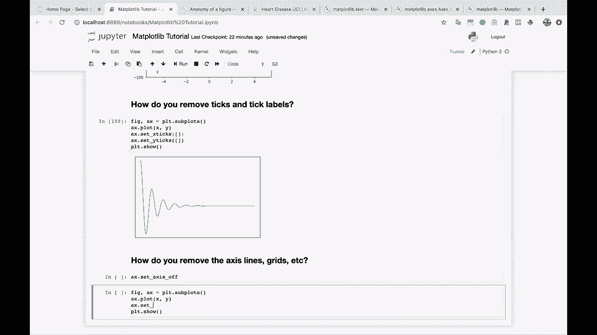
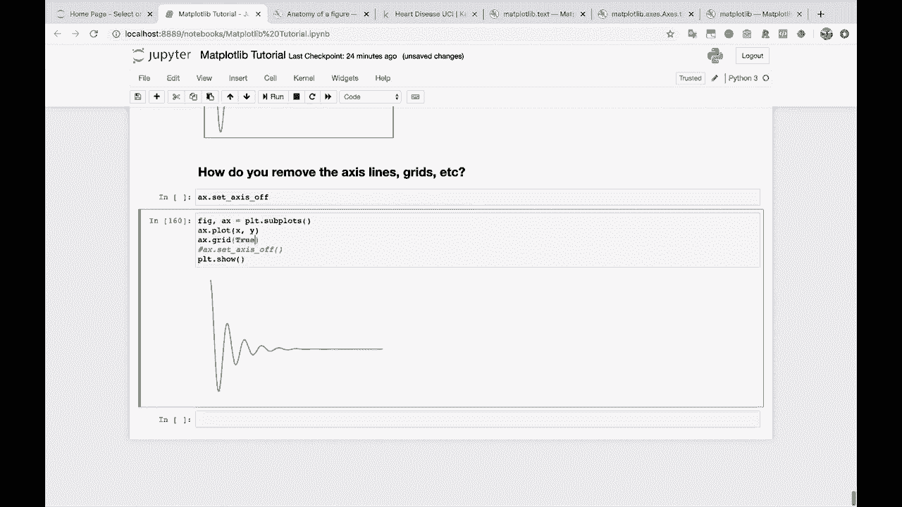
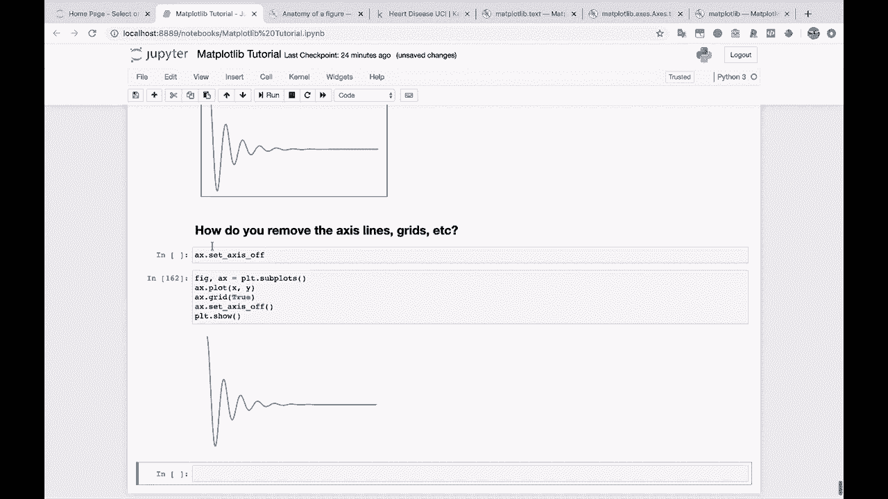

# 【双语字幕+资料下载】绘图必备Matplotlib，Python数据可视化工具包！150分钟超详细教程，从此轻松驾驭图表！＜实战教程系列＞ - P18：18）怎么关掉轴 - ShowMeAI - BV14g411F7f9

There you go， so related to this。How do you remove。The access lines， grids， etc cetera。

So let's say that we want to remove these lines around the edge。 Well。 let's get our normal plot up here。Delete be。And if you come in here to AX do set。

And then set axis， set axis， set axis is off Ta。 So let's try that。 see what happens， set。

Access off。And there you go， No axis lines around that。

Now， by the way， we didn't have any grid lines here， but if we did。 this would affect the grid lines as well。 So let's let's actually show that really quickly if we do AX do grid and then pass in trueu here。

We get this nice grid at the tick marks。 And now if we do set access off。 So this not only turns off the align around the graph， but it also turns off those grid marks。

