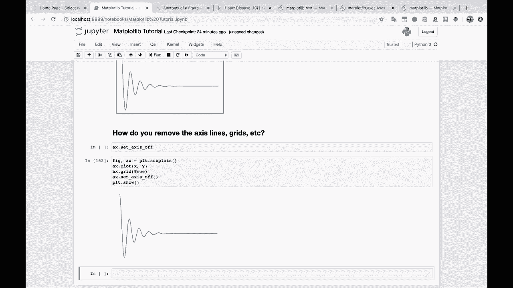
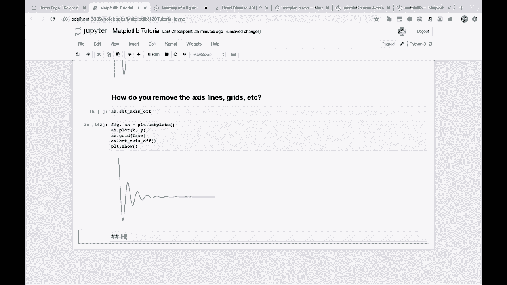
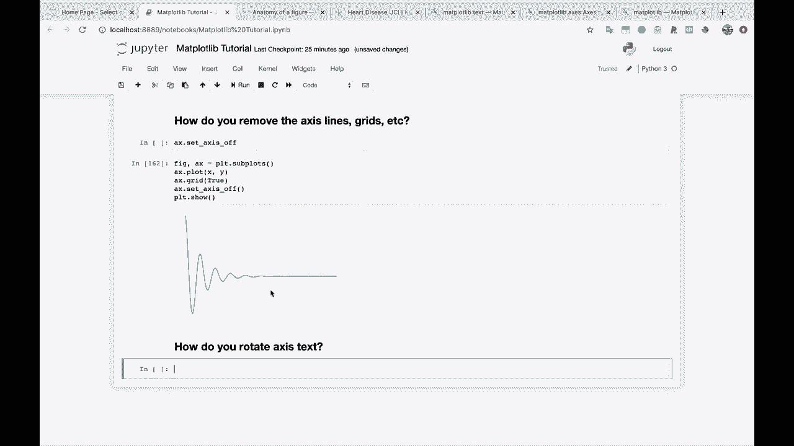
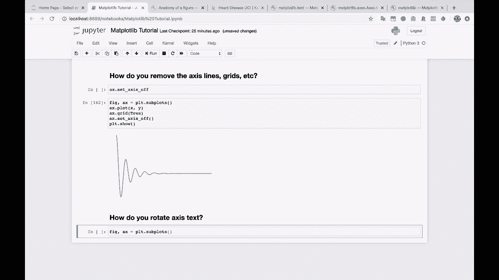
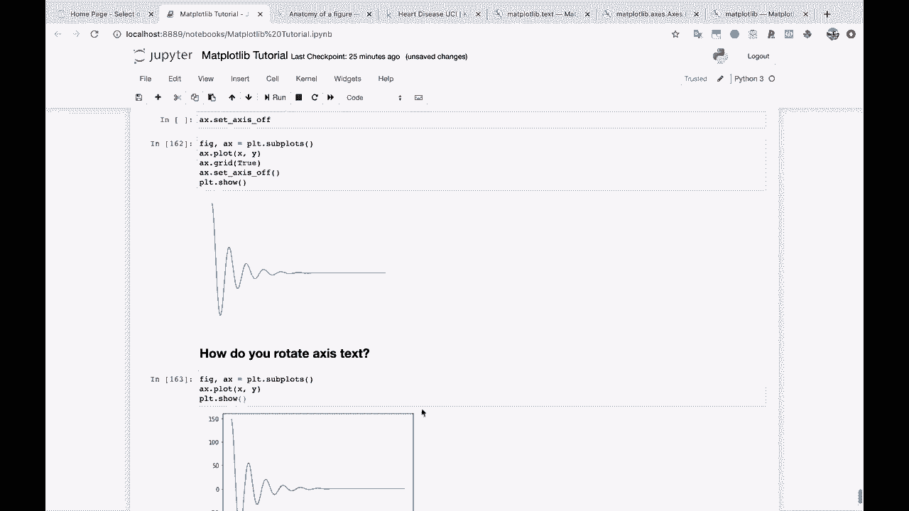
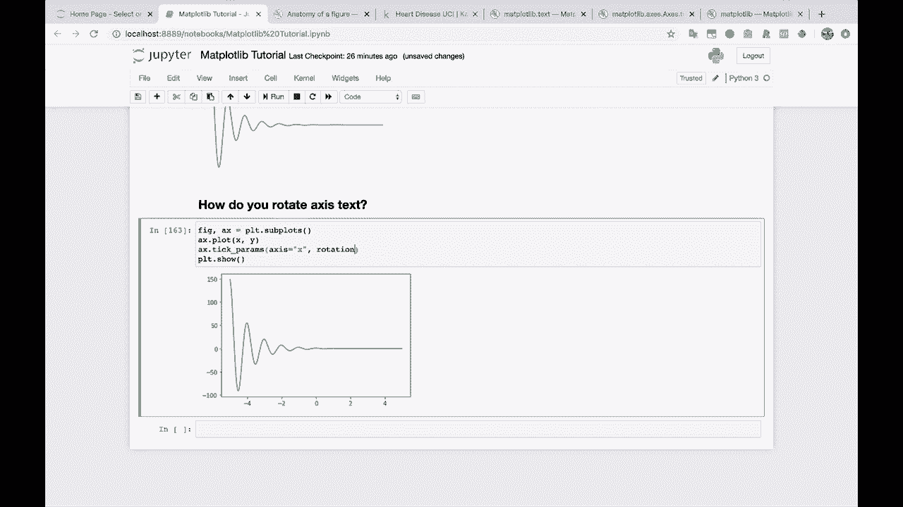
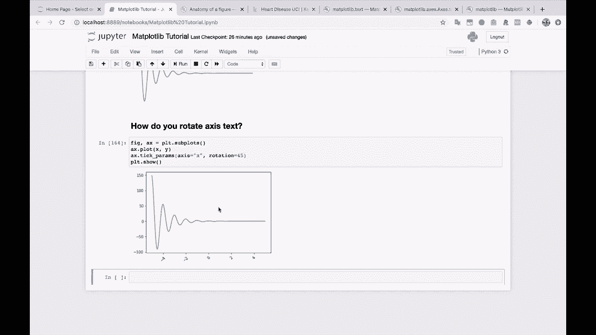

# 【双语字幕+资料下载】绘图必备Matplotlib，Python数据可视化工具包！150分钟超详细教程，从此轻松驾驭图表！＜实战教程系列＞ - P19：19）旋转轴刻度标签文本 - ShowMeAI - BV14g411F7f9

Okay， next question rolling right along here。 So this is a very common one。

How do you rotate access text？And this isn't something that we've had to use， really。

 because our access text has looked fine。 but a lot of the time。

You might have very long labels here and they all run into each other and you can't read anything and so you're like。

 well， I need to rotate these so I can see them。

So I'll show you how to rotate your。Accs your axis。Tick labels。

 And we're going go back to our friend the tick parametersms method。 So A X dot plot， X， Y。

 PL T dot show。

All right， let's rotate these X axis labels。So we're going to go back to Ax do tick parameterss。

 And if you look at the documentation， or if you remember。

 you can remember that we can pass in which axis we want to do it to。

 and then we can pass in any parameters that we can apply to these these labels here。

 So I'm going to pass in the parameter rotation equals， let's try 45。

And there you go。 Now they're nice and rotated。 and if these labels were very long。

 they would not run into each other。

