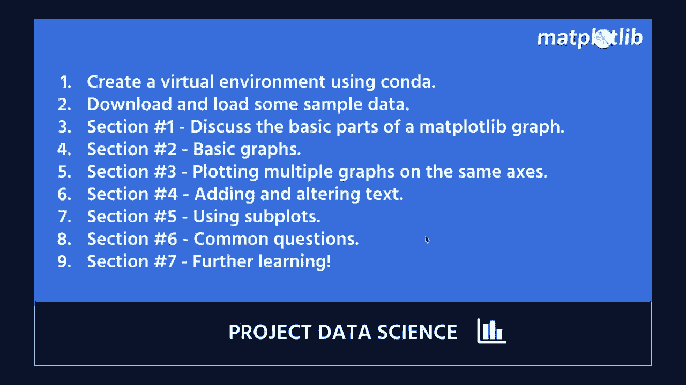
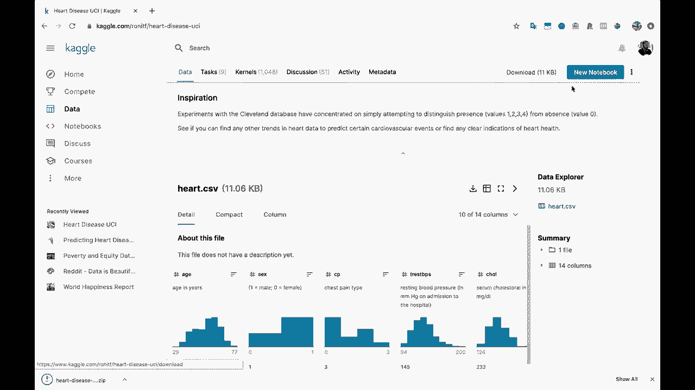
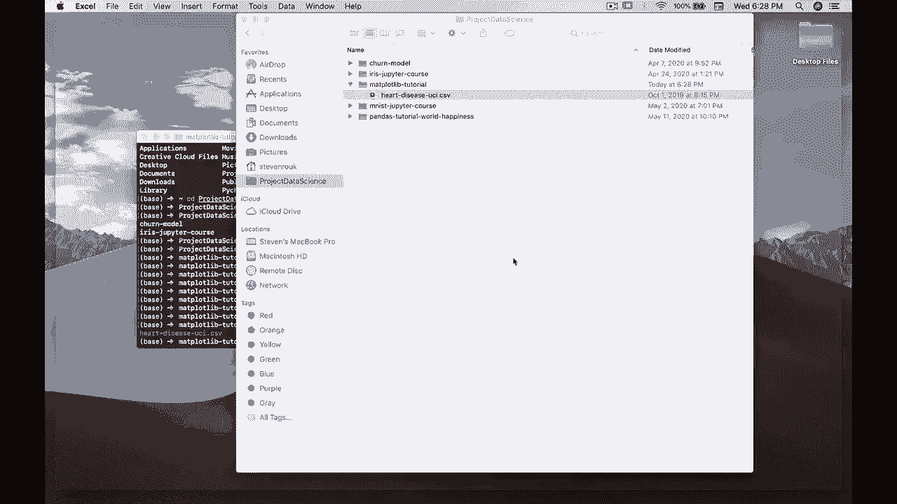
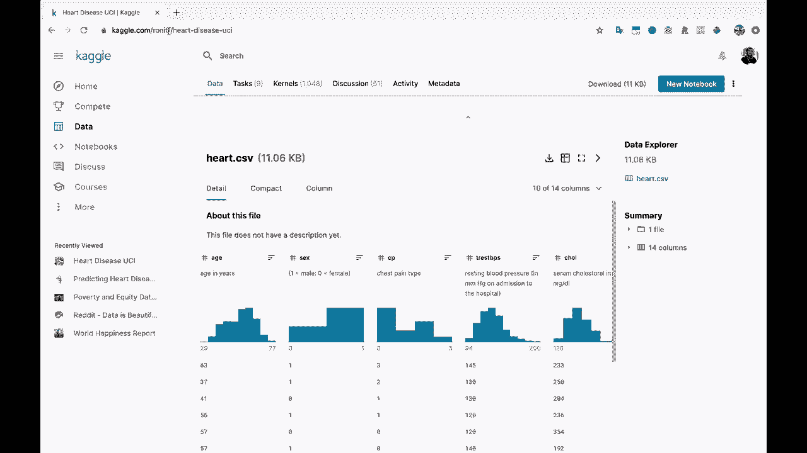

# 【双语字幕+资料下载】绘图必备Matplotlib，Python数据可视化工具包！150分钟超详细教程，从此轻松驾驭图表！＜实战教程系列＞ - P2：2）创建项目目录并下载数据 - ShowMeAI - BV14g411F7f9

开始。

首先，我要打开一个终端，我要创建一个新的。让我把这个终端拖到这里。我将创建一个新的目录供我们在这个项目中使用。这就是我喜欢开始新项目的方式。让我在这里执行一下LS，看看我的主目录。你会看到我有一个名为项目数据科学的文件夹。

我将继续在这里更改，如果我执行LS。你会看到。这是我们在网上录制的其他课程和其他视频的目录。我将创建一个新的目录。我们称之为mat plot Lib。😊。我们称之为mappl Lib教程。就叫这个吧。

所以我会进入Maplot Lib教程目录。如果我执行LS，你会看到这里什么都没有，因为我们还没有在这里创建任何内容。我们只是创建了这个目录。所以，看起来不错。现在，我们将使用在这个教程中创建的一些数据。

但我们还将使用一点关于心脏病的数据。从kle这里取一点数据。所以我将打开一个新的Chrome窗口。让我把这个Chrome窗口拖到这里。如果你去kggle心脏病。让我们看看。我们有心脏病数据集。我们有预测心脏病。让我们去这里，预测。

心脏病。实际上，如果我们点击这个心脏病UI链接。这是我们想要的。所以Caggle.com/RonyTF R O N I TF，然后是heart disease U I。我会确保发布这个链接，以便你能获取到它。但这是我们将下载数据的地方。这是关于心脏病的数据。

我们可以看看这里的描述。这个数据库包含76个属性，但这个数据的已发布实验仅使用了14个属性，而这14个就是我们将在这个数据集中使用的。特别是，克利夫兰数据库是迄今为止唯一被机器学习研究人员使用的。

等等，这个数据集最初来自UCI。UCI机器学习库。如果你来这里。你会看到这些是一些非常受欢迎的机器学习数据集。我们将使用这个心脏病的数据集，但我们将从Cagle获取它。

所以，让我们。上去这里。点击这个下载按钮。如果你没有Cagle账户，你可能需要创建一个。我将点击这个下载的zip文件。它打开了这个heart.dot CSV。我会迅速重命名它，正好是这个zip文件的名字，实际上是heart disease U C I。

现在，为了向你展示如何在终端中做到这一点。我将回到我们的目录，我们的MaplotlibB教程。如果我们去项目数据科学和Maplotlib教程，你会看到就在这里。我将从我们的下载中移动heart diseasease UCci.csv。

我将把这一点移到目录，也就是说这个目录，所以我稍微做一下`ls`，以显示我们在这里有我们的heartdisease UCci.csv文件。O。所以现在，如果我再检查一下我们的CSV文件确实在这里。我会双击这个。我们可以在Excel中快速打开它，只是看看它的样子。

好吧，这里是一堆数字。看到这里有一堆数字，我们的列标题在顶部。所以我们有这个人的年龄，性别。这些是0和1，原始的Caal数据集在这里给出了映射。所以1代表男性，0代表女性。然后我们还有其他一些数值列。

这就是我们将在一些教程中绘制的内容。

所以回来这里，让我们关闭这个，然后继续关闭。
