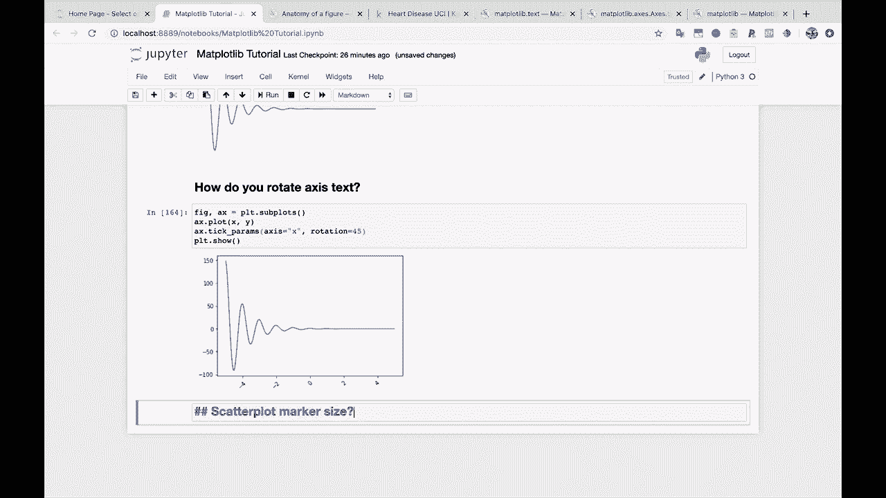
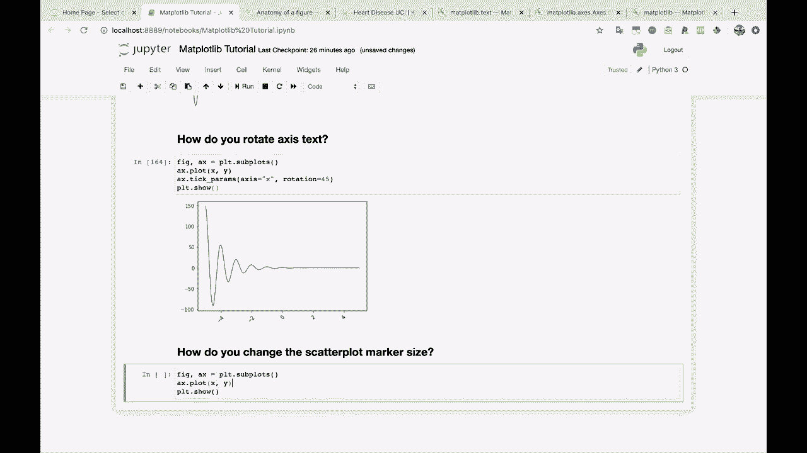
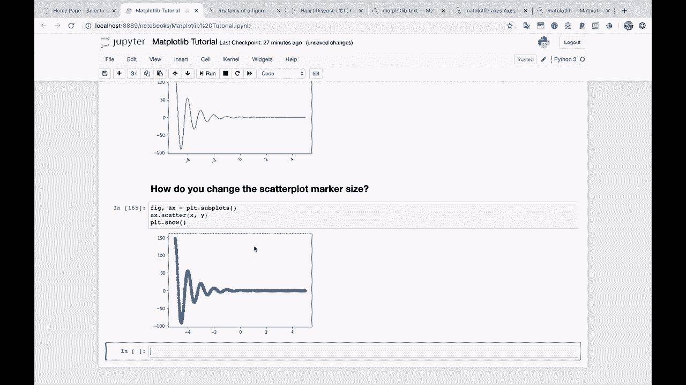
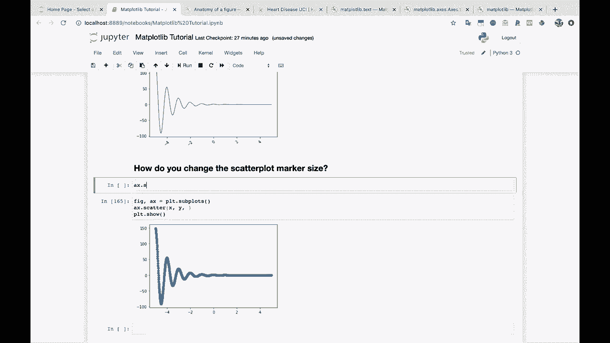
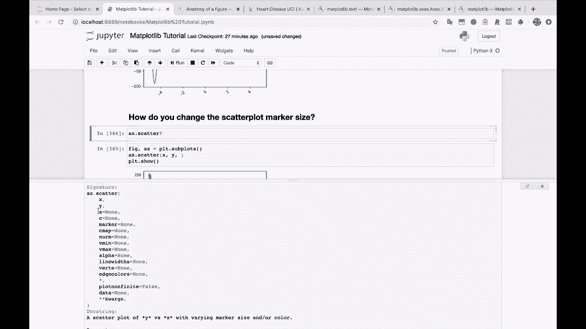
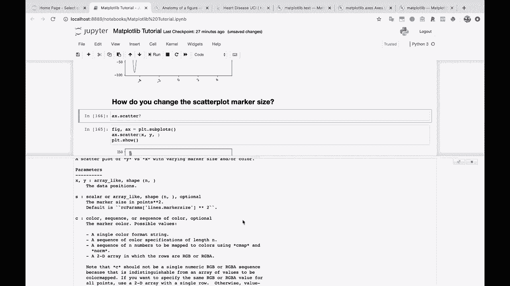
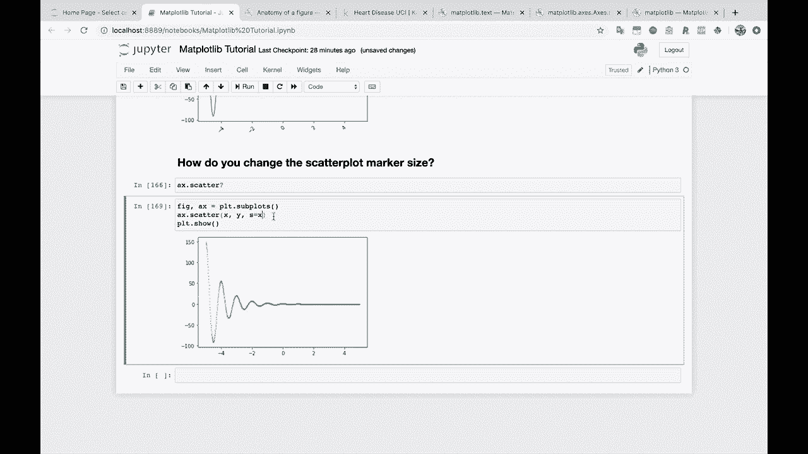
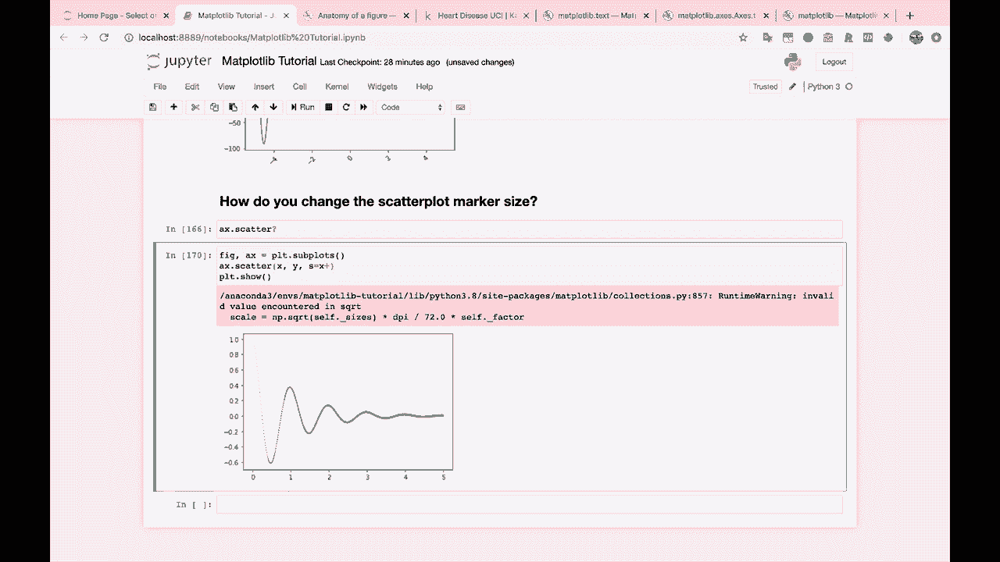
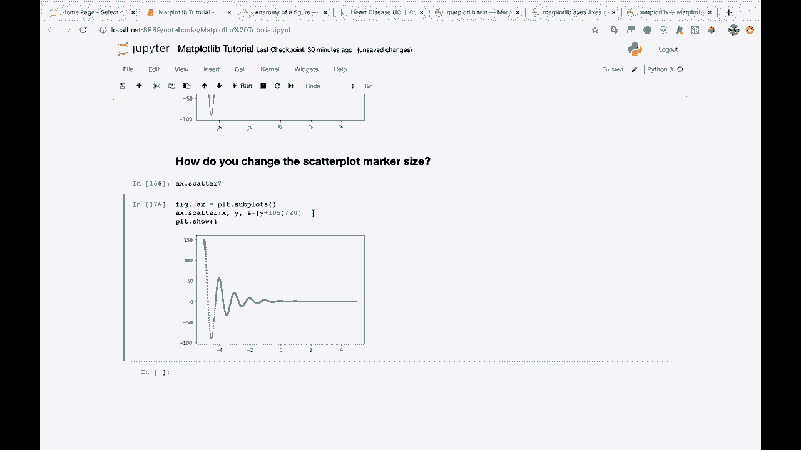

# 【双语字幕+资料下载】绘图必备Matplotlib，Python数据可视化工具包！150分钟超详细教程，从此轻松驾驭图表！＜实战教程系列＞ - P20：20）更改散点图标记大小 - ShowMeAI - BV14g411F7f9

Okay， we're getting closer to the end here。 We've got a few more questions to go through， though。 So let's keep rolling scatter plot marker size。 Or let's， let's change this into a question。 How do you change the scatter plot。

Marker size。 So let's get our graph here。 In this case， we are going to need to change this to。

Scatter。Look at that。 So remember that we had like 1 thousand points here that we're plotting。So that's why you see so many different points here。

So， for the size。Well， let's just look at A X dot Sc。 This is a great habit to get into， by the way。 Just look at the documentation。 Check out what the parameters are。 This will help you a ton， a ton。 Okay， so we're gonna be going for this S parameter here。😊。

And if you look down here under parameters， S the marker size in points squared。 Okay， cool。 let's just tinker with it。And see what happens。 You can also pass in an array like so you can pass in a shape for every。

Every or sorry， a size for every point。 But let's just start by passing an S equals。 Let's try 10。 Whats 10 do10 makes it smaller。 So if we can go down to 5。Even go down to one。 look at that。 And then we get these kind of really tiny little points here。 So we can change the size that way。What if we wanted the size to vary。With the X。The X axis here。 So as our points have larger x values。

 maybe they get bigger。 Let's try that。

Hey， look at that。 So they start off really small。 And actually。 I think we do have a point of 0 in here， which is probably why this is yeah invalid value encountered in the square root。 so。嗯。We might be， let's try adding a very small value to this like 0。1。 There we go。 That fixes it。

So you can see here that our sizes start out very small， and then they get bigger as we go along。 And so this can lead you to do some kind of， you know， cool effects。 I don't know if they'd be useful for what you're trying to plot， but they can look pretty cool。 at least。 You know， let's do。 Let's even do X。😊，Plus 。1， let's multiply by 10 or something。

 So we get really a bigger effect。 There we go， or we could pass in。We could pass in y， for example。 and， it looks like because we can't have negative sizes。Now。 we're only showing the points for the positive Y。 So maybe we make this absolute value of y。So that looks pretty funky。Or we could do。What does this go down to like negative 100 So we could do y。

Plus。Hundred and5。There you go。 And this is kind of big。 So， you know。 we're just tinkering around at this point。 This doesn't necessarily。Y。So there you go。 You got your size option。 And by the way， this is going to be how you would do this across kind of a lot of different graphs。 and， and actually， in fact， some other。Some other plotting libraries in Python as well。

 So that's why I wanted to show you this that you can pass an array here for the size。 And you can also， you can also do the same thing for color。