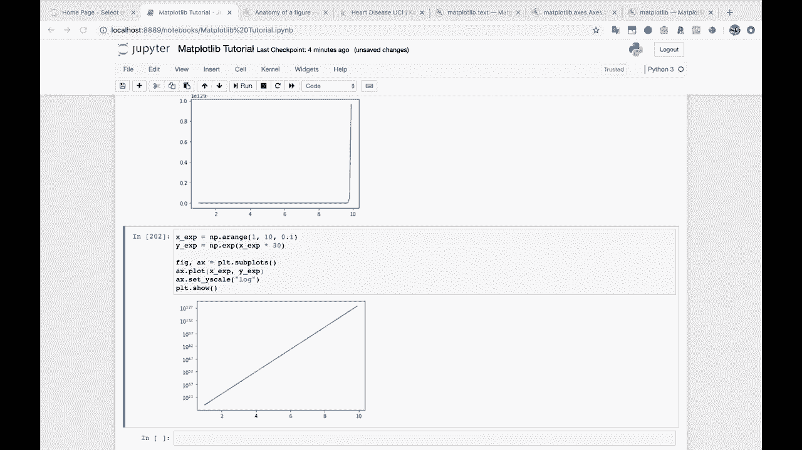
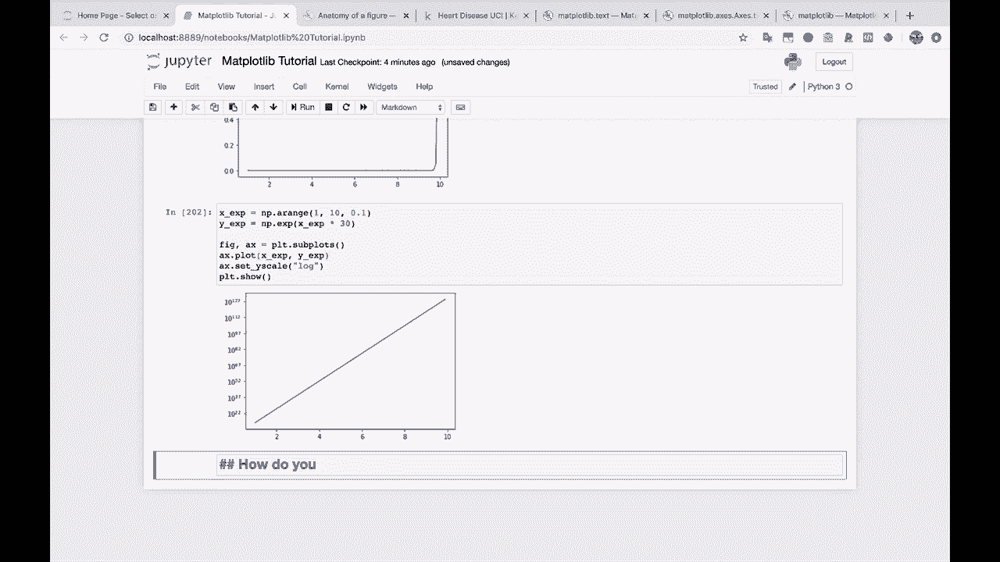
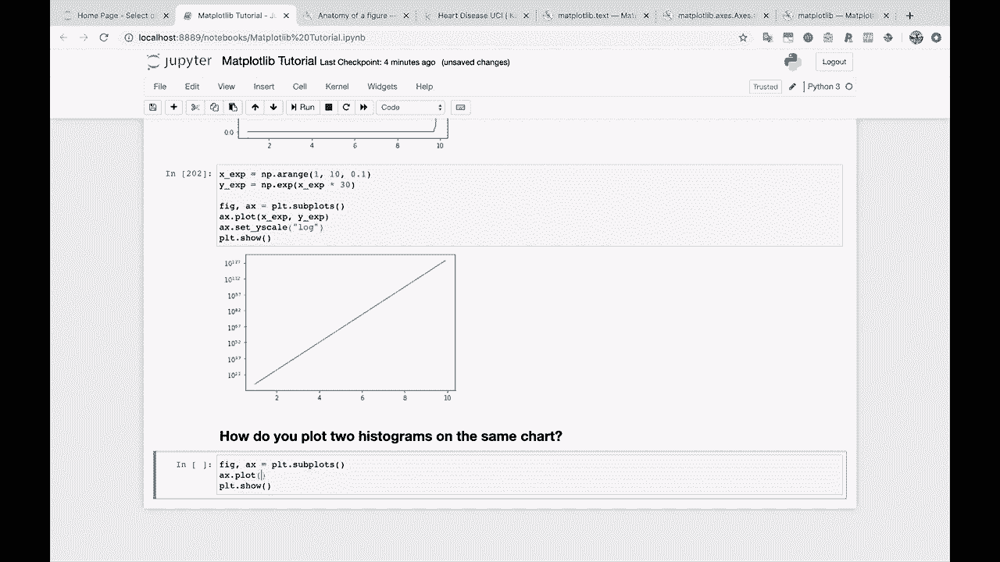
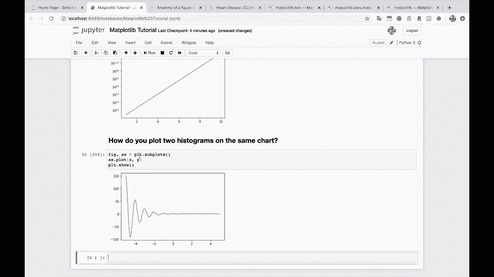
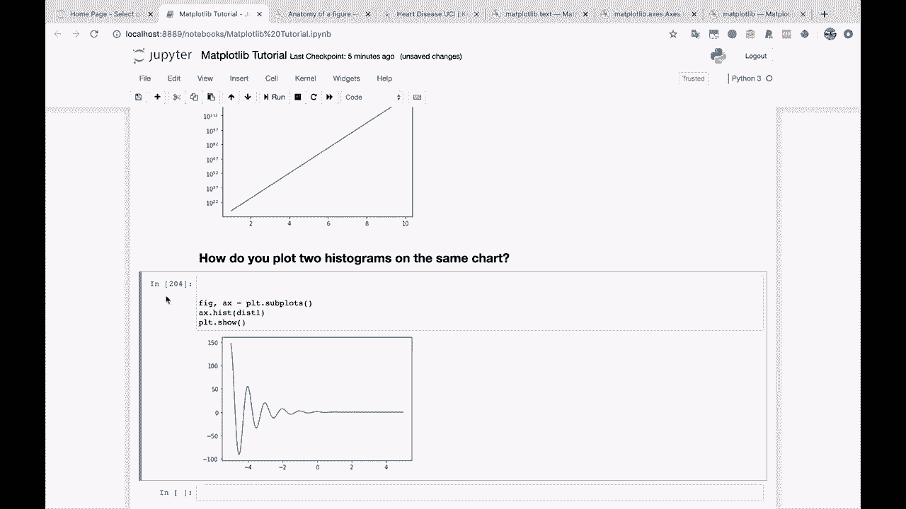
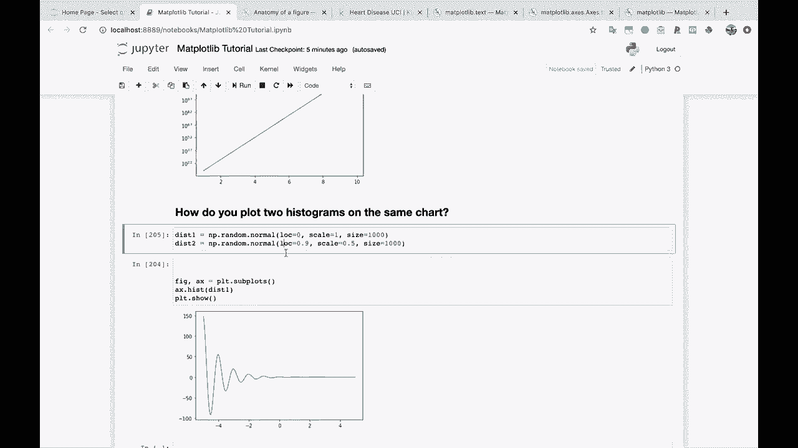
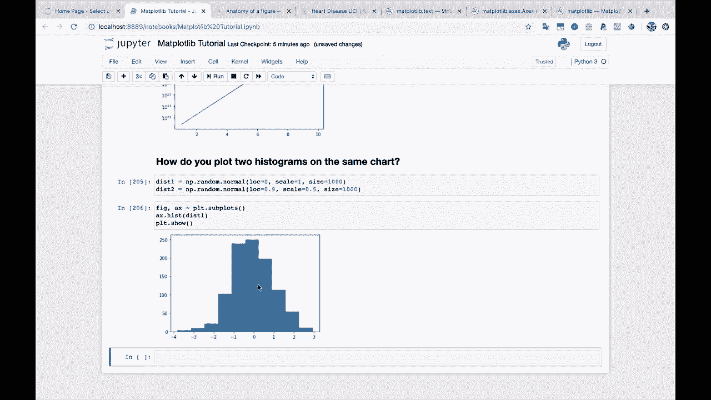
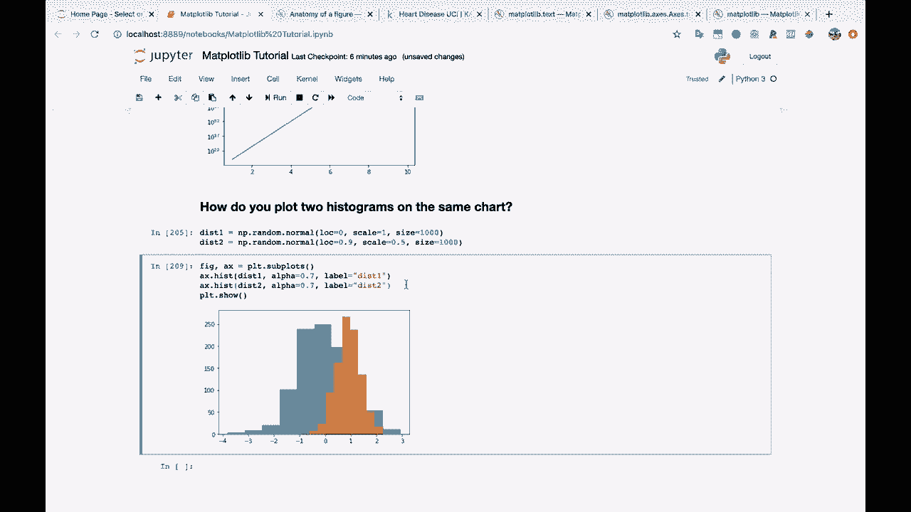
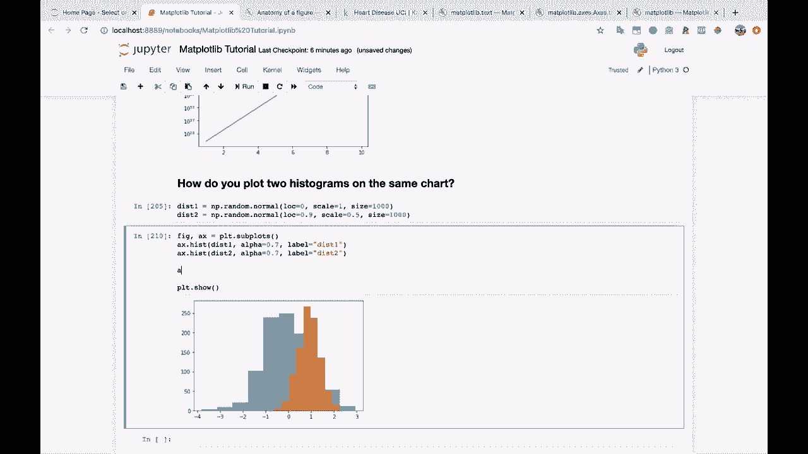
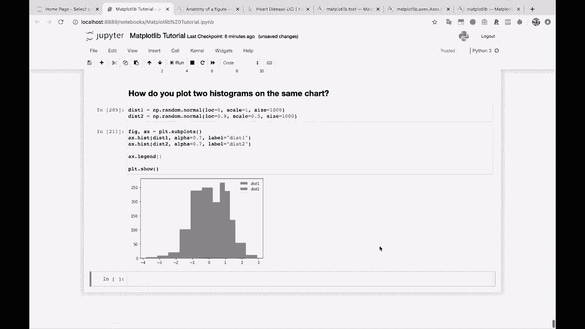

# 【双语字幕+资料下载】绘图必备Matplotlib，Python数据可视化工具包！150分钟超详细教程，从此轻松驾驭图表！＜实战教程系列＞ - P23：23）在同一张图上绘制两个直方图 - ShowMeAI - BV14g411F7f9

是的。

好的，继续前进。如何在同一图表上绘制两个直方图是一个非常常见的问题。这是你应该掌握的技能。如何在同一图表上绘制两个直方图。

这是你应该掌握的技能，因为这是在同一坐标系上绘制两个图的经典例子。所以，让我们看看。

所以如果我们在这里绘制 X 和 Y。我们需要一些可以用的数据。

在直方图中绘图。我继续创建了几个正态分布。让我们把它们放进去。所以我正在创建正态分布。它们有特定的均值，特定的标准差。我正在创建1000个不同的数据点。如果我们对 disk 1 使用 Ax 点 hist。

让我们在这里创建这些。所以我们处理的是相同的数据，因为这将每次创建一个新的数据集。

这是我们的第一个直方图。

现在。你只需在同一坐标系上再绘制一个直方图。所以，这就好了。在同一图表中绘制两个直方图，使用相同的坐标系，就是这么简单。现在。每当我们遇到这样的情况，我会给你展示我另一个喜欢的技巧，就是使用这个 alpha 参数。Alpha 基本上控制透明度。

所以我们先在第二个图上实际使用 alpha。让我们把这个降到。😊，比如 0.7。如果我们把 alpha 降到 0.7，你现在可以看到我们可以透过橙色图看到蓝色图。如果我们对它们都使用 alpha。那我们得到的效果很不错，两者的颜色都有点柔和，我们可以看到两个图的分布。现在。

因为我觉得这很有帮助，我还会在这里添加标签。所以 dis1。Dis 2。然后记住，如果我们运行这个。

这没有任何作用，直到。Wei。

调用 A X 点 legend。这样，你就可以在同一图表上绘制两个直方图了。
