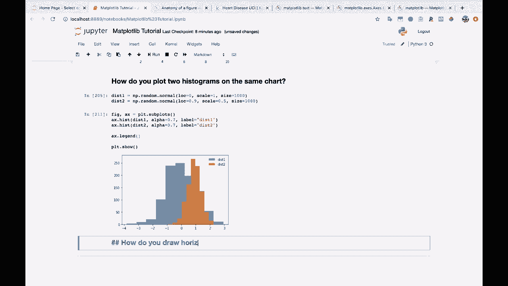
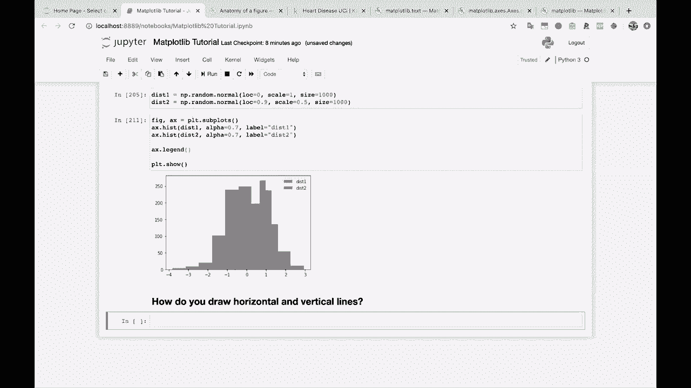
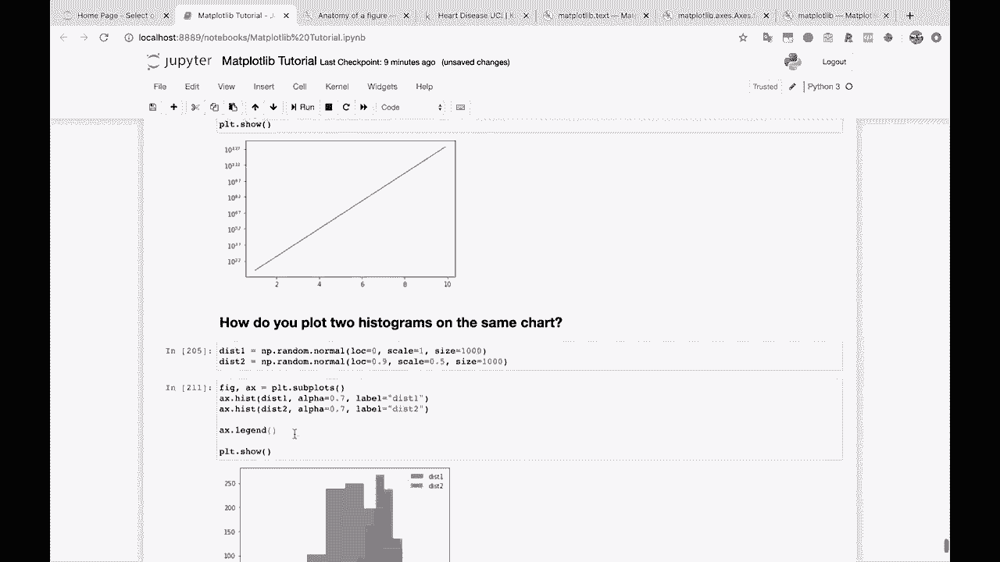
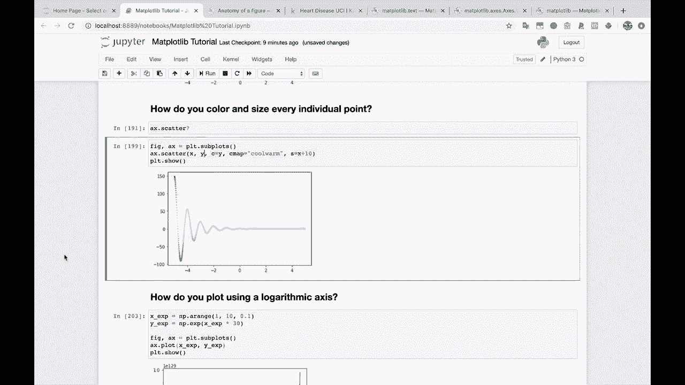
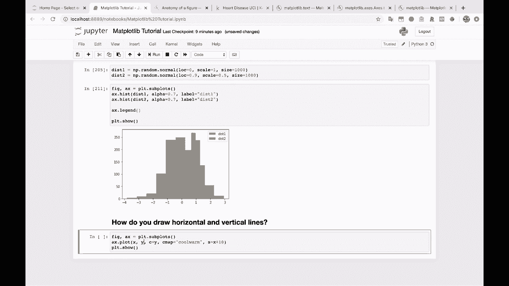
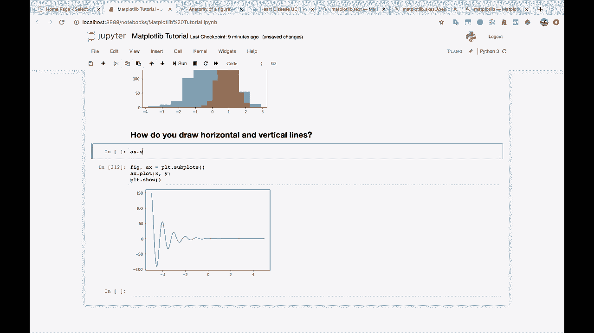
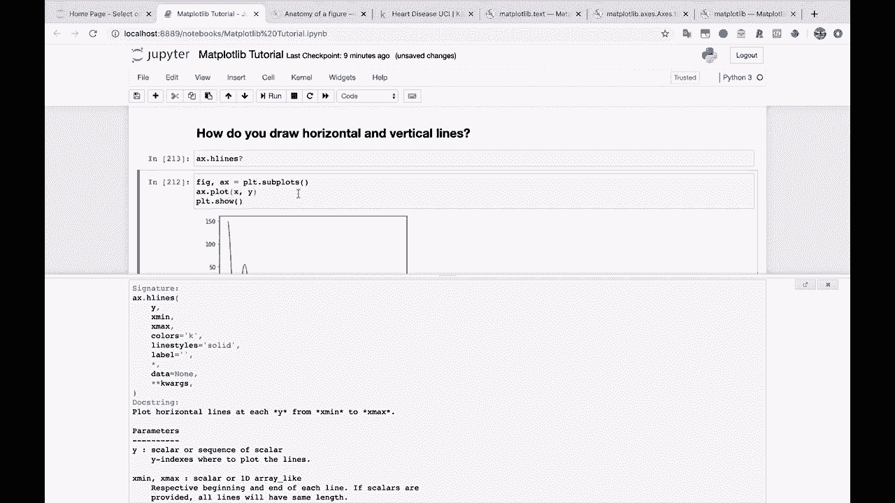
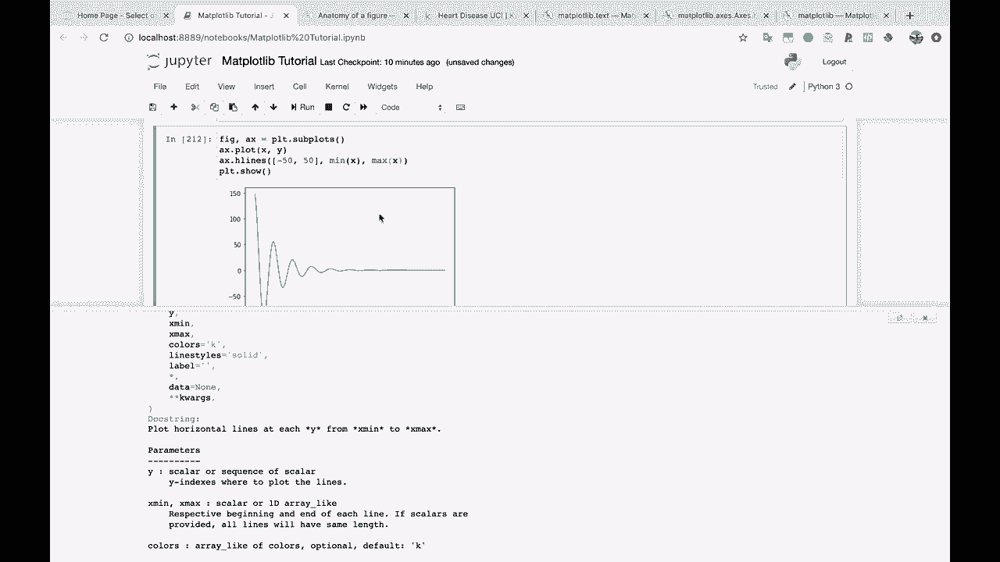
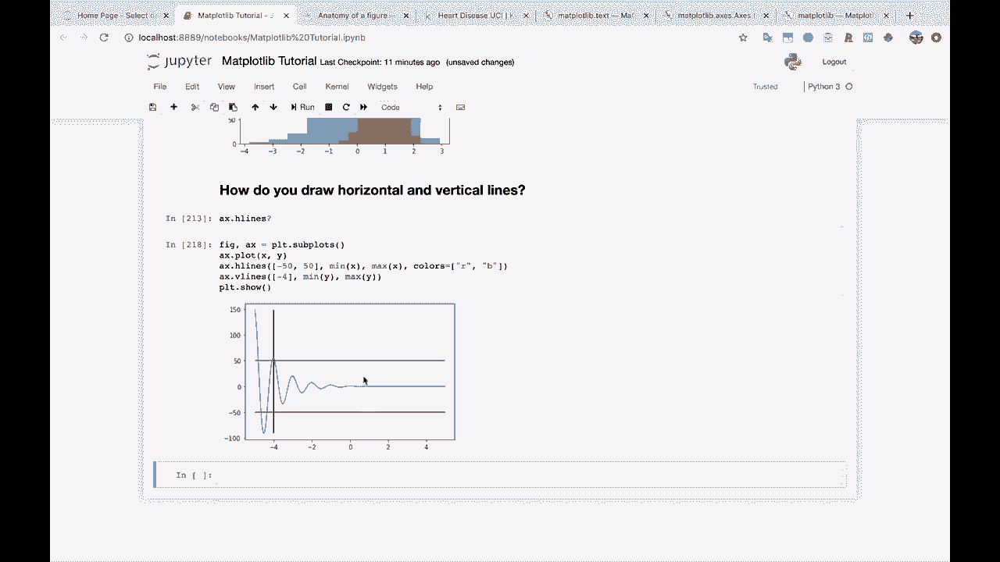

# 【双语字幕+资料下载】绘图必备Matplotlib，Python数据可视化工具包！150分钟超详细教程，从此轻松驾驭图表！＜实战教程系列＞ - P24：24）绘制水平线和垂直线 - ShowMeAI - BV14g411F7f9

好的，再来三个问题。这是一个马拉松，不是吗？那么，如何绘制水平和垂直线？你可能想为图表的某些地方绘制一些参考线。我们来看看。

让我们到这里来。我们来获取我们的模板。

我们将绘制一个A X dot图，X和Y。

好的，假设我们想在100的位置绘制一条水平线，在50和负50的位置再绘制一条水平线。然后我们还要在负4的位置绘制一条垂直线。我们该如何做到呢？好吧，这些可爱的A X dot H线函数和Ax dot V线函数。我们来看一下H线的文档。

所以你要传入。

一个x dot H线。所以你传入y，这是一个标量或一系列索引。这是绘制线条的y索引。所以我们想把它设置在负50和50。然后你还得传入x的最小值和最大值。你想要这条线从负4到0吗？你想让它跨越整个图表吗？

在这种情况下，我们希望它跨越整个图表。所以我实际上只想说，给我X数据的最小值，给我X数据的最大值。

就这样。所以我们从x的最小值到最大值。如果我们想让这个线条短一点，出于某种原因，我们可以让它从0到5，或者其他什么。好的，然后A X dot V线的情况也是如此。所以在这种情况下，我们只想。

一条在负4的位置。我们从y的最小值到最大值来绘制。就是这样。如果你想的话，可以传入颜色，比如传入颜色等于红色，或者你可以传入一个颜色列表，比如红色和蓝色。就是这样。所以现在我们用不同的颜色来为我们的线条上色。

