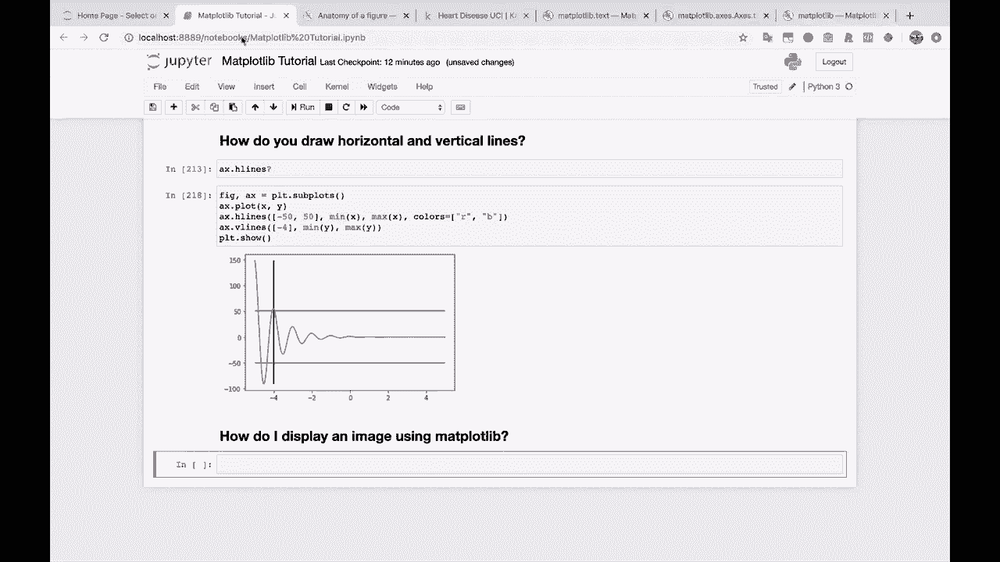
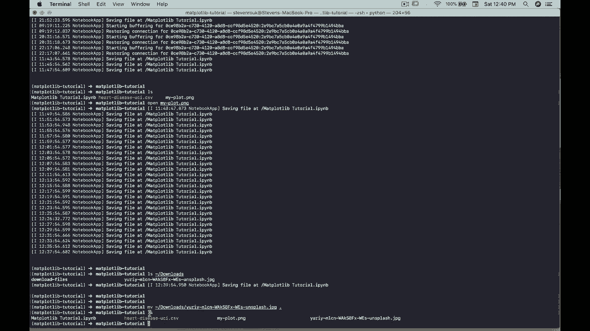
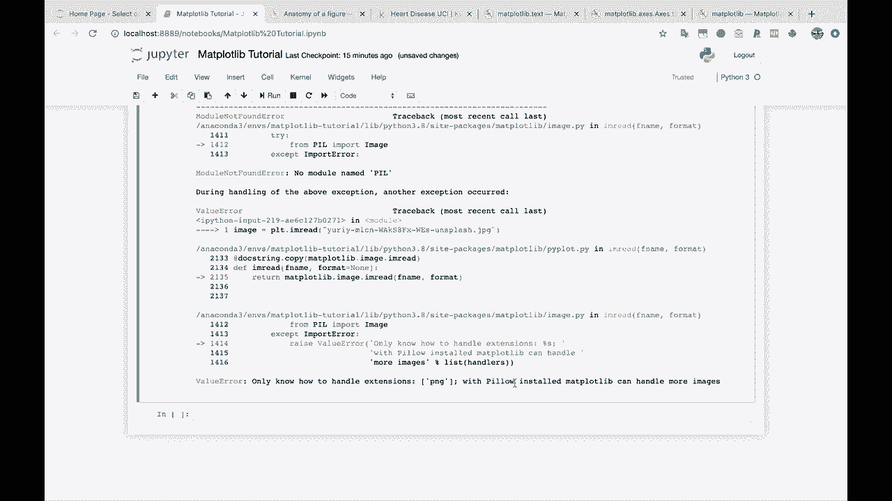
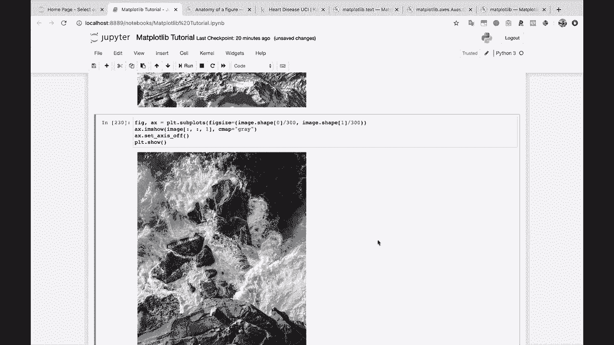

# 【双语字幕+资料下载】绘图必备Matplotlib，Python数据可视化工具包！150分钟超详细教程，从此轻松驾驭图表！＜实战教程系列＞ - P25：25）在 Matplotlib 中显示图像 - ShowMeAI - BV14g411F7f9

Different colors there。Okay， two questions left。 And I I saved two of the cool ones for the end。 So we're gonna talk about images and we're gonna talk about colors。 So how do I。Display an image。Using mat plot Lib， How do I display an image。 So this is something。 this is pretty common。 You might want to do this， especially with neural networks， with deep learning。

 If you're dealing with image data， you might want to look at some samples of your data in a Jupyter notebook。So let's go to an image which I like， I think， is very beautiful。So I'm going to get an image from unsplash。Unsplash has a lot of really nice photos on there。 can you can download them。 They've got the art the photographer who took the photo。

So you can go to this photo if you want， which has this URL here， this funky looking URL。 or you can find your own photo on Unsplash。 That's totally fine。And let's go ahead and download for free。 Thank you to what is this Yuri M LC N on Unsplash for sharing your work with us。 We're just going to use it for a minute。All right。 So let's go。Close this out。

Let's go back over here。 Let's actually go to our terminal。 And we're going to need to move our。Let's see downloads our image file from downloads。 So if I do LS。Tilda for home and then downloads for our downloads folder here。 You'll see that here is our Jpeg that we just downloaded。

 So let's move M V from the downloads Uri into the current folder where I'm at。 If I do a little Ls。 you'll see that I just moved that image here， perfect。😊。

So how do you display an image in mat plot Lib well。If you look， this is gonna use the P L。T the the pipe plot module here。 So PL T dot。I am for image。Read， I am read。So if we read in the image， so we have an image， it's a Jpeg。 Let's read in our image here。 and we'll just call it， let's just call it image。Oop。😔，Alright。

 so it looks like we can only use P And G files without pillow installed。 But if we install pillow here， then we can handle more images。 So let's just hop over to。 And actually， I'll show you how to do this in Jupyter notebooks。 You don't even need to leave Jupyter notebooks necessarily。 So let's say which P。

And our Pip is going to be the one from our visual environment。 So let's do。Pip install pillow。Let's try that out。There we go。 Is that easy。 Very quick， too。 So I'm going to go ahead and delete this cell。 Let's try reading it in again。 And there we go。 We read it in successfully this time now that we have pillow installed。So what's the type of this。

Object here。 Well， this is a nuumpy array。 So if you already have a an image file that you want to read in。 you can use Pl T that I am read， and that will convert it into a numpy array。 If you already have a nuy array where your image is stored， then you're good to go。And let's take a look。Let's take a look at our image data here。 Alright。

 you can see that we've got some nesting of these square brackets。 So this is going to be a multidimensional array here。 Let's look at the shape。 Let's look at the shape。So here we go。We have one dimension of our image。 We have another dimension of our image， and you'll see that our third dimension。

this is going to be our RGB values。 This is going to be the color of the image， essentially。So let's show you how to plot that。Let's do our our normal template here。Normal formula。 P T dot subpls。And then Plt。 show。And then in this case， we're going to use a special。Method called I am show。And we are going to pass in our image there。And look at that。

 it's kind of small and it has an aes or it has your x axis and your y axis there。But this is our image。 That's pretty sweet。 I think that's pretty cool， so。😊，I'm going to turn off。I'm going to turn off the axis。And I'm also going to specify a larger fig size。Now， in this case。 I want the same dimensions。As the original image， I'm going to say image dot shape 0。And then。

 since this is gonna be this large number here， maybe I'll divide this。By。 let's divide it by like 300。Image dot shape 1。Divide that by 300。And there you go。 We have a much bigger image and the axis。 the y axis and the X axis are turned off。 So that's how you display an image。 Now， I want to show you a couple of other cool tricks really quickly while we're here。

 And that's how you can display just one of the RGB channels using Mapllib here。 So let's go back up here。Copy this， come down。 So now instead of plotting the whole image。Let's plot all of the。Rs of pixels， all of the columns of pixels。 But let's only plot the first of the RGB channel。 So I think this。

 this will probably be the R channel， the red channel。And let's take a look at what that gives us。Wow， look at that。So this adds a color map to it。 So this is going to add a color map by default。 These are actually just。These are just single valued pixels。 so you can think of it as kind of a black and white image here。

 but then Matplot Libb chooses to add a color map to it the default color map here。So what if we actually wanted to see this？As a gray scale image。 Well。 that's where this nice C map parameter comes in again。 We say C map equals gray。And now we have that nice gray scale image。 And this is， remember。

 this is just using the single channel， the red channel， I believe。 So let's try another channel。 And this is where you can get into some， some really cool image analysis stuff。😊。So this is a different channel of the image。And you can see that you can see a。 you can see a lot of different detail based on what the original color was。 So in particular。

 notice。Notice up here。How this is very dark up here on the top left。 And then up here， you've。 you've definitely got a lot more lights， a lot more light going on。 And in this first image。 the land here is much brighter than it is in the second image here。😊。So that's how you can start doing some cool image analysis using Mapllib。 And you can， you know。

 this is just a nuy array。😊，You can go in there and you can edit this however you want。 You could feed this through a convolutional neural network。You know， do some。 do some machine learning， do some deep learning on that。And plot your results using map。

