# 【双语字幕+资料下载】绘图必备Matplotlib，Python数据可视化工具包！150分钟超详细教程，从此轻松驾驭图表！＜实战教程系列＞ - P26：26）Matplotlib 可以使用的颜色 - ShowMeAI - BV14g411F7f9

Pt lib。好的。我们最后一个问题。那就是，我如何找到可用的颜色。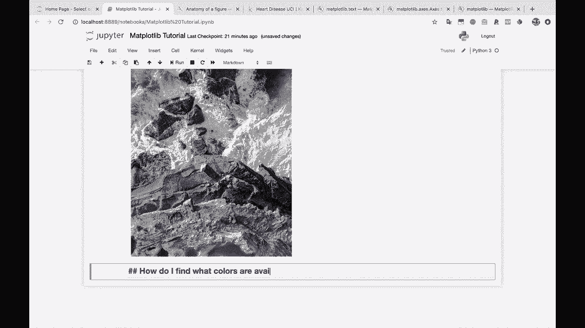

在 mappl lib 中。这是个好问题，因为这段时间，我们一直在做 C map 等于灰色，就像，你知道，颜色等于 R 和 B。或者你可以输入红色和蓝色。这可能会让人感到非常困惑。😊。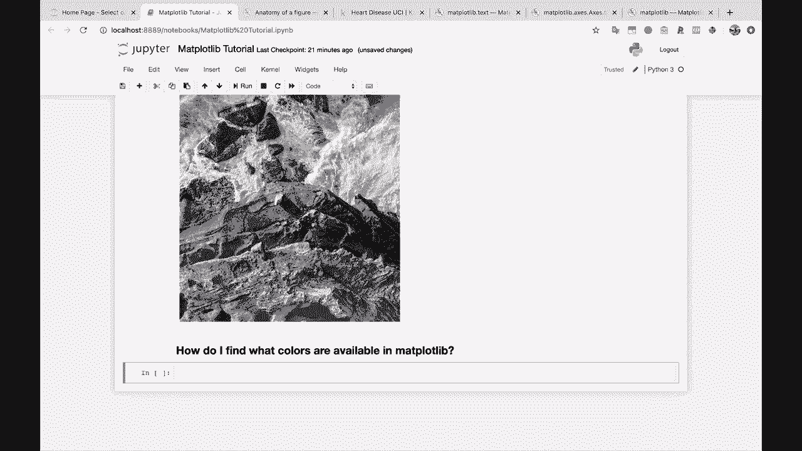

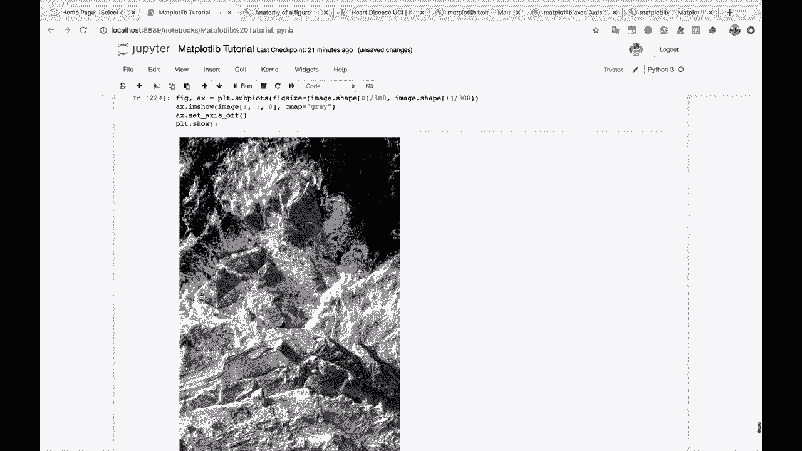

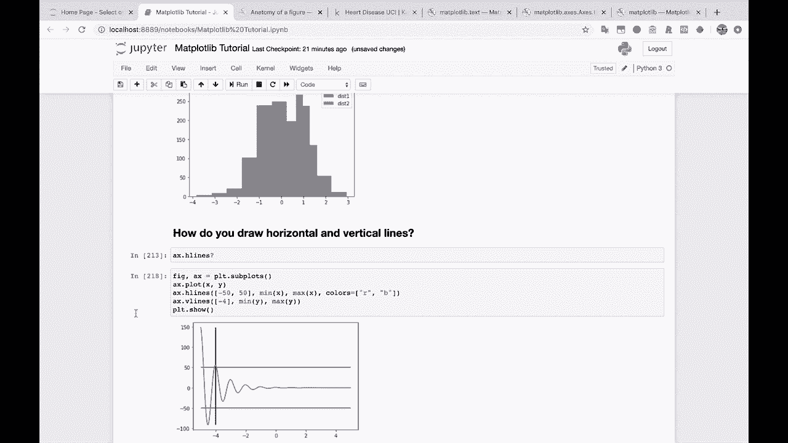

所以，从 mappl Lib。让我们导入颜色，我们要导入它。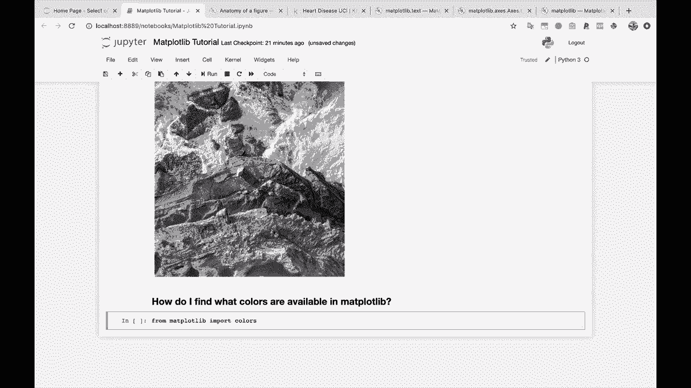

作为 mappl Lib 颜色的 M 颜色在这里。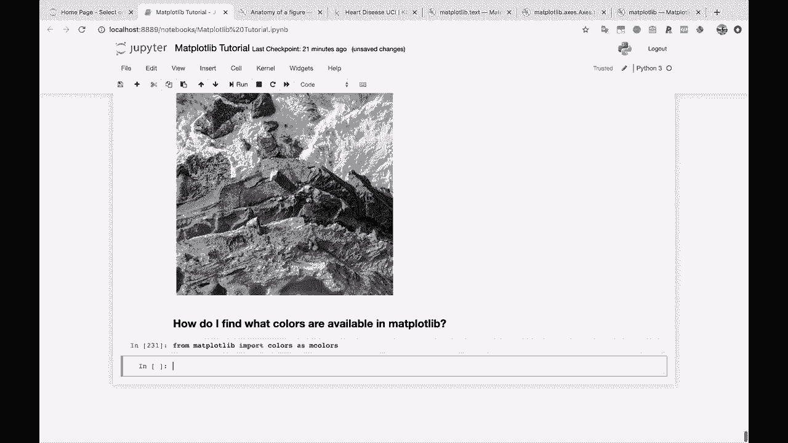

所以如果我们做 M 颜色，做一些文档。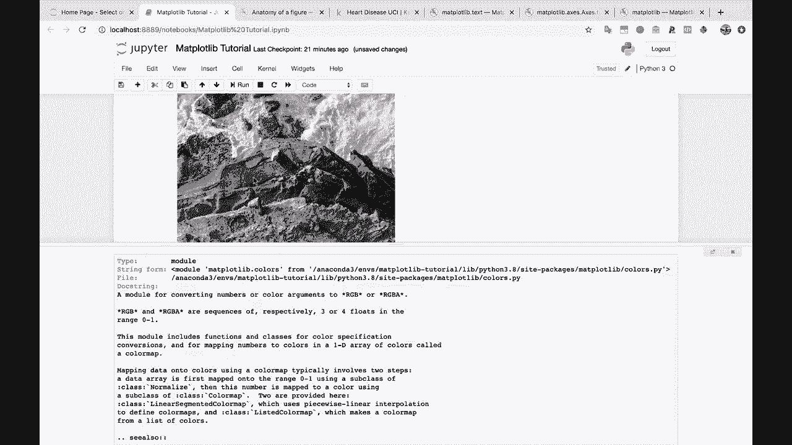

你会看到。颜色模块。是一个将数字或颜色参数转换为 RGB 或 RGBA 的模块？

它还包括用于颜色规格的类中的函数。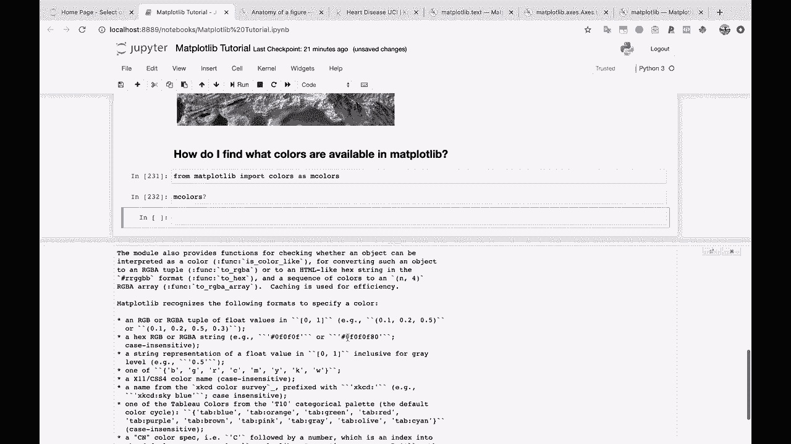

如果我们做 M 种颜色点，然后按下 tabab。你会看到一些看起来像颜色列表的东西。所以让我们查看基本颜色。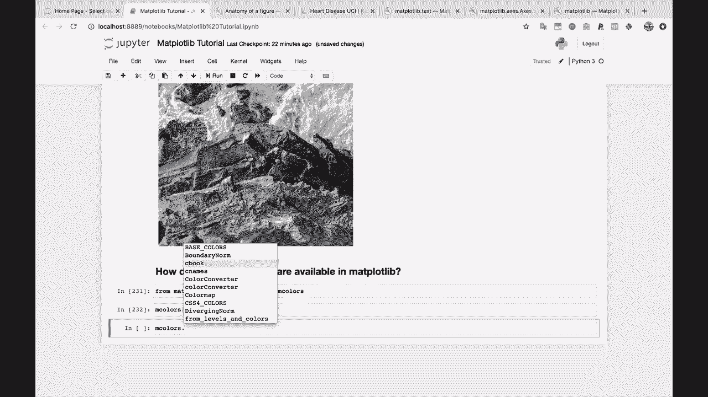

看看这个。我们得到了我们的 B。我们得到了我们的 G。我们得到了我们的 R。K 在这里是黑色的。嗯。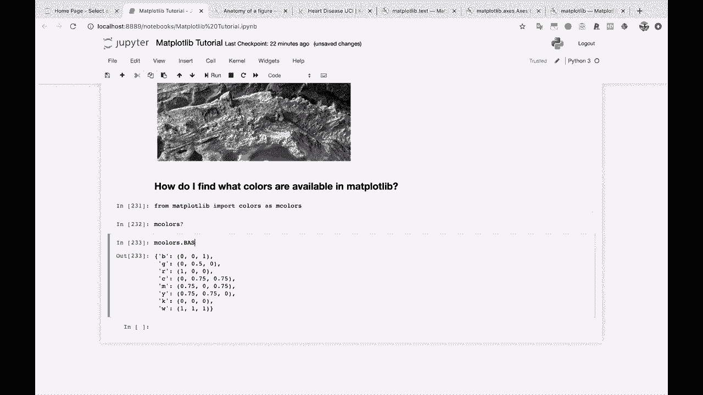

如果你继续向下滚动，CSS4 颜色。所以。这是一个你可以使用的庞大颜色列表。你可以在 Maplotlib 中使用其中任何一种。如果我们一直滚动到最底部。你会看到我最喜欢的 XKCD 颜色之一。看看这个。这来自一部很棒的 XKCD 漫画。如果你还没有，赶快去谷歌一下。

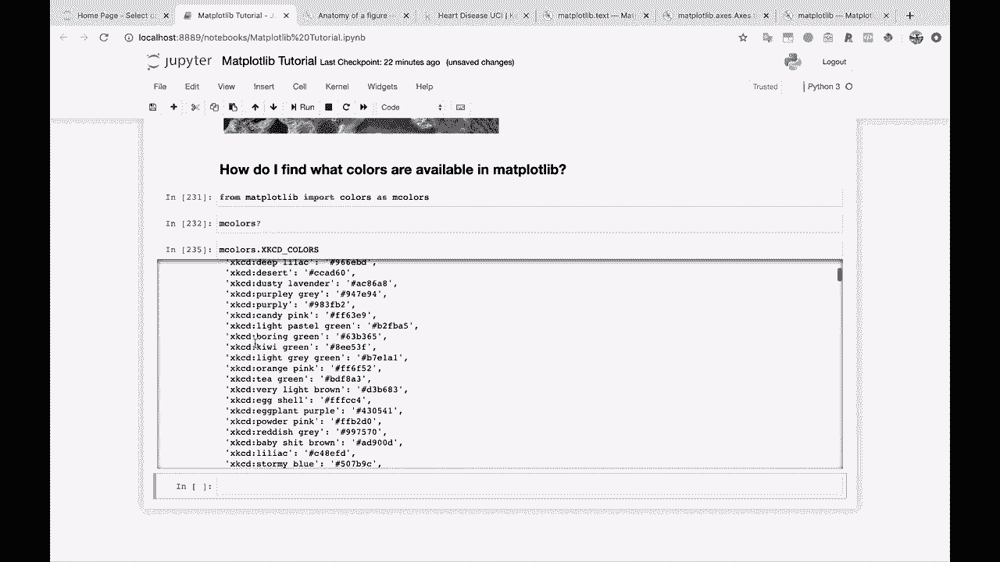

XKCD 颜色。你会发现它在说什么。如果你去 C 名称。现在。这将是一个很大的标准颜色列表，在 matplot Lib 中。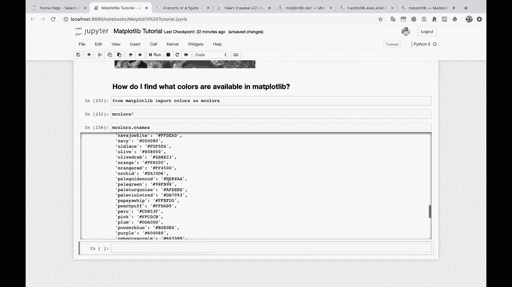

其实在 stack overflow 上有个人做了一个非常好的不同颜色的可视化。我将把这个链接粘贴在这里，以便你可以查看。但这就是视频的最后一件事。最后一件事我们完成了。耶，我们完成了。我将向你展示这美丽的表示。😊，许多在 map plot lips 中命名的颜色。

所以让我们把这段代码复制过来。这是一段相当多的代码，这就是为什么。我不想为你敲出来。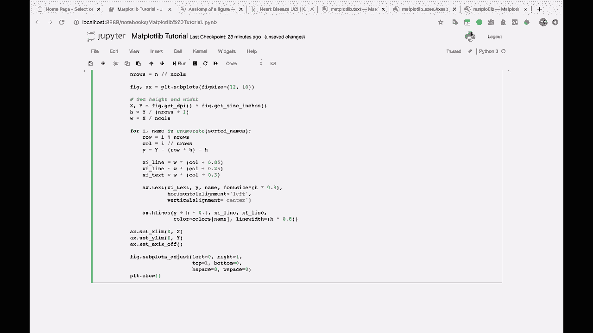

看看这个。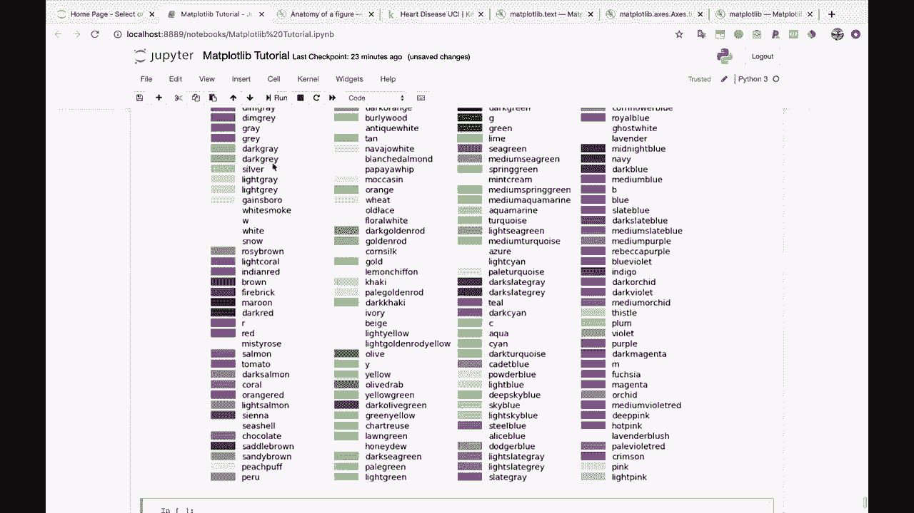

所有这些颜色及其名称可以在 matte plot Li 中使用。我会说相当美丽。相当美丽。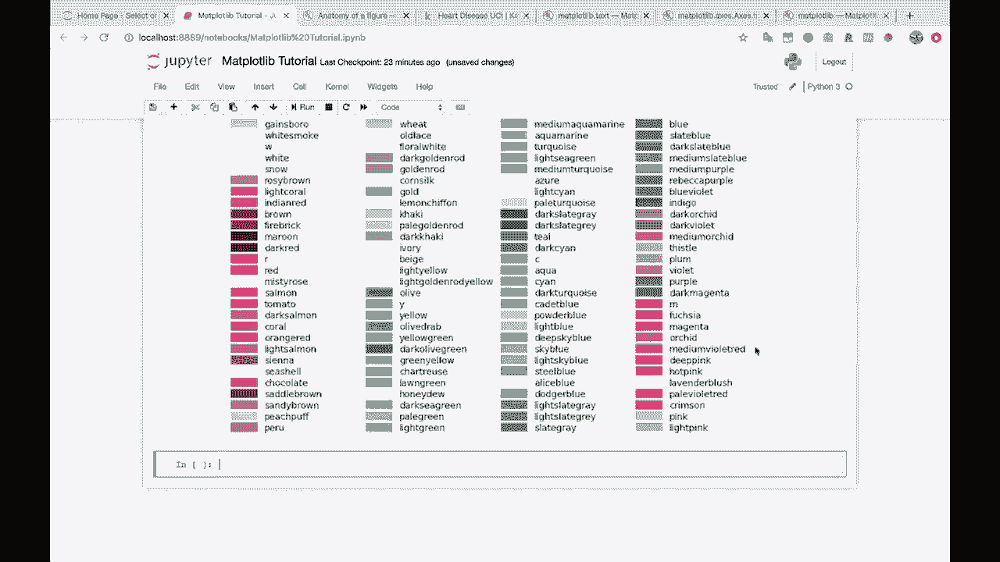
