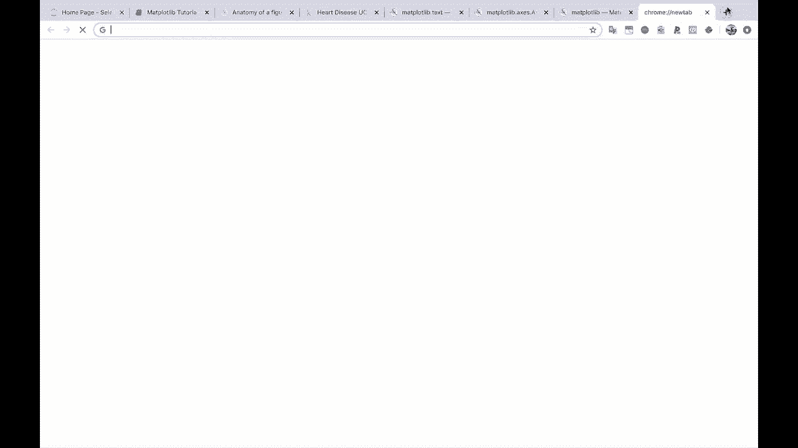

# 【双语字幕+资料下载】绘图必备Matplotlib，Python数据可视化工具包！150分钟超详细教程，从此轻松驾驭图表！＜实战教程系列＞ - P26：26）Matplotlib 可以使用的颜色 - ShowMeAI - BV14g411F7f9

Pt lib。All right。Our last question。 And that is， how do I find what colors are available。

In mappl lib。This is a great question because this whole time， you know。

 we've just been doing C map equals gray and like， you know， colors equals R and B。

 or you could type in red and blue。 and it's， it can be very confusing。😊。

So， from mappl Lib。Let's import colors， and we're going to import it。

As M colors for mappl Lib colors here。

So if we do M colors， do some documentation。

You'll see that。The colors module。Is a module for converting numbers or color arguments to RGB or RGBA？

And it also includes functions in classes for color specification。

And if we do M colors dot， and then hit tabab。You'll see some things that look like list of colors here。

 So let's check out base colors。

Look at that。 We got our B。 We got our G。 We got our R。 K is black over here。嗯。

If you keep scrolling down， CSS4 colors。So。This is a huge list of colors here that you can use。

 You can use any of these in Maplotlib。If we scroll all the way to the bottom。

 you'll see one of my favorites XKCD colors。Check that out。 This is from a great XKCD comic。

 If you have not， just just Google。

X， KCD colors， and。You will find what that is talking about。If you go to the C names。Now。

 this is going be kind of the huge list of a lot of the standard colors in matplot Lib。

And。There's actually someone on stack overflow who did a really nice visualization。

Of these different colors。 And I'm going to。Paste this link here so that you can check it out。

 But this is the very last thing the video。 Very last thing we're done。 yay， we're done。

 I'm going show you this beautiful representation。😊，Of a lot of the named colors in map plot lips。

 So let's copy this code over here。 This is kind of a lot of code， which is why。

I'm not going to type this out for you。

And check that out。

All of these colors with their names that you can use in matte plot Li。 Prety beautiful， I would say。

 pretty beautiful。

